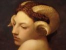

  
[Intangible Textual Heritage](../../index)  [Evil](../index) 
[Index](index)  [Previous](dwf12)  [Next](dwf14) 

------------------------------------------------------------------------

[Buy this Book at
Amazon.com](https://www.amazon.com/exec/obidos/ASIN/B0024NL7C6/internetsacredte)

------------------------------------------------------------------------

  
*Devil Worship in France*, by A.E. Waite, \[1896\], at Intangible
Textual Heritage

------------------------------------------------------------------------

p. 225

### CHAPTER XI

#### FEMALE FREEMASONRY

LAST on the list of our recent witnesses who have had a hand in creating
the Question of Lucifer—not actually last in the order of time but the
least in importance to our purpose—is M. A. C. de la Rive, author of
"Child and Woman in Universal Freemasonry." He very fairly fulfils the
presumption which is warranted by his name; he does not pretend to have
come forth from the turbid torrent of Satanism and Masonry which is
carrying multitudes into the abyss and effacing temples and thrones in
its furious course. He has been content, like a sensible person, to
stand on bank or brink and watch the rage and flow. He does not tell us
anywhere in his narrative that he is himself a Mason; he has no personal
acquaintance with Satan; he has not been guilty of magic, nor has

p. 226

he assisted at a Black Mass. He belongs to a wholly different order of
witnesses, and he has produced what is in its way a genuine book, which
does not pretend to be more than a careful compilation from rare but
published sources, while we can all of us defer to the erudition of a
Frenchman who has actually spent on collecting his materials the almost
unheard-of space of twelve months. The result is correctly described as
"grand in octavo, 746 pages," and is really an inflated piece of Masonic
chronology, exceedingly ill-balanced, but, at the same time, undeniably
useful. Beginning with the year 1730 it is brought down to 1894, and it
is designed to demonstrate the existence at the present day of "adoptive
lodges" wherein French gallantry once provided an inexpensive substitute
for Masonry in which ladies had the privilege of participating. One of
the most learned and illustrious of French Masonic writers, Jean-Marie
Ragon, describes such androgyne or female lodges as "amiable
institutions" invented by an unknown person some time previously to the
year 1730, under the

p. 227

name of "mysterious amusements," which appears to describe them exactly,
and one cannot be otherwise than astonished at the extraordinary gravity
of nervous and well-intentioned persons who ascribe them such tremendous
importance. Whereas they are the fringe of Freemasonry, writers like M.
de la Rive persist in regarding them as its heart and centre, while it
is also in such institutions that he and others of his calibre expect to
discover Satanism. A celibate religion ever suspects the serpent in the
neighbourhood of the woman. He discovers Satanism accordingly by reading
it into handy passages and bracketing interpretations of his own when
the text cannot otherwise be worked. Thus he gets oracles everywhere,
and to compel Satan he finds the parenthesis quite as useful as the
circle of black magic; it is a juggler's method, but among French
anti-Masons it passes with high credit. The question of Female
Freemasonry, apart from the Palladian Order, is quite outside our
subject; its existence in Spain is a matter of public knowledge, and I
have Mr Yarker's authority for stating that in certain countries,

p. 228

one of which is South America, the Rite of Memphis and Misraïm and the
Ancient and Accepted Scotch Rite have both initiated women, the latter
up to and including the 33rd degree. No adoptive lodges exist or would
be tolerated in England within the jurisdiction of the Grand Lodge, and
if it can be shown that the Palladian order initiates English women into
Masonic secrets, that is performed surreptitiously and in defiance of
our Masonic constitutions. As to the schismatic Grand Orient of France,
whatever may be done in secret or devised in public upon this point, is
of no importance here, but I should add that little credit, and
deservedly, is attached in England to any of the so-called revelations
which from time to time come over from Paris.

As regards M. de la Rive, apart from this subject, we are unable to
extract from his pages anything that is fresh or informing on the
subject of our inquiry. Despite the sensational picture which emblazons
the title-page, where a full-length Baphomet is directing a *décolletée*
Templar-Mistress through the pillars Jakin and

p. 229

\[paragraph continues\] Bohaz, there is
not a single page in the whole vast compilation which shows any
connection between Satanism and Masonry until towards the close, when an
adroit tax is levied on the still vaster storehouse of Doctor Bataille.
The author tells us clearly enough how adoptive Masonry arose, what
rites were instituted, what rituals published, what is contained in
these, and it is all solid and instructive. His facts, as already
indicated, are borrowed facts, but they come from a variety of sources,
and original research was scarcely to be expected from a writer against
whom the avenues of knowledge are sealed by his lack of initiation. He
concludes, however, that Adoptive Masonry is Satanic by intention, and
that even the orphanages of the Fraternity are part of a profound and
infamous design to ruin the children of humanity and to perfect
proselytes for perdition.

The appearance of "Child and Woman in Universal Freemasonry" was hailed
with acclamation in the columns of the *Revue Mensuelle;* it reviewed it
by dreary instalments,

p. 230

and when reviewing was no longer possible, had recourse to tremendous
citations; as a last effort, it supplied an exhaustive index to the
whole work—a charitable and necessary action, for the twelve months’
toil of the author had expired without the accomplishment of this
serviceable means of reference. And still, as occasion offers, it gives
it bold advertisement.

The quaint methods of previous witnesses are amplified by M. de la Rive.
Like Dr Bataille, he tells us that the Order of Oddfellows, though quite
distinct from Palladism, is "essentially Luciferian," but he does not
say why or how—instance of demonstrative method. He regards the Jews
with holy hatred as chief ministers of Anti Christ, and characterises
them as that nation of which Judas was "one of the most celebrated
personages"—specimen recipe for the production of cheap odium in large
quantities; but what about Jesus the Christ, whom men called King of the
Jews? Fie, M. de la Rive! He informs us that Miss Alice Booth, daughter
of General Booth, the founder of the Salvation Army,

p. 231

is one of the foremost Palladists of England—instance of absurd slander
which refutes itself.

M. de la Rive must therefore on all counts of his evidence be ruled out
of court as a witness. No one denies the existence of Adoptive Lodges in
a few countries and under special circumstances, and no sensible person
attributes them any importance. Freemasonry as an institution is not
suited to women any more than is cricket as a sport, but they have
occasionally wished to play at it as they have wished to play at
cricket; the opportunity has been offered them, but, except as the vogue
of a moment, it has come to nothing. It is, moreover, of no importance
to our inquiry if it can be proved that the true head of the Grand Lodge
in England is the Princess of Wales and not her royal husband; while
concerning the existence of Devil-Worship M. de la Rive has nothing new
to tell us, and nothing at first-hand. I therefore ask leave to dismiss
him, hoping that he will devote another laborious year to the reissue of
Masonic rituals, authentic or not, at the extremely moderate price which
he asks for his first volume;

p. 232

originals are scarce and costly, and invention is a pleasant faculty.
The interpretation which he chooses to put on them is an interpretation
of no consequence, and can never have misled any one who is in any sense
worth misleading.

------------------------------------------------------------------------

[Next: Chapter XII. The Passing of Doctor Bataille](dwf14)
