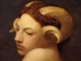

  
[Intangible Textual Heritage](../../index)  [Evil](../index) 
[Index](index)  [Previous](dwf14)  [Next](dwf16) 

------------------------------------------------------------------------

[Buy this Book at
Amazon.com](https://www.amazon.com/exec/obidos/ASIN/B0024NL7C6/internetsacredte)

------------------------------------------------------------------------

  
*Devil Worship in France*, by A.E. Waite, \[1896\], at Intangible
Textual Heritage

------------------------------------------------------------------------

p. 255

### CHAPTER XIII

#### DIANA UNVEILED

THE discovery of Leo Taxil and of M. Ricoux has one remaining witness in
the person of Miss Diana Vaughan. She also, as we have seen, is a writer
of memoirs, and in giving some account of her narrative I have already
indicated in substance certain lines of criticism which might be applied
with success thereto. We must obviously know more about this lady, and
have some opportunity of verifying the particulars of her past life
before we can accept her statement that she has written while fresh from
"conversion," and is speaking for the first time the language of a
Christian and a Catholic. The supernatural element of her memoirs it is
not worth while to  discuss. Were she otherwise worthy of credit, we
might exonerate her personal veracity by assuming that she was tricked

p. 256

over the apparition and hallucinated in the vision that followed it, but
I propose submitting to my readers sufficient evidence to justify a
conclusion that she does not deserve our credit, and though out of
deference to her sex it is desirable, so far as may be possible, to
speak with moderation, I must establish most firmly that the motive she
betrays in her memoirs is not in many respects preferable to that of the
previous witness.

It will be advisable, however, to distinguish that part of the narrative
for which Miss Vaughan is admittedly and personally responsible from
that which she claims to be derived from her family history. I must
distinguish between them, not that I am prepared to admit as a
legitimate consequence of her statement that there is any real
difference or that I unquestionably regard Miss Vaughan as having
created a strong presumption that she is in possession of the documents
which she claims to have. I am simply recognising the classification
which she may herself be held to make. If in this respect it can be
shown that I have

p. 257

mistaken the actual position, I will make such reparation as may be due
from a man of letters, whose reasonable indignation in the midst of much
imposture will, in such case, have misled him. But there is only one
course which is open to Miss Vaughan in the matter, and that is to
produce the original documents on which she has based her narrative for
the opinion of competent English investigators, in which case Miss
Vaughan may be held to have established not the truth of her family
history, which is essentially beyond establishment, but her *bona fides*
in connection with its relation. After this the portion for which she is
personally responsible, and from which there is no escape, will still
fasten the charge of falsehood ineffaceably upon her narrative.

In addition, then, to her personal history, Miss Vaughan's memoirs
contain:—I. A mendacious biography of the English mystic, Thomas
Vaughan. II. A secret history of the English Rosicrucian Fraternity, and
of its connection with Masonry, which is also an impudent fraud. The two
constitute one of the most curious

p. 258

literary forgeries which are to be met with in the whole range of
Hermetic literature; and Hermetic literature, it is known, has been
enriched by many triumphs of invention. I shall deal with the narratives
plainly on the provisional assumption that Miss Vaughan has been herself
deceived in regard to them. They are based upon family papers said to be
now in possession of the Charleston Dogmatic Directory. The central
facts which are sought to be established by means of these papers have
been mentioned already in my eighth chapter, namely, that Miss Vaughan
is one of the two last descendants of the alchemist Thomas Vaughan; that
this personage made a compact with Satan in the year 1645, that .under
the name of Eirenæus Philalethes, he wrote the well-known alchemical
work entitled "An Open Entrance to the Closed Palace of the King," and
that he consummated a mystical marriage with Venus-Astarte, of which the
Palladian Templar-Mistress is the last development. For the purposes of
these narratives the birth of Thomas Vaughan is placed in the year 1612,
and his death, or rather translation, in

p. 259

the year 1678. At the age of twenty-four years, that is to say, in 1636,
he proceeded to London, and there connected himself with the mystic
Robert Fludd, by whom he was initiated into a lower grade of the
Rosicrucian Fraternity, and received a letter of introduction to the
Grand Master, Johann Valentin Andræ, which he took over to Stuttgart and
presented. In 1637, having returned to London, he was present at the
death of Robert Fludd, which occurred in that year. In 1638 he made his
first voyage to America, where he was hospitably entertained by a
Protestant minister, named John Cotton, but his visit was not
characterised by any remarkable occurrence. At this period the alchemist
is represented by his descendant as a Puritan impregnated with the
secret doctrine of Robert Fludd. In 1639 Vaughan returned to England,
but was immediately attracted to Denmark by the discovery of a golden
horn adorned with mysterious figures, which he and his colleagues in
alchemy supposed to typify the search for the philosophical stone. At
the age of twenty-eight,

p. 260

\[paragraph continues\] Vaughan made
further progress in the Rosicrucian Fraternity, being advanced to . the
grade of *Adeptus Minor* by Amos Komenski, in which year also Elias
Ashmole entered the order. Accompanied by Komenski, Vaughan proceeded to
Hamburg, thence by himself to Sweden, and subsequently to the Hague,
where he initiated Martin de Vriès. A year later he visited Italy, and
made acquaintance with Berigard de Pisa. This was a pious pilgrimage
which testified his devotion to Faustus Socinus, for Miss Vaughan, on
the authority of her documents, regards the Italian heretic, not only as
a conscious Satanist, but as the founder of the Rosicrucian Society, and
the initiator of Johann Valentin Andrew, whom he also won over to
Lucifer. On his return Thomas Vaughan tarried a short time in France,
where he conceived the project of organising Freemasonry as it exists at
the present day, and there also it occurred to him that the guilds of
the Compagnage might serve him for raw material. When, however, he
returned to England, he concluded that the honorary or Accepted Masons,
received by the

p. 261

\[paragraph continues\] Masonic guilds of
England, were better suited to his purpose. Some of these were already
Rosicrucians, and among them he set to work. In the year 1644 he
presided over a Rosicrucian assembly at which Ashmole was present. At
this time also Oliver Cromwell is said to have been an accepted Mason,
and it was by his intervention that, a year later, Thomas Vaughan was
substituted for the headsman at the execution of Archbishop Laud, for
the object already described. It was after his compact with Lucifer that
the alchemist wrote the "Open Entrance." His activity in the Rosicrucian
cause then became prodigious, and the followers of Socinus, apparently
all implicated in the Satanism of their master, began to swell the ranks
of the Accepted Masons. At this time also he began his collaborations
with Ashmole for the composition of the Apprentice, Companion, and
Master grades, that is to say, for the institution of symbolical
Masonry. In 1646 he again visited America, and consummated his mystic
marriage, as narrated in the eighth chapter. In 1648 he returned to
England, and one year later completed

p. 262

the Master grade, that of Companion having been produced during his
absence, but following the indications he had given, by Elias Ashmole.
In 1650 he began to issue his Rosicrucian and alchemical writings,
namely, *Anthroposophia Theomagica* and *Anima Magica Abscondita*,
followed by *Lumen de Lumine* and *Aula Lucis* in 1651. The Rosicrucian
Grand Master Andreæ died in 1654, and was succeeded by Thomas Vaughan,
whose next step was the publication of his work, entitled "Euphrates, or
the Waters of the East." In 1656 he is said to have published the
complete works of Socinus, two folio volumes in the collection, entitled
*Bibliotheca Fratrum Polonorum*. Three years later appeared his
"Fraternity of R.C.," and in 1664 the *Medulla Alchymiæ*. In 1667 he
decided to publish the "Open Entrance," the MS. of which was returned to
him by the editor Langius after printing, and was subsequently annotated
in the way I have previously mentioned. During the early days of the
same year Vaughan converted Helvetius, the celebrated physician of the
Hague, who in his

p. 263

turn became Grand Master of the Rosicrucian Fraternity. In 1668 he
published his "Experiments with Sophie Mercury" and *Tractatus Tres*,
while ten years later, or in 1678, the year of his infernal translation,
he produced his edition of "Ripley Revived" and the *Enarratio Trium
Gebri*.

From beginning to end, generally and particularly, the narrative I have
summarised above is a gross and planned imposture, nor would any
epithets be so severe as to be undeserved by the person who has
concocted it, because it does outrage to the sacred dead, in particular
to the greatest of the English spiritual mystics, Thomas Vaughan, and to
the greatest of the English physical mystics, Eirenæus Philalethes. For
the mendacious history confuses two entirely distinct persons—Eugenius
and Eirenæus Philalethes. It is true that this confusion has been made
frequently, and it is true also that at the beginning of my researches
into the archæology of Hermetic literature I was one of its victims, for
which I was sharply brought to book by those who knew better. But a

p. 264

young and unassisted investigator, imperfectly equipped, has an excuse
which will exonerate him at least from a malicious intention. It is
otherwise with a pretended family history. When documents of this kind
reproduce blunders which are pardonable to ignorance alone, and upon a
subject about which two opinions are no longer possible, it is certain
that such documents are not what they claim; in other words, they have
been fabricated, and the fabrication of historical papers is essentially
a work of malice. Furthermore, when such forgeries impeach persons long
since passed to their account, on the score of unheard of crimes, they
are the work of diabolical malice, and this is a moderately worded
judgment on the case now in hand. Thomas Vaughan, otherwise Eugenius
Philalethes, was born in the year 1621 at Newton, in Brecknockshire. The
accepted and perfectly correct authority for this statement is the
*Athenæ Oxonienses* of Anthony Wood, but he is not the only authority,
and if he be not good enough for Miss Vaughan, she can take in his place
the

p. 265

exhaustive researches of the Rev. A. B. Grosart, whose edition of the
works of the Silurist Henry Vaughan have probably been neither seen nor
heard of by this unwise woman, in the same way that she is ignorant of
most essential elements in the matters which she presumes to treat. The
authority of a laborious scholar like Dr Grosart will probably be of
greater weight than the foul narrative of a Palladian memoir-maker, who
has not produced her documents. From this date it follows that in the
year 1636 Thomas Vaughan was still in the schoolboy period, not even of
sufficient age to begin a college career. He could not, as alleged, have
visited Fludd, the illustrious Kentish mystic, in London, nor would he
have been ripe for initiation, supposing that Fludd could have dispensed
it. In like manner, Andreæ, assuming that he was Grand Master of the
Rosicrucians, would not have welcomed a youngster of fifteen years,
supposing that in those days he was likely to travel from London to
Stuttgart, but would have recommended him to return to his lesson-books.

p. 266

\[paragraph continues\] The first voyage
to America and all the earlier incidents of the narrative are untrue for
the same reason. In place of wandering through Denmark, the Hague, and
Sweden, initiating and being initiated, he was drumming through a course
at Oxford; in place of pious pilgrimages to the shrine of Socinus, he
was preparing to take orders in the English Church, and the narrative
which is untrue to his early is untrue also to his later life. After
receiving Holy Orders he returned to his native village and took over
the care of its souls. Ike was never a Puritan; he was never a friend of
Cromwell; he was a high-churchman and a Royalist, and he was ejected
from his living because he was accused by political enemies of carrying
arms for the king. He never travelled; on the contrary, he married, at
what period is unknown, but his tender devotion to his wife is
commemorated on the reverse pages of an autograph alchemical MS. now in
the British Museum, which belies furthermore, in every line and word,
the Luciferian imposture of the Paris-cum-Yankee documents, by its
passionate

p. 267

religious aspiration and its adoring love of Christ.

When Vaughan came up to London, it was as a man who was somewhat out of
joint with English, in spite of his Oxford career, because he was a
Welsh speaking man, and when he took to writing books, he apologises for
his awkward diction. He accentuates also his youth, which would be
warrantable at the age of twenty-eight, but would be absurd in a writer
approaching forty years. This point may be verified by any one who will
refer to my edition of Vaughan's *Anthroposophia Theomagica*. The works
of Thomas Vaughan, besides *Anthroposophia Theomagica* are *Anima Magica
Abscondita*, published in 1650; *Magia Adamica* 1650, apparently
forgotten by the "authentic documents" of Miss Vaughan, as are also "The
Man-Mouse" and "The Second Wash, or the Moore scoured once More"—satires
on Henry More, written in reply to that Platonist, who had attacked the
previous books. These belong to the year 1651, as also does *Lumen de
Lumine;* "The Fame and Confession of the Fraternity

p. 268

\[paragraph continues\] R.C." appeared in
1652, not 1659, as the "family history" affirms; *Aula Lucis*, 1652 (not
1651); and "Euphrates," 1655. What is obvious everywhere in these
priceless little books is the devotion of a true mystic to Jesus Christ,
and to gift them with the sordid interpretation of a French-born cultus
of Lucifer is about as possible as to attribute a Christian intention to
the calumnies of Miss Vaughan's documents.

In the year 1665, at the house of the rector of Albury, a chemical
experiment with mercury cost the Welsh alchemist his life, and he was
buried in the churchyard of that village in Oxfordshire.

It is clear, therefore, that the wonderful archives in the possession of
Miss Vaughan give a bogus history of Eugenius Philalethes, but they are
also untrue of Eirenæus. It is untrue that this mysterious adept, whose
identity has never been disclosed, was born in 1612; he was born some
ten years later.

The source of both dates is "The Open Entrance to the Closed Palace of
the King";

p. 269

but that which Miss Vaughan champions is based upon a corrupt reading in
a bad version, and she has evidently never seen the original and best of
the Latin impressions, that of Langius, though she has the presumption
to cite it. That edition establishes that he wrote the treatise in the
year 1645, he being then in the twenty-third year of his age—whence it
follows that the date of his birth was most probably 1622, and the
history with which he is invested by Miss Vaughan is again a misfit; it
is putting man's garments on a boy. Furthermore, there is not one item
in her statements concerning the "Open Entrance" which is not directly
and provably false. It was not printed, as she indicates, under the
supervision of the author; it was not printed from the original MS., nor
was that MS. returned to Philalethes after it had passed through the
press. It is shameful for any person, male or female, however little
they may consider their own fair fame, to so far violate the canons of
literary honour as to make dogmatic statements concerning a work which
they cannot have seen, The preface prefixed to

p. 270

this edition by Langius completely refutes Miss Vaughan. Here is a
passage in point:—"Truly who or what kind of person was author of this
sweet, must-like work, I know no more than he who is most ignorant, nor,
since he himself would conceal his name, do I think fit to enquire so
far, lest I get his displeasure." Again—"To pick out the roses from the
most thorny bushes of writings, and to make the elixir of philosophers
by his own industry, without any tutor, and at twenty-three years of
age, this perchance hath been granted to none, or to most few hitherto."
Langius, moreover, laments explicitly the fact that he did not print
from an original MS. He printed front a Latin translation, the work of
an unknown hand, which had come into his possession, as he tells us,
from a man who was learned in such matters. Miss Vaughan's pretended
autograph, with its despicable marginal readings, is obviously a Latin
copy, whatever be its history otherwise. The original was in English,
and when Langius was regretting its loss, "a transcript, probably
written from the author's copy, or very little

p. 271

corrupted," was in possession of the bookseller William Cooper, of
Little Saint Bartholomews, near Little Britain, in the city of London,
who published it in the year 1669, to correct the imperfections in the
edition of Amsterdam. This transcript also establishes that the "Open
Entrance" was penned when the author was in his twenty-third year.

As a matter of fact, Philalethes does not appear to have superintended
the publication of any of his writings, and here Miss Vaughan again
exhibits her unpardonable ignorance concerning the works with which she
is dealing. To prove that her reputed ancestor was alive after the
accepted date of Thomas Vaughan's death, she triumphantly observes that
in . the year 1668 he published his experiments on the preparation of
Sophie Mercury and *Tractatus Tres*. But the latter volume was a piracy,
for in his preface to "Ripley Revived" the author expressly laments that
two of its three treatises had passed out of his hands, and he. feared
lest they should get into print, because they were imperfect works
preceding the period of solid

p. 272

knowledge which produced the "Open Entrance." Again, so little was he
consulted over the appearance of the "Sophie Mercury" that the printer
represents it as the work of an American philosopher, whence it has been
fathered upon George Starkey.

Eirenæus Philalethes was undoubtedly a great traveller and he visited
America, but there is no ground for supposing that he was ever in Italy,
and that either he or Thomas Vaughan edited the works of Socinus is an
ignorant fiction, for which even Miss Vaughan can find no better warrant
than the evasive place of publication which figures on the title-page of
the *Bibliotheca Fratrum Polonorum*, namely, Eirenæopolis. In like
manner she erroneously credits him with the authorship of the *Medulla
Alchemiæ*, which is the work of Eirenæus Philoponos Philalethes,
otherwise George Starkey.

These facts fully establish the fraudulent nature of Miss Vaughan's
family history, by whomsoever it has been devised, and seeing that where
it is possible to check it, it breaks down

p. 273

at every point, we need have no hesitation in rejecting the information
which it provides in those cases where it cannot be brought to book. The
connection of Faustus Socinus with the Rosicrucian Fraternity, as
founder, is one instance; this is merely an extension of the imposture
of Abbé Lefranc in his "Veil Raised for the Curious:" and it rests, like
its original, on no evidence which can be traced. Another is the
Rosicrucian Imperatorship of Andreæ, and yet another the initiation of
Robert Fludd. Again, the connection of Philalethes with John Frederick
Helvetius is based on speculation only, and that of Ashmole with the
institution of symbolical Masonry has never been more than hypothesis,
and not very deserving at that. I regret to add that, on the authority
of her bogus documents, Miss Vaughan has given currency to a rumour that
the founder of the Ashmolean Museum poisoned his first wife. She
deserves the most severe reprobation for having failed to test her
materials before she made public this foul slander. Furthermore, in that
portion of her materials which is concerned with her family

p. 274

history, she is not above tampering with the sense of printed books. The
worshippers of Lucifer are represented as invariably terming their
divinity the "good God"—*Dieu bon*,—or our God—*notre Dieu*—to
distinguish him from the God of the Adonaïtes, and the references made
to the Deity by Philalethes in the "Open Entrance" she falsely
translates by these Luciferian equivalents, thus creating an impression
in the minds of the ignorant that he is not speaking of the true
Divinity. After this it will hardly surprise my readers that a pretended
translation from a MS. of Gillermet de Beauregard, which she states to
be preserved in the archives of the Sovereign Patriarchal Council of
Hamburg, is simply stolen from an *Instruction à la France sur la vérité
de l’Histoire des Frères de la Roze-Croix*, by Gabriel Naudé, who
ridiculed and reviled the Order. I submit in conclusion that, in view of
the facts already elicited, it is not worth while to inquire into the
value of the episode concerned with the judicial murder of Archbishop
Laud, and to elaborately argue that Oliver Cromwell was the last person

p. 275

in England to be implicated in such a transaction, he, at the period in
question, being briskly employed in checkmating his King, who was at
Oxford in winter quarters, and having neither the power nor opportunity
to meddle with the details of an execution. The incident, in a word, is
worth as much and as little as the abominable story of the subsequent
pact with Lucifer or the foolery of the mystic marriage.

The critical investigation of Miss Vaughan's alleged documents having
led to these results, it remains to be seen how far the other portions
of her narrative will bear analysis. So long as she confined the more
responsible part of her memoirs to personal experiences in the science
of conversion and to the relation of her Eucharistic raptures, the
lovers of ardent reading in this order of sensation were the only
persons who could lay a complaint against her if she failed to fulfil
their requirements. So long also as she fixed the scene of her history
in a comparatively remote place, and among men now dead, she was
partially protected from exposure, but when she transfers her
revelations to England

p. 276

she is treading on dangerous ground, and she has in fact fallen into the
pit. She has had the temerity to meddle with the modern history of
Rosicrucian societies, and has undertaken to inform her readers after
what manner she has come into possession of the rituals of the revived
Rosicrucian Order, and her account is specifically untrue. She is
undoubtedly acquainted with the grades of the order, but she could leave
obtained these from more than one published source—as, for example, the
late Kenneth McKenzie's "Cyclopædia of Freemasonry," or from my own
"Real History of the Rosicrucians." But even if she possess the rituals,
she has not come by them in the manner she describes. Her account is as
follows:—"The Fraternity of the Rose-Cross comprises nine degrees of
initiation—1. Zelator; 2. Theoricus; 3. Practicus (Miss Vaughan writes
*Praticus*, which would be the error of a French person who does not
read Latin and not the error of an English or American person as she
claims to be); 4. Philosophus; 5. Adeptus Minor, according to the
variants of Valentin Andreæ, or

p. 277

\[paragraph continues\] Adeptus Junior,
according to the variants of Nick Stone (those were the variants of Nick
Stone which were ostensibly burned in 1720 by the Grand Master
Theophilus Desaguliers, but were not in reality destroyed; transmitted
to trusty English brethren, after the death of Desaguliers, they passed
from reliable hands to others also reliable, until the reconstitution of
the Rose-Cross; for the reconstituted association exists actually in
England, Scotland, the United States, and Canada, and those variants of
the grades which were made by Nick Stone, are at the present day
deposited with Doctor W. W. W., living at Cambden (*sic*) Road, London,
Supreme Magus of the Rose-Cross for England, AT WHOSE HOUSE I HAVE
TRANSCRIBED THEM); 6. Adeptus Major; 7. Adeptus Exemptus; 8. Magister
Templi; 9. Magus."

Miss Vaughan's literary methods are not exactly captivating, and the
enormous parenthesis is hers, but the capitals which close it are mine.
The English doctor mentioned is well known to transcendentalists, and he
is actually a high-grade Mason he is also personally

p. 278

well-known to myself. To the best of his recollection he has never at
any time met any person terming herself Diana Vaughan. More especially,
no such individual has ever called at his house, much less copied any
rituals of which he may be in possession. There is therefore only one
term by which it is possible to qualify Miss Vaughan in her account of
this matter, and if I refrain from applying it, it is more out of
literary grace than from considerations of gallantry, for when persons
of the opposite sex elect to make themselves odious by gross imposition,
they cannot expect to escape the legitimate consequences at the hands of
criticism any more than another class of female malefactors will escape
on the plea of their sex at the hand of justice.

The subject of Luciferian Freemasonry has been under discussion in the
columns of *Light* long before the appearance of this volume, and a
number of transcendentalists, including one of great eminence—Mr Charles
Carleton Massey—a few high-grade Masons, and myself, have exposed the
pretensions of the French conspiracy. In most cases, and by more than
one person,

p. 279

copies of the various issues were sent to Miss Vaughan through her
publisher, and if she be not, as I hinted in that journal, the Mrs
Harris of Freemasonry, there is little doubt that they reached her like
other friendly offerings which she acknowledges in odd corners of her
memoirs. It is probably in consequence of the exposures made in *Light*
in connection with others said to have been made recently in Canada that
in the eighth number of her memoirs she threatens to turn somewhat
desperately on her critics. I understand that the Australian boomerang
is a weapon that comes back to its caster, and the vindictive feeling
which has prompted Miss Vaughan to a fresh burst of revelation has
returned upon herself in a very overwhelming manner. "I am driven, and I
will do it," is her position. "I will reveal the English Palladists such
as they actually and personally are." And she does so to her own
destruction as follows:—

"The actual chief of the English Luciferians is Doctor William Wynn
Westcott, living at 396 Cambden Road, London, whom on a previous
occasion I mentioned only by his initials,

p. 280

\[paragraph continues\] It is he who is
the actual custodian of the diabolical rituals of Nick Stone; it is he
who is the Supreme Magus of the Socinian Rose-Cross for England." She
proceeds to give the names of the Senior and Junior Sub-Magi, the
members of the Grand Council, the chiefs of what she terms the Third
Luciferian Order, and the Masters of the Temple, otherwise the
Metropolitan College. Similar particulars follow concerning the York
College, the College of Newcastle-on-Tyne, and that of Edinburgh.

Now, Dr Wynn Westcott is a high-grade Mason, as I have said, and he
occupies a professional position of influence and importance; it is
clear that a gratuitous attempt to fasten upon him charges of an odious
character is an exceedingly evil proceeding and places the person who
does so outside all limits of tender consideration. When Miss Vaughan
states that Dr Westcott is a Palladist, a diabolist, a worshipper of
Lucifer, or however she may elect to distinguish it, I reply that she is
guilty of a gross libel, which is at the same time an abominable and
cruel falsehood. When she says that

p. 281

she has been received at his house, I reply that she has not been
received there, and that Dr Westcott is likely to require better
credentials from female visitors than are supplied by the infamous
inventions in the "Memoirs of an Ex-Palladist." When Miss Vaughan
affirms that she has transcribed Dr Westcott's rituals at the house of
Dr Westcott, I reply that this would be an untrue statement if the lady
who made it were an intimate friend, and it is doubly untrue when
affirmed by a perfect stranger. When Miss Vaughan states that Dr
Westcott is the head of a Society which worships Lucifer, I reply that
she is speaking falsely of a body concerning which she is in complete
ignorance, and when an ignorant person thus attributes evil she or he
does not only act foolishly but with exceeding malice. Miss Vaughan is
henceforth upon all accounts outside that category of literary honour
which makes it possible for criticism to be concerned with her and still
preserve its dignity. Lastly, Miss Vaughan alleges that the official
appointments made by Dr Westcott as Supreme Magus of the Society in
question for

p. 282

the year 1896 were submitted to Adriano Lemmi and approved by him. This
allegation is false *in toto*. Neither in a general nor a special sense
is Dr Westcott responsible to Lemmi or to any Italian Freemason; what is
more, no personal or written communication has at any time passed
between them, and save as a past Grand Master Dr Westcott has never
heard of the person to whose commands he is thus supposed to be subject.
It will be seen that the baseless nature of this absurd statement
involves all others of its kind, and there is no reason to attach the
slightest credibility to anything which has been advanced concerning the
supreme position of Adriano Lemmi, who, further, himself denies it, and,
whatever his past history, is as much entitled to belief as accusers who
betray their true character in this unenviable manner.

The Society which has thus been attacked in the person of its Supreme
Magus is of singularly unpretending nature, simple as regards its
history, and making no claim either to Masonic or Mystical importance.
It does not claim or possess a connection with the original Rosicrucian

p. 283

\[paragraph continues\] Fraternity. It
does not attribute antiquity to the rituals which it uses. It was
founded by Robert Wentworth Little, who died in 1878, and has been in
existence somewhat less than forty years. Its sole connection with
Masonry is that it only initiates Masons. It neither enjoys nor expects
recognition from the Grand Lodge of England. It is literary and
antiquarian in its object, and came into existence chiefly for the study
of the history of Freemasonry and of other secret societies. Its members
are required to believe in the fundamental principles of Christian
doctrine. The Metropolitan College has only four convocations and one
banquet annually; the number of Fratres upon the Roll of Subscribers is
fifty-four. It has attracted Masons interested in the antiquities of
their craft and has no other sphere of influence. It publishes
occasional transactions, the dimensions of which are regulated by an
exceedingly modest income. I mention many of these particulars merely to
place a check upon exaggerated notions. Some of the provincial Colleges
have a larger membership, but they are of precisely the same

p. 284

character. It is not a society of occultists, though, like innumerable
other bodies, it counts occultists among its brethren. Finally, no
religious cultus of any kind is performed at its meetings, and no woman
has ever passed its threshold.

The Societas Rosicruciana in Anglia is Rosicrucian only in its name, as
it is Masonic only in its name, and its members are not Miss Vaughan's
*ex-Frères d’Angleterre*.

It is certainly and in all respects necessary that something effectual
should be done to curb a slanderous and evil tongue which has the
audacity to impress the most sacred feelings of religion into the
service of wilful lying. Dr Westcott is not the only English Mason who
has suffered the undeserved indignity of gross aspersion from this
unclean pen. Another victim is Mr Robert S. Brown, Grand Secretary of
the Supreme Grand Royal Arch Chapter of Scotland, who is also a member
of the Ancient and Accepted Rite, and of nearly all Masonic Orders, the
Societas Rosicruciana in Anglia included. This honourable gentleman is
especially recommended by Miss Vaughan to the attention of

p. 285

\[paragraph continues\] Catholics in
Edinburgh, being the city, in which he resides. She describes him as a
dangerous sectarian, a veritable sorcerer, and the evil genius of one of
her own relatives. She states further that he is an Elect Magus of the
Palladium, that he protects Sophia Walder when she visits Scotland, and
that he was a great admirer of Phileas Walder, at whose instance he
consecrated himself to the demon anti-Christ. In each and all these
statements this malicious woman has lied foully. I communicated with Mr
Brown on the subject, and hold his written denials, which are at the
service of any person who desires to see them. Mr Brown says:—"I am not
an Elect Magus of the Palladium. I never to my knowledge saw Miss
Walder, and never knew Miss Vaughan, or anyone of the name, man, woman,
or child. I never heard Miss Walder named till I received your letter,
and never knew of the existence of the Palladian Order, if it does
exist, till I saw it mentioned in articles in 'Light' and the
'Freemason's Chronicle' (London. . . . With reference to the particular
statements in this copy of the *Mémoires*,

p. 286

no doubt the writer has succeeded in getting hold of the facts in most
cases as to the official positions of the parties named, which of course
are easily obtained; the little details regarding some of us would
indicate the presence of an agent in our midst or near at hand. The
'inventions' and most slanderous statements regarding most of us are,
however, outrageously false and wicked. My house has never had the
honour (!!!) of entertaining Miss Walder or any other lady of like
character; it is not a chemical laboratory, and I have .never exercised
myself in these *mysterious experiences* either there or elsewhere. I am
a humble member of the Episcopal Church of Scotland, and, I trust, a
sincere follower of the Master. . . . I count nearly all the gentlemen
named in this vile proclamation among my friends, they are all good men
and true, and I hope to associate with them for many years to come. I
most emphatically deny the vile aspersions cast on their characters and
my own, and you have my full authority to do so as far as the same may
serve your purpose." My readers will agree that the clear and temperate
statement

p. 287

of Mr R. S. Brown brands Diana Vaughan with indelible disgrace in the
eyes of the civilised world.

There is a limit to the necessity of exposure, but should Miss Vaughan
manifest any desire to have further instances of her mis-statements I
will undertake to supply them. I will only add here in conclusion my
personal opinion that Miss Vaughan has not been for any length of time a
resident in an English-speaking country, much less can she have
received, as it is alleged by some of her friends, an American
education. The proof is that she makes characteristic French blunders
over English names. Thus, we have *Cambden* on each occasion for Camden,
*Wescott* for Westcott; we have *baronnet* for baronet, *Cantorbéry* for
Canterbury, *Kirkud-Bright* for Kirkcudbright; we have hybrid
combinations like *Georges* Dickson, impossibilities like *Tiers-Ordre
Luciferien d’Honoris Causa*, and numerous similar instances.

To behold "Diana unveiled" was equivalent in alchemical terminology to
attaining the *magnum opus*. The reputed author of the "New

p. 288

\[paragraph continues\] Light of Alchemy"
testifies that some persons had in his own day and to his certain
knowledge attained this supreme privilege. It is not of my own seeking
if in another sense I have made public the same spectacle, and thus
broken with the traditions of secret science. It would have been
preferable from one point of view to have discovered Lucifer behind the
mask of Masonry than to have found the conspiracy against it another
*Tableau des Inconstances des Démons* in which the *infadelité et
mécreance* connected with the old false witness, abound after a manner
undreamed of by Bodin and Wierus, for it is distinctly disconcerting to
think that a great church is so little honoured by her combatants and
converts.

It only remains to state, and I do so with extreme reluctance, that the
evidence of Signor Domenico Margiotta, which seems so strong in itself,
can only be accepted, as we have seen, in connection with the
credibility of Miss Vaughan, and as this has completely broken down, we
cannot do otherwise than regard that part of his evidence which is
concerned with Palladism as

p. 289

the narrative of a person who has been very seriously misled. And I
think he has otherwise shown us that he is not a judicious critic of the
materials which have come into his hands. He should never, for example,
have printed his list of Palladian Lotus Lodges—so far as regards Great
Britain, it is undeniably a false list. Take that of Edinburgh as a
typical instance. Mr Brown, who has every opportunity of knowing, tells
me there is absolutely no truth in the statement that there is in
Edinburgh a Mother, or any, Lodge of the Palladian Order. "Neither is
there a Triangular Province—whatever that may mean—such as is described.
All is absolutely false."

------------------------------------------------------------------------

[Next: Chapter XIV. The Radix of Modern Diabolism](dwf16)
