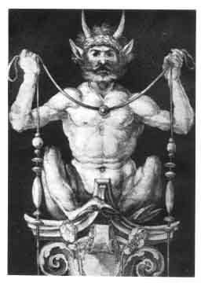

  
[Intangible Textual Heritage](../../index)  [Evil](../index) 

------------------------------------------------------------------------

[Buy this Book on
Kindle](https://www.amazon.com/exec/obidos/ASIN/B001VKXOHY/internetsacredte)

------------------------------------------------------------------------

<table width="75%">
<colgroup>
<col style="width: 50%" />
<col style="width: 50%" />
</colgroup>
<tbody>
<tr class="odd">
<td width="50%" data-valign="TOP"> 
The Devil [Public Domain Image]</td>
<td width="50%" data-valign="CENTER"><h3 id="the-history-of-the-devil-and-the-idea-of-evil-from-the-earliest-times-to-the-present-day">THE 
HISTORY OF THE DEVIL 
AND THE 
IDEA OF EVIL 
FROM THE EARLIEST TIMES TO THE PRESENT DAY</h3>
<h4 id="by-paul-carus" data-align="CENTER">by PAUL CARUS</h4>
<h5 id="section" data-align="CENTER">[1900]</h5></td>
</tr>
</tbody>
</table>

------------------------------------------------------------------------

[Contents](#contents)    [Start Reading](hod00)    [Page
Index](pageidx)    [Text \[Zipped\]](hod.txt.gz)

------------------------------------------------------------------------

|                                                                                                                           |
|---------------------------------------------------------------------------------------------------------------------------|
|  |

This massive work on the history of evil, particularly as symbolized by
the Christian devil, was written on the cusp of the 20th century by Paul
Carus, who wrote such other books as '[Buddha, the
Gospel](../../bud/btg/index)'.

At that point in history it seemed apparent that evil would soon be
eliminated by the onrushing forces of rationalism and modernism. The
devil had been reduced to a literary character, always ready to make a
silly bargain for a soul. This trivialized image is perpetuated to this
day. Satan in the cinema is either represented as a hideous special
effect or a comic, bumbling trickster. Long gone is the noble adversary
of Jehovah, as portrayed in the [Bible](../../bib/index),
[Milton](../../chr/milton/index) or [Dante](../../chr/dante/index).

However, the 20th century brought total war; genocide; death camps;
nuclear, biological and chemical weapons; mind control; double-speak;
ecological destruction; and finally indiscriminant mass terror. Evil was
back and it was unmistakable. No wonder that opinion polls in the United
States show that a large proportion of the population believe in the
existence of the devil.

PRODUCTION NOTES: First of all, before you fire off any angry letters
about this book, please keep in mind that the title of the book is
**not** 'We Worship Satan'. Secondly, the book was lavishly illustrated,
and it took a lot of work to get the images compressed enough so that
these pages would load effectively on the Internet. So please accept my
apologies for the dinky images. In any case, I hope you enjoy this
ebook, which was an extremely difficult production job. -- J.B. Hare.

------------------------------------------------------------------------

[Title Page](hod00)  
[Contents](hod01)  
[List of Illustrations](hod02)  
[Good and Evil as Religious Ideas](hod03)  
[Devil Worship](hod04)  
[Ancient Egypt](hod05)  
[Accad and the Early Semites](hod06)  
[Persian Dualism](hod07)  
[Israel](hod08)  
[Brahmanism and Hinduism](hod09)  
[Buddhism](hod10)  
[The Dawn of a New Era.](hod11)  
[Early Christianity](hod12)  
[The Idea of Salvation in Greece and Italy.](hod13)  
[The Demonology of Northern Europe](hod14)  
[The Devil's Prime.](hod15)  
[The Inquisition](hod16)  
[The Age of the Reformation](hod17)  
[The Abolition of Witch-Prosecution](hod18)  
[In Verse and Fable](hod19)  
[The Philosophical Problem of Good and Evil](hod20)  
