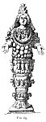
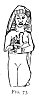
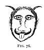
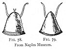
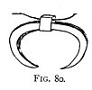
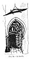
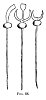
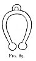

  
[Intangible Textual Heritage](../../index)  [Evil](../index) 
[Index](index)  [Previous](tee07)  [Next](tee09) 

------------------------------------------------------------------------

[Buy this Book at
Amazon.com](https://www.amazon.com/exec/obidos/ASIN/B0024NL744/internetsacredte)

------------------------------------------------------------------------

  
*The Evil Eye*, by Frederick Thomas Elworthy, \[1895\], at Intangible
Textual Heritage

------------------------------------------------------------------------

p. 181

## CHAPTER VI

### CRESCENTS, HORNS, HORSESHOES

EVERYBODY is familiar with the lunar appearance popularly known as "the
old moon in the arms of the new," in which a dark disc is seen within
the crescent. Precisely this phase was adopted as one of the most
frequent crests to be seen upon the head of more than one of the
Egyptian gods and goddesses. Thoth or Tehuti, [284](#fn_298) the scribe who weighed the souls when
brought to judgment ("in one aspect he is the god of the moon"), and
Chonsu, the hawk-headed, are both represented with the crescent and
disc. Isis, and Hathor who was closely connected and sometimes actually
confounded with her, [285](#fn_299) bear the
disc with the horns of the crescent much prolonged, so as to assume the
appearance of the horns of a cow. Hathor is often represented with the
head of a cow on a human body, and also frequently as a cow, having the
disc and horns on its head. At Philæ, Denderah, and elsewhere, she is
represented as beautiful, while at the same time she has a sort of
half-human, half-bovine face. Hathor became in late Greek and Roman
times completely identified with Isis. "Isis is the female and receptive
principle of generation." [286](#fn_300)

p. 182

It is with the crescent and disc head-dress that we now have to do. Of
course the deities thus distinguished by the crescent were moon-gods;
but in the case of the gods Thoth and Chonsu the disc represented the
sun also, from their intimate connection with Ra, the Sun-God of Egypt.
Among the Greeks, who got much of their mythology from Egypt, the
counterparts of Isis and Hathor were Artemis and Iö, the latter of whom
became at length identical with Hera; all of these were symbolised by
the Crescent. [287](#fn_301)

The Greek Iö was frequently represented by a cow, [288](#fn_302) as at Amyclæ. She is said to have been
changed into a cow by Hera, and she was considered in the heroic age to
be the cow-goddess Hera herself. The latter is called, from her
cow-face, βοωπίς by Homer. In the battle of the gods, Hera took the form
of a white cow, *Nivea Saturnia vacca*. [289](#fn_303) Cows' heads were on the coins of
Samos, where was the most ancient temple of Hera. In Corinth [290](#fn_304) she had the epithet βουναία, and white
cows were sacrificed in her honour. [291](#fn_305) The priestesses of Hera rode in a car
drawn by white bulls to her temple at Argos. [292](#fn_306) It is said that the Egyptian Isis was
born at Argos, [293](#fn_307) and that she was
identified with the cow-shaped Iö, who, as before stated, was the same
as Hera, and both were represented in Egypt as well as in Greece with
cows' horns. [294](#fn_308) In the religious
mysteries of Argos, Iö continued to be the old name

p. 183

 

  [  
Click to enlarge](img/18300.jpg)  
FIG. 68.  

 

for the moon. [295](#fn_309) We are further
told distinctly and repeatedly, that the cow horns of Iö-Hera, who was
also often represented with a cow's face, like that of Isis-Hathor, were
derived from the symbolic horns of the crescent moon. [296](#fn_310)

Hera, under her old moon-name Iö, had a celebrated temple on the site of
Byzantium, said to have been founded by her daughter Keroëssa, "the
horned." [297](#fn_311) The crescent, which was
in all antiquity and throughout the Middle Ages the symbol of Byzantium,
and which is now the symbol of the Turkish Empire, is a direct
inheritance from Byzantium's mythical foundress Keroëssa, the daughter
of the moon-goddess Iö-Hera; for it is certain the Turks did not bring
it with them from Asia, but found it already the "cognizance" of
Byzantium. The name Bosphorus is said to be "the passage of the cow":
Iö, according to the legend, having there crossed into Europe in that
form. [298](#fn_312)

The intimate connection of Hera and all her relatives with the crescent,
is shown by the remarkable figures in coarse terra cotta, of which so
many were discovered by Schliemann at Mycenæ, and now to be seen in the
Athens Museum. The illustrations herewith ([Fig. 68](#img_18300)) are
from the writer's own sketches from the original painted pottery at
Athens, but a coloured plate of one of them appears in Schliemann's book
on Tiryns and Mycenæ. He calls them Hera images, and the strange
association of the female form with the crescent rather confirms the
opinion that these were the household gods (like

p. 184

\[paragraph continues\] Penates or
Teraphim) of those ancient Greeks, who relied upon their protection
against the evil eye. [299](#fn_313) They
certainly belong to that class of objects, of which we have other
striking examples. They are in any case very remarkable evidences of the
emblematic treatment of a divinity at a very early date; for it must be
admitted that the use of the crescent as the body of the figure in each
of the many examples at Athens is of itself remarkable, and it is
certainly reasonable to maintain that all relate to one and the same
personality.

When the several attributes of the various deities came to be
represented by concrete shapes, as, for example, the "lowing one" by
horns, the early figurative significations were forgotten, and they
became so mixed up, confused, and conventionalised, that a cow -face, a
crescent, or a cow's horns stood alike for Isis, Hathor, Iö, Hera, or
Demeter; while an owl represented Athena as the type of wisdom and as
one of the goddesses of the dawn. In fact the cow, the crescent, the
horns, and the owl became their recognised attributes or
symbols-precisely as in Christian art the man's

p. 185

face, the winged lion, the bull, and the eagle have become the
recognised symbols or attributes of the four Evangelists.

Having then shown that the same symbols represented beings which
originally were held to be distinct and separate, it is not difficult to
see how their separate identities became lost, and from the same symbol
each and all would at last come to be regarded as one and the same
person. Not only a number of goddesses did actually become mixed and
confused into one, but several of the gods likewise.

"Jove, Pluto, Phœbus, Bacchus, all are one," was sung by Orpheus, [300](#fn_314) thus adopting the grand principle of
Hindooism--that all the various deities are but names for the different
attributes of the Almighty one. In further confirmation of this idea, we
find that Virgil treated Bacchus the Wine God, the god of orgies and
debauch, as only another form, we may call it an effect, of the
life-giving, wine-producing sun. He makes Bacchus and Ceres stand for
Osiris and Isis, the sun and moon, typified in the disc and crescent.
Hence Bacchus is often represented with horns. [301](#fn_315) In Hebrew a 'radiated' and a 'horned'
head is signified by the same word. Hence, when Moses came down from the
Mount, *cornuta fuit facies ejus*, according to the Vulgate; and in
virtue of this mistranslation hath the Lawgiver ever been graced with
those appendages." [302](#fn_316)

p. 186

Without entering into the nice controversy here foreshadowed, it is
quite enough for the present purpose to point to the fact that the
authors of the Vulgate translation believed, from their own training and
habit, that the Hebrew meaning was that the great, almost divine Moses,
came down with actual horns upon his head. Moreover, this view has been
actually maintained by more than one commentator.  [303](#fn_317)

As with gods, so with regard to goddesses, we find the same pervading
idea; and as we proceed, this will have constant illustration in the
manifold combination of attributes certainly relating to one and the
same being, but in their inception belonging to many distinct
personifications.

"Apuleius quoque Isin--Deum Matrem, Minervam, Junonem, Dianam, Cererem,
Venerem, Proserpinam, Hecatem unam, eandemque esse prædicat." [304](#fn_318) If then all these various goddesses,
like

p. 187

the gods sung by Orpheus, are "one and the same"--mere names
representing various attributes of one great divinity--our oft-recurring
difficulty in explaining the strange combination of charms in one
complex amulet, vanishes, and that which was obscure becomes quite
clear. [305](#fn_319)

The remarkable inscription found by Lanciani (see [p.
129](tee06.htm#page_129)) does but confirm what we are trying to make
plain, that one and the same deity appears over and over again under
different names, representing diverse attributes.

To return to Isis: she "sometimes signifies the Moon when she is
represented by a crescent; sometimes the Earth, as fecundated by the
waters of the Nile. Hence water, as the issue of Osiris, is carried in a
vase in her processions. Osiris is signified by an eye, also by an eye
and a sceptre combined: his name being compounded of *Os*, many; and
*Iris*, eye." [306](#fn_320) We have seen how
completely Isis, Artemis, and Diana were identical, and hence all three
are habitually represented with the horned crescent, as their particular
accompaniment or symbol: and further by the cow's head or cow's horns so
often seen. When we speak of Diana the chaste huntress, it is manifestly
under a very different aspect from that of the Ephesian Diana, whose
typical statues are to be seen at Naples and elsewhere. [Fig.
69](#img_18800) is from Menetrius, [307](#fn_321) and represents one of the Roman ideas
of the Ephesian goddess. In these statues the great feature is the
numerous mammæ which

p. 188

mark her as the type of human fertility. This latter conception is of
purely Asiatic origin, though the 

<table data-align="LEFT">
<colgroup>
<col style="width: 100%" />
</colgroup>
<tbody>
<tr class="odd">
<td data-valign="CENTER"><a href="img/18800.jpg"> 
Click to enlarge</a> 
FIG. 69. 
</td>
</tr>
</tbody>
</table>

same fertility was ascribed to Isis; moreover, the Diana of Ephesus
whose "image fell down from Jupiter," is, like Isis, allowed to be in
that aspect the same person as the Indian Parvati. The multiplicity of
mammæ was the symbol of abundance of nutriment. The same symbols are
used in representations of the Babylonian Ishtar and the Indian
Devaki. [308](#fn_322) The wide difference
between the fertile matron of Ephesus and the chaste maiden of the
Romans has to be carefully borne in mind. The illustrations we give in
Chap. X. of statues of the former, show how the Romans ignored the most
prominent of her Asiatic attributes, and portrayed her, by way of
compromise, as a portly female of uncertain status, rather suggestive of
her patronage, as Diana Lucina, of the monthly nurse.

Looking at Isis as the mother of Horus, [309](#fn_323) in the

p. 189

act of nursing him ([Fig. 70](#img_18900), from Wilkinson, iii. 112),
one of the commonest forms in which she is represented, and remembering,
too, that in the use of the same symbols, those of the crescent and
horns,

  [  
Click to enlarge](img/18900.jpg)  
FIG. 70., 71.  
  
 [310a](#fn_325)

she was succeeded by Artemis and Diana, one cannot but be struck with
the wonderful similarity between her and the present-day Madonna and
Child.

In one of the rock chambers at Silsilis on the Nile, is a relief of Isis
suckling Horus, said [310](#fn_324) to be "one
of the most perfect specimens of Egyptian sculpture at its best period."
It is treated in such a manner, and without the usual head ornaments,
that one would be ready to believe the old Italian painters Lippi and
Botticelli must have gone there,

p. 190

and have made true copies of what they saw, to be reproduced at home as
the "Holy Family." In India, the infant Chrishna, the incarnate deity,
in the arms of Devaki, is another very striking example [311](#fn_326) ([Fig. 72](#img_19000)) of precisely
the same subject. Moreover, in this the child is black with woolly
hair--a thing

  [  
Click to enlarge](img/19000.jpg)  
FIG. 72.  

strange in India. Those who have seen the black figure at the top of the
Scala Santa at Rome will not fail to be struck with the remarkable
resemblance not only of the mother and child, but of the ray of light or
nimbus round both heads. It is of a piece with the black Virgins to be
seen elsewhere. [312](#fn_327)

p. 191

In the statues of Diana of Ephesus (supposed to represent the original
"image which fell down") at Naples and elsewhere, the face, hands, and
feet, are of black marble, showing that it was intended to represent a
black goddess; and it is maintained 

<table data-align="RIGHT">
<colgroup>
<col style="width: 100%" />
</colgroup>
<tbody>
<tr class="odd">
<td data-valign="CENTER"><a href="img/19100.jpg"> 
Click to enlarge</a> 
FIG. 73 
</td>
</tr>
</tbody>
</table>

by some writers that the primæval belief of mankind was that the Mother
of the Gods was black. [313](#fn_328)

Ishtar was adored in ancient Babylon

p. 192

much in the same manner as the Virgin is now; and amongst her other
titles was "The Mother of the Gods." [314](#fn_329) [Fig. 73](#img_19100) is Ishtar, from
Rawlinson's *Ancient Monarchies*, vol. i. p. 176. The same figure is
reproduced in Layard, *Nineveh and Babylon*, p. 477; and in Inman,
*Ancient Faiths*, vol. ii. p. 254. (See Appendix I.)

Again, the analogy of Diana Lucina and Diana Pronuba, the goddess of
childbirth and of marriage,

  [  
Click to enlarge](img/19200.jpg)  
FIG. 74.  
  
 [314a](#fn_330)

represented by the crescent, is well preserved in her successor the
Madonna del parto, who in the well-known attribute of "Madonna
Immaculata," [315](#fn_331) is always depicted
as standing on the crescent. It is easy to trace the chain of ideas. We
must not forget that in one of her aspects Diana was a tree spirit or
sylvan deity. Like the tree spirits before referred to, she helped women
in travail." [316](#fn_332)

Somewhat allied to the foregoing is the belief

p. 193

in what is understood by immaculate conception--another of those
remarkable instincts which seem to have existed throughout the ages, and
long antecedent to the Jewish prophecies. In the far East the Persian
Mazda worshippers looked for the birth of a Saviour from a virgin
mother. In the sacred books of Zoroaster we read: "We worship the
guardian spirit of the holy maid Esetât-Jedhri, who is called the
all-conquering, for she will bring him forth who will destroy the malice
of the demons and of men." [317](#fn_333) It
was this firm belief which brought the Magi, many long centuries after
the above was written, from the land of Zoroaster to worship Him whom
they had heard of, as born of a virgin to be the King of the Jews. Ages
upon ages earlier still, the belief was current in Egypt, for, according
to some, Aroeris or the Elder Horus (the Greek Apollo) was born of Isis
from a conception previous to her own birth; [318](#fn_334) and we constantly see the unmistakable
foreshadowing by Isis and Horus of the latter day Madonna e Bambino.

We know, too, that both Greeks and Romans fully believed in the facts
implied, and they further believed that certain plants had the property
of rendering women pregnant.

Diana was called the "Mother of the World," [319](#fn_335) strangely like the title given to the
Babylonian Ishtar. The Egyptian priests styled the moon, whose
personification was Isis, "The Mother of the Universe." [320](#fn_336)

p. 194

Domestic cattle were supposed to be under the special protection of
Diana, hence we may well trace the extreme prevalence of amulets,
symbolic of her attributes, upon horses. Diana was also identified
through Artemis with the Greek Ilithya, the servant of Hera, and goddess
of birth. She also was originally a moon-goddess, and the moon was
always believed to exercise great influence on growth in general, but
especially of children; so the attributes of Ilithya were passed on
along with her moon-symbol, and consequently all those deities, ancient
or modern, whose principal sign is the crescent, are looked upon as the
special protectors of women and children against malign influence. The
wearing of the crescent is a visible worship of the powerful being whose
symbol it is, whether known as Isis, Parvati, Devaki, Kali, [321](#fn_337) Bhavani, Artemis, Athena, Minerva,
Diana or Madonna, who are all, as shown before, *unam eandemque*.

Seeing how every phase or attribute of nature had its special divinity,
we are not surprised to learn that, in Imperial times, according to
Varro, there were in Rome three temples on the Esquiline dedicated to
the goddess of fever, and one to Mephitis. Readers of Tacitus will
remember that a temple of

p. 195

\[paragraph continues\] Mephitis was the
only building left standing after the sack of Cremona. There was also an
altar dedicated to the evil eye (*Mala Fortuna*). "Near the Prætorian
Camp, there was an altar to Verminus, god of microbes, and in the very
centre of the Forum an altar to Cloacina, the goddess of typhoid." Those
who know the spot can join the writer in testifying that she still
reigns there with unabated power. The example of ancient Rome does but
illustrate how ignorant people fly to the supernatural and miraculous,
whenever attacked by evils of which they cannot understand the cause.
Hence the increase of divinities in pagan times, when not only aspects
of nature, but every disease, and almost every idea, had its
personification. In mediæval days there was no advance in real belief,
but simply a transfer of these old-world ideas: having set up separate
deities, they merely transposed them into attributes of the great
Christian goddess, successor of Diana, whose cult then became
all-supreme. It is a curious fact that when Rome, after the fall of the
Empire, relapsed into its insanitary condition, the old worship
reappeared in another shape, and a chapel arose near the Vatican to the
"Madonna della Febre," [322](#fn_338) the most
popular in Rome, in times of sickness or epidemic.

As a parallel to this here in Britain, "the goddess of love was turned
into St. Brychan's daughter; and as late as the fourteenth century
lovers are said to have come from all parts to pray at her shrine in
Anglesea." Another similar example "is found in the confusion of St.
Bridget and an Irish goddess whose gifts were poetry, fire, and
medicine. The

p. 196

saint became the Queen of Heaven, and was adored as 'Mary of the Gael';
but almost all the incidents in her legend can be referred to the pagan
ritual." [323](#fn_339)

Having sketched briefly the cult which may be called Isis-Diana worship,
whose principal attributes were symbolised by the horned moon, we arrive
at the conclusion that, to-day, horns, in one form or another, are of
all objects the most common as amulets against the evil eye, whether
affecting man or beast; so much so that it has at last come to be fully
believed by Neapolitans that, in default of a horn of some shape in the
concrete, the mere utterance of the word *corno* or *corna* is an
effectual protection." [323a](#fn_340) Further
than this, the common name by which every charm or amulet against the
evil eye is known, even the most elaborate, such as the *Cimaruta*, or
*Mano Pantea*, is simply "un corno."

In one of her aspects Hecate was identical with the Gorgon, and hence we
find very numerous instances, widely separated in locality, of the
Medusa being furnished with horns. In [Fig. 53](tee07.htm#img_16500),
from the Paris Exhibition of 1889, though the moustaches seem to imply a
male face, yet it is one of several hideous masks, all of which are
ornamented with horns, while the eyebrows and moustaches are alike
formed of the black horns of smaller animals. Some, from Cambodia, may,
with every reason, be considered to represent the oriental Bhavani, the
original of the Greek Gorgoneion. From Senegal were exhibited many
roughly-carved wooden figures--images or gods, but mostly with horns
projecting

p. 197

high above the head. There were two head-dresses ornamented with
cowries, charms in themselves; but above each head-dress there were two
antelope horns standing up conspicuously. The central object of the
exhibits at Paris from Senegal was a typical house, ornamented at the
four corners of the roof with large cow's horns turned upwards. From

  [  
Click to enlarge](img/19700.jpg)  
FIG. 75.  

\[paragraph continues\] Tahiti was
exhibited an idol, with two large horns on its head carved in wood;
moreover, this figure had the right hand raised with palm exposed. [324](#fn_341)

[Fig. 75](#img_19700) is from Peru, [325](#fn_342) and the horns on this mask are of much
the same character as those found in Tahiti ([Fig.
53](tee07.htm#img_16500)).

p. 198

On p. 44 Wiener gives a plate showing the interior of a tomb. Above the
group of figures and utensils it contains, is fixed, near the apex of
the roof, a large mask with immense horns. This is evidently an amulet
to Protect the dead.

[Fig. 76](#img_19800) is a horned Medusa from the bust of one of the
Emperors, in the Doria Gallery in Rome, showing that, in the time of the
Empire, horns had been 

<table data-align="LEFT">
<colgroup>
<col style="width: 100%" />
</colgroup>
<tbody>
<tr class="odd">
<td data-valign="CENTER"><a href="img/19800.jpg"> 
Click to enlarge</a> 
FIG. 76 
</td>
</tr>
</tbody>
</table>

applied to the Medusa, in addition to the retention of her hideousness.
These examples are sufficient to show that in all parts of the world not
only is the Bhavani-Gorgoneion used as an amulet, but to add to its
power, horns have been given to it; whether or not these are to replace
the snakes does not appear. [326](#fn_343)
Later we shall show how the horns of the crescent are represented by a
snake, thus combining the efficacy of two separate symbols into one
powerful charm. Not only is the horn found upon the head of the dead
Medusa, but in many places upon the head of the living man. In the many
passages of Scripture, where it is mentioned, the horn seems to have
become the emblem of dignity and honour, though it may originally have
been adopted as an amulet. [326a](#fn_344)
There is some reason for this suggestion from the analogy

p. 199

of the phylactery, an undoubted amulet, worn as a "frontlet" for a
protection against the evil eye.

We know how in our Lord's time the wearing of these had become a
fashion; how they got to be enlarged and exaggerated, until they were
looked upon as a badge of sanctity, a mark of worldly honour. So much
had they become, in this way, the instruments of hypocrisy, that they
brought upon the Pharisees the Master's denunciation. Why should not the
use of both phylactery and horn have had the same origin? The defiling
of his horn in the dust by Job (xvi. 15) and the exalting of his horn by
the Psalmist (lxxxix. 17, 24; xcii. 10) seem both to point in the same
direction, and to show that it was worn as a mark of
distinction--something to attract attention and to bespeak respect. In
the present day, the curious spiral ornaments worn on each side of the
head by Dutch women, must surely be something more than a mere
coincidence, in their resemblance to the ram's horns so often seen upon
the heads of Jupiter and Bacchus. The women of the Druses of Lebanon
wear silver horns upon their heads, larger or smaller, to distinguish
the married from the single. The writer can bear witness that the
Jewesses of Tunis also wear, as part of their regular costume, a sort of
pointed cap, much higher on the matron than the maid. It is quite well
understood there that this headdress is the survival of the Scriptural
horn. In South Africa [327](#fn_345) the women
of some tribes ornament their heads with buffalo horns. Horns are worn
as amulets by Africans of both sexes; [328](#fn_346) and we see that

p. 200

 

  [  
Click to enlarge](img/20000.jpg)  
FIG. 77.--From Catlin, i. 146.  

 

p. 201

elsewhere they are not now restricted to female wear, any more than in
the time of David. Catlin [329](#fn_347) gives
portraits of many North American Indians who wear the skins of bisons on
their heads with the horns attached. We reproduce one ([Fig.
77](#img_20000)), that of *Mah-to-wo-pa*, as it contains another
important amulet, besides the very conspicuous horns upon his head. Also
it should be noted that on his spear are two horns, with a feather close
by in a conspicuous place, to draw attention to them, like the
pheasant's tail on the Neapolitan harness. Not only, however, were these
worn on the head of the savage, but on the *helmet* of the warrior, as a
crest which his enemy might not fail to see, in case the shield, bearing
some other amulet, should not attract the first fatal glance. In the
Naples 

<table data-align="RIGHT">
<colgroup>
<col style="width: 100%" />
</colgroup>
<tbody>
<tr class="odd">
<td data-valign="CENTER"><a href="img/20100.jpg"> 
Click to enlarge</a> 
FIG. 78., 79. 
From Naples Museum 
</td>
</tr>
</tbody>
</table>

Museum and in that of the Louvre are several ancient Greek bronze
helmets ([Figs. 78, 79](#img_20100)). Each one bears a pair of branching
horns of flat plate much of the same shape as the conventional horns of
Isis. In the Louvre is a full-sized Greek helmet of gold, [330](#fn_348) having the high branching horns. [331](#fn_349) The helmet of the ancient Belgian

p. 202

\[paragraph continues\] "was ornamented
with horns and a high plume." [332](#fn_350) We
may reasonably conclude that the high plume was not only ornamental,
but, like the pheasants' tails now stuck on horses' heads, was intended
to attract the eye of the malevolent and to direct it upon the
protecting horns. Who will undertake to assert that the horns on the
Greek, Etruscan, Belgic, or Saxon warrior, were worn for a purpose
different from those on the head of Catlin's Mandan chief?

Besides those borne on the helmet by Greeks and others, horns were worn
as amulets by man and beast; 

<table data-align="LEFT">
<colgroup>
<col style="width: 100%" />
</colgroup>
<tbody>
<tr class="odd">
<td data-valign="CENTER"><a href="img/20200.jpg"> 
Click to enlarge</a> 
FIG. 80 
</td>
</tr>
</tbody>
</table>

so they are to this day. The ancient Egyptian one ([Fig.
80](#img_20200)) is from the Ashmolean Museum, Oxford. It is carved out
of cornelian or some hard stone. Horns of this kind are often thus made
at Constantinople, of two tusks united, or like this, carved out of fine
stone so as to form a crescent.

Among the Louvre ancient gems are horns of agate set in gold with
eyelets for suspension, especially Nos. 726, 727, while No. 729 has
three horns so set. Compare. this with the modern Italian charm, the
hand holding three coral horns suspended, see centre of [Fig.
81](#img_20300). [333](#fn_351)

Necklaces and bracelets formed of suspended crescents and horned heads
of oxen are common in every collection of ancient jewellery. [334](#fn_352)

p. 203

There is abundant evidence, moreover, that our own British forefathers
wore these things, for in the

  [  
Click to enlarge](img/20300.jpg)  
FIG. 81.-From the Author's Collection.  

tumuli which have been opened in various places in England, have been
found "crescents made of wolves'

p. 204

teeth and boars' tusks, which were perforated and worn as charms." [335](#fn_353)

In a Dorsetshire barrow was found a perforated boar's tusk. [336](#fn_354) Crescents made of boars' tusks are
favourite ornaments on horses' breasts in Constantinople, where dread of
the evil eye for his horse makes the Turk forget his antipathy to the
pig.

In Naples, horns both in the form of crescents and like those of animals
are as common as blackberries, upon the trappings of horses. Examples of
each are to be seen in Figs. [83](#img_20800), [84](#img_20900); but the
single pendent horn, whether of brass or white metal, of silver, coral,
pearl, or bone, may be said to be almost invariable upon man and beast
in Italy. A horn of one or other of these materials is to be seen
hanging to the watch-chain of nearly every Italian one meets, who wears
any such things; while many wear them as hidden charms on the breast,
next the skin. [337](#fn_355)

Of the common Neapolitan cart harness, shown on [Fig. 82](#img_20500),
the ornaments are literally made up of charms and prophylactics.
Photogravure cannot adequately represent this, for it fails to show that
the whole thing is kept very bright; and all being of polished brass, it
has a flashing and most attractive appearance, which cannot be
overlooked, in any sense of the word. On his head the horse carries a

p. 205

 

  [  
Click to enlarge](img/20500.jpg)  
FIG. 82.--From the Author's Collection.  

 

p. 206

bell, with four jingling clappers, surmounted by a crescent; another
crescent, having horns pointing downwards, shows beneath the bell. On
the off cheek is a piece of the inevitable wolf skin, a warning to every
*versipelle* whose wicked eye may light upon the horse. Outside the wolf
skin is a bunch of bright, many-coloured ribbons, and upon them is hung
the single pendent horn. The colours, which do not come out in the
photograph, as before explained, are a part of the business, for
coloured threads and ribbons enter largely into all matters relating to
witchcraft. Besides all these things, the bridle or head-stall is
bedecked with a pheasant's tail, another attractive object to be seen on
nearly every Neapolitan or Roman horse's head-gear. The bright
brass-plating, engraved with saints or angels, completes this powerful
battery of resisting charms, so that an evil glance must be fully
absorbed, baffled, or exhausted before it can fix itself upon the
animal.

It may be well here to point out other peculiarities of horse gear
which, though so very common in Naples, are not generally known, and
perhaps have passed unnoticed by many, who are familiar with the general
appearance. There is no bit in the horse's mouth, but a metal plate with
two projecting arms rests on the nasal bone above the nostrils; to these
the reins are attached, and a subsidiary strap, on each side passing
through a ring, is fastened to a jointed plate with rough edges resting
on the under jaw opposite the nose plate. Any pull on this latter causes
the nose and jaw to be held in a powerful grip, far more effective than
a common bit. Nearly all the cab horses are driven with a contrivance of
this kind.

p. 207

\[paragraph continues\] Neapolitan horses
being small, and the carts having very high wheels, the shafts have to
be kept at a considerable distance above the animal's back, and the
loads are so adjusted as to bear very little on him. The very high
pommel and brightly-plated saddle are peculiar to Southern Italy and
Sicily. In Naples the two brazen flags, swinging about, above the
horse's back, are almost invariable. They are said to be typical of the
"flaming sword which turned every way" (Gen. iii. 24), and they are no
doubt intended as part of the guard, protecting the life of the horse
bearing them; for they are an unfailing attraction to the eye whether
evil or not. [338](#fn_356) The high pommel
ends in another patch of wolf skin and more red worsted round the
spindle of the vanes. [339](#fn_357) The figure
standing upon the little round barrel at the back of the pommel is San
Gennaro. This ornament varies according to the fancy of the

p. 208

owner, but the little round barrel is invariable, so is the row of studs
on the front of the pommel; but I have never been able to learn the
meaning of

  [  
Click to enlarge](img/20800.jpg)  
FIG. 83.--From the Author's Collection.  

either. These pommels are, however, like the prows of Venetian gondolas,
all alike.

In Figs. [83](#img_20800) and [84](#img_20900) are examples of amulets,
one or more of which are to be found upon every cab horse in Naples. The
small branching horns at the left

p. 209

corner of [Fig. 84](#img_20900) are carried on his head between his
cars, and very few horses are to be seen without this particular
article, though of course varied in form;

  [  
Click to enlarge](img/20900.jpg)  
FIG. 84.--From the Author's Collection.  

some are of brass and some of white metal. The pendent horn next the
pair of horns, is that which is worn on the off cheek with the ribbons,
wolf skin, and pheasant's tail. The pendent crescents are often worn
fastened upon the loin strap on each side, as well as on the forehead--a
favourite place for a

p. 210

half-moon, just as it is here in Somerset. All the other amulets shown
on both figures are screwed into the pommel of the little pad on the
horse's back, and in some cases form a stud for the bearing rein. In
one, the screw by which it is fixed is shown. All these are avowedly
carried *contra la jettatura*, and each owner chooses the one he thinks
most effectual or ornamental. This is anything but an exhaustive
collection, yet it very well represents the horse furniture of to-day.
It is the result of many and long-separated visits to the shops, well
known to the writer, where these things are made. Each may be taken as
typical of the class of amulet to which it belongs, but there are many
varieties of each kind, and of many more among the thousands of
Neapolitan *carosselle*, which could not be procured unless specially
ordered.

Of all the different objects upon the horses' backs, and no back is
without one, by far the most numerous are the hands, in various
positions or gestures. On a long rank of fourteen *carosselle*, we once
saw three horses only which did not carry a hand. Of course this was
rather exceptional, but it would be no exaggeration to say that up to a
year or two ago, nearly every other cab horse in Naples carried a hand
on his back. We shall speak of each of these horse amulets separately in
its proper turn, but would here point out that the placing of the book
in the paw of the lion, making him the "leone di San Marco," is the only
visible sign, at least among the cabmen, of the thin veneer of
Christianity, commonly overlaid upon Neapolitan paganism. In Rome these
articles are not seen on horses' backs, though wolf skins, pheasants'
tails, horns and crescents

p. 211

are plentiful enough. There, however, differing from Naples, are to be
seen large quantities of silver rings, for human fingers, with a little
pendent horn attached, like the one in [Fig. 81](#img_20300). These are
strung on rods, fifty or sixty in a row, and marked plainly in the shop
windows, "Annelli contra la jettatura." That here shown was bought in
the Piazza di Spagna. [340](#fn_358)

We are told [341](#fn_359) that petrified
sharks' teeth owing to their tongue or horn shape were used as amulets
against fascination in ancient times; probably they were fastened
together, as boars' tusks are to-day, to form crescents.

Another singular form of horn amulet, is that of the combination of the
two heads and fore legs of horned animals into a nondescript, as shown
in Figs. [31](tee06.htm#img_14500)-37. It will be seen later, from the
illustrations of *Cavalli Marini* and other impossible animals, that
charms made of a double-headed creature were rather favourites.

Horns were used as handles in various shapes for lamps of various kinds.
Sometimes, as in [Fig. 85](#img_21200), they have the crescent plainly
marked with the name of the Ephesian Artemis, and in others, the plain
crescent without knobs; plenty of these latter are to be seen at the
Naples and other museums. Others again had handles of branching cows'
horns, still pointing to the same deity in her cow-faced form ([Fig.
86](#img_21300)). Many of these lamps bore more than the single amulet
of the handle: sometimes one, but often a number of objects are found
upon them. That here shown has a scorpion upon it; a very

p. 212

common central ornament was a Medusa's head, perhaps found more
frequently than any other on this kind of lamp, belonging to pagan
times. These

  [  
Click to enlarge](img/21200.jpg)  
FIG. 85--From *Symbolica Diana Ephesiæ Statua*.  

lamps are generally of bronze, though often of terra cotta.
Subsequently, in the Christian period, the central ornament in lamps of
this kind changed to a cock or a cross, but most commonly of all, to
what is miscalled the labarum--the Greek monogram ~~P~~, the initials of
χριστός. [342](#fn_360) These are the lamps
commonly found in the Roman Catacombs. A number of lamps from Pompeii is
to be seen at Naples of this general shape--most of them have on the
flat centre a Medusa, a Tragic mask, a hand, and for a handle a
crescent, the head of an ox, horse, dog, swan, or a serpent. These
latter are

p. 213

\[paragraph continues\] of course all
identical as amulets with the same objects worn to-day by Neapolitan
cab-horses. Who can doubt that the intention of these things upon the
ancient lamps, was precisely the same as of those now on the horses,
against the evil eye? [343](#fn_361)

We have noticed the cows' horns affixed to the model house from Senegal.
The Bataks of Sumatra also place horns of oxen on the gables of their
houses by way of finials. [344](#fn_362) Those
who know Naples will not have failed to remark that many of the

  [  
Click to enlarge](img/21300.jpg)  
FIG. 86.--From Naples Museum.  

houses near the Porta Nolana have cows' horns, often painted blue, fixed
against the wall, especially upon an angle, at about the height of the
first floor, at just the height of the famous *diavolo* of Florence, [p.
231](tee10.htm#page_231), Appendix II.

One of the entrances to Seville Cathedral, that which belonged to the
original mosque, still retaining its horseshoe Moorish arch, leads from
the famous Patio de los Naránjos (Court of the Orange-trees) into the
Cathedral, and is a true relic of the

p. 214

noble Moslems who built the splendid tower of Seville. Over this door
([Fig. 87](#img_21400)) is hung by a chain 

<table data-align="LEFT">
<colgroup>
<col style="width: 100%" />
</colgroup>
<tbody>
<tr class="odd">
<td data-valign="CENTER"><a href="img/21400.jpg"> 
Click to enlarge</a> 
FIG. 87.--At Seville 
</td>
</tr>
</tbody>
</table>

the tusk of an elephant, and further out, but still commanding the same
doorway, swings from the roof by another chain a large crocodile, sent
as a present, no doubt as amulets of special power, to Alonso el Sabio
in 1260, by the then Sultan of Egypt, with a request for the hand of the
Wise Alonso's daughter. These two great amulets have been hanging there
ever since, and lend a strangely weird appearance to the doorway of a
Christian church. (See Appendix II.)

Many of our readers will probably have remarked that on the framework of
that remarkable structure to be seen upon the Roman wine carts, which,
rough as it is, forms a folding hood to shelter the *contadino*, there
is almost always a small cow's horn. It is usually fixed to the side of
the first piece of bent wood at the front of the hood, but in such a
way, and in such a position, that it can be of no use except as amulet
or ornament. Very often another cow's horn is seen hanging upon the
axle, underneath the cart, along with the usual lantern.

How shall we account for almost identical objects

p. 215

to the crescents and horns we have been describing, when we find them in
use among the negro savages of Ashantee? [Fig. 88](#img_21500) shows
three iron standards of native make, now to be seen in 

<table data-align="RIGHT">
<colgroup>
<col style="width: 100%" />
</colgroup>
<tbody>
<tr class="odd">
<td data-valign="CENTER"><a href="img/21500.jpg"> 
Click to enlarge</a> 
FIG. 88. 
</td>
</tr>
</tbody>
</table>

the Museum at Taunton. They are from 20 to 23 inches in length, and by
no means badly forged. They were brought from the west coast of Africa,
where they are used to stick into the ground "to protect the crop sown
from evil spirits," or, in other words, from the witchcraft of
possessors of the evil eye.

In these objects the crescent surmounts the disc instead of enclosing
it, just as it does in many examples of the insignia of Roman legions;
and we cannot fail to be struck with the remarkable coincidence. One of
the crescents has a prolongation of the stem ending in a flat surface,
which we suggest may represent the head of the moon-goddess; and
allowing for difference of treatment, and the separation of unknown ages
in time, [345](#fn_363) very remarkably
preserves the same old notion, typified by the neck and head starting
out of the crescent, of the terra-cotta figures from Mycenæ, now in the
Athens Museum (see [Fig. 68](#img_18300)).

p. 216

The third of these iron objects, used for the same purpose as the
others, is more difficult to explain. It is submitted, as at least
possible, and even plausible, taken in connection with its more evident
companions, that this may be intended for a horn, point downwards, as in
Neapolitan harness. Although we profess to be dealing with facts, yet
again we submit that when such facts as we here produce can be
marshalled together, it is but reasonable to deduce an intimate
connection, and therefore that they are the products of one and the same
idea in Naples and in Ashantee.

No doubt among savage and half-civilised races, plenty of other examples
can be found of the use of crescents and horns, in positions analogous
to those already mentioned: indeed a cow's horn hung up over the doorway
of a stable or cowhouse may be seen anywhere in Italy, and the writer is
of opinion it may often be found even here in England. Certainly there
is no need to go to stables here, to find handsomely-polished pairs of
horns hung up in halls; and stags' "heads" cannot be called uncommon,
even in houses where the owners never saw a deer except in a park, or in
the Zoo. [346](#fn_364) Of course the
enlightened owners would be indignant at any suggestion that these horns
were put up as amulets, or for anything but ornament; yet, we ask, what
first gave rise to the notion that these objects were suitable for
ornament, or if there is any decorative propriety in them, say in the
case of a suburban villa?

There is one custom, however, common amongst us enlightened English, as
it is among Jews, Turks,

p. 217

infidels, and heretics all the world over, that of fixing old
horseshoes [346a](#fn_365) over, under, upon,
or behind our doors. The English horseshoe is now somewhat of a
conventional article--it is in itself an example of evolution; but an
Oriental one can scarcely be called anything but the crescent, whether
as represented on the Turkish ensign, on the gems of ancient Rome, or on
the iron amulets of Ashantee. We may without discussion assume that the
horseshoe wherever used is the handy conventional representative of the
crescent. The Buddhist crescent emblem is a horseshoe, with the toe
pointed like a Gothic arch" [347](#fn_366) "The
arch or bend of the mystical instrument borne by Isis--the
sistrum--represented the lunar orbit." [348](#fn_367) May we not then safely say the same of
the horseshoe? At the Ashmolean Museum is a small sistrum in blue
enamel, from Thebes, evidently an amulet.

Here in Somerset horseshoes are nailed on stable doors, hung up to the
ceilings above the horses, or fastened to the walls of the cowhouse, "to
keep off the pixies," those malicious sprites who are said to come and
ride the horses at night, so that "very often in the mornin', there they
be, all a-brokt out into a sweat, the very same's 'off they'd a-bin hard
to work." This does not occur where the stable is properly protected by
the powerful crescent horseshoe. [349](#fn_368)
Dwelling-houses are equally

p. 218

guarded against the entrance of a witch who can "overlook," by the shoe
being nailed against the "dreckstool" [350](#fn_369) or behind the door, especially if it
be a "half-hatch." [351](#fn_370)

Sometimes the shoe is found in combination with other amulets. At this
moment, within half a mile of the spot where this is written, is a house
with a horseshoe nailed behind the door, and above it what appears to be
a book wrapped in black cloth. The present occupier cannot say what the
book is, but nothing would induce him to have it disturbed or examined.
He believes devoutly in its power to keep off "they there witches."

The editor of Brand (iii. p. 17) says that in 1813 he counted no less
than seventeen horseshoes in Monmouth Street, London, nailed against the
steps of doors. "Five or six are all that now remain in 1841." "That the
horseshoe may never be pulled from your threshold!" was one of the good
wishes or "sentiments" of the last century, and throws some light upon
the unwillingness of my neighbour in Wellington to permit any
disturbance of the protectors behind his door.

The late Duchess of St. Albans and her husband, Mr. Coutts, had two
rusty, old, broken horseshoes fastened on the highest marble step, by
which the house at Holly Lodge was entered from the lawn. The horseshoe
has been also used for a talisman as well as an amulet; for in 1687 it
was believed in Amsterdam that a stolen horseshoe placed on the

p. 219

chimney-hearth would bring good luck to the house. [352](#fn_371)

In the tombs of the kings at Thebes (that of Rameses IX. No. 6) the king
is represented as receiving the *ankh*, or symbol of life, from
different goddesses, each of whom, in several scenes, holds him hand in
hand. In one case, however, Hathor is presenting him with a double
phallus, which is curiously, but evidently with intention, made to take
the form of a horseshoe! In Tunis, Cairo, Constantinople, Spain, Italy,
and Sicily, plenty of horseshoes may be seen in the streets fixed to the
houses, as the writer can testify. At the Paris Exhibition of 1889 was a
reproduction of a street in Old Cairo. Over several of the doors was
hung a crocodile, a powerful amulet; on one house, however, was not only
the crocodile, but on his snout, and also on his tail, were perched
horseshoes, 

<table data-align="RIGHT">
<colgroup>
<col style="width: 100%" />
</colgroup>
<tbody>
<tr class="odd">
<td data-valign="CENTER"><a href="img/21900.jpg"> 
Click to enlarge</a> 
FIG. 89 
</td>
</tr>
</tbody>
</table>

the crescent symbol of the pagan Diana, used as an amulet by the
Mahomedan iconoclast!

The lamp shown in [Fig. 85](#img_21200) has the crescent handle almost
in horseshoe shape. The curious amulet, too ([Fig. 89](#img_21900)),
from the Etruscan Museum at Bologna, can hardly represent anything but a
horseshoe, while the round knobs at the heels are matched by those on
the lamp; the same knobs are often seen upon crescents. There is a
necklace in the

p. 220

\[paragraph continues\] Louvre consisting
entirely of half-moons with these balls on the. ends. What they mean
must be left to others to explain. It will be seen by [Fig.
81](#img_20300), which exhibits no single article, except the three
mystic eyes, which is not sold in the shops of Italy as distinctly
*contra la jettatura*, that the horseshoe is one of the common charms
worn on the watch-chain. This is always in addition to, never in place
of, the inevitable horn of coral or metal.

Among certain people there is an aversion, an antipathy, to iron, as
bringing evil to those who touch it. Possibly this may partly account
for the strange though powerful amulet (*phallus*) adopted by the
blacksmiths of ancient Rome and Pompeii to counteract the effect which
the constant handling of iron might be expected to bring upon them.

The negroes of the Gold Coast remove all metal from their persons when
they consult their fetish--a practice with which Freemasons will not
fail to perceive reasons for lively sympathy. So the men who made the
needfire in Scotland had to divest themselves of all metal. [353](#fn_372) Another Scotch custom was that in
making the *clavie* (a kind of Yuletide fire-wheel) at Burghead, no
hammer might be used, the hammering must be done with a stone. [354](#fn_373)

Nearer home we know that one of the sights of Exeter Cathedral is the
wooden Bishop's throne, with its canopy 60 feet high, constructed
entirely without nails or iron of any kind; this fact is always
specially dwelt upon by the verger. We are told (Ex. xx. 25) as to
building an altar: "If thou lift

p. 221

up thy tool (iron) upon it, thou hast polluted it." So of the temple (1
Kings vi. 7): "There was neither hammer, nor axe, nor any tool of iron,
heard in the house while it was in building."

"At Cyzicus is the βουλευτήριον, (senate house), a vast edifice,
constructed without a nail of iron; [355](#fn_374) the raftering being so contrived as to
admit of the beams being removed and replaced without the use of stays.
A similar thing, too, is the case with the Sublician Bridge at Rome."
This was a sacred bridge, and it had to be kept in repair without the
use of either iron or other metal. [356](#fn_375)

Raja Vijyanagram, one of the most enlightened of Hindoo princes, would
not allow iron to be used in the construction of buildings within his
territory, believing that its use would inevitably be followed by
smallpox and other epidemics. [357](#fn_376)

On the other hand, the very fact that iron is deemed obnoxious to
spirits, furnishes men with a weapon which may be turned against them
when occasion serves. The dislike of spirits for iron is so great that
they will not approach persons and things protected by the obnoxious
metal. "Iron therefore may obviously be employed as a charm for banning
ghosts and other dangerous spirits," [358](#fn_377) to which we may add--witches. [359](#fn_378) This feeling will

p. 222

possibly account for the iron crescents of Ashantee, and perhaps for the
adoption of the horseshoe as a potent form of the crescent, especially
obnoxious to witches and pixies. In Morocco iron is considered a great
protection against demons. In Scotland when a fisherman at sea uses
blasphemous language, the first man who hears him calls out "Cauld
airn," at which every man grasps the nearest bit of iron, and holds it
fast for awhile. [360](#fn_379) The old binding
contract among schoolboys on making a "swop," [361](#fn_380) "Tick, tack, never change back, touch
cold iron!" is well known as a binding form of contract in several parts
of England, and may well be a vestige of the same old belief as that of
the Scotch fisherman, which seems to imply a seeking of the protection
of the iron against the temptations of evil demons. In Wales it was
believed [362](#fn_381) that touching with iron
caused fairy wives to vanish. Professor Rhys tells a story of a young
man at last winning a fairy maid, but she told him if he ever struck her
with iron she would go away never to return. This of course recalls
myths like Melusine and Undine.

According to authorities quoted by Frazer the same idea as to iron is
very prevalent in India; especially is cold iron used by the performer
of certain funereal rites, apparently to guard himself against the evil
spirits which he may have set free from the dead man. So in North
Scotland, immediately

p. 223

after a death, a piece of iron, such as a nail or knitting needle, used
to be stuck into all the meal, butter, cheese, flesh, and whisky in the
house, "to prevent death from entering them." This custom is evidently
the same in idea as that of the Hindoo, and is intended to keep off the
ghost of the deceased. Various people ranging from Burmah to Roumania
are careful not to use sharp instruments so long as the ghost of a
deceased friend is thought to be near, lest they should wound it. In
Transylvania they will carefully see that no knife is left lying with
the sharp edge upwards so long as the corpse remains in the house, or
else the soul will be forced to ride on the blade. [363](#fn_382)

Similar customs are recorded of the Chinese, the Esquimos of Alaska, the
people of Celebes, Prussians, Lithuanians and Germans generally.

Professor Rhys believes aversion to iron to be a survival of the feeling
implanted in man's early life, when all metals were new, and hence to be
avoided. The like explanation is given respecting the dislike of first
seeing the new moon through glass. Polish farmers having experienced a
succession of bad harvests, set down this to the recent introduction of
iron ploughshares; consequently, they gave up using them and took to the
old wooden ones. Probably the same feeling, respecting the baneful
effect of iron, gave rise to the many customs we read of, about not
cutting the hair, especially when undertaking any important expedition.
Such a custom was observed occasionally by the Romans, while the very
name Lombards (*Langobardi*) implies that for

p. 224

some reason the men allowed no cutting instrument to touch their beards.
Six thousand Saxons once swore they would not cut their hair nor shave
until they had taken vengeance of their enemies. The Nazarite of
Scripture, too, was set apart by "no razor shall come on his
head." [363a](#fn_383) No doubt this aversion
to cutting the hair implied not only that the man should not be defiled
by iron, but probably also, especially on the war path, that nothing
belonging to the warrior should by any chance fall into the hands of his
enemy--whose possession of so special a part of him as a lock of his
hair, would enable him to work untold evil. The same dread of iron has
doubtless given rise to the custom throughout Europe regarding
children's nails. Everywhere, including England, it is the practice to
bite off the infant's nails if too long, and not to cut them, at least
for the first year, or until the child, who is peculiarly open to the
attacks of all malignant influences, has grown strong. It is presumed
that to postpone cutting will enable the child to get power to withstand
at least one of the evils awaiting him, that which may be in the iron.
English mothers in this respect hold to the same fashion, belief, custom
or whatever may be the motive for the practice, as Hindoos. The latter
cut the nails of the firstborn at six months, while other children,
presumed to be weaker, are left for two years. [364](#fn_384) The Slav, Hare, and Dogrib Indians of
North America do not cut their female (the weaker) children's nails till
they are four years of age.

The same anxiety exists everywhere with respect to nails as to hair,
teeth, or any other part of the

p. 225

body, lest it should fall into the hands of an enemy; hence here in
England the nails bitten off by nurses must be spit into the fire, and
the cuttings taken off by knife or scissors must likewise be burnt. The
same with respect to teeth-a child's milk-teeth must be thrown into the
fire. The writer well remembers in his childhood being told to be very
careful when "shelling" his teeth not to lose one, but to be sure to
throw it into the fire, because "a dog would be safe to pick it up, and
then you would have a dog's tooth." This very thing has been said with
all seriousness in the writer's own house within the past few days (July
1894). A story is told [365](#fn_385) of an
Australian girl who fell ill of a fever, and persisted that some months
before a young man had come behind her and cut off a lock of her hair:
she was sure that he had buried it, and that it was rotting somewhere.
She persisted that this was the cause of her sickness, and that as her
hair rotted so her flesh was wasting away, and when her hair was quite
rotten, she would die.

Out of all the evidence we have produced as to the aversion to iron on
the one hand, and as to its potency in keeping off evil spirits on the
other, we may gain some clue to the notion underlying the common use of
the horseshoe: first, it is a handy representation of the powerful
amulet the crescent; and next, its power is greatly reinforced by its
material--the witch-hated cold iron.

------------------------------------------------------------------------

### Footnotes

[181:284](tee08.htm#fr_298) Budge, p. 93 sq.

[181:285](tee08.htm#fr_299) Wilkinson, iii, p.
110. Herodotus, ii. 4.

[181:286](tee08.htm#fr_300) Plutarch, *De Iside
et Osir.* 53.

[182:287](tee08.htm#fr_301) "The emblem of Isis
is that of a beautiful woman with cow's horns, just as the Greeks make
Iö."--Payne Knight, *Symbolical Language of Ancient Art and Mythology*,
p. 37.

[182:288](tee08.htm#fr_302) Pausanias, iii. 18.
13.

[182:289](tee08.htm#fr_303) Ovid
*Metamorphoses*, v. 330.

[182:290](tee08.htm#fr_304) Pausanias, ii. 4, 7

[182:291](tee08.htm#fr_305) *Ib*. ix. 3, 4.

[182:292](tee08.htm#fr_306) Herodotus, i. 31.

[182:293](tee08.htm#fr_307) Diodorus Sic. i.
24, 25. Apollodorus, ii. 1, 3.

[182:294](tee08.htm#fr_308) Herod. ii, 4 1.

[183:295](tee08.htm#fr_309) Eustath. *ap*.
Dionys. Perieg. 92, 94. Also Jablonsky, *Pantheon*, ii. p. 4.

[183:296](tee08.htm#fr_310) Diod. Sic. i. 11.
Plutarch, De Is. et Os. 52. Macrobius, *Sat.* i. 19.

[183:297](tee08.htm#fr_311) O. Müller,
*Dorier*, i. 121. Steph. Byz. s.v. βυζάντιον.

[183:298](tee08.htm#fr_312) Bostock, note to
Pliny's *Nat. Hist.* Vol. i. p. 326 (Bohn).

[184:299](tee08.htm#fr_313) Freeman (Studies of
Travel, Greece, p. 141) says of the objects found at Mycenæ, that they
are "of an age which, though beyond the reach of chronology, we can
hardly call unrecorded . . . they are work of the period which Homer
sung": consequently, they were historically ancient even in his day.

"Hera, Iö, and Isis (Hathor) must at all events be identical also with
Demeter Mycalessia, who derived her epithet, 'the lowing,' from her cow.
shape, and had her temple at Mycalessus in Bœotia. She had as doorkeeper
Hercules, whose office it was to shut her sanctuary in the evening and
open it again in the morning. This service is identical with that of
Argus, who in the morning unfastened the cow-shaped Iö, and fastened her
again in the evening to the olive-tree which was in the sacred grove of
Mycenæ.

"Iö-Hera, as deity of the moon, would receive her epithet βοωπίς from
the symbolic horns of the crescent moon, and its dark spots, resembling
a face with large eyes; whilst Athena, as goddess of the dawn, doubtless
received the epithet γλαυκωπίς, the owl-faced, to indicate the light of
the opening day."--Schliemann, Mycenæ, p. 21.

[185:300](tee08.htm#fr_314) King, *Gnostics*,
p. 83. The above takes for granted the identity of Roman and Greek
divinities, in thus translating Ζεύς, Ἀΐδης, Ἥλιος, Διόνυσος.

[185:301](tee08.htm#fr_315) Among the Gnostic
gems in the British Museum is a figure of the mummied Osiris with very
distinct horns on his head.

[185:302](tee08.htm#fr_316) King, *Gnostics*,
p. 84. In Pignorius, *Expositio Mensæ Isiacæ*, p. 15 *in dorso*, is a
head of a man, with horns growing out of his forehead, from an ancient
relief.

[186:303](tee08.htm#fr_317) Smith's *Dictionary
of the Bible*, s.v. "Horn."

Michael Angelo's famous statue in San Pietro in Vincoli, of which a copy
exists at South Kensington, whereon the horns are very concrete in
substance, serves to show the continuance of the old classic notions
referred to above. That horns are typified by the shape of a bishop's
mitre is well known, and the belief that Moses had actual solid horns
must have been firmly held in the Middle Ages. Bishop Reginald of Bath,
1174-1191, is represented on his seal as having actual horns projecting
from his head while in the act of benediction, besides the conventional
ones of his mitre. Moreover, it is evident that horns were typified by
the points of the mitre and were believed to have the power of keeping
off evil and of appearing terrible to evil persons. The words now used
in the consecration of a bishop in the Roman Church fully keep alive
this belief. In placing the mitre on the head of the newly-consecrated
prelate, the consecrator says: "We set on the head of this prelate, Thy
champion, the helmet of defence and of salvation, that with comely face,
and with his head armed with the horns of either Testament, he may
appear terrible to the gainsayers of the truth," etc.--"Order of
Consecration of a Bishop-elect." Translated from *The Roman Pontifical*
(Burns and Oates, 1893), p. 14.

[186:304](tee08.htm#fr_318) *Symbolica Dianæ
Ephesiæ*, p. 10. The author continues, "nevertheless celebrated by
diverse names, and worshipped by various races in many different ways"
(*multiplici specie*), "Isis, Hathor, Aphrodite, and Venus, are all one
and the same personage" (Payne Knight, *Symb. Lang. of Anc. Art*, p.
35).

[187:305](tee08.htm#fr_319) On this subject see
*La Migration des Symboles*, par le Comte Goblet d'Alviella, Paris,
1892.

[187:306](tee08.htm#fr_320) King, *Gnostics*,
p. 42.

[187:307](tee08.htm#fr_321) *Symbolica Dianæ
Ephesiæ Statua*, a Claudio Menetrio. Romæ. Typis Mascardi, MDCLVII. The
loan of this rare book, with permission to copy, has cleared up the
Siren question in Chap. X.

[188:308](tee08.htm#fr_322) "St. Jerome says
Diana of Ephesus was called Multimammia." Several paps were ascribed to
Isis also. Isis had sometimes a flower on her head; Diana always a tower
(Montfaucon, vol. i., p. 96).

[188:309](tee08.htm#fr_323) Pignorius,
Expositio Mensæ Isiacæ (Vetustissimæ Tabulæ), p. 16, alludes to Mercury
having placed horns made out of the head of a cow upon the head p. 189 of Isis. He also later refers to the horns
upon the head of Moses: "qui a congressu Domini Dei Exercituum faciem.
cornutam referebat."

[189:310](tee08.htm#fr_325) Murray's *Handbook
for Egypt*, 1888, p. 517.

[189:310a](tee08.htm#fr_324) [Fig.
71](#img_18900) is from an ancient bronze in possession of the author.
Similar ones are common in most Egyptian museums.

[190:311](tee08.htm#fr_326) From Moor's *Hindoo
Pantheon*, Plate lix.

[190:312](tee08.htm#fr_327) The idea is,
however, distinctly foreign to the uneducated Italian mind. Having taken
an old Italian servant who had lived with us in Florence to Rome, she of
course made her pilgrimage to the Scala Santa and devoutly ascended on
her knees. The thing which struck and astonished her most on p. 191 beholding the famous painting was that he
was black. "Ma! non ho capito mai che fu Moro!" was her first remark.

Upon the remarkable halo surrounding the heads of both the Indian mother
and child one might almost say that it belonged to a Christian work and
not a heathen. The nimbus is, however, far older than the nineteen
centuries of Christendom. Rays were said to have proceeded from the head
of Isis; and they have been called the proper attributes of Juno, of
Isis, or the "Mother of the Gods" (Pignorius, *Vetustissimæ Tabulæ*, p.
16).

[191:313](tee08.htm#fr_328) Inman, *Ancient
Faiths embodied in Ancient Names*, Vol. i. p. 105.

A learned writer remarks that not only was Diana black, but that so was
Christna of the Hindoos. Isis, Horus, Cneph, Osiris, Buddha, Mercury,
and the Roman Terminus, were typified by black stones. There was a black
Venus at Corinth. "Venus, Isis, Hecate, Diana, Juno, Metis, Ceres, and
Cybele, were black, and the Multimammia in the Campidoglio in Rome is
also black." To this list are added Jupiter, Apollo, Bacchus, Hercules,
Asteroth, Adonis, Apis, Ammon. The same author states that the Roman and
Greek emperors who claimed to be gods, had their statues in black marble
with coloured draperies (Higgins, *Anacalypsis*, Vol. i. p. 286).

The famous Virgin of Einsiedeln in Switzerland, to whom 150,000 pilgrims
annually resort, is a black image. Black is appropriated to the female
creator for reasons given, but not here producible, by all Oriental
nations (Inman, *Ancient Faiths*, p. 266).

Higgins in his very remarkable book (*Anacalypsis*) gives much learning
and many references: indeed, we strongly urge those who are interested
in this particular subject to study the book. He says, in speaking of
the negro Chrishna, that he presumes man to have been originally negro,
and that he improved and developed as he travelled westward (Vol. i. p.
284). He also refers to Venus and the other divinities as all black; and
remarks (p. 286) that "all wood and stone deities were black." This is
not quite the fact in these modern days. In the Pitt Rivers Museum is a
Siva, having a trinity of heads; while besides the principal pair of
arms, are three other subsidiary pairs, all rising one over the other.
The three faces all show tusks like the Cambodian and Peruvian Gorgons,
without a protruded tongue; but the whole figure is black. On the other
hand, Thagya, the Buddhist Angel of Life, a wooden figure, is
represented as of a light colour.

Another author (Lieut. Wilford, "On Egypt and the Nile, from the Ancient
Books of the Hindus," *Asiatic Researches*, Vol. iii. pp. 389, 406)
says: p. 192"It cannot reasonably be doubted
that a race of negroes had formerly preeminence in India." Professor
Huxley says Australians believe white men to be the reincarnated spirits
of black men (*Science and Hebrew Tradition*, 1893, p. 317).

[192:314](tee08.htm#fr_329) Inman, *op. cit.*
vol. ii. p. 254.

[192:314a](tee08.htm#fr_330) [Fig.
74](#img_19200) is the Hindu Indranee and Child (from *Journ. Asiat.
Res.* vi. 393), and is one more example of the all-pervading belief in
the same motherhood.

[192:315](tee08.htm#fr_331) In the Museo del
Prado at Madrid are the masterpieces of Murillo's *vaporosa* style,
representing this subject. All these, as well as the more famous but
less beautiful replica in the Louvre, represent the central figure as
standing on the crescent.

[192:316](tee08.htm#fr_332) Roscher, *Lexikon
d. Griech. u. Röm. Mythologie*, 1007.

[193:317](tee08.htm#fr_333) Dr. L. H. Mills,
"Zoroaster and the Bible," in *Nineteenth Century*, Jan. 1894, p. 51.

[193:318](tee08.htm#fr_334) Wilkinson, *Anc.
Egyp.* iii. 61.

[193:319](tee08.htm#fr_335) Payne Knight,
*Symb. Lang.* p. 99.

[193:320](tee08.htm#fr_336) Plutarch, *De Isid.
et Osir.* p. 48.

Diana was frequently represented by a sea-crab (Payne Knight, op. it. p.
100), a symbol often placed upon her statues, and to be seen upon the
p. 194 breast of the Ephesian Artemis ([Fig.
69](#img_18800)). She was the sovereign of humidity, her nymphs or
subordinate personifications came to her from the ocean. She was the
protectress of women, the patroness and regulator of nutrition, and of
passive generation both in man and beast. As among the ancients "the
moon's orbit was held to be the boundary between the celestial and
terrestrial world, so Diana was held to be the mediatrix between the
two."

[194:321](tee08.htm#fr_337) "Kali, one
character of Bhavani, appears in sculpture as a terminal figure, the
exact counterpart of the Ephesian Diana. Even the stags, those singular
adjuncts to the shoulders of the latter, are seen in a similar position
springing from Kali's hands. The numerous breasts of the Ephesian statue
were also peculiar to Isis, who is allowed to be the Indian goddess in
her form Parvati."--King, *Gnostics*, p. 171.

[195:322](tee08.htm#fr_338) Lanciani, *Ancient
Rome*, pp. 441 52 *et seq*.

[196:323](tee08.htm#fr_339) Elton, *Origins of
Eng. Hist.* 2nd ed. p. 269.

[196:323a](tee08.htm#fr_340) Jorio, *Mimica
degli Antichi*, p. 92.

[197:324](tee08.htm#fr_341) In the British
Museum there are two masks from Ceylon. That for a man has a large
boar's tusk by way of horn projecting from each side, That for a horse
has one long upright horn, like that of a unicorn.

[197:325](tee08.htm#fr_342) *Pérou et Bolivie*,
Ch. Wiener, Paris, 1890, p. 649.

[198:326](tee08.htm#fr_343) Later developments
of the Medusa show it with wings, while the snakes are conventionalised
into curls. Such is the face in the well-known triskelion of Sicily, of
which [Fig. 133](tee12.htm#img_29000) is a good representation. We
cannot help noticing the strange coincidence of the winged face of the
Medusa with those winged faces called "cherubs" so very commonly seen on
funereal monuments of the last century, and as attending in crowds the
Madonna Immaculata, when standing on her crescent, especially in
Murillo's pictures called *vaporosas*.

[198:326a](tee08.htm#fr_344) In Ilton Church,
Somerset, is the figure of a "horned" lady, of whom a print will be
found in *Som. and Dor. Notes and Queries*, December 1894.

[199:327](tee08.htm#fr_345) Livingstone,
*Missionary Travels*, pp. 430-431. See also Smith, *Bib. Dict.* s.v.
"Horn."

[199:328](tee08.htm#fr_346) Livingstone,
*Zambesi*, c. xxv. p. 523

[201:329](tee08.htm#fr_347) Catlin, *North
American Indians*. 2 vols. 1844.

[201:330](tee08.htm#fr_348) A drawing of this
helmet is given in Daremberg et Saglio, p. 1534.

[201:331](tee08.htm#fr_349) The ancient
Etruscans wore a helmet with horns precisely like one of those here
shown (Fig. 78). Like it there was a small square fork upon the apex,
apparently for fixing some crest or plume to add to the attractiveness
of the whole. An Etruscan helmet of this shape is given by Gen. Forlong,
*Rivers of Life*, Vol. ii. p. 254, Pl. xii. In the *Bullettino
Archeologico Napoletano* (An. II. Tav. XI.) is a man on horseback,
apparently an ancient Roman or Greek soldier. From the back of his
helmet rise two large horns, forming a complete crescent, while at the
same time preserving their distinct horn shape; even the rings at the
root of a cow's horn are well indicated. In the British Museum is an
Anglo-Saxon helmet with two large horns. There is also an ancient
Mexican helmet p. 202 with large horns. The
attachment of horns to the helmet by way of special protection must have
been quite familiar to the writers of Isaiah (lix. 17) and Ep. to
Ephesians (vi. 17). The horns made it the helmet of salvation or of
safety. This idea is rather confirmed by i Thess. v. 8, where it is
called the "hope of salvation," implying the belief in its efficient
protection.

[202:332](tee08.htm#fr_350) Elton, *Origins of
Eng. History*, 2nd ed. p. 113.

[202:333](tee08.htm#fr_351) Plutarch says
(Daremberg et Saglio, p. 168) that horns of stags were offered to Diana;
horns of all kinds, we know, are symbolical of her.

[202:334](tee08.htm#fr_352) At the Louvre are
many--Nos. 196, 198 especially should be noted. p.
203 No. 198 is a necklace with eight horned heads as pendants,
precisely like those ornamenting the front of the statue of the Ephesian
Diana, Fig. 69. No. 196 has the head of Jupiter Serapis, of a larger
size than the *capo di bove*, as the single pendant, with two horns.
This is a very fine specimen, and the head may well be compared to that
of Moses. "The most ancient altars were adorned with horns" (upon this
see Potter, *Arch. Græc.* i. 229), while the expression "horns of the
altar" in Psalm cxviii. 27 is familiar to all.

[204:335](tee08.htm#fr_353) Elton, *Orig. of
Eng. Hist.* 2nd ed. p. 145.

[204:336](tee08.htm#fr_354) *Archæologia*,
xliii. 540, quoted by Elton, *op. cit.* p. 145.

[204:337](tee08.htm#fr_355) "Mascagni, like so
many other Italian artists, is also said to carry in his pockets an
extraordinary collection of amulets against the superstition of the
'evil eye,' the list including corals, horns of mother-of-pearl, ivory,
and ebony, some of them bearing the effigy of his patron saint, St.
George, besides a goodly number of lucky chestnuts."--*Daily News*, June
23, 1893. Much more is said about horns as a Neapolitan hand-gesture in
Chap. VII.

[207:338](tee08.htm#fr_356) "The flaming sword
finds its analogue in the weapon of the Babylonian god Merodach, a
revolving circular disc surrounded with flaming points. This weapon is
called among other names *littu*, which is letter for letter the same as
the Hebrew word translated flaming."--Lenormant, *Les Origines de
l'Histoire d'après la Bible et les Traditions des Peuples Orientaux*.
*Athenæum*, July 31, 1880, p. 137.

[207:339](tee08.htm#fr_357) I have often seen
here in Somersetshire (even so late as 1894) cart horses, each with a
bunch of many-coloured ribbons on his cheek, and others with a half-moon
on the forehead. One of our commonest of crest ornaments is a small disc
pivoted, in a kind of horned or crescent-shaped frame, which swings
backwards and forwards glinting in the sun, as the horse moves his head.
Surely this is the Babylonian disc of Merodach, analogous to the
Neapolitan vanes, and moreover it must represent also the disc and horns
on the head of Isis. If not, the coincidence is strange indeed. Further,
Pluto was represented with a disc on his head like Venus and Isis (Payne
Knight, *Symb. Lang.* p. 104). From Pluto to Vulcan the step is short,
and they may well be confounded. If then our disc is the symbol of
Vulcan, it is a most suitable horse amulet. A disc framed like this, but
having also a face upon it, is on the Barone lamp in Chap. X. Not long
ago I saw what I remember as very common--the "vore 'oss" of a team had
a board about 18 inches long mounted on two irons, which held it well
above the collar into which they fitted. This board had hung beneath it
a row of about six large jangling bells which, when the horse moves, can
be heard for half a mile. To complete this pixy-driving apparatus is a
fringe concealing all the bells, but made of the inevitable, bright,
many coloured worsted threads.

[211:340](tee08.htm#fr_358) I fear that in Rome
articles of this kind have begun to find a place among the spurious
curios called *roba Americana*, and expect soon to find the demand
producing a like supply in Naples.

[211:341](tee08.htm#fr_359) Dodwell, *Class.
Tour*, vol. ii. p. 34.

[212:342](tee08.htm#fr_360) This monogram was
called χρῆσμα by S. Ambrose; the staff of Osiris, to which it bears some
resemblance, was called χρηστηριον (Higgins, *Anacalypsis*, Vol. ii. p.
204).

[213:343](tee08.htm#fr_361) The subject of
terra-cotta lamps is referred to again in Chap. X.

[213:344](tee08.htm#fr_362) Report of M. Jules
Chaine. See *Illustrated London News*, Sept. 12, 1891, p. 335.

[215:345](tee08.htm#fr_363) Schliemann says
(Mycenæ, p. 69): "There is also a human head painted on a fragment of
pottery; it has a very large eye, and a head-dress in the form of a
Phrygian cap." Also (p. 71): "I have been able to gather here more than
200 terra-cotta idols of Hera, more or less broken." "The head of those
idols is of a very compressed shape . . . the lower part is in the form
of a gradually widening tube." To this may be added that one of those
sketched by the writer is widened out so as to form a distinct stand,
and perhaps to indicate female drapery.

[216:346](tee08.htm#fr_364) See Jorio's remarks
upon this, *post*, pp. [263](tee11.htm#page_263), 264.

[217:346a](tee08.htm#fr_365) See Jorio's
remarks upon this, *post*, [p. 260](tee11.htm#page_260).

[217:347](tee08.htm#fr_366) Inman, *Ancient
Faiths,* vol. ii. p. 262.

[217:348](tee08.htm#fr_367) Payne Knight,
*Symbolical Language*, p. 201.

[217:349](tee08.htm#fr_368) The same thing is
done by hanging up scythes or sharp instruments to the stable rafters,
by which the pixies will be cut if they ride the horses.

Hang up hooks and sheers to scare  
Hence the hag, that rides the mare,  
Till they be all over wet  
With the mire and the sweat.  
This observed, the manes shall be  
Of your horses all knot-free.  
           Herrick, *Hesperides*, ed. Hazlitt, 1869, p. 305.

 

[218:350](tee08.htm#fr_369) Threshold; low
half-door. See *West Somerset Word-Book*.

[218:351](tee08.htm#fr_370) A horseshoe may be
seen to-day nailed on the outside of a stable door opening on to the
principal thoroughfare of the town of Wellington.

[219:352](tee08.htm#fr_371) Brand, *Pop. Ant.*
vol. iii. p. 18, ed. Bolin. In Cumberland this practice is very common;
the writer has seen many upon various parts of the premises at Duddon
Hall. One old one is nailed to the wall at the back of an ornamental
temple in the garden--a building which is quite empty. The only
explanation to be extracted from the natives is that the shoes are
nailed up for luck. If more close and intimate relations could be
established, we have no doubt of finding the way to other reasons.

[220:353](tee08.htm#fr_372) Logan, *The
Scottish Gael*, vol. ii. p. 68.

[220:354](tee08.htm#fr_373) C. F. Gordon
Cumming, *In the Hebrides*, p. 226; E. J. Guthrie, *Old Scottish
Customs*, p. 223, quoted by Frazer, *Golden Bough*, vol. i. p. 73.

[221:355](tee08.htm#fr_374) Pliny, *Nat. Hist.*
xxxvi. 24 (Ed. Bohn, vi. p. 345).

[221:356](tee08.htm#fr_375) It was the earliest
constructed across the Tiber, by Ancus Martius, 114 A. U. C. It was
called *Sublician*, because it was constructed entirely of wood. No iron
was used in its construction, on the strength of religious tradition,
nor was any ever used in repair even in Christian times down to the fall
of the Empire. The fact is noted by Dionysius, v. 24; Varro, v. 83;
Ovid, *Fasti*, v. 622. Pliny's account, assigning the rejection of iron
to the difficulties of Horatius Cocles in cutting it through, is absurd
(Lanciani, *op. cit.* p. 40).

[221:357](tee08.htm#fr_376) *Indian Antiquary*,
vol. x. 1881, p. 364.

[221:358](tee08.htm#fr_377) Frazer, *Golden
Bough*, vol. i. p. 175.

[221:359](tee08.htm#fr_378)

Let the superstitious wife  
Neer the child's heart lay a knife:  
Point be up, and haft be downe,  
While she gossips in the towne,  
This 'mongst other mystic charms  
Keeps the sleeping child from harms.  
        Herrick, *Hesperides*, ed. Hazlitt, 1869, p. 305.

 

[222:360](tee08.htm#fr_379) E. J. Guthrie, *Old
Scottish Customs*, p. 149; C. Rogers, *Social Life in Scotland*, 1886,
vol. iii. p. 218.

[222:361](tee08.htm#fr_380) *Notes and
Queries*, 8th ser. v. 160, 235, 354.

[222:362](tee08.htm#fr_381) Rhys, *Welsh
Fairies*, art. in *Nineteenth Century*, Oct. 1891, p. 565.

[223:363](tee08.htm#fr_382) Bastian, *Die
Völker des östlichen Asien*, i. 136; E. Gerard, *The Land beyond the
Forest*, i. 312; Schmidt, *Das Jahr und seine Tage in Meinung und
Brauch*, etc., p. 40; Frazer, i. 176.

[224:363a](tee08.htm#fr_383) Judges xiii. 5.

[224:364](tee08.htm#fr_384) *Punjaub Notes and
Queries*, ii. No. 1092.

[225:365](tee08.htm#fr_385) B. Smith,
*Aborigines of Victoria*, vol. i. p. 467.

------------------------------------------------------------------------

[Next: Appendix I](tee09)
