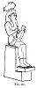
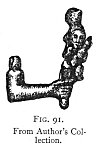

  
[Intangible Textual Heritage](../../index)  [Evil](../index) 
[Index](index)  [Previous](tee08)  [Next](tee10) 

------------------------------------------------------------------------

[Buy this Book at
Amazon.com](https://www.amazon.com/exec/obidos/ASIN/B0024NL744/internetsacredte)

------------------------------------------------------------------------

  
*The Evil Eye*, by Frederick Thomas Elworthy, \[1895\], at Intangible
Textual Heritage

------------------------------------------------------------------------

p. 226

### APPENDIX I

A VERY short excursion in the field of comparative religions will show
how one idea seems to have come from the far East in the early days of
mankind, and to have taken root in the minds of all races who came
westward. We have already referred to the faith which led the Magi to
follow the star to Bethlehem. Throughout the East it was the primæval
instinct that a child was to be born of a celestial mother, who should
destroy the spirit of evil and be the saviour of mankind. Not only so,
but the mother was to conceive and to bring him forth from her own
inherent power. [366](#fn_386) With the triune
male deity we find a single female associated. "Her names are
innumerable, 'Mother of all the Gods,' The Lady, The Queen, Mulita,
Bilta, Ishtar, or the bright, pure being. She is also Ri, Alitta,
Elissa, Beltis, Ashtoreth, Astarte, Saraha or Sara, Nana, Asurah,
Tanith. All these and more are Babylonish, but elsewhere she is Athor,
Dea, Syria, Artemis, Aphrodite, Rhea, Demeter, Ceres, Diana, Minerva,
Juno, Venus, Isis, Cybele, Ge, Hera. As Anaitis she is 'The Mother of
the Child'; reproduced again as Isis and Horus, Devaki and Christna,
Aurora and Memnon. Even in ancient Mexico the mother and child were
worshipped. In modern times she survives as the Virgin Mary and her Son.
There were Ishtar of Nineveh and Ishtar of Arbela, just as there are now
Maria di Loretto and Marie de la Garde."

Indranee (and her child), consort of Indur from the cave of Indur Subha,
are again one and the same person. [Fig. 74](tee08.htm#img_19200) [367](#fn_387) really represents Mary, whose name is
synonymous with maternity, but not with ordinary maternity occurring on
earth, inasmuch as throughout the ancient mythologies

p. 227

the celestial mother was represented as a virgin [368](#fn_388)--the same "woman who has replaced in
Christendom the celestial virgin of Paganism."

The same author [369](#fn_389) records that in
India, Christna, Chrishna, or Vishnu, is usually called "the saviour" or
"preserver." "He, being a god, became incarnate in the flesh. As soon as
he was born he was saluted by a chorus of angels or avators." "One of
his names is 'the Good Shepherd.' Christna cured a leper, a woman poured
on his head a box of ointment, and he cured her of disease. He washed
the feet of Brahmins. Christna had a dreadful fight with the serpent
Caluga. He astonished his tutor by his learning. He was crucified, went
into hell, and afterwards into heaven. Christna and his mother are
always represented as black. His statue in the temple at Mathura is
black, and the temple is built in the form of a cross. As Vishnu he is
painted with a Parthian coronet, when crucified. As Wittoba he has
sometimes the stigmata in his hands, and sometimes in his feet, and one
picture represents him with a round hole in his side: to his collar
hangs a heart." [370](#fn_390)

This account is so remarkable in its correspondence with our Gospel
narrative that it seems almost incredible for it to be other than a
paraphrase therefrom. Nevertheless, our author says "There is every
reason to believe the legend to be more ancient than the Christian era."
The various illustrations in other books fully support the foregoing.
Chrishna is represented in Moor's *Hindu Pantheon* (p. 67) with a nimbus
as shown in [Fig. 72](tee08.htm#img_19000), while winged cherubs from
above are sending down upon him rays of light, just as we are accustomed
to see in pictures of the baptism of our Lord. He is also shown as
crucified in precisely the same way, and with a crown of thorns and
nimbus, just as we are accustomed to see in pictures of the
Crucifixion. [371](#fn_391)

p. 228

Isis and Horus were distinctly associated with a fish, for we find her
represented as bearing a fish on her head 

<table data-align="LEFT">
<colgroup>
<col style="width: 100%" />
</colgroup>
<tbody>
<tr class="odd">
<td data-valign="CENTER"><a href="img/22800.jpg"> 
Click to enlarge</a> 
FIG. 90 
</td>
</tr>
</tbody>
</table>

instead of the usual disc and horns (Fig. 90). [372](#fn_392) Another author says: "The most obvious
and ancient symbol of the reproductive power of water was a fish. [373](#fn_393) Derceto, goddess of the Phœnicians,
had the body of a woman ending in a fish. We have already remarked that
Diana was sovereign of humidity, and was symbolised in the aspect of the
goddess of the fertilising power of water by a crab. We venture to
suggest that these considerations offer another solution of the origin
of the fish as a Christian symbol of Christ. The acrostic or rebus
explanation of the Greek word for fish has always seemed speculative and
far-fetched, when viewed by the light obtained from other
well-understood objects, such as the cross, which have certainly been
adopted from so-called heathenism. All these startling facts, so far
from unsettling our weak minds upon the cardinal facts of our Christian
belief, should but prove to us that they are founded upon an instinct
planted in the breast of man as mysterious as his life, and just as
inexplicable by his limited faculties. They do but point out the
futility of what we in our pride call "knowledge," and suggest to us
that the best motto modern savants could adopt would still be *Quod scis
nescis*. [374](#fn_394)

Further, we suggest that the celestial mother and child were not only
objects of faith and worship, but representations

p. 229

of them were certainly used as amulets. In support of this we point to
[Fig. 91](#img_22900), a bronze 

<table data-align="RIGHT">
<colgroup>
<col style="width: 100%" />
</colgroup>
<tbody>
<tr class="odd">
<td data-valign="CENTER"><a href="img/22900.jpg"> 
Click to enlarge</a> 
FIG. 91. From Author's Collection 
</td>
</tr>
</tbody>
</table>

arm from a larger figure, holding out a woman and child, in a manner
which candour must admit to be conclusive. The bronze, of evident
antiquity, was obtained by the writer from a native on the Nile. It is
scarcely a likely object to have been forged. Another piece of
convincing evidence is found in the woman and child in both
representations of the Mano Pantea (Figs. [148](tee13.htm#img_29900),
[156](tee13.htm#img_31800)).

------------------------------------------------------------------------

### Footnotes

[226:366](tee09.htm#fr_386) Inman, *Ancient
Faiths*, Vol. i. p. 98 *et seq*.

[226:367](tee09.htm#fr_387) From *Asiatic
Researches*, Vol. vi. p. 393. I am quite aware that Lieutenant Wilford
is said to have been imposed upon by stories invented for him. Into that
controversy I need not enter, and merely give his statements for what
they are worth. Prof. Max Müller refers to this in an article in
*Nineteenth Century*, October 1894.

[227:368](tee09.htm#fr_388) Inman, *op. cit.*
Vol. i. p. 253.

[227:369](tee09.htm#fr_389) *Ib*. vol. i. p.
400.

[227:370](tee09.htm#fr_390) *Ib*. vol. i. pp.
400-403.

[227:371](tee09.htm#fr_391) Much information on
this subject may be found in Hislop's *Two Babylons*, pp. 30-90. It is
needless to say that we have no sympathy with p.
228 the purpose of this book nor with the spirit in which it is
written. Moreover, judging from some of those we have endeavoured to
verify, the references cannot be wholly relied on.

[228:372](tee09.htm#fr_392) Inman, *Ancient
Faiths*, vol. i. Frontispiece; also p. 520.

[228:373](tee09.htm#fr_393) Payne Knight,
*Symbolical Language*, p. 111.

[228:374](tee09.htm#fr_394) Upon this subject
see Mr. Gladstone's remarks in a paper on Heresy in the *Nineteenth
Century*, August 1894, p. 174.

------------------------------------------------------------------------

[Next: Appendix II](tee10)
