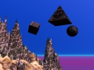

  
[Intangible Textual Heritage](../../index)  [Fortean](../index) 
[Index](index)  [Previous](land05)  [Next](land07) 

------------------------------------------------------------------------

[Buy this Book at
Amazon.com](https://www.amazon.com/exec/obidos/ASIN/B0027P8882/internetsacredte)

------------------------------------------------------------------------

  
*New Lands*, by Charles Fort, \[1923\], at Intangible Textual Heritage

------------------------------------------------------------------------

### 6

*English Mechanic*, 56-184:

That, upon April 25, 1892, Archdeacon
Nouri climbed Mt. Ararat. It was his hope that he should find something
of archæologic compensation for his clamberings. He found Noah's Ark.

About the same time, Dr. Holden, Director of the Lick Observatory, was
watching one of the polished and mysterious-looking instruments that, in
the new ikonology, have replaced the images of saints. Dr. Holden was
waiting for the appointed moment of the explosion of a large quantity of
dynamite in San Francisco Bay. The moment came. The polished little
"saint" revealed to the faithful scientist. He wrote an account of the
record, and sent copies to the San Francisco newspapers. Then he learned
that the dynamite had not been fired off. He sent a second messenger
after the first messenger, and, because messengers sometimes have
velocities proportional to urgencies—"the Observatory escaped ridicule
by a narrow margin." See the *Observatory*, 20-467. This revelation came
from Prof. Colton, who, though probably faithful to all the "saints,"
did not like Dr. Holden.

The system that Archdeacon Nouri represented lost its power be.

p. 346

cause its claims exceeded all conceivableness, and because, in other
respects, of its inertness to the obvious. The system that Dr. Holden
represented is not different: there is the same seeing of whatever may
be desirable, and the same profound meditations upon the remote, with
the same inattention to fairly acceptable starting-points. The
astronomers like to tell audiences of just what gases are burning in an
unimaginably remote star, but have never reasonably made acceptable, for
instance, that this earth is round, to start with. Of course I do not
mean to say that this, or anything else, can be positively proved, but
it is depressing to hear it said, so authoritatively, that the round
shadow of this earth upon the moon proves that this earth is round,
whereas records of angular shadows are common, and whereas, if this
earth were a cube, its straight sides would cast a rounded shadow upon
the convex moon. That the first part of a receding vessel to disappear
should be the lower part may be only such an illusion of perspective as
that by which railroad tracks seem to dip toward each other in the
distance. Meteors sometimes appear over one part of the horizon and then
seem to curve down behind the opposite part of the horizon, whereas they
describe no such curve, because to a string of observers each observer
is at the center of the seeming curve.

Once upon a time—about the year 1870—occurred an unusual sporting event.
John Hampden, who was noted for his piety and his bad language, whose
avowed purpose was to support the principles of this earth's earliest
geodesist, offered to bet five hundred pounds that he could prove the
flatness of this earth. Somewhere in England is the Bedford Canal, and
along a part of it is a straight, unimpeded view, six miles in length.
Orthodox doctrine—or the doctrine of the newer orthodoxy, because John
Hampden considered that he was orthodox—is that the earth's curvature is
expressible in the formula of 8 inches for the first mile, and then the
square of the distance times 8 inches. For two miles, then, the square
of 2, or 4, times 8. An object six miles away should be depressed 288
inches, or, allowing for refraction, according to Proctor (*Old and New
Astronomy*) 216 inches. Hampden said that an object six miles away, upon
this part of the Bedford Canal, was not depressed as it "should" be. Dr.
Alfred Russell Wallace took up the bet. Mr. Walsh,

p. 347

\[paragraph continues\] Editor of the
*Field*, was the stakeholder. A procession went to the Bedford Canal.
Objects were looked at through telescopes, or looked for, and the
decision was that Hampden had lost. There was rejoicing in the fold of
the chosen, though Hampden, in one of his most furious bombardments of
verses from the Bible, charged conspiracy and malfeasance and
confiscation, and what else I don't know, piously and intemperately
declaring that he had been defrauded.

In the *English Mechanic*, 80-40, someone writes to find out about the
"Bedford Canal Experiment." We learn that the experiment had been made
again. The correspondent writes that, if there were basis to the rumors
that he had heard, there must be something wrong with established
doctrine. Upon page 138, Lady Blount answers—that, upon May 11, 1904,
she had gone to the Bedford Canal, accompanied by Mr. E. Clifton, a
well-known photographer, who was himself uninfluenced by her motives,
which were the familiar ones of attempting to restore the old gentleman
who first took up the study of geodesy. However, she seethes with
neither piety nor profanity. She says that, with his telescopic camera,
Mr. Clifton had photographed a sheet, six miles away, though by
conventional theory the sheet should have been invisible. In a later
number of the *English Mechanic*, a reproduction of this photograph is
published. According to this evidence this earth is flat, or is a sphere
enormously greater than is generally supposed. But at the 1901 meeting
of the British Association for the Advancement of Science, Mr. H. Yule
Oldham read a paper upon his investigations at the Bedford Canal. He,
too, showed photographs. In his photographs, everything that should have
been invisible was invisible.

I accept that anybody who is convinced that still are there relics upon
Mt. Ararat, has only to climb Mt. Ararat, and he must find something
that can be said to be part of Noah's Ark, petrified perhaps. If someone
else should be convinced that a mistake has been made, and that the
mountain is really Pike's Peak, he has only to climb Pike's Peak and
prove that the most virtuous of all lands was once the Holy Land. The
meaning that I read in the whole subject is that, in this Dark Age that
we're living in, not even such rudimentary matters as the shape of this
earth have ever been investigated

p. 348

except now and then to support somebody's theory, because astronomers
have instinctively preferred the remote and the not so easily
understandable and the safe from external inquiry. In *Earth Features
and Their Meaning*, Prof. Hobbs says that this earth is top-shaped,
quite as the sloping extremities of Africa and South America suggest.
According to Prof. Hobbs, observations upon the pendulum suggest that
this earth is shaped like a top. Some years ago, Dr. Gregory read a
paper at a meeting of the Royal Geographical Society, giving data to
support the theory of a top-shaped earth. In the records of the Society,
one may read a report of the discussion that followed. There was no
ridiculing. The President of the Society closed the discussion with
virtual endorsement, recalling that it was Christopher Columbus who
first said that this earth is top-shaped. For other expressions of this
revolt against ancient dogmas, see *Bull. Soc. Astro. de France*,
17-315; 18-143; *Pop. Sci. News*, 31-234; *Eng. Mec.*, 77-159; *Sci.
Amer.*, 100-441.

As to supposed motions of this earth, axial and orbital, circumstances
are the same, despite the popular supposition that the existence of
these motions has been established by syntheses of data and by
unanswerable logic. All scientists, philosophers, religionists, are
today looking back, wondering what could have been the matter with their
predecessors to permit them to believe what they did believe. Granted
that there will be posterity, we shall be predecessors. Then what is it
that is conventionally taught today that will in the future seem as
imbecilic as to all present orthodoxies seem the vaporings of preceding
systems?

Well, for instance, that it is this earth that moves, though the sun
seems to, by the same illusion by which to passengers on a boat, the
shore seems to move, though it is the boat that is moving.

Apply this reasoning to the moon. The moon seems to move around the
earth—but to passengers on a boat, the shore seems to move, whereas it
is the boat that is moving—therefore the moon does not move.

As to the motions of the planets and stars that co-ordinate with the
idea of a moving earth—they co-ordinate equally well with the idea of a
stationary earth.

In the system that was conceived by Copernicus I find nothing

p. 349

that can be said to resemble foundation: nothing but the appeal of
greater simplicity. An earth that rotates and revolves is simpler to
conceive of than is a stationary earth with a rigid composition of
stars, swinging around it, stars kept apart by some. unknown substance,
or inter-repulsion. But all those who think that simplification is a
standard to judge by are referred to Herbert Spencer's compilations of
data indicating that advancing knowledge complicates, making, then,
complexity, and not simplicity, the standard by which to judge the more
advanced. My own acceptance is that there are fluxes one way and then
the other way: that the Ptolemaic system was complex and was simplified;
that, out of what was once a clarification, new complications have
arisen, and that again will come flux toward simplification or
clarification—that the simplification by Copernicus has now developed
into an incubus of unintelligibilities revolving around a farrago of
inconsistencies, to which the complexities of Ptolemy are clear
geometry: miracles, incredibilities, puerilities; tottering deductions
depending upon flimsy agreements; brutalized observations that are
slaves to infatuated principles

And one clear call that is heard above the rumble of readjusting
collapses—the call for a Neo-astronomy—it may not be our Neo-astronomy.

Prof. Young, for instance, in his *Manual of Astronomy*, says that there
are no common, obvious proofs that the earth moves around the sun, but
that there are three abstrusities, all of modern determination. Then, if
Copernicus founded the present system, he founded upon nothing. He had
nothing to base upon. He either never heard of, or could not detect one
of these abstrusities. All his logic is represented in his reasoning
upon this earth's rotundity: that this earth is round, because of a
general tendency to sphericity, manifesting, for instance, in fruits and
in drops of water—showing that lie must have been unaware not only of
abstrusities, but of icicles and bananas and oysters. It is not that I
am snobbishly deriding the humble and more than questionable ancestry of
modern astronomy. I am pointing out that a doctrine came into existence
with nothing for a foundation: not a datum, not one observation to found
upon; no astronomical principles, no mechanical principles to justify
it. Our inquiry will be as to how, in the annals of false architecture,
it

p. 350

could ever be said that—except miraculously, of course—a foundation was
subsequently slipped under this baseless structure, dug under, rammed
under, or God knows how devised and fashioned.

------------------------------------------------------------------------

[Next: 7](land07)
