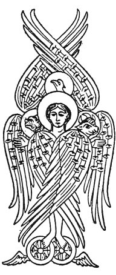
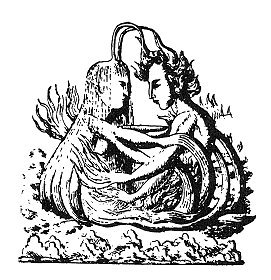

  
[Intangible Textual Heritage](../../index)  [Gnosticism](../index) 
[Index](index)  [Next](fff01) 

------------------------------------------------------------------------

[Buy this Book at
Amazon.com](https://www.amazon.com/exec/obidos/ASIN/B002CVUVRM/internetsacredte)

------------------------------------------------------------------------

  
*Fragments of a Faith Forgotten*, by G.R.S. Mead, \[1900\], at
Intangible Textual Heritage

------------------------------------------------------------------------

# FRAGMENTS OF A FAITH FORGOTTEN

## by George Robert Stow Mead

###### SOME SHORT SKETCHES AMONG THE GNOSTICS, MAINLY OF THE FIRST TWO CENTURIES : A CONTRIBUTION TO THE STUDY OF CHRISTIAN ORIGINS BASED ON THE MOST RECENTLY RECOVERED MATERIALS.

#### Theosophical Publishing Society: London

#### \[1900\]

Scanned, Proofed, and formatted at Intangible Textual Heritage, June
2006, by John Bruno Hare. This text is in the public domain in the
United States because it was published prior to 1923.

 

 

 

<table data-border="0" width="50%">
<colgroup>
<col style="width: 100%" />
</colgroup>
<tbody>
<tr class="odd">
<td data-valign="top" width="655">
So understand the Light, He answered, and make friends with it. 
                       HERMES THE THRICE-GREATEST.
</td>
</tr>
</tbody>
</table>

 

 

------------------------------------------------------------------------

[Next: Synopsis of Contents](fff01)
