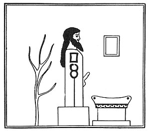

  
[Intangible Textual Heritage](../../index)  [Gnosticism](../index) 
[Index](index)  [Previous](fff16)  [Next](fff18) 

------------------------------------------------------------------------

[Buy this Book at
Amazon.com](https://www.amazon.com/exec/obidos/ASIN/B002CVUVRM/internetsacredte)

------------------------------------------------------------------------

  
*Fragments of a Faith Forgotten*, by G.R.S. Mead, \[1900\], at
Intangible Textual Heritage

------------------------------------------------------------------------

p. 154 p. 155

 

# The Gnosis According to its Foes

------------------------------------------------------------------------

[Next: Some Gnostic Fragments Recovered from the Polemical Writings of
the Church Fathers](fff18)
