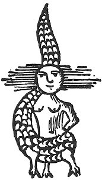

  
[Intangible Textual Heritage](../../index)  [Gnosticism](../index) 
[Index](index)  [Previous](fff17)  [Next](fff19) 

------------------------------------------------------------------------

[Buy this Book at
Amazon.com](https://www.amazon.com/exec/obidos/ASIN/B002CVUVRM/internetsacredte)

------------------------------------------------------------------------

  
*Fragments of a Faith Forgotten*, by G.R.S. Mead, \[1900\], at
Intangible Textual Heritage

------------------------------------------------------------------------

p. 156

<table data-border="0" width="50%">
<colgroup>
<col style="width: 100%" />
</colgroup>
<tbody>
<tr class="odd">
<td data-valign="top" width="655">
Oh that mine adversary had written a book! 
       <em>Job</em> (according to the Authorised Version).
</td>
</tr>
</tbody>
</table>

p. 157

 

### Some Gnostic Fragments Recovered from the Polemical Writings of the Church Fathers

WE shall now proceed to introduce the reader to the chief teachers and
schools of Gnosticism, as far No Classification
Possible. as they are known to us from the polemical writings of
the Church Fathers. Unfortunately we are not in a position to present
the student with a satisfactory classification of the Gnostic schools;
every classification previously attempted has completely broken down,
and in the present state of our knowledge we must be content to sift the
different phases of development out of the heap as best we can. Clement
of Alexandria, at the end of the second century, tried the rough
expedient of dividing these schools of Christendom into ascetic and
licentious sects; Neander at the beginning of the present century
endeavoured to classify them by their friendly or unfriendly relations
to Judaism; Baur followed with an attempt which took into consideration
not

p. 158

only how they regarded Judaism, but also their attitude to Heathenism;
Matter adopted a geographical distribution into the schools of Syria,
Asia Minor, and Egypt; and Lipsius followed with a more general division
into the Gnosticism of Syria and of Alexandria.

All these classifications break down on many important points; and we
are thus compelled to follow the imperfect indications of the earliest
Patristic hæresiologists, who vaguely and uncritically ascribed the
origin of Gnosticism to "Simon Magus." It is, however, certain that the
origin of Gnostic ideas, so far from being simple and traceable to an
individual, was of a most complex nature; some have thought that it has
to be sought for along the line of so-called "Ophitism," which is a
general term among the hæresiologists for almost everything they cannot
ascribe to a particular teacher. But the medley of schools and
tendencies which the Fathers indiscriminately jumble together as Ophite,
contains the most heterogeneous elements, good and bad. The name Ophite,
or "serpent-worshipper," is simply a term of abuse used solely by the
refutators, while the adherents of these schools called themselves
generally "Gnostics," and were apparently the first to use the term.

We shall, therefore, first of all follow the so-called "Simonian" line
of descent until the first quarter of the second century; then plunge
into the indefinite chaos of the "Gnostics"; next retrace our steps
along a Gnostic phase of the Ebionite tradition; and finally treat of
the most brilliant epoch of Gnosticism known

p. 159

to us--when Basilides, Valentinus, and Bardesanes lived and worked and
thought, and Marcion amazed infant orthodoxy with a "higher criticism"
which for boldness has perhaps not yet been equalled even in our own
day. It was an epoch which gave birth to works of such excellence that,
in the words of Dr. Carl Schmidt (in the Introduction to his edition of
the Codex Brucianus), "we stand amazed, marvelling at the boldness of
the speculations, dazzled by the richness of thought, touched by the
depth of soul of the author"--"a period when Gnostic genius like a
mighty eagle left the world behind it, and soared in wide and ever wider
circles towards pure light, towards pure knowledge, in which it lost
itself in ecstasy."

We should, however, in studying the lives and teachings of these
Gnostics always bear in mind that our only sources of information have
hitherto been the caricatures of the hæresiologists, and remember that
only the points which seemed fantastic to the refutators were selected,
and then exaggerated by every art of hostile criticism; the ethical and
general teachings which provided no such points, were almost invariably
passed over. It is, therefore, impossible to obtain anything but a most
distorted portrait of men whose greatest sin was that they were
centuries before their time. It should further be remembered, that the
term "heresy" in the first two centuries, did not generally connote the
narrow meaning assigned to it later on. It was simply the usual term for
a school of philosophy; thus we read of the heresy of Plato, of Zeno, of
Aristotle. The Gnostics, and the rest of Christendom also, were thus
divided into a

p. 160

number of schools or "heresies," which in those early times were more or
less of equal dignity and authenticity.

------------------------------------------------------------------------

[Next: The ''Simonians''](fff19)
