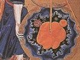

  
[Intangible Textual Heritage](../../index)  [Gnosticism](../index) 
[Index](index)  [Previous](fff61)  [Next](fff63) 

------------------------------------------------------------------------

[Buy this Book at
Amazon.com](https://www.amazon.com/exec/obidos/ASIN/B002CVUVRM/internetsacredte)

------------------------------------------------------------------------

  
*Fragments of a Faith Forgotten*, by G.R.S. Mead, \[1900\], at
Intangible Textual Heritage

------------------------------------------------------------------------

p. 445

### FROM THE ACTS OF ANDREW.

FROM *The Acts of Andrew* the following Address Address to the Cross. to the Cross is of great
interest, when compared with what has been already quoted from *The Acts
of John* and with the rest of the Gnostic ideas on the subject. For the
Gnostics the Cross was a symbol of cosmic processes as well as of the
crucifixion of the soul in matter and of its regeneration, and it is to
be regretted that our information is so fragmentary. The following
Address put into the mouth of Andrew has been worked over by Catholic
scribes, but the underlying material is plainly to be derived from the
Gnostic circle of ideas.

"Rejoicing I come to thee, thou Cross, the life-giver, Cross whom I now
know to be mine; I know thy mystery, for thou hast been planted in the
world to make fast things unstable.

"Thy head stretcheth up into heaven, that thou mayest symbol forth the
heavenly Logos, the head of all things. Thy middle parts are stretched
forth, as it were hands to right and left, to put to flight the envious
and hostile power of the evil one, that thou mayest gather together into
one them \[*sci*., the limbs\] that are scattered abroad. Thy foot is
set in the earth, sunk in the deep, that thou mayest draw up those that
lie beneath the earth and are held fast in the regions beneath it, and
mayest join them to those in heaven.

"O Cross, engine, most skilfully devised, of

p. 446

salvation given unto men by the Highest; O Cross, invincible trophy of
the conquest of Christ o’er His foes; O Cross, thou life-giving tree,
roots planted on earth, fruit treasured in heaven; O Cross most
venerable, sweet thing and sweet name; O Cross most worshipful, who
bearest as grapes the Master, the true vine, who dost bear too the Thief
as thy fruit, fruitage of faith through confession; thou who bringest
the worthy to God through the Gnosis and summonest sinners home through
repentance!"

------------------------------------------------------------------------

[Next: From The Travels of Peter](fff63)
