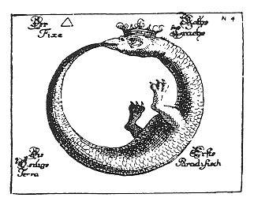

  
[Intangible Textual Heritage](../../index)  [Gnosticism](../index) 
[Index](index)  [Previous](fff64)  [Next](fff66) 

------------------------------------------------------------------------

[Buy this Book at
Amazon.com](https://www.amazon.com/exec/obidos/ASIN/B002CVUVRM/internetsacredte)

------------------------------------------------------------------------

  
*Fragments of a Faith Forgotten*, by G.R.S. Mead, \[1900\], at
Intangible Textual Heritage

------------------------------------------------------------------------

p. 452

*Sempiterna Lux! Nec divitias nec honores peto; me
modo Divinæ Lucis radio illumines!*  
  
                 From *An Essay of Transmigration in Defence of
Pythagoras* (London, 1692).

p. 453

 

## Some Greek Original Works in Coptic Translation

### THE ASKEW AND BRUCE CODICES.

So far we have endeavoured to recover some fragments of flotsam and
jetsam from the pitiful wreck of the Gnosis, wrought by the hands of its
bitterest foes, the orthodox Church Fathers; we will now try to give the
reader some rough idea of the contents of some Gnostic treatises, which
have been preserved to us in Coptic translation by the hands of its
friends.

We have to consider the contents of three precious documents known as
the Askew, Bruce, and Akhmīm Codices, the last of which was only
discovered in 1896. We shall reserve the Akhmīm Codex for later notice,
since little is so far known of it, and so give our immediate attention
to the Askew and Bruce Codices.

The Askew Codex was bought by the British Museum from the heirs of Dr.
Askew at the The Askew Codex. end of the
last century (presumably a little prior to 1785). The MS. is written on
vellum in Greek uncials, in the Upper Egyptian

p. 454

dialect, and is not in roll but in book-form. It consists of 346 quarto
pages, and for the most part is in an excellent state of preservation; a
few leaves only are missing. The Codex is a copy and not an original;
and the original was a translation from the Greek. The general contents
consist of a treatise to which custom has given the name *Pistis
Sophia*, owing to a heading in the middle of the general narrative,
added by another hand. The treatise has no superscription or
subscription, and though there is a long incident in it dealing with the
passion and redemption of the Sophia, other parts of equal length might
just as well be called *The Questions of Mary*, as Harnack has
suggested, and Matter long prior to him. The Codex also contains a short
inset and a lengthy appendix entitled *Extracts from the Books of the
Saviour*. For a further description I must refer the reader to the
Introduction of my translation.

The Bruce CodexThe Bruce Codex was brought
to England from Upper Egypt in 1769 by the famous Scottish traveller
Bruce, and bequeathed to the care of the Bodleian Library, Oxford. It is
written on papyrus, in Greek cursive characters, in the Upper Egyptian
dialect, and consists of seventy-eight leaves, in book-form. Its leaves
are in a most terrible state of disorder and dilapidation, and many are
missing. A scientific examination of the Codex reveals the fact that it
consists of two distinct MSS., containing the remains of at least two
distinct Gnostic works and some fragments. The superior MS., of better
material and finer handwriting, contains a treatise of great sublimity,
but without a title, the

p. 455

first and last pages being lost. The other MS. contains fragments of at
least two separate books, and preserves the title *The Book of the Great
Logos according to the Mystery*. This is taken by Schmidt to be the
general title, and to comprise two parts which he calls respectively the
*First and Second Book, of Ieou*.

The contents of these treatises are of such a marvellous and complex
nature, that I despair of Translations.
giving the general reader any adequate conception of them. The student
may, however, form some idea of the task by reading my translation of
the *Pistis Sophia* treatise and the *Extracts from the Books of the
Saviour;* but even this will give him no adequate conception of the
complexity of the contents of the Codex Brucianus, of which,
unfortunately, there is as yet no English translation.

In 1891 Amélineau published a text and French translation of the Bruce
Codex with a brief introduction; but his text was based on Woide's copy
of the Codex made a century ago, and the French *savant* had no idea
that he was dealing with two distinct MSS., whose leaves were jumbled up
in inextricable confusion.

In 1892 Dr. Carl Schmidt, having with admirable patience collated the
copies of the Codex made by Schwartze and Woide with the original at
Oxford, and with still greater acumen and industry separated the two
MSS. and placed their respective leaves in order, published a critical
text, with a German translation and a voluminous commentary.

In the following *résumé*, with regard to the Codex

p. 456

\[paragraph continues\] The Difficulty of the Subject.Brucianus, I shall
follow Schmidt's translation and not Amélineau's. Schmidt is by far the
most competent authority in the field, and no praise is too high a
tribute to pay this most distinguished Coptic scholar for his unwearied
patience. I have before me a rough translation of the whole of Schmidt's
voluminous work, and have spared no pains to make myself acquainted with
his labours; but, even with his help, I feel as yet a very tyro in the
Gnosticism revealed in these treatises. For, though Schmidt throws light
on many points, innumerable problems are still left untouched; in fact,
with all his admirable scholarship and infinite research, he is entirely
baffled on just those very points which seem to have been of greatest
interest to the composers or compilers of these Gnostic documents.

When, in 1896, I published a translation of the *Pistis Sophia* I had
intended to follow it up with a commentary; but I speedily found that in
spite of the years of work I had already given to Gnosticism, there were
still many years of labour before me, ere I could satisfy myself that I
was competent to essay the task in any really satisfactory fashion; I
have accordingly reserved that task for the future. Meantime, in the
present short sketches nothing more is attempted than a very tentative
summary, so that the general reader may obtain some notion of the
contents of our Coptic Gnostic treatises; my only excuse for breaking
silence being that there is absolutely nothing as yet in English on the
contents of the Bruce Codex.

p. 457

We will, then, first of all attempt a summary of the contents of the
so-called *Pistis Sophia* Programme.
treatise; then a summary of the *Extracts from the Books of the
Saviour*, inserted in and following after this treatise in the Askew
Codex. This will be followed by a summary of the fragments contained in
the inferior MS. of the Bruce Codex. I shall venture, however, to
transpose Schmidt's main order, and place what he calls *The Second Book
of Ieou* before what he calls *The First*, for the general subjects of
his first group of fragments seem to me to follow the subjects of his
second, rather than the contrary. It is quite true that the beginning of
his second division starts on the *verso* of the papyrus leaf, the
*recto* of which contains the end of the other; but this only assures us
the correct position of two adjacent fragments. That the numerous other
fragments are always arranged in their proper sequence is by no means
quite certain, though I frankly confess I so far see no more
satisfactory ordering of the chaos myself.

That we have among these fragments part of the original contents of *The
Books of Ieou* mentioned in the *Pistis Sophia* seems highly probable,
but that we can assign our fragments definitely to Books I. and II. is
not so certain. The whole will therefore in our summary stand under the
general title, *The Book of the Great Logos according to the Mystery*,
without further distinction, including both the introductory matter and
also the leaves surrounded by a border, which Schmidt adds as an
appendix. But it must be understood that this

p. 458

is a tentative arrangement. There may be several treatises to which the
fragments of the inferior MS. of the Bruce Codex ought to be assigned
for anything we know to the contrary.

This will be followed by the fragments of the untitled treatise
contained in the superior MS.

The purpose that has guided me in this general arrangement is, as far as
possible, to place the contents of these Coptic translations roughly in
such a sequence that the reader may be led from lower to higher grades
of the Gnosis. I am perfectly aware that higher mysteries (the three
Spaces of the Inheritance) are spoken of and explained in the *Pistis
Sophia* treatise than in the rest of the matter, but they are not
revealed. In *The Book of the Great Logos* and in the *Extracts from the
Books of the Saviour* some of the mysteries are given, and the disciples
are made to see face to face. I therefore place the summary of the
*Pistis* first, though it was probably composed last.

------------------------------------------------------------------------

[Next: Summary of the Contents of the So-Called Pistis Sophia
Treatise](fff66)
