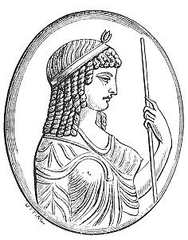

  
[Intangible Textual Heritage](../../index)  [Gnosticism](../index) 
[Index](index)  [Previous](gar24)  [Next](gar26) 

------------------------------------------------------------------------

[Buy this Book at
Amazon.com](https://www.amazon.com/exec/obidos/ASIN/B002BA5FIO/internetsacredte)

------------------------------------------------------------------------

  
*The Gnostics and Their Remains*, by Charles William King, \[1887\], at
Intangible Textual Heritage

------------------------------------------------------------------------

### III. MONUMENTS OF THE SERAPIS WORSHIP.

Innumerable are the statues, bas-reliefs, and gems, many of them in the
best [style](errata.htm#9) of Roman art, emanating from the worship of
Serapis; a thing not to be wondered at in the case of a divinity whose
idea involved the two strongest principles that actuate the conduct of
mankind--the love of riches and the fear of death. For the god of the
subterranean world was necessarily lord also of its treasures; a truth
expressed by the dedication to Serapis of an altar as "Iovi custodi et
genio thesaurorum" (Winckelmann, 'Pierres Gravées de Stosch,' p. 83).
And similarly the older Roman Pluto takes the title of "Jupiter
Stygius;" but the comprehensiveness of the idea as expanded by the
monotheistic tendency of later times is most fully manifested by the
invocation (Raspe, No. 1490) **ΕΙC ΖΕΥC CΑΡΑΠΙC ΑΓΙΟΝ ΟΝΟΜΑ CΑΒΑΩ ΦΩC
ΑΝΑΟΤΛΗ ΧΘΩΝ** "One Jupiter, Serapis, Holy Name, Sabaoth, the Light, the
Day-spring, the Earth!"

Talismanic gems very commonly bear the full length figure, or the bust
of Serapis, with the legend **ΕΙC ΘΕΟC CΑΡΑΠΙC** (often abbreviated into
**Ε · Θ · C**), "There is but one God, and he is Serapis: "**ΕΙC ΖΩΝ
ΘΕΟC**, "The One Living God." Sometimes the purpose of the amulet is
distinctly expressed by the inscription, **ΝΙΚΑΟ CΑΡΑΠΙC ΤΟΝ ΦΘΟΝΟΝ**,
"Baffle the Evil-eye, O Serapis:" or in the curious example published by
Caylus, where the god stands between Venus and Horus, and the legend
**ΚΑΤΑ ΧΡΗΜΑΤΙCΜΟΝ** intimates that the gem had been "so" engraved in
consequence of a vision or other divine intimation. Around his bust on a
jasper (Praun) appears the invocation, convincing proof of his supposed
supremacy, **ΦΥΛΑCCΕ ΔΙΑ**, "Protect Jupiter," the ancient king of
heaven being now degraded to the rank of an astral genius and benignant
horoscope. Invocations like the

p. 173

above bear the unmistakable stamp of the age when the old, liberal,
mythology of the West, which had pictured Heaven as a well-ordered
monarchy peopled by innumerable deities, each one having his own proper
and undisputed position therein, was fast giving place to the gloomy
superstitions of Syria, which made the tutelary divinity of each nation
or sect the sole god of Heaven, condemning those of all other races as
mere deceivers and evil spirits.

There are, however, many gems, fine both as to material and workmanship,
which give us, besides Serapis, the primitive Egyptian gods exactly as
they appear in the most ancient monuments, but engraved in the
unmistakable style of Roman art. Most of these are to be referred to the
efforts of Hadrian to resuscitate the *forms* of that old religion whose
*life* had long before passed away in this equally with the grander
department of sculpture. Under his zealous patronage, the religion of
the Pharaohs blazed up for a moment with a brilliant but factitious
lustre, a phenomenon often observed to precede the extinction of a long
established system. [\*](#fn_84) To this period
belongs a beautiful sard of my own, which represents Serapis enthroned
exactly as Macrobius describes him, whilst in front *stands* Isis,
holding in one hand the sistrum, in the other a wheatsheaf, with the
legend, **ΗΚΥΡΙΑΕΙCΙC ΑΓΝΗ**. [†](#fn_85)
"Immaculate is our Lady Isis!" This address is couched in the exact
words applied later to the personage who succeeded to the form, titles,
symbols and ceremonies of Isis with even less variation than marked the
other interchange alluded to above. The "Black Virgins" so highly
venerated in certain French Cathedrals during the long night of the
Middle Ages, proved when at last examined by antiquarian eyes to be
basalt statues of the Egyptian goddess, which having merely changed the
name, continued to receive more than pristine adoration. Her devotees
carried into the new priesthood the ancient badges of their profession;
"the obligation to celibacy," the tonsure, the

p. 174

bell, and the surplice--omitting unfortunately the frequent and complete
ablutions enjoined by the older ritual. The holy image still moves in
procession as when Juvenal laughed at it (vi. 530), "Escorted by the
tonsured, surpliced, train." Even her proper title "Domina," exact
translation of the Sanscrit *Isi*, survives with slight change, in the
modern "Madonna" (Mater-Domina). By a singular permutation of meaning
the flower borne in the hand of each, the lotus, former symbol of
*perfection* (because in leaf, flower, fruit, it gave the figure of the
Circle, as Jamblichus explains it), and therefore of fecundity, is now
interpreted as signifying the opposite to the last--virginity itself.
The tinkling *sistrum*, so well pleasing to Egyptian ears, has unluckily
found a substitute in that most hideous of all noise-makers, the
clangorous bell. But this latter instrument came directly from the
Buddhistic ritual in which it forms as essential a part of the religion
as it did in Celtic Christianity, where the Holy Bell was the actual
*object* of worship to the new converts. The hell in its present form
was unknown to the Greeks and Romans; its normal shape is Indian, and
the first true bell-founders were the Buddhist Chinese. Again
*relic-worship* became, after the third century, the chief form of
Christianity throughout the world; which finds its parallel in the fact
that a fragment of a bone of a Buddha (that is, holy man in whom the
deity had dwelt during his life) is actually indispensable for the
consecration of a *dagobah*, or temple of that religion; equally as a
similar particle of saintliness is a *sine quâ non* for the setting-up
of a Roman-Catholic altar.

Very curious and interesting would it be to pursue the subject, and
trace how much of Egyptian, and second-hand Indian, symbolism has passed
over into the possession of a church that would be beyond measure
indignant at any reclamation on the part of the rightful owners. The
high cap and hooked staff of the Pharaonic god become the mitre and
crosier of the bishop; the very term, *Nun*, is Coptic, and with its
present meaning: the erected oval symbol of productive Nature,
christened into the *Vesica piscis*, becomes the proper framework for
pictures of the Divinity: the *Crux ansata*, that very expressive emblem
of the union of the Male and Female

p. 175

\[paragraph continues\] Principles, whence
comes all Life, and therefore placed as the symbol of Life in the hands
of gods, now, by simple inversion, chances into the orb and cross, the
recognised distinction of sovereignty.

But to give a last glance at Serapis and his attributes: his bust on
gems is often accompanied by a figure resembling a short truncheon from
the top of which spring three leaves, or spikes. Can it be some plant
sacred to the god, or else some instrument of power?--certain it is that
Iva, Assyrian god of Thunder, carries in his hand a *fulmen* of somewhat
similar form in the Ninivitish. sculptures. A dwarf column, supporting a
globe, a corded bale, the letter **Μ**, [\*](#fn_86) are all frequently to be seen in the same
companionship. Another symbol is of such mighty import in the domains of
the Lord of Souls, that its discussion may fairly claim to itself the
space of the following section.

 

   
FIG. 7.

[(\*)](gar71.htm#an_fig07)

 

------------------------------------------------------------------------

### Footnotes

[173:\*](gar25.htm#fr_85) Shering, in his
'Benares,' observes that the Hindoos are now building and restoring
temples everywhere with greater zeal and cost than at any time since the
final overthrow of Buddhism; and yet the religion itself is utterly worn
out.

[173:†](gar25.htm#fr_86) In inscriptions of this
period the long **Ι** is usually written **ΕΙ**.

[175:\*](gar25.htm#fr_87) Perhaps the Greek
numeral = 40, which was the number sacred to the Assyrian Hoa, god of
Water. A conjecture, therefore, may be hazarded that these figures
symbolise The Four Elements under the protection of the supreme Lord,
Serapis.

------------------------------------------------------------------------

[Next: The Caduceus, and its Symbolism](gar26)
