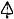
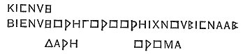
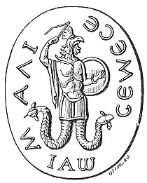

  
[Intangible Textual Heritage](../../index)  [Gnosticism](../index) 
[Index](index)  [Previous](gar33)  [Next](gar35) 

------------------------------------------------------------------------

[Buy this Book at
Amazon.com](https://www.amazon.com/exec/obidos/ASIN/B002BA5FIO/internetsacredte)

------------------------------------------------------------------------

  
*The Gnostics and Their Remains*, by Charles William King, \[1887\], at
Intangible Textual Heritage

------------------------------------------------------------------------

### II. ABRAXOIDS, OR GEMS CONFOUNDED WITH THE TRUE GNOSTIC.

Our invaluable and most charming guide, Hippolytus, when describing the
*Astrotheoscopi*, "Seekers of God in the stars," begins with a simile
more apposite than complimentary to the fashion which then prevailed for
combining astrology with every species of religion. He compares these
inquirers to that silly fowl the bustard, which suffers itself to be
caught by the following device. "When a man discovers a flock he begins
to dance and make grimaces in front of them. The birds stand motionless
staring at him in wonderment until his confederate steals up to them
from behind and knocks them on the head. In the same way (adds the good
Saint, evidently much refreshed by his joke) do the people seduced by
such teachers stare up at the stars, until at last they find themselves
hopelessly caught in the snare of the heresy." As an example of this
most curious system of theology it will suffice to quote their
exposition of the doctrine conveyed by one constellation out of many.
"Ophiuchus represents with his stars a man on his knees, in appearance
oppressed with

p. 238

fatigue, a posture for which that great authority in Astrology, Aratas,
is at a loss to account. But rightly understood, he is *Adam* engaged in
watching the Dragon's head underneath him, which is biting his heel.
Over his head are seen the Lyre, and the Crown. The *Lyre* was the
invention of the infant Hermes, who is in reality the Word of God: their
position therefore announces that whosoever gives heed unto the Word, he
shall obtain the Crown; but if he refuses to hearken unto the Word, he
shall be cast down below with the Dragon." In another place Hippolytus
observes: "The doctrine of the Chaldæans concerning trines, quadrates,
benignant and malign stars, Euphrates the Peratist applies to
Christianity, by changing the concord and discord of the stars into the
constitution of the Æons, the transition of Good Powers into Evil ones,
and the harmony of their respective particles. From the same source he
gets his "Toparchs" and "Presidents," and all the other imagery of the
astrologers."

Such being the nature of the actual foundations of Gnosticism, no wonder
that it should so frequently be impossible to decide whether a
talismanic sigil be the expression of some semi-Christian tenet, or
merely the imagined similitude of some astral Power whose influence was
thus secured for the wearer's protection. For the gods of Magianism, the
religion that has so deeply tinged all Gnostic doctrines, were no other
than these starry Powers. The Agathodæmon himself gave his name to one
of the three Decani of Cancer, as Hephaestion hath already informed us.
The very title, "Decanus," Salmasius with some reason derives from the
Chaldee *Dekan*, "inspector," and thereby makes it equivalent to the
Greek "Horoscopos," "The god that looks down upon the nativity." The
common Latin derivation, in its military sense of "sergeant," Salmasius
rejects as foreign to the idea conveyed. Again, Charchnumis is named as
the First Decanus in Leo, and this title actually appears around a
serpent with human and radiated head, figured by Salmasius in the same
chapter. This name is sometimes written **ΧΟΛΧΝΟϒΒΙΣ**, which the same
authority explains as "The All-golden One."

A Greek astrologer quoted without name by Salmasius gives

p. 239

this curious piece of information: "There are appointed in each one of
the Signs, three Decant of different forms; one *holding an axe*, the
others represented variously. These figures engraved in rings are
amulets against all mischance." As Telmer asserts, with other great
astrologers of his times: "This, alas! too scanty notice of their
attributes shows at least one of their number to be the old Babylonian
god described by the prophet Baruch (*Epistle* 13, 14) He hath a sceptre
in his hand like a man, like a judge of the kingdom--he hath in his hand
a sword and an *axe*.'" But not merely the Decant of the Signs were thus
worn in rings, but equally so the signs themselves, and the stars rising
together with them, technically called οἱ παρατέλλοντες. Such images
were termed στοιχεῖα, whence those who made a business of engraving then
got the name στοιχειοματικοί. They performed their work with many
ceremonies, and always under the *inspection* of the particular Decanus,
or star, whose sigil they were embodying, On this account Epiphanius
speaks of the sun, moon, and planets as στοιχεῖα, terming μορφώσεις the
figures of the constellations formed by the imaginary collocation of the
stars. The same writer uses the expression, "The stars that be vainly
imagined in the shape of figures, which are called Signs of the Zodiac."
As Diodorus distinguishes between *planets* and στοιχεῖα, it follows
that the term was equivalent to our "constellation." All this evinces
that the Arabian writers were correct in translating στοιχειοματικοί by
"talisman-makers." How these later astrologers thought proper to portray
the Ascendants of each Sign in their "Table of the Myriogeneses" will be
described in my chapter upon Talismans.

A curious Praun gem represents Mercury enthroned and bearing the
attributes of Jupiter, with the strange legend **ΕΠΠΤΑ** (*sic*)
**ΧΡϒΣΟΣ**, which has been absurdly interpreted as referring to his
*seven*-stringed lyre. Moro probably was the gem the signet of some
"Hebdomadarian" or votary of the Number Seven; a sect of sufficient
importance to get from Hippolytus a separate section for themselves in
his great work. The identification of Hermes with the Christian *Logos*
was one grand feature in the doctrine of the Naaseni, so lucidly set
forth by that learned

p. 240

\[paragraph continues\] Father. He was of
opinion that this Hebdomadarian doctrine (derived from ancient Egyptian
philosophy) was the true source of every form of Gnosticism. This potent
Numeral is illustrated by another device of frequent occurrence in
cameo, the Delphic **Ε** crowned with a fillet, and below, the legend
**ΧΡϒΣΟϒ**. This can be no other than that most holy of Numerals the
Delphic Ἔι, or *Five*, on the mystery whereof Plutarch has left a very
curious dissertation; and it represents the *golden* figure of that same
numeral dedicated by Livia Augusta at the shrine of her husband's
peculiar patron. And similarly the gem above referred to exhibits Hermes
invested with supreme dominion, and accompanied by his own special
*number*, "testudo resonare *septem* [\*](#fn_141) callida nervis"--the Magian method for
symbolizing the different Powers of Heaven, which shall be explained in
its due place, when we come to treat of the "Seven Voices."

The oddest adaptations of the imagery of the old religions mark the
earliest preaching of the Gnosis. Its first apostle, Simon Magus, who
passed himself off upon the Samaritans as the *third* manifestation of
the Christ, was worshipped as late as Hippolytus’ times, in statues made
in the form of Jupiter. His famous concubine Helena (in whom Simon has
discovered the Lost Sheep of the parable whilst carrying on her
profession in a brothel at Tyre) was similarly adored under the forms of
Minerva and the Moon (Hipp. vi. 19). The main doctrines of the Naaseni
were supported by ingenious applications of the symbolism employed in
the Eleusinian, Phrygian, and Samothracian Mysteries, of which
Hyppolytus has given a full and very interesting account.

*Phœnicia*, again, furnished our talisman-makers with a copious
repertory in the exaggerated symbolism of the figures whereby their
priesthood had expressed their notions of the Divine Power. "Taut, the
great god of the Phœnicians" (says Samoniathon), "in order to express
the character of Kronos, made his image with four eyes--two in front,
two behind, open and closed; also with four wings--two expanded upwards,
two folded downwards. The eyes denoted that the godhead sees

p. 241

when sleeping, and sleeps when waking; the attitude of his wings, that
he flies in resting, and rests in flying. Upon his head are two wings,
denoting Reason and the Senses." It is very provoking that Diodorus (xx.
19) should have given no further description of the famous Kronos,
*Melcarth*, of Carthage than the brief remark that it held the hands
open, palm upwards, but sloping downwards, so that the child sacrificed,
when laid upon them, should roll off into a pit of fire at the
foot. [\*](#fn_142) When Agathocles was
pressing hard the siege, and hope was almost lost, no fewer that three
hundred children of the nobles were offered to Melcarth at one and the
same time.

Inasmuch as the genius of the planet Saturn, or Kronos, was held by the
Talmudists to be good and pure, contrary to those of the other planets,
the Four-winged image, so common upon Gnostic gems, may reasonably be
considered as a copy from the ancient original, devised by Taut. Saturn,
the sole inspirer of the Law and the Prophets, had special claims to the
veneration of the Alexandrine Kabbalists. And this belief explains
wherefore Valentinus fixed upon this planet for the abode of Ildabaoth,
the Giver of the Law to the Children of Israel in the Wilderness.

It sounds like a paradox to assert that our "Gnostic" gems are not the
work of the Gnostics; but taking that appellation in its strictest
sense, the thing is perfectly true. The talismans we are considering
never exhibit any traces of that admixture of Christian and Pagan
doctrines which properly constitutes the Gnosis, that subject of the
descriptions and the attacks of the Fathers of the Church. Their
elements are drawn from the ancient religions of Babylon and Egypt,
mixed at times with the formulæ of the Jewish Kabbala. The "Gnostic"
stones are in reality the paraphernalia of magicians and dealers in
charms (charm-doctors in modern phrase), and only belong to the Ophites,
Valentinians, and other subdivisions of the Christian Gnosis, in so far
as those theosophists were especially given to

p. 242

the cultivation of the Black Art; as the notices above cited abundantly
declare. This delusive study prevailed at the period of the grand
development of Gnosticism to an extent which no one can credit who has
not studied the historians of the Later Empire. The accusation of
"magical practices" proved a ready weapon for destroying an obnoxious
individual against whom no tangible crime could be charged: what
stronger proof of this than its being effectually employed (as Ammian
tells us) to expel that pattern of orthodoxy, the great Athanasius, from
the patriarchal throne of Alexandria? The same historian notices that
under the timid Valens it sufficed to establish this capital charge if
the suspected person had been seen walking at night-time in the
neighbourhood of any cemetery, where he might possibly have gone to hold
conference with the demons of the dead.

But to exhibit the true source and nature of these "Gnostic"
inscriptions I shall transcribe a spell from the "Magic Papyrus," to
which I shall have occasion frequently to refer. The author of this
wondrous Manual of Necromancy was unmistakably of the old unmixed
Egyptian religion, and very probably a priest of Isis. Nevertheless, he
not merely employs the very words found on our talismans, but even the
same peculiar arrangement of them. Any one desirous of preserving so
valuable a charm in a more durable material than papyrus or lead, had
only to order a lapidary to copy it for him upon a jasper, and a regular
"Gnostic" monument would have been bequeathed to our times. The maker
having carefully specified the virtues of composition, gives us to
understand the value of similar forms still existing on stones: VII.
"Take a sheet of hieratic paper, or a leaden plate, and an iron link of
a chain (κρίκος), and place the link upon the paper, and mark both
inside and out with a pen the form of the link. Then having described
the circular outline of the link, write upon the same outline,
inscribing upon the paper the name and the characters on the outside,
and inside the thing which you wish not to happen, or that a man's mind
may be bound so as not to do such and such a thing. Then placing the
link upon its outline which you have made, and taking up the parts
outside the

p. 243

outline, sew up the link with thread so as to completely conceal it,
piercing through the characters with the pen; and when you wish to bend,
say--'I bend such a one not to speak to such a one, let him not resist,
let him not contradict, let him not be able to look me into the face, or
to answer me, but let him be subject unto me so long as this link is
buried. And again I bind his mind, his senses, his desires, his actions,
that he may be sluggish towards all men, in case (a certain woman)
marries such a one,' or else, 'in order that she may *not* marry such
and such a one.' Common (*i.e.*, to be said in Greek).

"Then taking it to the grave of one untimely deceased, dig four fingers
deep, and put it in and say--'O departed Spirit, whosoever thou art,
thou art this; I deliver unto thee such a one, that he may not do such
and such a thing.' Then cover it up and depart. And you will do this
best when the moon is on the wane. The words to be written within the
circle are these: **ΑΡΟΑΜΑΘΡΑΕΡΕC: ΚΙΓΑΛΑΧ · ΕΖΑΝΤΑ · ΙΑΡΟϒΝΗ · ΑΚΗ ·
ΙΑΩ · ΔΑΡϒΝΚΩ · ΜΑΝΙΗΛ · ΜΗ ΠΡΑΧΘΗΤΩ ΤΟ** 
 (δεῖνα) **ΠΡΑΓΜΑ ΕΦ᾽ ΟCΟΝ ΧΡΟΝΟΝ ΚΕΧΩCΤΑΙ Ο ΚΡΙΚΟC
ΟϒΤΟC** ('Let not such and such a thing be done for so long a time as
this link is buried'). Bind it with knots, making a twist of them, and
so deposit it. The link may also be cast into a disused well, or into
the grave of one dead before his time. And after the characters, write
also these words below the link as a plinth (or a *square*): **ΑΡΧΟΟΛ
ΛΑΙΑΑΜ CΕΜΕCΙΛΑΜΦ ΑΜΜΟΦΟΡΙΩΝ ΙΩΑΗ ΦΘΟϒΘ ΕΩΦΡΗ Ο ΜΕΛΙCΤΟC ΔΑΙΜΩΝ ΙΑΩ
CΑΒΑΩΘ ΑΡΒΑΘ ΙΑΩ ΛΑΙΛΑΜ ΟCΟΡΝΟΦΡΙ ΕΜΦΡΗ ΦΡΗ ΦΘΑ ΧΡΩΙΩ ΙΑΩ ΒΑΒΟϒΡΗ
ΘΙΜΑΜΕΝ ΦΡΗ ΒΕ ΝΟϒCΙ CΑΒΑΩΘ ΒΑΡΒΑΘΙΑΩ ΘΑΧΡΑ ΟϒΧΕΕΘ ΕCΟΡΝΩΦΡΙ** and the
inscription at the top of the page, which also you must place within it.

**ΙΑΕΩΒΑΦΡΕΝΕΜΟϒΝΟΘΙΛΑΡΙΚΡΙΦΙΑΕϒΕΑΡΙΦΙΚΡΑᾹΙΘΟΝΦϒΟΜΕΝΡΦΑΒΑΩΕΑΙ**.

(This spell is repeated at the foot of the page, inscribed in one
continuous circle, to show that it reads either way. It occurs also on a
gem (Brit. Mus.) followed by **ΔΟΤΑΙ ΧΑΡΙΝ ΙΕΡΩΝΙΜΑ ΠΡΟC ΠΑΝΤΑC**, "Give
to Hieronima favour in the sight of all men ": and also on another,
figured by Montfaucon, II. pl. 164--a proof of the importance attached
to it at the time.)

p. 244

"And the same arrangement may be written upon a leaden plate; and having
put the link within it, fold it over and seal with gypsum, and
afterwards the base beneath, upon which **ΙΑΕΩ** as before directed, and
also these words: **ΒΑΚΑΞϒΧϒΧ ΜΕΝΕΒΑ ΙΧϒΧ ΑΒΡΑCΑΞΑϒ**, "Prevent such and
such a thing." But in the *original* the Names are found as follows:
**ΑΜΦΟΟΛ ΛΑΙΛΑΜ CΕΜΕCΙΑΛΑΜ ΙΑΕΩ ΛΟΒΑΚΑΞΙΧϒΧ ΑΡΑCΑΞΑϒ ΑΡΧΩΜ ΕΛΑΧ
ΜΕΝΕCΙΑΛΑΜ ΙΑΕΩ ΟϒΩ ΒΑΚΑΞΙΧϒΧ ΑΡΑCΑΞΩϒ**, "Prevent such and such a
thing."

 

On the reverse of a Chnuphis plasma (Lewis Collection), **ΚΙCΝVΘ** and
**ΝΑΒΙC** (*prophet*) occur, as also on the Bosanquet gem. The last
words may be corrupt Greek, "Restore the sight"; the object of the
talisman.

 

   
FIG. 10.

[(\*)](gar71.htm#an_fig10)

 

------------------------------------------------------------------------

### Footnotes

[240:\*](gar34.htm#fr_142) The compound
Ἑπτάχρυσος is made after the same rule as the Ἑπτάχαλκος, the place in
the wall of Athens where Sulla took the city.

[241:\*](gar34.htm#fr_143) This tradition was
verified by N. Davis, who in excavating the ruins of the temple found,
at a great depth, a thick layer of ashes mingled with burnt human bones.
The discovery is well described in his section "Moloch and his Victims."

------------------------------------------------------------------------

[Next: III. The True Abraxas Gems](gar35)
