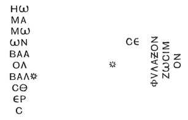
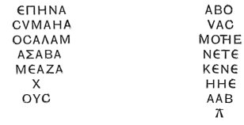
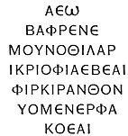

  
[Intangible Textual Heritage](../../index)  [Gnosticism](../index) 
[Index](index)  [Previous](gar35)  [Next](gar37) 

------------------------------------------------------------------------

[Buy this Book at
Amazon.com](https://www.amazon.com/exec/obidos/ASIN/B002BA5FIO/internetsacredte)

------------------------------------------------------------------------

  
*The Gnostics and Their Remains*, by Charles William King, \[1887\], at
Intangible Textual Heritage

------------------------------------------------------------------------

p. 248

### GNOSTIC PLAQUE.

The most remarkable specimen of the class known to me was obtained (Jan.
1876) from Sambon, a noted *antiquario* at Naples. It is a circular
bronze disc, 2¾ inches (the ancient *palmus*) in diameter, with a small
projection to top, perforated for suspension. The surface of the obverse
bears a genuine patina, and the characters of the legend have the true
antique formation; but, for reasons hereafter to be stated, the reverse
strikes me as an addition of later times--not, indeed, a forgery to
entrap the antiquarian, but something intended in all good faith to
augment the virtues of the original talisman.

The Abraxas-god, advancing to the right, with arms extended crucifix
fashion, holding sword and shield, above his head and arms,

 

\[paragraph continues\] On each side of
figure--

 

\[paragraph continues\] The whole inclosed
within a coiled serpent.

Reverse: King with hand on breast, seated on throne, seen in front-face.
Over his head,

**CΦΡΑΓΙC CΑΛΟΜΩΝΟC**

\[paragraph continues\] On each side of
the figure--

 

p. 249

\[paragraph continues\] Under the
footstool, similarly surrounded by the coiled serpent,

 

\[paragraph continues\] This Solomon is a
truly mediæval piece of drawing; the lettering, too, evidently differs
from that of the obverse; and as the surface of the plate is fresher on
this side, it is probable that the whole has been added upon the empty
back of the original plate.

Some legends, following the rule of the famous **ΑΒΛΑΘΑΝΑΛΑΒΑ**, read
indifferently from either end. A good example occurs on the reverse of a
serapis, carried in the *baris* between Sol and Luna.

 

(Sard, from collection of Mr. Webb Ware, Cork.)

Horus seated in the *baris;* on prow and poop are perched the sacred
birds; neatly engraved on dark-green jasper (Pliny's Molochites). On the
reverse--

 

Amongst the various contents of a tomb at Saintes, discovered in 1885,
was a *metal* ring set with a heliotrope engraved with the Agathodæmon,
furnished with a human trunk, standing. On the reverse a novel formula--

 

*Ruchael*, "Spirit of God," is known as the name of an angel; but the
other words defy interpretation.

The best executed of such talismans known to me, belongs to Mr. Webb
Ware, of Cork. It is an elliptical sard, about 1¾ inches long and wide;
engraved very neatly, with Serapis

p. 250

seated on the Baris, busts of Osiris and Isis on prow and poop; above,
**ΑΛΔΑ**; below, **ΒΑΙΝ**. On the reverse, finely cut--

 

There is no distinction between **Α** and **Λ** in the original, but I
have made it where clearly required. The **ΑΛΔΑ** is a novelty; but many
words in the long formula are of common occurrence in other gems.

------------------------------------------------------------------------

[Next: IV. The God Abraxas as Described by the Christian Fathers](gar37)
