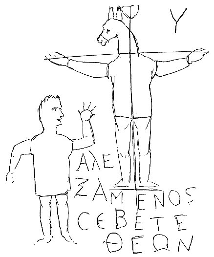
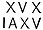

  
[Intangible Textual Heritage](../../index)  [Gnosticism](../index) 
[Index](index)  [Previous](gar41)  [Next](gar43) 

------------------------------------------------------------------------

[Buy this Book at
Amazon.com](https://www.amazon.com/exec/obidos/ASIN/B002BA5FIO/internetsacredte)

------------------------------------------------------------------------

  
*The Gnostics and Their Remains*, by Charles William King, \[1887\], at
Intangible Textual Heritage

------------------------------------------------------------------------

p. 274

### ABRAXAS-GEMS, THEIR MATERIALS, WORKMANSHIP, AND NATURE.

Following the axiom, "that the body is more than the raiment," the
foregoing chapters have been devoted to the consideration of the notions
which our talismans have *invested* with visible form. These visible
forms, therefore, their materials, and manufacture, now come before us
for explanation--a wide field for curious research, and extending into
many diverse regions of Archæology.

The *genuine* Abraxas-gems, that yet fill our cabinets, came originally
for the most part out of Egypt; others, as their differing style shows,
from Asia; others again from Syria, where many Basilidans had
established themselves at an early period. Amongst these philosophising
semi-Christian sects the figure of Abraxas was held in high esteem.
"They used it (says Bellermann) as a *Teacher* in doctrine, in obedience
to whom they directed their transcendental researches and mystic
instruction; as a *Token* and a *Password* amongst the initiated, to
show that they belonged to the same fraternity; as an *Amulet* and a
*Talisman*, and lastly as a *Seal* to their documents."

Gnostic intagli are almost the sole productions of the Glyptic Art,
during the time it was dying out, all through the last two centuries of
the Western Empire, if we except a few rude figures of the goddess Roma,
Victories, and Eagles made for legionary rings. As may easily be
supposed the art displayed in these designs is at its lowest ebb, being
itself a degenerate successor to the debased Egyptian school of
Alexandria. [\*](#fn_155) The

p. 275

engraving seems to have been entirely executed by means of a coarse
*wheel*, like that characterising the Sassanian stamp, then commonly
used in Persia, a country which, by the bye, was the source of many of
the ideas expressed in these figures and inscriptions. The choice Indian
Sards, Nicoli, and Amethysts which embellished earlier periods, are
replaced by coarser materials, the native productions of the countries
which had engendered the new creed, the Jasper of Egypt dark green, or
sometimes mottled with yellow and red, the Plasma, usually of bad
quality, passing from a dirty olive-green into common Calcedony, and
quite as abundantly the fibrous Hæmatite more or less magnetic. Indeed
the opaque Jasper and the Loadstone, those special materials for signets
at the fountains of the Magic Art, Egypt and Assyria, had, from time
immemorial, engrossed the reputation of the most fitting vehicles for
talismanic figures. The former was Pliny's *Molochites*, "opaque, and of
the colour of a mallow leaf, of innate power as an amulet to protect
children;" its black variety was his *Antipathes*, "recommended by the
Magi as a sure defence against witchcraft of every kind;" whilst the
Hæmatite is the Persian *Kamhahen*, perhaps the true etymology of
*cameo*, a word that came into Europe in the ages when every engraved
stone passed for a talisman.

So constant is this rule of unmitigated barbarism that Gnostic types
when found well executed and in fine stones, as sometimes is the case,
will on examination always prove to emanate from the Cinquecento school,
a period when anything pertaining to Astrology or the Kabala was
reproduced in vast abundance under the impulse of the revived spirit of
mystic speculation. To this and the following century, must be referred
the authorship of those large jaspers, not unfrequent in Collections,
presenting the terminal figure of Osiris, the field occupied with
astrological cyphers and *modern* Hebrew letters. Of these imitations,
betraying themselves by their own excellence, the most conspicuous was a
large Amethyst, obtained by me at Florence, engraved with an erect
figure of the hawk-headed Phre, Priapean, holding the Cynophalus upon
his hand, and standing on the coiled serpent, an intaglio in the

p. 276

best Roman manner, that no era of Gnosticism had been capable of
producing. [\*](#fn_156)

Antique pastes with subjects do not exist, and for a very sufficient
reason. The *material* of a talisman being quite as essential to its
virtue as the *sigil* engraved upon it; the mystery whereof the profound
Camillo di Leonardo shall hereafter declare in his own words. Again, the
genuine stones were in themselves so cheap, and the work upon them
produced so expeditiously and with so little care, as to leave small
temptation for counterfeiting them in a baser substance. The only
exception that has come under my notice to the inferior quality of the
stones employed by the Gnostic engravers is the singular Garnet tablet
of the Hertz Cabinet, of which a description will be given in its proper
place, when we come to treat of inscriptions.

The *Lettering* of the legends [†](#fn_157)
upon these talismans has a peculiarity of execution that of itself
serves to identify almost every stone belonging to the Gnostic series.
The letters are all formed by *straight* lines, the **Θ**, **Ο**, and
**Σ**, being quite square, either from the rudeness of the instrument
employed to cut them, or because want of skill prevented the engraver
from attempting curvilinear characters, to do which neatly requires the
utmost dexterity and long practice, being in fact the most difficult
task that can be demanded from the *wheel*. For it was with this
newly-invented instrument, as the equality of their lines demonstrates,
that these ill-shaped characters were faintly

p. 277

traced upon the stone. In all likelihood the same artists were the
Alexandrian glass-workers, famed long before for their engraved vases,
Martial's "tepide toreumata Nili," for Pliny uses the significant
expression, "vitrum, aliud torno teritur, aliud argenti more caelatur,"
"some glass vessels are cut out by means of the drill, others carved in
relief in the same manner as silver plate." The **Ξ** in these
inscriptions is invariably formed by drawing a short line across the
diagonal of a **Ζ**, so that in rude work, it cannot be distinguished
from the latter character.

These inscriptions are often found *superadded* upon the backs of gems
of much earlier date, evidently for the purpose of converting them into
talismans. Of such conversions the most remarkable known to me are, a
fine cameo (Marlborough Cabinet) a bust of Commodus; on the reverse of
which has been rudely cut the Abraxas-god surrounded by a legend,
unintelligible though sounding like Greek words.

**ΔΟΥΓΕΝΝΑΙΟΔΕΜΕΝΑΙΒΑΣΙΛΙΣΚΟΣ**

\[paragraph continues\] Another cameo
(Royal Cabinet) with the helmeted heads regardant of Constantine's two
elder sons, has received the very unorthodox addition of Anubis, also
surrounded by a long legend in huge characters, so barbarous as to defy
transcription. A third (Devonshire Parure, No. 79), a fine head of
Hercules, lapis lazuli, has received the Gnostic baptism by the addition
on the back of a scarabeus with expanded wings (recognised emblem of the
Creator), and the word of power **ΑΒΡΑΣΑΞ**. The extremely debased style
of all such additions plainly indicates a period long posterior to that
of the originals; whilst the position they occupy, necessarily concealed
when in use, proves that the whole object of such *improvements* was the
supernatural protection of the wearer.

The finest example of Gnostic conversion is an onyx cameo (Vienna
Cabinet), representing some young Cæsar under the form of Jupiter Axur,
standing in front face with the thunderbolt in his left hand, his right
resting on the sceptre, the ægis hangs down his back for paludamentum,
at his feet the eagle on one side a trophy with seated captive, hands
tied behind; all in a good style in low relief. The talisman-maker has
cut a

p. 278

line of square characters, resembling Palmyrene, down each leg from hip
to foot, a nimbus of the same round his head, others on the field: and,
to make all sure, has covered the back of the gem with 16 lines in the
same abstruse lettering. It is carefully figured in Arneth's 'Cameen des
K. K. Cabinettes,' (Pl. xviii. 2), who suggests Julian for its subject,
without considering that the "Philosopher" wore a long beard during the
period when such a representation of him as *this* was permissible.
Besides, for the two centuries before Julian's times, Serapis was the
only type under which the reigning emperor was allowed to be
complimented, the old Latin 'Jovis Axur' having grown obsolete. The hero
of this apotheosis is much more probably Titus, or even his brother. The
cameo is of respectable dimensions, being 2¾ inches high by 2½ wide.

As regards the history of Glyptics these inscribed gems have a value of
their own, as fixing the date when the *wheel* came generally into use
in the engraver's *atelier*; for the minute and elegant lettering of
earlier times will be found, when examined with the microscope, to have
been *incised* in the gem with the diamond point, whence its perfect
regularity and freedom.

Of these Gnostic inscriptions in general, Raspe (Catalogue of Tassie's
Pastes, p. 38) has given accurate transcripts, from an immense
collection belonging to every shape and period of Gnosticism.
Chabouillet has more recently done the same for the very large series in
the French Cabinet, in his valuable 'Catalogue des Camées de la Bib.
Imp.' p. 282. In the 'Gorlæ Dactyliotheca,' (3rd ed. 1695), Nos. 326-486
are entirely Gnostic and astrological designs, and include the greater
part of those first published by Chiflet in his 'Macarii
Abraxas-Proteus,' ed. 1610, whose plates were re-engraved for the
purpose on a reduced scale, but with large additions, apparently made by
the learned editor of the work, Gronovius. But the most extensive series
of actual representations of the whole class are the plates to the
Section 'Les Abraxas' of Montfaucon's grand work 'L’Antiquité
expliquée.' Many of his examples were drawn from the fine Cabinet of
gems belonging to the Library of St. Geneviève, besides others, and very

p. 279

interesting specimens, from a previous work by Capello. [\*](#fn_158) Though roughly engraved, they seem to
have been copied with laudable attention to accuracy.

 

   
FIG. 12.

[(\*)](gar71.htm#an_fig12)

 

------------------------------------------------------------------------

### Footnotes

[274:\*](gar42.htm#fr_156) Their barbarism,
however, is often in advance of that of their real period. A convincing
example is the one found in the great treasure-trove of Tarsus, where
the latest coins went no later than Gordian III. It was a black
hematite, with a four-winged, sceptre-holding Æon, reverse Venus
Anadyomene, with her usual title **ΑΡΩΡΙΦΡΑCΙC**, scratched in so rude a
style that one would have placed its execution three centuries later,
but for the company in which it was found. Another point of interest was
its retaining the original setting--a cable-mounted frame, with loop, of
massy gold--proof of the value placed upon its potency. (Franks
Collection.)

[276:\*](gar42.htm#fr_157) I had long suspected
that the Cinquecento period produced much Gnostic work in the ruder
style, and at length have obtained proof demonstrative of the truth of
this suspicion. Amongst a large lot of coarsely-cut Gnostic jaspers of
very recent work, my attention was caught by one (an inscription of
several lines) *cut* upon a tablet of that streaky
[agate](errata.htm#17) paste so popular at that period, but quite
unknown to the ancients. The piece had been highly polished and then
engraved with the wheel; the design probably copied from a genuine
stone.

[276:†](gar42.htm#fr_158) Stiechel explains the
inscription upon the shield borne by an Abraxas figure, written thus,
  as no more than the
customary form in that position, the Name Iao with the Sign of the Cross
thrice repeated (to make up the mystic number, Seven), He quotes in
support of this acute explanation a gem published by Matter, bearing
**ΧΦΕΝΕCΧΗΡΦΙΧ**, expressing the sound of the Hebrew *Peni zets ripia* =
"His face--this--healed."

[279:\*](gar42.htm#fr_159) Who professes to
copy originals in the ancient Cassel Cabinet; although many of his types
are so unparalleled in modern collections that Matter suspects them mere
creations of his own fancy. But examples of some of the strangest
amongst them have lately come under my own notice, apparently mediæval
Arabic talismans, which Capello, very pardonably, mistook for remains of
the ancient Gnostics.

------------------------------------------------------------------------

[Next: Legends and Formulæ](gar43)
