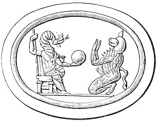

  
[Intangible Textual Heritage](../../index)  [Gnosticism](../index) 
[Index](index)  [Previous](gar51)  [Next](gar53) 

------------------------------------------------------------------------

[Buy this Book at
Amazon.com](https://www.amazon.com/exec/obidos/ASIN/B002BA5FIO/internetsacredte)

------------------------------------------------------------------------

  
*The Gnostics and Their Remains*, by Charles William King, \[1887\], at
Intangible Textual Heritage

------------------------------------------------------------------------

### FUTURE PUNISHMENTS.

The Gnostics did not fail, after the example of their orthodox rivals,
to employ the strongest stimulants of terror in order to gain converts,
as is forcibly manifested by this picture of the varied torments of the
world to come, the appointed heritage of all who obtained not the Gnosis
which they preached ('Pistis-Sophia,' 255):--

"And Jesus continuing in his discourse said unto the disciples, When I
shall have returned into the Light, preach ye unto the whole world. Say
unto them, Slacken not by day and night to seek until ye shall find the
mysteries of the Kingdom of Light, that shall cleanse you, and render
you a pure light, and shall bring you into the Kingdom of Light. Say
unto them, Renounce the world and all the *Matter* which is therein, and
all the cares and the sins thereof--in a word, all the conversation that
therein is--that ye may be worthy of the mysteries of Light, that ye may
be saved from all the punishments that are in the judgment-places. Say
unto them, Renounce murmuring, that ye may be worthy of the mysteries of
Light, that ye may be saved from the burning of the Figure of the *Dog*.
Say unto them, Renounce obedience (to the world), that ye may be saved
from the judgments of the Figure of the Dog. Say unto them, Renounce
invocation (of idols), that ye may be worthy of the mysteries of Light,
that ye may be saved from the torments of *Ariel*. Renounce a lying
tongue, that ye may be saved from the burning rivers of the Figure of
the Dog-shaped one. Renounce false witnessing, that ye may be set free,
that ye may be saved from the same rivers. Renounce boastings and pride,
that ye may be saved from the burning pits of Ariel. Renounce self-love,
that ye may be saved from the judgments of *Orcus*. [\*](#fn_213) Renounce talkativeness, that

p. 357

ye may be saved from the fires of Orcus. Renounce unjust judgments, that
ye may be saved from the torments that be in Orcus. Renounce
covetousness, that ye may be saved from the rivers of smoke of the
Dog-shaped. Renounce the love of this world, that ye may be saved from
the pitched-coats burning of the Dog-shaped. Renounce robbery, that ye
may be saved from the rivers of deceit of Ariel. Renounce evil speaking,
that ye may be saved from the torments of the river of smoke. Renounce
wickedness, that ye may be saved from the burning seas of Ariel.
Renounce unmercifulness, that ye may be saved from the judgments of the
*Dragon-shapes*. Renounce anger, that ye may be saved from the rivers of
smoke of the Dragon-shapes. Renounce reviling, that ye may be saved from
the burning seas of the Dragon-shapes. Renounce robbery, that ye may be
saved from the boiling seas of the same. Renounce thieving, that ye may
be saved from *Ildabaoth*. Renounce backbiting, that ye may be saved
from the burning rivers of the *Lion-shaped* one. Renounce fighting and
quarrelling, that ye may be saved from the boiling rivers of Ildabaoth.
Renounce stubbornness, that ye may be saved from the ministers of
Ildabaoth and his burning seas. Renounce evil deeds, that ye may be
saved from all the devils of Ildabaoth and from all his punishments.
Renounce desperateness, that ye may be saved from the seas of boiling
pitch of Ildabaoth. Renounce adultery, that ye may be saved from the
seas of brimstone and pitch of the Lion-shaped. Renounce murders, that
ye may be saved from the Ruler of crocodiles, which is the first
creature in the ice that is in the Outer Darkness. Renounce cruelty and
ungodliness, that ye maybe saved from the Rulers of the Outer Darkness.
Renounce impiety, that ye may be saved from weeping and the gnashing of
teeth. Renounce witchcraft, that ye may be saved from the mighty frost
and hail of the Outer Darkness. Renounce blasphemy, that ye may be saved
from the great dragon of the Outer Darkness. Renounce

p. 358

false doctrines, that ye may be saved from all the torments of the great
dragon of the Outer Darkness.

"Say unto them that teach false doctrines, and unto every one that is
taught by them, Woe unto you; for, unless ye repent and leave your
error, ye shall fall into the torments of the great dragon of the Outer
Darkness, exceeding cruel, and they in the world shall not redeem you
out of them for ever and ever, but ye shall be utterly destroyed unto
the end. Say unto them that slight the doctrine of truth of the First
Mystery, Woe unto you, for your punishment shall be evil beyond that of
all men: ye shall abide in the great frost, ice, and hail in the middle
of the dragon, and in the Outer Darkness, and they in this world shall
not redeem you from this hour forth for ever, but ye shall be in that
place; and in the dissolution of the universe ye shall be consumed, so
that ye shall be destroyed for ever."

 

   
FIG. 16.

[(\*)](gar71.htm#an_fig16)

 

------------------------------------------------------------------------

### Footnotes

[356:\*](gar52.htm#fr_215) These regions and
the shapes of their Rulers seem to have been suggested to our author by
the Egyptian mummy-ease paintings of the *Gates* p.
357 in which are seated so many genii with heads of hawk, baboon,
man, crocodile, lion, jackal, vulture, winnowing-fan, and serpent; all
armed with swords. These were the Gates passage through which on his way
to the judgment seat Anubis is prayed to procure for the defunct in the
papyrus-ritual buried with him.

------------------------------------------------------------------------

[Next: Talismanic Leaden Scrolls](gar53)
