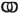
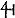
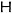

  
[Intangible Textual Heritage](../../index)  [Gnosticism](../index) 
[Index](index)  [Previous](gar56)  [Next](gar58) 

------------------------------------------------------------------------

[Buy this Book at
Amazon.com](https://www.amazon.com/exec/obidos/ASIN/B002BA5FIO/internetsacredte)

------------------------------------------------------------------------

  
*The Gnostics and Their Remains*, by Charles William King, \[1887\], at
Intangible Textual Heritage

------------------------------------------------------------------------

### Masons’ Marks

But to return to the marks themselves, of which many collections have
been published gathered from regions the most widely separated. Their
history is indeed full of interest but likewise of obscurity; "res alta
nocte et caligine mersae." Many of them are traditional, and go back to
the highest antiquity, being found on Phœnician [\*](#fn_224) and Greek buildings (as well as on
vases and coins of the earliest times), and in still larger abundance
and variety in all mediæval architecture. These marks were in the
beginning religious symbols, many of them being identical with the
*caste-marks*, whereby to this day the followers of the respective
Hindoo gods are distinguished from one another. This religious
significance explains also their occurrence on Celtic monuments, as on
the Stonehenge lintel, and the Newton Stone, Aberdeen, and so numerously
on the Gallic coins; but they have for centuries, further back than can
be traced, degenerated into the mere signatures of illiterate
mechanics. [†](#fn_225) To illustrate this
curious point, I shall adduce a

p. 387

few of the most remarkable examples of lapidary symbolism, [\*](#fn_226) giving, as in duty bound, precedence to
the late discovery at Stonehenge. The mark is cut upon the fallen impost
lying across the supposed altar. It is nine inches long and clearly
defined, and may be described as a semicircle of which the diameter
being produced, its own length terminates in a second semicircle
reversed and open, combined with the Roman letters, **L**, **V**; having
in fact much the appearance of a *sigla* or *nota scriptoria*. The mark
has therefore something in its look that suggests the signature
**LVCIUS**. Had the sagacious Stukeley discovered this inscription he
would unquestionably upon the strength thereof have ascribed the whole
fabric to the British Lucius so renowned in fable. It must not however
be concealed that our fashionable scepticism has impugned the reality of
even this most venerable "handwriting on the wall." Dr. Thurman has
hunted up three credible witnesses ready to make affidavit that they saw
with their own eyes a certain stranger cut the sigil. [†](#fn_227) But inasmuch as it would be equally
facile, by means of *leading questions* dexterously put, to obtain the
testimony of the same number of "bucolical juveniles" that they were
present at the erection of Stonehenge itself, the genuineness of the
mark (so *un*modern in configuration) seems to me in no measure
disproved. Symbolic figures, spirals and interesting circles are found
on the stones in Newton Grange, Drogheda Cave, Routh Linn, Old Berwick,
Doddington Moor, Northumberland; Long Meg, Cumberland. The latter have
been published in the Archaeological Journal.

But to proceed to actual Caste-marks. We find a casual allusion to their
use in ancient writers, who state that the badges distinguishing the
three orders of the Egyptian priest--xix. p. 78. [‡](#fn_228)

p. 388

hood were the **Θ** signifying the *sun;* the **Τ** *eternal life;* and
the **Δ** *pleasure*. With the Hindoos, the equilateral Triangle
symbolises Mahadeva, or Siva, that is, the element Fire personified.

The same figure *inverted* stands for Vishnu, Water.

The two, intersecting each other, form the *Sherkun* or six-points; that
is, the two elements in conjunction.

The five-pointed figure, made by bisecting the sides of an equilateral
triangle by a line as long as one side, and drawing lines from each
extremity of the said line to each foot of the triangle, symbol of Siva
and Brahma (the latter god having *five* heads) became, later, the
famous "Solomon's Seal." This appellation it must have got in early
times, as in virtue thereof it is sculptured along with the
seven-branched candlestick upon Sivish tombs dating from the Lower
Empire. [\*](#fn_229) The Hindoos still
venerate the figure as replete with virtue. Similarly the *Sherkun* is
engraved on a large scale upon each side of the gate of the Fort at
Agra, although the building is of Mohammedan work.

A point, *Puru*, is the Deity; self existing. A circle, *Brahm*,
eternity. Hence a triangle within a circle is the emblem of Trinity in
Unity; and the circle inscribed within a triangle the converse.

Worshippers of [*Sacti*](errata.htm#24), the Female Principle, mark
their sacred vase with a right angle bisected by a line; and similarly
the worshippers of Isis used so to mark the vessel necessary at her
rites. But the Vishnaivas have for the same object a symbol of wondrous
vitality and diffusion: for it is seen equally on Greek coins and vases,
on the Newton Stone, Aberdeen, in ecclesiastical sculpture, where it
takes the name "[Tetragrammaton](errata.htm#25),"

p. 389

being ignorantly supposed the compounds of the letter **Γ** four times
repeated, and its sound and power confounded with those of the sacred
"Tetragrammaton," or the Hebrew quadriliteral name Jehovah. This mark is
properly the symbol of Sitala, the seventh incarnation, entitled
"Trithalesor," a title exactly translated by the alchemical
*Trismegistus:* its name is the *Swastika*, an emblem of Resignation; so
that the figure nay have passed into Byzantine art with some
recommendation from a knowledge of its real meaning. In Gothic
nomenclature this mark becomes the equally renowned "Fylfot," as to
whose etymology the following conjecture may be hazarded. The Swastika
signified at first the arms crossed over the breast, the regular Indian
gesture of submission, and also the legs similarly folded as the statues
of Buddha are usually represented. The symbol is evidently nothing more
than the rough outline of the arms and legs thus disposed. May not
therefore the Gothic name *Fylfot*, applied to the same hieroglyph, bear
through some remote tradition a reference to its real meaning, and imply
the sense of *Fold-foot?* In the same way the old Greeks appear to have
recognised its true sense, when they changed its simple form into the
three conjoined legs that so aptly allude to the name Trinacria. In all
probability the great popularity of the symbol, wheresoever the
Indo-Germanic race penetrated, was due to the same feeling that renders
it still so respected in the land of its origin, its power as a talisman
to protect all places where the figure is painted up. The exclamation
"Swastika" the Hindoos still employ as a mode of assent, synonymous with
"Amen," "So be it." [\*](#fn_230) As the symbol
of Resignation the Mark forms the distinctive badge of an ascetic. When
a man desires to become a *Bandya* (Buddhist monk) the rites required
for his initiation occupy three days, foremost amongst which the
Swastika is solemnly set up, upon an altar of unbaked bricks; the
neophyte being seated on the ground with his legs disposed after the
same fashion. In China the Mark is the badge of the *Pon*, the strictest
sect of Buddhists, who attribute its invention to Buddha himself, about
six centuries before our era. This

p. 390

fact may explain how "denying oneself and taking up the cross" came to
signify the embracing an ascetic life; for so evident are the traces of
Buddhist influence over the institutions of the Essenes, that it is
probable enough the symbol retained its pristine acceptation amongst the
sect.

The Swastika occurs amongst the signet-devices of the old Jaina kings of
Guzerat (belonging to the far-removed epoch of Buddhist supremacy in
Hindostan), in company with that intricate square figure which when
appearing on Greek works is denominated a *Labyrinth*. Other sectarian
Marks are three paralled lines placed horizontally, or vertically, to
denote their respective deities: others of truly Masonic aspect, are the
wheel, crescent, heart, *vesica piscis*, all variously modified to
express ritualistic differences. That the Gnostics borrowed many of
these symbols directly from Buddhism, [\*](#fn_231) adding them to their old stock of
Egyptian devices, is apparent upon the inspection of any large
collection of Abraxas gems. The lingering influence of this importation
continually peep out where least to be expected. In the finest known MS.
of the Apocalypse, the work of a French illuminator about the middle of
the thirteenth century (in the library of Trinity College, Cambridge),
the most elaborate of all its decorations is the heading to chapter
xiv., filling half a page. It represents "The Lamb standing upon Mount
Zion," surrounded by the saints; above, is the Godhead, typified by an
immense golden *Quatrefoil*, encompassed by the Four Beasts which bear
the names of the Evangelists; at each side and below are the
Four-and-twenty Elders, arranged in groups of six, eight, and ten.
Within the Quatrefoil is seen an empty throne covered with a cloth
crossed by diagonal blue lines; in each diagonal so formed is painted in
red a circle containing a point. This *geometrical* expression of the
idea of the Deity, so opposed to the characteristic anthropomorphism of
regular Gothic art, may perhaps have been inspired by the Manicheist
spirit that still actuated the Southern French. But to go back to the
source--in the

p. 391

\[paragraph continues\] Chinese system,
*Yang*, the Male, Active, Principle has for his own possession, the Sun,
Fire, and all the higher phenomena of Nature: to him belong the uneven
numbers. *Yn*, the Female, Passive, Principle, possesses the Earth,
Moon, and the even numbers. The same notion as to the sexes of Numbers
was taught by Pythagoras, and by the Gnostic Marcus, after him. *Yang*
is represented by the circle, *Yn* by the square, the two Forces
combined, by two interlaced circles, 
, the actual badge of the Mediaeval Vehm-Gerichte.

------------------------------------------------------------------------

### Footnotes

[386:\*](gar57.htm#fr_226) A most interesting
example is the stone in the second course of the Temple Wall, S.E.
Jerusalem, discovered Jan. 1869 It bears two marks, deeply cut,   and  . Other marks in *red paint*
resemble Phœnician letters. Deutsch observed many such on the walls of
the old Castle of Sidon, built from ancient materials. He considers them
numeral, unity to 9 being represented by vertical lines, 10 by a
horizontal, 20 by two parallels, &c. It is, however, ridiculous to
attribute the foundation of the Temple Wall to Solomon's architects, the
fact of its being cut through ten feet of rubbish thrown from above
proves it to have been done long *after* the city was inhabited, and
therefore the work of Agrippa.

[386:†](gar57.htm#fr_227) Who have introduced a
refinement upon the old system, viz., the necessity of every mark
terminating in an odd number of ends.

[387:\*](gar57.htm#fr_228) Regular Masons’
marks are visible upon the great hewn stones of the Buddhist buildings
at Sarnath, which are known to have been erected before the sixth
century; and more of the same kind are found on the ruined buildings of
the same religion still to be traced incorporated into the Brahminical
edifices within the neighbouring Benares. Sherring, 'Sacred City of the
Hindus.'

[387:†](gar57.htm#fr_229) It must be remembered
the stone is so hardened by weathering as to turn the best chisel!

[387:‡](gar57.htm#fr_230) Lists of Masons’
marks have been published in the following works: Archæologia (1845),
for Scotland, by Prof. Chalmers; Marks p. 388
at Brechin, and signatures to St. Ninian's Roll, coming down to the date
1814. Ditto, for 1844, contains a memoir by G. Godwin, with five plates
of marks from England (Gloucester, Tewkesbury), France, Germany (Köln).
'Annales Archéologiques' (1844-5), 'Signes Lapidaires,' from Coney,
Avignon, Palais de Justice, Paris, Vincennes. Rheims, Strasburgh. Most
curious of all are those given by Ouseley ('Travels,' pl. 82), as
"characters of some unknown alphabet," found by him on the stones of the
Old Palace (a Mohammedan building) of Saaditalat, near Ispahan; which
nevertheless have a striking resemblance to the European class.

[388:\*](gar57.htm#fr_231) Numerous examples
may be seen in their catacomb at Rome, lately discovered.

[389:\*](gar57.htm#fr_232) Or, to speak
masonically, So mote it be!"

[390:\*](gar57.htm#fr_233) Scythicus, the
preceptor of Manes, is actually declared by Epiphanius to have picked up
his novel ideas during his visits to India as a trader from Alexandria.

------------------------------------------------------------------------

[Next: Origin of Modern Freemasonry](gar58)
