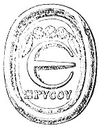

  
[Intangible Textual Heritage](../../index)  [Gnosticism](../index) 
[Index](index)  [Previous](gar69)  [Next](gar71) 

------------------------------------------------------------------------

[Buy this Book at
Amazon.com](https://www.amazon.com/exec/obidos/ASIN/B002BA5FIO/internetsacredte)

------------------------------------------------------------------------

  
*The Gnostics and Their Remains*, by Charles William King, \[1887\], at
Intangible Textual Heritage

------------------------------------------------------------------------

### Conclusion

The symbols, forming the proper subject of the present enquiry, embodied
in their origin the deepest mysteries of Brahminical theosophy; they
were eagerly accepted by the subtile genius of the Alexandrine school
and applied to the hidden wisdom of Egypt; and lastly, in their
captivating and illusory promise of enlightenment, the few bright
spirits of the Middle Ages sought for something better than the childish
fables, engendered by monkery upon the primal Buddhistic stock, which
then constituted the Faith: and these holy figurations still continue to
flourish, but only as the insignia and mummery of what, at best a mere
charitable, is perhaps only a convivial association. In the same way
Apollo's golden Pentagon, which of yore blazed on high above the Delphic
shrine, in the Middle Ages the badge of the proudest Order of Chivalry,
and a sure defence from peril of lightning and fire, has come at last to
be degraded into the mere sign of a German pothouse!

A Master-Mason of the very highest degree lately informed me that he had
detected the *Signs* now in use, engraved amongst the sculptures in the
Cave-temples of Elephanta; and, what is still more important, that,
although the Brahmins are Masons, yet if a European makes the *Sign* to
them, they immediately put their hands up before their eyes, as if to
shut out the sight of the profanation of things holy. But this curious
fact can be explained with the utmost certainty. The Dionysiac
Mysteries, the most popular of all in Greece, were believed to have been
introduced direct from Syria, and necessarily brought along with them
all the signs and rites of their birth-place. The painted vases of the
period of the *Decadence*, of the fourth and third centuries before our
sera, take for their favourite subject scenes from the celebration of
these Mysteries, and in these pictures, mystic

p. 428

\[paragraph continues\] *Siglæ*
perpetually recur, amongst which the *Fylfot* shines conspicuous. But in
truth, all the ancient Mysteries came from the East, as their names, the
*Phrygian*, the *Mithraic*, the *Iliac*, declare, and these Mysteries
existed publicly almost to the close of the Roman Empire, and how much
further down into mediæval times they existed as secret and prohibited
things, it is impossible to decide.

From the very nature of things we may be certain that their signs and
symbols, after the esoteric doctrines were forgotten, passed into the
repertory of all "who used curious arts," the alchymists, astrologers,
and wizards of the Dark Ages, and then became the property of
Rosicrucians, who truly were the parent *stock*, and not a recent brand
(as is now pretended) of the present Freemasons. [\*](#fn_260)

A most important contribution to the history of Masons’ marks has (1877)
been obtained through the researches of Sig. Arnoaldi Veli amongst the
Gallic cemeteries around Bologna. Many of the vases there exhumed bear
*Siglæ* upon their bases, more rarely upon their sides, which are
unmistakably of the same nature, and, what is more curious, are
constructed on the same principle as those used by the regular
stone-mason at this very day.

Those in Class A (see Veli's *Scavi presso Bologna*) may be considered
as of the highest authority, because they are the actual stamps of the
potter, impressed upon the clay before baking. That they distinguished
individuals, and were not merely religious symbols, but stood for the
*proper* names of people unacquainted with writing may be inferred not
only from the established custom of antiquity in this respect, but from
the much more frequent occurrence of the class, of which he gives
examples in list B. These are scratched upon the bases *after* baking,
and therefore must have been added by the

p. 429

buyers, not by the makers. The great variety in the forms of these
latter siglæ sufficiently proves that they were the "marks" of private
persons, not of clans or tribes. Class C, of similar "marks" engraved
upon articles of metal, lead irresistibly to the same conclusion. It
must, however, be observed that although these characters cannot be
distinguished at first sight from the modern Masons’ Marks of which I
have given specimens in the large Plate, it appears upon examination
that no care has been taken to make them end in an *odd* number of
points--the guiding rule with the modern craft.

To come from the Cisalpine to the Western Gauls, some evidence of the
same practice is deducible from their coins. The large billon pieces,
evident copies of Alexander's tetradrachms, found so plentifully in the
Channel Islands, often bear a figure, upon the cheek of the Hercules’
head, and repeated in the field of the reverse. What can these symbols,
placed so prominently to catch the eye, have been intended for, but to
inform the world what particular tribe of the confederation using one
national type had issued the coin thus distinguished? There is some
analogy to this in the Greek series, where distant cities use the type
of Athens, or Corinth, but make it their own by placing some appropriate
symbol in the field. We need not, however, carry out this theory to the
same fanciful length as does the Baron Donop, who, struck by the evident
resemblance of these figures to the Hindoo Caste marks, builds upon it a
complete history of the migration of the Aryans into Jersey; and points
out the Puranic deities to whom each of such symbols is to be referred.
Of these figures, again, a great variety, and much better executed, are
to be seen in the field of the pretty hemi-drachms of Solimara; which,
as well as those above mentioned, belong to the times immediately
preceding Cæsar's conquest of Gaul--a date clearly ascertained from that
of the Roman denarii often forming part of the same deposits. Of the
continued use of these "Marks" under the Roman rule in Gaul some
vestiges are still to be discovered. The "Pile Cinq-Mars" which cuts so
ludicrous a figure in Rabelais' description of Garagantua's horse, is a
lofty quadrangular column, ending in a point, in the most compact

p. 430

and skilfully executed brickwork, apparently built within the first
century of the Empire. Upon each face, towards the top, are wrought in
bricks of different colour from the main structure various devices of
the same sort as those of the coins. These can be nothing else than the
"armorial bearings," of the several cities or tribes that had combined
together for the erection of so costly a monument; which we may safely
suppose intended for one of those "plurima simulacra" of Mercury which
Cæsar noticed in Gaul, and which forms the intermediate link between the
upright stones (*menhirs*) roughly cut into a phallic shape at top, of
the uncivilised aborigines; and the grand Colossus of Zenodorus, to
which native taste had advanced by the time of Nero.

A lucky accident has thrown in my way another, and much more curious
proof of the use of these "marks" by the more barbarous part of the
Celts at a much later period. That the decoration of the skin which gave
the name to the "Picts" consisted in *stigmata* in the literal sense of
the word, and not in mere dyeing with woad (like the early Britons), is
made out by Claudian's definite expression,

". . . . . *ferroque* notatas  
Perlegit exanimes Picto moriente figuras."--*De Bello Getico*, xxvi.
417-18.

"The Book of Kells" is a MS., written some time in the ninth century. In
one of the facsimiles of its pages published by the Palæographical
Society, amongst the ornamentation of one vast initial letter, the most
conspicuous is the figure of a naked man, writhing himself amongst its
most intricate convolutions. This man's body is entirely covered with
"marks" of various forms; and from the circumstances under which the
drawing was made we can safely assume that we have here preserved to us
the portrait of a true Pict, taken from the life. The four centuries
that had elapsed since Claudian wrote were not likely to have changed
the customs of a country so remote, and in which the small amount of
civilisation derivable from its Romanised neighbours must have gone
backwards in proportion as they relapsed into their pristine barbarism.
This pictured Pict may also lead us to conclude that the sigil

p. 431

seen upon the cheek of the Jersey Hercules was actually tattooed upon
that of the Gaul who issued the coin.

Out of deference to the popular belief in the Masonic *Brand* mark, I
shall wind up this section with a few observations upon that most
time-honoured method of distinguishing those initiated into any mystic
community. To give precedence to the Patron Saint of Freemasons, St.
John the Divine, his making the followers of the Beast receive his
*Mark* "upon the forehead and the palm of the hand," is a clear allusion
to the Mithraical practice, of which Augustine (as already quoted)
speaks, in mentioning "a certain Demon, that will have his own image
purchased with *blood*." Ptolemy Philopator, whom Plutarch describes as
"passing his *sober* hours in the celebration of Mysteries, and in
beating a tambourine about the palace," submitted also to receive the
Dionysiac brand-marks; which were, no doubt, those symbols so
plentifully introduced into the vase-paintings of Bacchanalian rites.
"Brand-marks," however, is an incorrect name for such *insignia*, for
they were imprinted on the skin, not by fire, but by the milder process
of *Tattooing*, as we learn incidentally from Vegetius (I. cap. 8), and
also that it was the regular practice in the Roman army, in his day, the
close of the fourth century. He advises that the recruit be not tattooed
with the devices of the standards (*Punctis signorum inscribendus est*)
until he has been proved by exercises as to whether he be strong enough
for the service. That these tattoo marks were the distinctive badges
painted on the shields of the different legions, may be inferred from
their insertion in the epitaphs of individuals of each corps.

 

   
FIG. 18.

[(\*)](gar71.htm#an_fig18)

 

------------------------------------------------------------------------

### Footnotes

[428:\*](gar70.htm#fr_262) The Jews have a
tradition that the boards of the Tabernacle were marked with Hebrew
letters, as a guide for their adjustment in the setting up of that
migratory Temple. Writing, therefore, becomes one of the thirty-two
works interdicted to every religious Jew upon the Sabbath day. It is a
singular coincidence that the stones of the Wall of Servius Tullius at
Rome are inscribed with Mason's marks that much resemble Phœnician
letters.

------------------------------------------------------------------------

[Next: Woodcuts in the Text](gar71)
