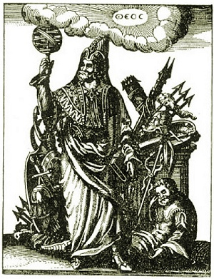

  
[Intangible Textual Heritage](../../index)  [Gnosticism and
Hermetica](../index) 

------------------------------------------------------------------------

[Buy this Book at
Amazon.com](https://www.amazon.com/exec/obidos/ASIN/0766126129/internetsacredte)

------------------------------------------------------------------------

<table width="75%">
<colgroup>
<col style="width: 50%" />
<col style="width: 50%" />
</colgroup>
<tbody>
<tr class="odd">
<td width="50%" data-valign="TOP"></td>
<td width="50%" data-valign="CENTER"><h1 id="thrice-greatest-hermes-vol.-1" data-align="CENTER">Thrice-Greatest Hermes, Vol. 1</h1>
<h2 id="by-g.r.s.-mead" data-align="CENTER">by G.R.S. Mead</h2>
<h4 id="section" data-align="CENTER">[1906]</h4></td>
</tr>
</tbody>
</table>

------------------------------------------------------------------------

**Volume 1**   \|    [Volume 2](../th2/index)   \|    [Volume
3](../th3/index)

------------------------------------------------------------------------

[Contents](#contents)    [Start Reading](th100)    [Page
Index](pageidx)    [Text \[Zipped\]](th1.txt.gz)

------------------------------------------------------------------------

|                                                                                                                           |
|---------------------------------------------------------------------------------------------------------------------------|
|  |

This is the first volume of three of G.R.S. Mead's comprehensive survey
of the literature attributed to the legendary Egyptian sage, Hermes
Trismegistus.

------------------------------------------------------------------------

 [Title Page](th100)  
[Preface](th101)  
[Contents](th102)  
[Poem](th103)  
[I. The Remains of the Trismegistic Literature](th104)  
[II. The History of the Evolution of Opinion](th105)  
[III. Thoth the Master of Wisdom](th106)  
[IV. The Popular Theurgic Hermes-Cult in the Greek Magic
Papyri](th107)  
[V. The Main Source of the Trismegistic Literature According to Manetho,
High Priest of Egypt](th108)  
[VI. An Egyptian Prototype of the Main Features of the Pœmandres’
Cosmogony](th109)  
[VII. The Myth of Man in the Mysteries](th110)  
[VIII. Philo of Alexandria and the Hellenistic Theology](th111)  

### IX. Plutarch: Concerning the Mysteries of Isis and Osiris

[Foreword](th112)  
[Address to Klea concerning Gnosis and the Search for Truth](th113)  
[The Art of Knowing and of Divinising](th114)  
[The True Initiates of Isis](th115)  
[Why the Priests are Shaven and wear Linen](th116)  
[Of the Refraining from Flesh and Salt and Superfluities](th117)  
[On the Drinking of Wine](th118)  
[On Fish Taboos](th119)  
[The Onion and Pig Taboos](th120)  
[The Kings, the Riddles of the Priests, and the Meaning of
Amoun](th121)  
[Of the Greek Disciples of Egyptians and of Pythagoras and his
Symbols](th122)  
[Advice to Klea concerning the Hidden Meaning of the Myths](th123)  
[The Mystery-Myth](th124)  
[The Undermeaning a Reflexion of a Certain Reason](th125)  
[Concerning the Tombs of Osiris](th126)  
[Concerning the Theory of Evemerus](th127)  
[The Theory of the Daimones](th128)  
[Concerning Sarapis](th129)  
[Concerning Typhon](th130)  
[The Theory of the Physicists](th131)  
[Concerning Osiris and Dionysus](th132)  
[The Theory of the Physicists Resumed](th133)  
[The Theory of the Mathematici](th134)  
[The Theory of the Dualists](th135)  
[The Proper Reason according to Plutarch](th136)  
[The Symbolism of the Sistrum](th137)  
[The True “Logos,” again, according to Plutarch](th138)  
[Against the Weather and Vegetation God Theories](th139)  
[Concerning the Worship of Animals, and Totemism](th140)  
[Concerning the Sacred Robes](th141)  
[Concerning Incense](th142)  
[Afterword](th143)  

 

[X. ‘Hermas’ and ‘Hermes’](th144)  
[XI. Concerning the Æon-Doctrine](th145)  
[XII. The Seven Zones and their Characteristics](th146)  
[XIII. Plato: Concerning Metempsychosis](th147)  
[XIV. The Vision of Er](th148)  
[XV. Concerning the Crater or Cup](th149)  
[XVI. The Disciples of Thrice-Greatest Hermes](th150)  
