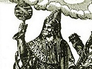

  
[Intangible Textual Heritage](../../index)  [Gnosticism and
Hermetica](../index)  [Index](index)  [Previous](th132)  [Next](th134) 

------------------------------------------------------------------------

[Buy this Book at
Amazon.com](https://www.amazon.com/exec/obidos/ASIN/0766126129/internetsacredte)

------------------------------------------------------------------------

  
*Thrice-Greatest Hermes, Vol. 1*, by G.R.S. Mead, \[1906\], at
Intangible Textual Heritage

------------------------------------------------------------------------

##### THE THEORY OF THE PHYSICISTS RESUMED

XXXVI\. 1. And they call not only the Nile, but also without distinction
all that is moist, “Osiris’ efflux”; and the water-vase always heads the
processions of the priests in honour of the God.

2\. And with “rush” [3](#fn_1073) they write
“king” and the “southern climate” of the cosmos; and “rush” is
interpreted as “watering” and “conception” of all things, and is
supposed to resemble in its nature the generative member.

3\. And when they keep the feast Pamylia, which is phallic, as has been
said, [4](#fn_1074) they bring out and carry
round an image having a phallus three times the size of it.

p. 313

4\. For God is source, and every source by the power of generation makes
manifold that which comes from it. And “many times” we are accustomed to
call “thrice,” as, for instance, “thrice-blessed,” and “three times as
many, endless, bonds” [1](#fn_1075)—unless,
indeed, “three fold” was used in its authentic meaning by those of old;
for the Moist Nature, as being source and genesis of all, moved from the
beginning the first three bodies—earth, air, and fire.

5\. For the *logos* that is superadded to the myth—how that Typhon cast
the chief part of Osiris into the river, and Isis could not find it, but
after dedicating an object answering to it, and having made it ready,
she commanded them to keep the Phallephoria in its honour—comes to this:
namely, an instruction that the generative and spermatic \[powers\] of
the God had moisture as their first matter, and by means of moisture
were immingled with those things which have been produced to share in
genesis.

6\. But there is another *logos* of the Egyptians—that Apophis, as
brother of the Sun, made war on Zeus, and that when Osiris fought on his
\[Zeus’\] side and helped him to conquer his foe, Zeus adopted him as
his son and called him Dionysus.

7\. Moreover, the mythical nature of this *logos* goes to show that it
connects with the truth about nature. For Egyptians call \[Cosmic\]
Breath [2](#fn_1076) Zeus—to which Dry and
Fiery is hostile; this \[latter\] is not the Sun, but it has a certain
kinship with him. And Moisture, by quenching the excess of Dryness,
increases and strengthens the exhalations by which the Breath nourishes
itself and waxes strong.

XXXVII\. 1. Moreover, both Greeks consecrate the

p. 314

ivy to Dionysus and \[also\] among Egyptians it is said to be called
*chen-osiris*—the name meaning, they say, “Osiris-plant.”

2\. Further, Ariston, who wrote *Colonies of the Athenians,* came across
some Letter or other of Alexarchus’s, [1](#fn_1077) in which it is related that Dionysus,
as son of Osiris and Isis, is not called Osiris but Arsaphēs by the
Egyptians—(\[this is\] in Ariston’s first book)—the name signifying
“manliness.”

3\. Hermæus also supports this in the first book of his *Concerning the
Egyptians,* for he says that “Osiris” is, when translated,
“Strong.” [2](#fn_1078)

4\. I disregard Mnaseas, [3](#fn_1079) who
associated Dionysus and Osiris and Sarapis with Epaphos; [4](#fn_1080) I also disregard Anticleides, [5](#fn_1081) who says that Isis, as daughter of
Prometheus, [6](#fn_1082) lived with Dionysus;
for the peculiarities which have been stated about the festivals and
offerings carry a conviction with them that is clearer than the
witnesses \[I have produced\].

XXXVIII\. 1. And of the stars they consider Sirius to be Isis’s [7](#fn_1083)—as being a water-bringer. And they
honour the Lion, and ornament the doors of the temples with gaping
lions’ mouths; since Nilus overflows:

> When first the Sun doth with the Lion
> join. [8](#fn_1084) 

p. 315

2\. And as they hold the Nile to be “Osiris’s efflux,” so too they think
earth Isis’s body—not all \[of it\], but what the Nile covers, sowing
\[her\] with seed and mingling with her; and from this intercourse they
give birth to Horus.

3\. And Horus is the season (ὥρα) and \[fair\] blend of air that keeps
and nourishes all in the atmosphere—who, they say, was nursed by Lēto in
the marshes round Butō; for the watery and soaked-through earth
especially nourishes the exhalations that quench and abate dryness and
drought.

4\. And they call the extremities of the land, both on the borders and
where touching the sea, Nephthys; for which cause they give Nephthys the
name of “End,” [1](#fn_1085) and say she lives
with Typhon.

5\. And when the Nile exceeds its boundaries and overflows more than
usual, and \[so\] consorts with the extreme districts, they call it the
union of Osiris with Nephthys—proof of which is given by the ‘springing
up of plants, and especially of the honey-clover, [2](#fn_1086) for it was by its falling \[from
Osiris\] and being left behind that Typhon was made aware of the wrong
done to his bed. Hence it is that Isis conceived Horus in lawful
wedlock, but Nephthys Anubis clandestinely.

6\. In the Successions of the Kings, [3](#fn_1087) however, they record that when
Nephthys was married to Typhon, she was at first barren; and if they
mean this to apply not to a woman but to their Goddess, they
enigmatically refer to the utterly unproductive nature of the land owing
to sterility.

XXXIX\. 1. The conspiracy and despotism of Typhon, moreover, was the
power of drought getting the mastery over and dispersing the moisture
which both generates the Nile and increases it.

p. 316

2\. While his helper, the Æthiopian queen, [1](#fn_1088) riddles southerly winds from Æthiopia.
For when these prevail over the Annuals [2](#fn_1089) (which drive the clouds towards
Æthiopia), and prevent the rains which swell the Nile from
bursting,—Typhon takes possession and scorches; and thus entirely
mastering the Nile he forces him out into the sea, contracted into
himself through weakness and flowing empty and low.

3\. For the fabled shutting-up of Osiris into the coffin is, perhaps,
nothing but a riddle of the occultation and disappearance of water.
Wherefore they say that Osiris disappeared in the month of Athyr, [3](#fn_1090)—when, the Annuals ceasing entirely,
the Nile sinks, and the land is denuded, and, night lengthening,
darkness increases, and the power of the light wanes and is mastered,
and the priests perform both other melancholy rites, and, covering a cow
made entirely of gold [4](#fn_1091) with a
black coat of fine linen as a mask of mourning for the Goddess—for they
look on the “cow” as an image of Isis and as the earth—they exhibit it
for four days from the seventeenth consecutively.

4\. For the things mourned for are four: first, the Nile failing and
sinking; second, the northern winds being completely extinguished by the
southern gaining the mastery; third, the day becoming less than the
night; and, finally, the denudation of the earth, together with the
stripping of the trees which shed their leaves at that time.

5\. And on the nineteenth, at night they go down to the sea; and the
keepers and priests carry out the

p. 317

sacred chest, having within it a small golden vessel, into which they
take and pour fresh water; and shouts are raised by the assistants as
though Osiris were found.

6\. Afterwards they knead productive soil with the water, and mixing
with it sweet spices and fragrant incense, they mould it into a little
moon-shaped image of very costly stuffs. And they dress it up and deck
it out,—showing that they consider these Gods the essence of earth and
water.

XL 1. And when again Isis recovers Osiris and makes Horus grow,
strengthened with exhalations and moist clouds,—Typhon is indeed
mastered, but not destroyed.

2\. For the Mistress and Goddess of the earth did not allow the nature
which is the opposite of moisture to be destroyed entirely, but she
slackened and weakened it, wishing that the blend should continue; for
it was not possible the cosmos should be perfect, had the fiery
\[principle\] ceased and disappeared.

3\. And if these things are not said contrary to probability, it is
probable also that one need not reject that *logos* also,—how that
Typhon of old got possession of the share of Osiris; for Egypt was
\[once\] sea. [1](#fn_1092)

4\. For which cause many \[spots\] in its mines and mountains are found
even to this day to contain shells; and all springs and all wells—and
there are great numbers of them—have brackish and bitter water, as
though it were the stale residue of the old-time sea collecting together
into them.

5\. But Horus in time got the better of Typhon,—that, is, a good season
of rains setting in, the Nile driving out the sea made the plain
reappear by filling it up again with its deposits,—a fact, indeed, to
which our

p. 318

senses bear witness; for we see even now that as the river brings down
fresh mud, and advances the land little by little, the deep water
gradually diminishes, and the sea recedes through its bottom being
heightened by the deposits.

6\. Moreover, \[we see\] Pharos, which Homer [1](#fn_1093) knew as a day’s sail distant from
Egypt, now part \[and parcel\] of it; not that the \[island\] itself has
sailed to land, [2](#fn_1094) or extended
itself shorewards, but because the intervening sea has been forced back
by the river’s reshaping of and adding to the mainland.

7\. These \[explanations\], moreover, resemble the theological dogmas
laid down by the Stoics,—for they also say that the generative and
nutritive Breath \[or Spirit\] is Dionysus; the percussive and
separative, Heracles; the receptive, Ammon \[Zeus\]; that which extends
through earth and fruits, Demeter and Korē; and that \[which extends\]
through sea, Poseidon. [3](#fn_1095)

------------------------------------------------------------------------

### Footnotes

[312:3](th133.htm#fr_1072) θρύον—confounded by
King (*in loc.*) with θρῖον, “fig leaf” (perhaps connected with τρὶς,
from the three lobes of the leaf); the “rush” is presumably the papyrus.

[312:4](th133.htm#fr_1073) *Cf.* xii.

[313:1](th133.htm#fr_1074) Bernardakis gives
the references as *Il.,* vi. 154 and viii. 340, but I am unable to
verify them.

[313:2](th133.htm#fr_1075) Or “Spirit”
(πνεῦμα).

[314:1](th133.htm#fr_1076) Ariston and
Alexarchus and Hermæus (*cf.* xlii. 7) seem to be otherwise unknown to
fame.

[314:2](th133.htm#fr_1077) ὄμβριμος =
ὄβριμος—strong, virile, manly. *Cf.* the Eleusinian sacred name Brimos
for Iacchos.

[314:3](th133.htm#fr_1078) Flourished latter
half of 3rd century B.C.

[314:4](th133.htm#fr_1079) Son of Zeus and Io,
born in the Nile, after the long wanderings of his mother. He is fabled
by the Greeks to have been subsequently King of Egypt and to have built
Memphis. Herodotus (ii. 153; iii. 27, 28) says that Epaphos = Apis.

[314:5](th133.htm#fr_1080) A Greek writer
subsequent to the time of Alexander the Great.

[314:6](th133.htm#fr_1081) *Cf.* iii. 1.

[314:7](th133.htm#fr_1082) But *cf.* lxi. 5.

[314:8](th133.htm#fr_1083) Aratus, *Phœnom.,*
351.

[315:1](th133.htm#fr_1084) *Cf.* xii. 6.

[315:2](th133.htm#fr_1085) *Cf.* xiv. 6.

[315:3](th133.htm#fr_1086) *Cf.* xi. 4.

[316:1](th133.htm#fr_1087) Asō; *cf.* xiii. 3.

[316:2](th133.htm#fr_1088) The “Etesian”
winds, which, in Egypt blew from the N.W. during the whole summer.

[316:3](th133.htm#fr_1089) Copt. Hathor—corr.
roughly with November.

[316:4](th133.htm#fr_1090) *Cf.* “the golden
calf” incident of the Exodus story.

[317:1](th133.htm#fr_1091) Another proof of
the common persuasion that there had been a Flood in Egypt.

[318:1](th133.htm#fr_1092) *Il.,* iv. 355.

[318:2](th133.htm#fr_1093) A play on the
“day’s sail” (δρόμον) and ἀνα-δραμοῦσαν.

[318:3](th133.htm#fr_1094) It is, of course, a
very poor interpretation of the myth to talk only about floods and
desert, sea and rain, etc. These are all facts illustrating the
underlying truth, but they are not the real meaning.

------------------------------------------------------------------------

[Next: The Theory of the Mathematici](th134)
