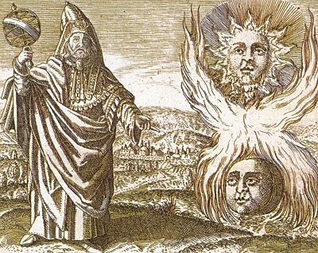

  
[Intangible Textual Heritage](../../index)  [Gnosticism and
Hermetica](../index) 

------------------------------------------------------------------------

[Buy this Book at
Amazon.com](https://www.amazon.com/exec/obidos/ASIN/0766126137/internetsacredte)

------------------------------------------------------------------------

<table width="75%">
<colgroup>
<col style="width: 50%" />
<col style="width: 50%" />
</colgroup>
<tbody>
<tr class="odd">
<td width="50%" data-valign="TOP"></td>
<td width="50%" data-valign="CENTER"><h1 id="thrice-greatest-hermes-vol.-2" data-align="CENTER">Thrice-Greatest Hermes, Vol. 2</h1>
<h2 id="by-g.r.s.-mead" data-align="CENTER">by G.R.S. Mead</h2>
<h4 id="section" data-align="CENTER">[1906]</h4></td>
</tr>
</tbody>
</table>

------------------------------------------------------------------------

[Volume 1](../th1/index)   \|    **Volume 2**   \|    [Volume
3](../th3/index)

------------------------------------------------------------------------

[Contents](#contents)    [Start Reading](th200)    [Page
Index](pageidx)    [Text \[Zipped\]](th2.txt.gz)

------------------------------------------------------------------------

|                                                                                                                           |
|---------------------------------------------------------------------------------------------------------------------------|
|  |

This is the second volume of three of G.R.S. Mead's comprehensive survey
of the literature attributed to the legendary Egyptian sage, Hermes
Trismegistus. This volume includes translations of the Corpus
Hermeticum, including the Sheperd Poemandres, To Asclepius, The Secret
Sermon on the Mountain, and more.

------------------------------------------------------------------------

 [Title Page](th200)  
[Contents](th201)  

### I. Corpus Hermeticum

[I. Pœmandres, the Shepherd of Men](th202)  
[Commentary](th203)  
[(II.) The General Sermon](th204)  
[II. (III.) To Asclepius](th205)  
[Commentary](th206)  
[III. (IV.) The Sacred Sermon](th207)  
[Commentary](th208)  
[IV. (V.) The Cup or Monad](th209)  
[Commentary](th210)  
[V. (VI.) Though Unmanifest God is Most Manifest](th211)  
[Commentary](th212)  
[VI. (VII.) In God Alone is Good and Elsewhere Nowhere](th213)  
[Commentary](th214)  
[VII. (VIII.) The Greatest Ill Among Men is Ignorance of God](th215)  
[Commentary](th216)  
[VIII. (IX.) That No One of Existing Things doth Perish, but Men in
Error Speak of Their Changes as Destructions and as Deaths](th217)  
[Commentary](th218)  
[IX. (X.) On Thought and Sense](th219)  
[Commentary](th220)  
[X. (XI.) The Key](th221)  
[Commentary](th222)  
[XI. (XII.) Mind Unto Hermes](th223)  
[Commentary](th224)  
[XII. (XIII.) About the Common Mind](th225)  
[Commentary](th226)  
[XIII. (XIV.) The Secret Sermon on the Mountain](th227)  
[Commentary](th228)  
[XIV. (XV.) A Letter to Asclepius](th229)  
[Commentary](th230)  
[(XVI.) The Definitions of Asclepius unto King Ammon](th231)  
[Commentary](th232)  
[(XVII.) Of Asclepius to the King](th233)  
[Commentary](th234)  
[(XVIII.) The Encomium of Kings](th235)  
[Commentary](th236)  

### II. The Perfect Sermon; or the Asclepius

[Part I](th237)  
[Part II](th238)  
[Part III](th239)  
[Part IV](th240)  
[Part V](th241)  
[Part VI](th242)  
[Part VII](th243)  
[Part VIII](th244)  
[Part IX](th245)  
[Part X](th246)  
[Part XI](th247)  
[Part XII](th248)  
[Part XIII](th249)  
[Part XIV](th250)  
[Part XV](th251)  
[Commentary](th252)  
