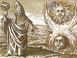

  
[Intangible Textual Heritage](../../index)  [Gnosticism and
Hermetica](../index)  [Index](index)  [Previous](th235)  [Next](th237) 

------------------------------------------------------------------------

[Buy this Book at
Amazon.com](https://www.amazon.com/exec/obidos/ASIN/0766126137/internetsacredte)

------------------------------------------------------------------------

  
*Thrice-Greatest Hermes, Vol. 2*, by G.R.S. Mead, \[1906\], at
Intangible Textual Heritage

------------------------------------------------------------------------

#### COMMENTARY

##### THE APOLOGY OF A PŒMANDRIST

This, the last piece in our Corpus, differs so greatly both in style and
form of contents from the rest of our sermons, that we are plainly
dealing with a different order of endeavour.

The style is for the most part so very artificial and forced, that we
are conscious of labour and effort, and sometimes of such obscurity as
to make a clear rendering almost impossible. The contents are of the
nature of an elaborate set Eulogy of Kings.

Whether or not this concluding piece ever bore a proper title it is
impossible to say, for the existing headings are plainly added by a
later redactor, [2](#fn_659)—as we

p. 299

have already seen in a number of other instances. I have therefore
ventured to superscribe as the main title “The Encomium of Kings,” [1](#fn_660) and have placed the contents-headings in
parentheses.

Reitzenstein, in his analysis of the Corpus, concludes (p. 207) that
this Eulogy was appended to the collection of treatises by the original
redactor, or collector.

He was an Egyptian Rhetor, who was a follower of the Trismegistic
tradition, and his object in making the collection was mainly to show
the Rulers of the Empire that not only was there nothing in the Hermes
religion that could excite their suspicion, but that, on the contrary,
it was in its most fundamental teachings admirably calculated to
inculcate Loyalty to the Rulers of the Empire’s destinies.

It is, indeed, to this “Apology,” so to speak, that we owe the good
fortune of the preservation of our Corpus.

##### SPECULATIONS AS TO DATE

Who the “most noble \[Sirs\]” of §§ 5 and 7, to whom the Eulogy is
immediately addressed, may be, is difficult to determine, for though the
subject is the “Encomium of Kings” in general, some actual King was
evidently in the mind of the writer when he penned § 16. Perhaps the
“most noble” may have been the high officials of Egypt.

The lost conclusion of our Encomium, for our actual text is evidently
incomplete, may have given clearer indications of the Emperor for whose
ultimate perusal the Eulogy was intended. As it is, the indications are
of the vaguest.

Reitzenstein, however, is of opinion (pp. 207, 208) that the indications
in § 16 best suit the reign of

p. 300

\[paragraph continues\] Diocletian (*imp.*
285-305 A.D.); but he is aware that, as far as these are concerned, an
earlier date is not excluded (p. 208). It is only when he has treated,
in his Addenda (pp. 371-374), the Encomium as an example of later Greek
“art-prose,” or rhythmic prose, the scheme of the accentuation of which
has been of late years carefully studied, especially by Meyer and
Wilamowitz, that he comes definitely to the conclusion that the external
form of our Rhetor’s effort fits precisely the time of Diocletian’s
Triumph, 302 A.D. I cannot, however, say that I am convinced by his
arguments.

The strained and elaborate introduction (§§ 1-5) needs no further
comment; no doubt it is very “fine writing,” but it is difficult to pin
some of it down to any precise meaning in translation.

##### THE STORY OF THE PYTHIC GRASSHOPPER

6\. With § 6, however, our interest is awakened, for it reminds us of
the famous Introduction to the *Protrepticus, or Exhortation to the
Greeks*, of Clement of Alexandria, when he says:

“I could tell thee also of another—brother to these [1](#fn_661)—story and singer, of Eunomus the Locrian
and the Pythic grasshopper.

“At Pytho there was gathered together a solemn assembly of Greeks to
celebrate the Death of the Serpent, with Eunomus to sing the funeral
song of the beast.

“Whether his song was a hymn or a dirge I cannot say; anyhow, there was
a contest, and Eunomus had to harp it in the heat of the day, when the
grasshoppers, warmed by the sun, were singing underneath the leaves
along the hills.

p. 301

“They were singing not to the Serpent, the dead thing, but to God the
All-wise, a song of unrestrained mode far better than the modes of
Eunomus.

“A cord breaks for the Locrian; the grasshopper flies on to the yoke; it
chirped on the harp as on a branch; and the minstrel, modulating to the
song of the grasshopper, filled up the missing string.

“It was not that the grasshopper was attracted by the song of Eunomus,
as the story would have it, setting up a brazen statue at Pytho of
Eunomus, harp and all, and his helper in the contest; it flew on
naturally and sung naturally. The Greeks, however, thought it played the
music.” [1](#fn_662)

This passage shows that the story referred to by our author was well
known, so well known indeed that Clement takes it as a text for a
naturalistic explanation of Hellenic miracle. No literary dependence,
however, of one or the other can be entertained, for the similarity of
the “τὴν νευρὰν ἀνεπλήρωσεν αὐτῷ” of our text and the “ὁ ᾠδὸς τὴν
λείπουσαν ἀνεπλήρωσε χορδὴν” of Clement is far too slight a link to bear
the weight of any argument of this nature. [2](#fn_663)

11\. There is evidently a lacuna after § 10, and, judging by the opening
words of § 11, it must be of some length, for the Praise of Kings so far
is of a very brief description.

It is also of interest to notice how much easier the style of our author
is when he treats of the Praises of God; his words seem to come far more
easily, as though he had a subject to deal with with which he was more
familiar, as, indeed, he ought to have been if he had studied the
treatises he has collected together.

p. 302

##### THE TRUE KING

13\. The idea that all his subjects are the children of the King is
Egyptian; or, rather, it is the tradition of all nations who believed in
Divine Kings. The true King was he who, so to speak, contained all his
subjects within himself; they were all “members,” or, as we should say,
cells, of his true Body. The nation was the King; the victory of the
nation was ascribed to the virtue of the King. [1](#fn_664)

##### THE FELLOW-RULERS OF THE HEIGHT

14\. The last three sentences of § 14 Reitzenstein (p. 208) would take
as referring to the Kings under the suzerainty of the Emperor, who were
bound to him by a common bond of love, in order that he may the more
insist on the Diocletian date. [2](#fn_665) I
would, however, refer the idea to the ideal of harmony and unity of the
Beings of the Intelligible World, as described, for instance, by
Plotinus, when he writes:

“They see themselves in others. For all things are transparent, and
there is nothing dark or resisting, and everyone is manifest to everyone
internally, and all things are made manifest; for light is manifest to
light. For everyone has all things in himself, and again sees in another
all things, so that all things are everywhere, and all in all, and each
in all, and infinite the glory. For each of them is great, since the
small also is great. And the sun there is all the stars, and, again,
each and all are the sun. In each, one thing is pre-eminent above the
rest, but it also shows forth all.” [3](#fn_666)

p. 303

Compare this also with the intuition of the seer in *The Untitled
Apocalypse* of the Codex Brucianus:

“Their Crowns send forth Rays; the Brilliancy of their Bodies is as the
life of the Space into which they are come; the Word (*Logos*) that
comes out of their mouth is Eternal Life, and the Light that comes forth
from their Eyes is Rest for them; the Movement of their Hands is their
Flight to the Space out of which they are come, and their Gazing on
their own Faces is Knowledge of themselves; their Giving to themselves
is a repeated Return, and the Stretching out of their Hands establishes
them; the Hearing of their Ears is the Perception in their Heart; and
the Union of their Limbs is the Ingathering of Israel; their Holding to
one another is their Fortification in the Logos.” [1](#fn_667)

This is the Egyptian counterpart of the Plotinian Ecstasis; and Plotinus
was by birth an Egyptian.

------------------------------------------------------------------------

### Footnotes

[298:2](th236.htm#fr_660) In fact, are due to
the first hand in B C D M. See R. 355, 1; 358, 12.

[299:1](th236.htm#fr_661) See § 15—ἡ πρὸς τοὺς
βασιλέας εὐφημία—and compare note to Clem. Alex., iii., in “Fragments
from the Fathers.”

[300:1](th236.htm#fr_662) Amphion, Arion and
Orpheus.

[301:1](th236.htm#fr_663) Clem. Al., *Prot.*,
i. 1; P. 2 (ed. Dindorf, i. 2).

[301:2](th236.htm#fr_664) *Cf.* R. 205, 206.

[302:1](th236.htm#fr_665) This belief, indeed,
is the power of the Japanese in our own day.

[302:2](th236.htm#fr_666) He thus, apparently,
would take the ἐκείσε as referring to these subject kings and rulers.

[302:3](th236.htm#fr_667) *En.*, V. viii. 4.

[303:1](th236.htm#fr_668) *F. F. F.*, 557.

------------------------------------------------------------------------

[Next: Part I](th237)
