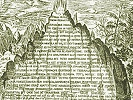

  
[Intangible Textual Heritage](../../index)  [Gnosticism and
Hermetica](../index)  [Index](index)  [Previous](th315)  [Next](th317) 

------------------------------------------------------------------------

[Buy this Book at
Amazon.com](https://www.amazon.com/exec/obidos/ASIN/0766126145/internetsacredte)

------------------------------------------------------------------------

  
*Thrice-Greatest Hermes, Vol. 3*, by G.R.S. Mead, \[1906\], at
Intangible Textual Heritage

------------------------------------------------------------------------

p. 65

#### EXCERPT XV.

------------------------------------------------------------------------

### \[OF SOUL, II.\]

(Patrizzi (p. 40) runs this on to the preceding
without a break.

Text: Stob., *Phys*., xxxv. 7, under heading: “Of
Hermes from the \[Sermons\] to Ammon”; G. pp. 291, 292; M. i. 203, 204;
W. i. 289, 290.

Ménard, Livre IV., No. iv. of “Fragments of the
Books of Hermes to Ammon,” pp. 261, 262.)

1\. That which is moved is moved
according to the operation of the motion that doth move the all.

For that the Nature of the all supplies the all with motion,—one
\[motion being\] the \[one\] according to its [1](#fn_214) Power, the other that according to
\[its\] Operation. [2](#fn_215)

The former doth extend itself throughout the whole of Cosmos, and
holdeth it together from within; the latter doth extend itself \[around
it\], and encompasseth it from without. And these go everywhere together
through all things.

p. 66

Now the \[Productive\] Nature [1](#fn_216) of
all things supplies the things produced with \[power of re-\]
production, sowing the seeds of its own self, \[and\] having its
becomings [2](#fn_217) by means of moving
matter.

2\. And Matter being moved was heated and did turn to Fire and
Water,—the one \[being\] strong and active, and the other passive.

And Fire opposed by Water was dried up by it, and did become Earth borne
on Water.

And when it [3](#fn_218) was excessively dried
up, [4](#fn_219) a vapour rose from out the
three,—from Water, Earth and Fire,—and became Air.

The \[Four\] came into congress, \[then,\] according to the reason of
the Harmony, [5](#fn_220)—hot with cold,
\[and\] dry with moist.

And from the union [6](#fn_221) of these
\[four\] is spirit born, and seed proportionate to the surrounding
Spirit.

This \[spirit\] falling in the womb does not remain inactive in the
seed, but being active it transforms the seed, and \[this\] being
\[thus\] transformed, develops growth and size.

p. 67

And as it grows in size, it draws unto itself a copy of a model, [1](#fn_222) and is modelled.

3\. And on the model is the form supported,—by means of which that which
is represented by an image is so represented.

Now, since the spirit in the womb had not the motion that maintaineth
life, but that which causeth fermentation [2](#fn_223) \[only\], the Harmony composed the
latter as the receptacle [3](#fn_224) of
rational life. [4](#fn_225)

This \[life\] is indivisible and changeless; it never changes from its
changelessness.

It [5](#fn_226) ruleth the conception of the
thing within the womb, by means of numbers, delivereth it, and bringeth
it into the outer air.

The Soul [6](#fn_227) dwells very near to
it [7](#fn_228);—not owing to some common
property, but under the constraint of Fate; for that it has no love to
be with body. [8](#fn_229)

Wherefore, \[the Harmony [9](#fn_230)\]
according unto Fate doth furnish to the thing that’s born \[its\] [10](#fn_231)

p. 68

rational motion, and the intellectual essence of the life itself.

For that \[this [1](#fn_232)\] doth insinuate
itself into the spirit, and set it moving with the motion of the
life. [2](#fn_233)

------------------------------------------------------------------------

#### COMMENTARY

Patrizzi is evidently at fault in running this on to Ex. xiv. without a
break. The subject again is not so much “Of Soul” as “Of Conception and
Birth,” but as the general exposition falls in very well with the nature
of the subjects treated in Exx. xiv. and xvi., we may keep the same
general title, though we may be quite certain that it was not that of
the original.

The exposition in § 2 is reminiscent of an apocalyptic style, and seems
to be a Greek overworking of Egyptian ideas; for though the details are
different and the precise meaning difficult to disentangle, the general
point of view may be compared with the embryonic stages of incarnation
given in the *Pistis Sophia* (pp. 344 ff.).

##### THE EMBRYONIC STAGES OF INCARNATION

“Then the Rulers summon the workmen of their æons, to the number of
three hundred and sixty-five, and hand over to them the soul and the
counterfeit of the spirit bound together, the one to the other, the
counterfeit of the spirit being outside the soul, and the

p. 69

compound of the power within the soul being inside both, that they may
hold together.

“(345) And the Rulers give commandment to the workmen, saying: ‘This is
the type which ye shall set in the body of the matter of the world. Set
ye the compound of the power which is in the soul within all of them,
that they may hold together, for it is their support, and outside the
soul place the counterfeit of the spirit.’ This is the order which they
have given to their workmen, that they may set the antitypes in bodies.

“Following this plan the workmen of the Rulers bring the power, the soul
and the counterfeit of the spirit, and pour them all three into the
world, passing through the world of the Rulers of the Midst.

“The Rulers of the Midst also inspect the counterfeit of the spirit and
also the destiny. The latter, whose name is the destiny, leadeth on a
man until it hath him killed by the death which is destined for him.
This the Rulers of the Great Fate have bound to the soul.

“And the workmen of the Sphere bind the soul with the power, with the
counterfeit of the spirit and with the destiny. And the whole is divided
so as to form two parts, to surround the man and also the woman in the
world, in whom the sign hath been set for them to be sent unto them.
(346) And they give one part to the man and the other to the woman in
the food of the world, either in the aery, or watery, or etheric
substance which they imbibe. . . .

“Now, therefore, when the workmen of the Rulers have cast one part into
the woman and the other into the man in the manner which I have just
related, even though \[the pair\] be removed to a great distance from
one another, the workmen compel them secretly to be

p. 70

united together in the union of the world. Then the counterfeit of the
spirit which is in the male cometh unto the part \[of itself\] which
hath been sent into the world in the matter of the body \[of the man\],
and sacrificeth it and casteth it into the womb of the woman, a deposit
of the seed of iniquity. And forthwith the three hundred and sixty-five
workmen of the Rulers enter into her, to take up their abode in her. The
workmen of the two parts are all there together.

“(347) And the workmen check the blood that cometh from all the
nourishment that the woman eateth or drinketh, and keep it in the womb
of the woman for forty days. And after forty days, they work the blood
\[that cometh\] from the essence of all the nourishment, and work it
together carefully in the woman’s womb.

“After forty days they spend another thirty days in building its members
in the likeness of the body of a man; each buildeth a member. I will
tell you of the decans who thus build \[the body\] . . . when I explain
the emanation of the plērōma.

“Afterwards, when the workmen have completed the body entirely with all
its members in seventy days, they summon into the body which they have
builded, first the counterfeit of the spirit, next they summon the soul
within those, and finally they summon the compound of the power within
the soul, and the destiny they place outside all, for it is not blended
with them, but followeth after and accompanieth them.”

(An elaborate account of the “sealing” of the members of the plasm is
then given.)

“And when the number of the months of the child’s conception is full,
the babe is born, the compound of the power being small in it, the soul
being small in it, and the counterfeit of the spirit being small in it;

p. 71

whereas the destiny, being vast, is not mingled with the body, according
to the regulation of the three (350), but followeth after the soul, the
body and the counterfeit of the spirit, until the soul passeth from the
body according to the type of death whereby he shall die according to
what hath been decreed unto him by the Rulers of the Great Fate.”

------------------------------------------------------------------------

### Footnotes

[65:1](th316.htm#fr_214) *Sc.* Nature’s.

[65:2](th316.htm#fr_215) Or energy.

[66:1](th316.htm#fr_216) φύσις simply; but as
there is a play in the original on the words φύσις, φύουσα, φυήν, and
φυομένοις, I have tried to retain it in translation by a series of
allied words.

[66:2](th316.htm#fr_217) γενέσεις.

[66:3](th316.htm#fr_218) *Sc.* Fire.

[66:4](th316.htm#fr_219) περιξηραινομένου.

[66:5](th316.htm#fr_220) Or law of
Harmony,—κατὰ τὸν τῆς ἁρμονίας λόγον.

[66:6](th316.htm#fr_221) Lit. “breathing with
one breath,”—ἐκ τῆς συμπνοίας—a wordplay on πνεῦμα (spirit). For
“spirit,” *cf*. *C. H*., x. (xi.) 13, Comment., and Exx. xix. 3; iv. 2.

[67:1](th316.htm#fr_222) Or image of a
figure,—εἴδωλον . . . σχήματος.

[67:2](th316.htm#fr_223) τὴν δὲ βραστικήν.

[67:3](th316.htm#fr_224) Or vehicle,—ὑποδοχήν.

[67:4](th316.htm#fr_225) τῦς διανοητικῆς
ζωῆς,—of the purposive rational life, otherwise called the Harmony.

[67:5](th316.htm#fr_226) *Sc.* the Harmony.

[67:6](th316.htm#fr_227) Reading ψυχὴ for ψυχῇ.

[67:7](th316.htm#fr_228) The new-born babe.

[67:8](th316.htm#fr_229) Compare Plutarch,
*Frag*., v. 9 (ed. Didot): “For you should know the intercourse and the
conjunction of the soul with body is contrary to nature.”

[67:9](th316.htm#fr_230) It is not easy to
disentangle the subjects of some of the above clauses.

[67:10](th316.htm#fr_231) *Sc.* the thing’s.

[68:1](th316.htm#fr_232) *Sc.* the rational
movement.

[68:2](th316.htm#fr_233) ζωτικῶς,—this may
perhaps have some reference to the circle of lives, or the zodiac.

------------------------------------------------------------------------

[Next: Excerpt XVI. Of Soul, III.](th317)
