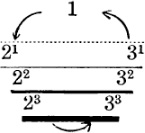

  
[Intangible Textual Heritage](../../index)  [Gnosticism and
Hermetica](../index)  [Index](index)  [Previous](th327)  [Next](th329) 

------------------------------------------------------------------------

[Buy this Book at
Amazon.com](https://www.amazon.com/exec/obidos/ASIN/0766126145/internetsacredte)

------------------------------------------------------------------------

  
*Thrice-Greatest Hermes, Vol. 3*, by G.R.S. Mead, \[1906\], at
Intangible Textual Heritage

------------------------------------------------------------------------

#### COMMENTARY

##### ARGUMENT

1\. The “Virgin of the World” is a sacred sermon of initiation into the
Hermes-lore, the first initiation, in which the tradition of the wisdom
is handed on by the hierophant to the neophyte, by word of mouth. The
instructor, or revealer, is the representative of Isis-Sophia, and
speaks in her name, pouring forth for her beloved son, the new-born
Horus, the first draught of

p. 135

immortality, which is to purge away the poison of the mortal cup of
forgetfulness and ignorance, and so raise him from the “dead.”

This pouring-forth explains that the divine economy is perfect order,
mystery transcending mystery,—each state of being, and each being, a
mystery to those below that state.

This order no mortal intellect can ever grasp; nay, in the far-off ages,
when as yet there were no men, but only Gods, those essences that know
no death, the first creation of the World-creator,—even these Gods,
these mysteries to us, were in amazement at the glories of the greater
mysteries which decked the Heaven with their unveiled transcendent
beauty. Even these Gods did not know God as yet.

2\. The Gods were immortal, but unknowing; they were intoxicated with
Heaven’s beauty, amazed, nay awestruck, at the splendour of the
mysteries of Heaven. Then came there forth another outpouring of the
Father over all; He poured the Splendour of His Mind into their hearts
and they began to know. [1](#fn_358)

With this representation is blended a mythical historical tradition
which suggests that all this was brought about for an “earth” on which
our humanity had not as yet appeared, in far-off distant days when
apparently our earth was not as now, ages ago, the purest Golden Age
when there were Gods, not men. In that race of Gods, those of them in
whom the ray was no low-burning spark, but a divine flame, were the
instructors in the heavenly wisdom.

3\. Of these was Hermes, a race or “being” rather

p. 136

than an individual; these “Sons of Fire” left the record of their wisdom
engraved on “stone” in symbol, in charge of others of the same race but
less knowing than themselves; and so they ascended to Heaven.

4\. Those that succeeded them had not the flame so bright within their
hearts; they were of the same race, but younger souls—the Tat-race.
Hermes could not hand on the direct knowledge to them, the “perfect
sight” (θεωρία), and so recorded the wisdom in symbol and myth. Still
later the Asclepius-race joined themselves to the Tat-souls.

All this, however, took place many many ages ago, long even before the
days of the men-gods Osiris and Isis; for the real wisdom of Hermes was
so ancient that even Isis herself had had to search out the hidden
records, and that too by means of the inner sight, when she herself had
won the power to see, and the True Sun had risen for her mind.

5\. But the strain of reconstructing the history of this far-distant
past, as he conceived it to have been, is too much for the writer. He
knows he is dealing with “myths,” with what Plutarch would have called
the “doings of the daimones;” he knows that in reality these primæval
“Books” of Hermes have no longer any physical existence, if indeed they
ever had any; he knows that no matter what legends are told, or whatever
the general priesthood may believe about ancient physical inscriptions
of the primæval Hermes,—all this has passed away, and that the real
wisdom of Hermes is engraved on the tablets of the æther, and not hidden
in the shrines of earth.

The “Books” are engraved in the “sacred symbols of the cosmic elements,”
and hidden away hard by the “secrets of Osiris”—the mysteries of
creative fire, the light that speaks in the heart. The true Books of

p. 137

\[paragraph continues\] Hermes are hidden
away in their own zones, the pure elements of the unseen world—the
celestial Egypt.

6\. This wisdom was held in safe keeping for the “souls” of men; it was
a soul-gnosis, not a physical knowledge. Hereupon the writer begins the
recital of his tradition [1](#fn_359) of the
creation of the “souls” of men in their unfallen state, all of which is
derived from the “Books of Hermes.” The soul-creation runs as follows:

The Watchers [2](#fn_360) approach the Creator.
The hour has struck for a new Cosmic Dawn, for a new Day. The time has
come for Cosmos to awake after the Night. [3](#fn_361) The Creative Mind of the universe turns
His attention, His thought, to a new phase of things, a new
world-period.

7\. God smiled, and His laughter thrilled through space, [4](#fn_362) and with His Word, called forth into the
light the new dawn from out the primæval darkness of the new
world-space. His first creation, transcendental or intelligible Nature,
stood before Him, in all the marvel of her new beauty, the primal
plērōma, or potential fullness, of the new universe or system, the ideal
cosmos of our world, for there were many others,—the Gods who marvelled
at the mystery.

Straightway this Nature fell from one into three, herself and Toil and
their fairest child Invention, to

p. 138

whom God gave the gift of being, themselves producing ideal form alone.

The first creation, then, was the bringing forth of potencies and types
and ideas, to whom God gave the gift of being; it was as yet the world
“above,” the primæval Heaven, in ultimate perfection, thus constituting
the unchanging boundaries of the new universe that was to be. These
things-that-are were filled with “mysteries,” not “breaths” or “lives,”
for these were not as yet.

8\. The next stage is the breathing of the spiritual (not the physical)
breath of lives into the fairest blend of the primal elements that
condition the world-area. This blend or soul-substance is called
*psychōsis*. The primal elements were not our mixed earth, water, fire,
and air, but “knowing fire” (perhaps “fire in itself,” as Hermes
elsewhere calls it, or intelligible fire, perchance the “flower of fire”
of the so-called “Chaldæan Oracles” [1](#fn_363)) and unknowing air, if we may judge from
the phrase (7): “Let heaven be filled with all things full, and air and
æther \[? = fire\] too!” It is Heaven or the ideal world that is so
filled; even earth-water was not yet manifested, much less earth and
water.

It seems, then, that these souls (souls corresponding above with the
subsequent man-stage below) were a blend of the three: spirit, knowing
fire, and unknowing air,—triads, yet a unity called *psychōsis*.

9\. They were moreover all essentially equal, but differed according to
some fixed law of numbering; they were also apparently definite in
number, one soul perchance for every star, as with Plato, according to
the law of similarity of less and greater, of within and without.

10\. These souls, then, were “sacred (or typical) men,”

p. 139

a creation prior to that of the “sacred animals”; their habitat was in
Upper Nature, the “all-fairest station of the æther”—the celestial
cosmos.

11\. They were appointed to certain stations and to the task of keeping
the “wheel revolving,”—that is, as we shall see, they were to fashion
forms for birth and death, and so provide means of transmission for the
life-currents ever circulating in the great sphere. This was their
appointed task, the law imposed on them, as obedient children of the
Great King, their sire. So long as they kept their appointed stations
they were to live for ever in surroundings of bliss and beauty, in full
contemplation of the glories of the greater universe, throned amid the
stars. But if they disobeyed the law, bonds and punishment await them.

12\. We next come to a further creation of souls—a subject somewhat
difficult to follow. These souls are of an inferior grade to the
preceding, for they are composed of the primal water and earth, of
“water in itself” and “earth in itself” we must suppose, and not of the
compound elements we now call by these names. These are the souls of
certain “sacred animals” or lives, which bear the same relationship to
the souls which “keep the wheel revolving” as animals do to man on
earth. They are, however, not shaped like the animals on earth, nor
possess even typical animal forms, but bear the forms of men, though
they are not men.

13\. Still was the divine “water-earth” substance unexhausted, and so
the residue was handed over to “those souls that had gone in advance and
had been summoned to the land of Gods,”—that is to say, those stations
near the Gods, in highest æther, of which mention has just been made.
These souls are, of course, the man-souls proper.

Out of this residue these Builders were to fashion

p. 140

animals, after the models the Creator gave them,—certain types of life,
below the “man” type proper, ranged in due order corresponding to the
“motions of the souls.” That is to say, there were various classes of
Builders according to the types of animals which were to be copied. The
Builders were to fashion the forms, the Creator was to breathe into them
the life.

14\. Thus these Builders fashioned the etheric doubles of birds,
quadrupeds, fish and reptiles, and not their physical bodies, for as yet
the earth was not solid.

15\. And so the Builder-souls accomplished their task, and fashioned the
primæval copies of the celestial types of animals. Proud of their work,
they grew restive at the restraints placed upon them by the law of their
stations, and overstepped the limits decreed by the Creator. [1](#fn_364)

Whereupon the punishment is pronounced, and the Creator resolves to make
the human frame, therein to imprison the disobedient souls.

And here we learn incidentally that all of this

p. 141

psychogenesis which has gone before was the direct teaching of Hermes to
the writer; of no physical Hermes, however, but of that Hermes whose
“Books” are hidden in the zones (5), of the Hermes whom the writer, as
he would have us believe, came to know face to face only after his inner
vision was opened, and he had gazed with all-seeing eyes “upon the
mysteries of that new dawn” (4).

16\. For the new and mysterious fabrication of the man-form, all the
seven obedient Gods, to whom the man-souls are kin (17), are summoned by
the chief of them, Hermes himself, the beloved son and messenger of the
Supreme, “soul of My Soul, and holy mind of My own Mind.” [1](#fn_365)

17\. All of the seven promise to bestow the best they have on man.

18\. The plasm out of which the man-form is to be modelled is the
residue of the mixture out of which the Builders had already made the
animal doubles. But the Builder of the man-frames was Hermes himself,
who mixed the plasm with still more water.

19\. Here the writer inserts a further piece of information concerning
the source of his tradition. It is no longer as before what Hermes
himself reveals to him in vision, but what the writer was told at a
certain initiation called the “Black Rite.” This rite was presided over
by Kamēphis, who is called the “earliest of all,” or perhaps more
correctly the “most primæval of \[us\] all.” Kamēphis is thus conceived
as the representative of a more ancient wisdom than that of Isis, and
yet even he but hands on the tradition of Hermes. [2](#fn_366)

20\. The souls are “enfleshed,” and utter loud complaints. Apparently
not all at first can speak articulately; most of them can only groan, or
scream,

p. 142

or hiss. The leading class of souls can, however, so far dominate the
plasm as to speak articulately, and so one of their number utters a
desperate appeal to Heaven.

21\. They have now lost their celestial state, and Heaven is shut away
from them; no longer can they see “without the light.” They are shut
down into a “heart’s small compass”; the Sun of their being has become a
light-spark only, hidden in the heart. This is, of course, the *logos*,
the inmost reality in man.

22\. The souls pray for some amelioration of their unhappy lot, and the
conditions of the moral law are expounded to them. They who do rightly
shall, on their body’s dissolution, reascend to Heaven and be at rest;
they who do ill, shall work out their redemption under the law of
metempsychosis, or change from body to body, from prison to prison.

23\. Details of this metempsychosis are then given with special
reference to the incarnations of the “more righteous,” who shall be
kings, philosophers and prophets. Such souls apparently, for it is not
expressly so stated, shall, in passing round the wheel of rebirth, when
out of incarnation in a human body, have some sort of life with the
souls of the leading types of animals, which are given as eagles, lions,
dragons, and dolphins. Or, if we are unjustified in this speculation,
such souls shall in their animal parts have intimate relation with the
noblest types of animal essence (24).

25\. There now comes upon the scene the mighty Intellect of the Earth, a
veritable Erdgeist, in the form of Mōmus, who speaking out of affection
for him (28), urges Hermes to increase ills and trials upon the souls of
men, so that they shall not dare too much (25-27). And thereon Hermes
sets in motion the instrument or engine of unerring fate and mechanical
retribution (28, 29).

p. 143

29\. Now all these things took place at the dawn of earth-life, when all
as yet was inert, as far as our now solid earth is concerned. We must
then suppose that as yet our present phase of existence on earth had not
yet been manifested; that all was as yet in a far subtler or more
primitive state of existence, when earth was still all “a-tremble,” and
had not yet hardened to its present state of solidity;—that is to say,
that the man-plasm was in an etheric state (30).

31\. The earth gradually hardens. Into the now more solid earth, the
Creator and His obedient sons, the Gods who had not made revolt, poured
forth the blessings of nature. This is described by the beautiful symbol
of the hands of blessing, figured in Egypt as the sun-rays, each
terminating in a hand for giving light and life. [1](#fn_367)

The imprisoned souls, the kinsmen of the Gods obedient, continue their
revolt; they are the leaders of mankind, of a mankind far weaker than
themselves, a humanity, apparently evolved normally from the nature of
things and as yet in its childhood. Instead of teaching them the lessons
of love and wisdom, the Disobedient Ones use them for evil purposes, for
war and conflict, for oppression and savagery.

32\. Things go from bad to worse; the earth is befouled with the horrors
of savage man, until in despair the pure elements complain to God. They
pray that He will send a holy emanation of Himself to set things right
(32-34).

35\. Hereupon God sends forth the mystery of a new birth, a divine
descent, or emanation, an *avatāra*, as the Aryan Hindu tradition would
call it, a dual manifestation. [2](#fn_368) And
so Osiris and Isis are born to help the

p. 144

world, to recall men from savagery, and restore the moral order (35-37).

It was they who were taught directly by Hermes (37) in all law and
science and wisdom. Their mission meets with success, and the “world” is
filled with a knowledge of the Path of Return. But before their
ascension into Heaven they have a petition to make to the Father, that
not only earth but also the surrounding spaces up to Heaven itself may
be filled with a knowledge of the truth. Thus then they proceed to hymn
the Sire and Monarch of all in a praise-giving which, unfortunately,
Stobæus did not think fit to copy.

------------------------------------------------------------------------

The original text of the “Virgin of the World” treatise is obviously
broken only by the omission of the Hymn of Osiris and Isis, and Excerpt
ii. follows otherwise immediately on Excerpt i. The subject is the birth
of royal souls, taken up from the instruction given in *K. K*., 23, 24
above.

39\. There are four chief spaces: (i) Invisible Heaven, inhabited by the
Gods, with the Invisible Sun as lord of all; (ii) Æther, inhabited by
the Stars, of which *for us* the Sun is leader; (iii) Air, in which
dwell non-incarnate souls, ruled by the Moon, as watcher o’er the paths
of genesis; (iv) Earth, inhabited by men and animals, and over men the
immediate ruler is the Divine King of the time.

40\. The king-soul is the last of the Gods but the first of men [1](#fn_369); he is, however, on earth a demigod
only, for his true divinity is obscured. His soul, or *ka*, comes from a
soul-plane superior to that of the rest of mankind.

The ascending souls of normally evolving humanity are thought of,
apparently, as describing ever widening

p. 145

circles in their wheelings in and out of incarnation, rising, as they
increase in virtue and knowledge, at the zenith of their ascent in the
intermediate state, before they turn to descend again into rebirth, ever
nearer to the limits of the sensible world and, the frontiers of Heaven.

41\. But there is also another class of descending royal souls, who have
only slightly transgressed, and therefore descend only as far as this
grade of humanity.

42\. For the royal or ruling soul is not only a warrior monarch; his
sovereignty may be also shown in arts of peace. He may be a righteous
judge, a musician or poet, a truth-lover or philosopher. The activities
of these souls are not determined, as is the case with souls of lower
grades,—that is, those souls which have fallen deeper into material
existence,—by what Basilides would have called the “appendages” of the
animal nature; they are determined by a fairer *taxis*, an escort of
angels and daimones, who accompany them into birth.

43\. The description of their manner of birth, however, is,
unfortunately, lost to us, owing either to the hesitation of Stobæus to
make it public, or to its being cut out by some subsequent copyist.

44\. We are next told that sex is no essential characteristic of the
soul. It is an “accident” of the body, but this body is not the
physical, but the “aery” body, which air, however, is not a simple
element, but already differentiated into four sub-elements. [1](#fn_370)

45\. Moreover the sight, or intelligence, of the soul also depends upon
the purity of certain envelopes, which

p. 146

are called “airs,”—“airs” apparently more subtle even than the aery body
(45). [1](#fn_371)

46\. Next follows a naïve reason for the excellence of Egypt and the
wisdom of the Egyptians (46-48). Here the writer seems to be no longer
dependent directly on the Trismegistic tradition, but is inserting and
expanding popular notions.

49\. The remaining sections of the Excerpt are taken up with
speculations as to the cause of delirium (49, 50), and Stobæus brings
his extract to a conclusion apparently without allowing the writer to
complete his exposition.

##### SOURCES?

The discussion as to the meaning of the title, which has so far been
invariably translated “The Virgin of the World,” will come more
appropriately later on.

How much of the original treatise has been handed on to us by Stobæus we
have no external means of deciding. Our two Extracts, however, plainly
stand in immediate connection with each other, and the original text is
broken only by the unfortunate omission of the Hymn of Osiris and Isis.
The first Extract, moreover, is plainly not the beginning of the
treatise, since it opens with words referring to what has gone before;
while the second Extract ends in a very unsatisfactory manner in the
middle of a subject.

What we have, however, gives us some very interesting indications of how
the writer regarded his sources,—whether written or oral, whether
physical or psychic. He of course would have us take his treatise as a
literary unity; and indeed the subject is so worked up that it is very
difficult to discover what the literary

p. 147

sources that lay before the writer may have been, for the story runs on
straight enough in the same thought-mould and literary form, in spite of
the insertion of somewhat contradictory statements concerning the
sources of information.

When, however, Reitzenstein (p. 136) expressly states that the
creation-story shows indubitable traces of two older forms, and that
this is not a matter of surprise, as we find two (or more precisely
four) different introductions,—we are not able entirely to follow him.
It is true that these introductory statements are apparently at
variance, but on further consideration they appear to be not really
self-contradictory.

##### THE DIRECT VOICE AND THE BOOKS OF HERMES

The main representation is that the teacher of Isis is Hermes, who saw
the world-creation, that is, the creation of our earth-system, and the
soul-making, with his own spiritual sight (2). Isis has obtained her
knowledge in two ways: either from the sacred Books of Hermes (4, 5); or
by the direct spiritual voice of the Master (15). The intention here is
plainly to claim the authority of direct revelation, for even the Books
are not physical. They have disappeared, if indeed they ever were
physical, and can only be recovered from the tablets of unseen nature,
by ascending to the zones (5) where they are hidden; and these zones are
plainly the same as the soul-spaces mentioned in *S. I. H*., 8.

At the same time there is mention of another tradition, which, though in
later details purporting to be historic and physical, in its beginnings
is involved in purely mythological and psychic considerations. When the
first and most ancient Hermes ascended to Heaven, he left his Books in
the charge of the Gods, his kinsmen,

p. 148

in the zones, and not on earth (3). On earth there succeeded to this
wisdom a younger race, beloved of Hermes, and personified as his son
Tat. These were souls as yet too young to understand the true science
face to face. They were apparently regarded as the Tat (Thoth)
priesthood of our humanity, who were subsequently joined by
wisdom-lovers of another line of tradition, the Imuth (Asclepius)
brotherhood, who had their doctrine originally from Ptah. [1](#fn_372) This seems to hint at some ancient union
of two traditions or schools of mystic science, perhaps from the
Memphitic and Thebaic priesthoods respectively. [2](#fn_373)

What, however, is clear is that the writer professes to set forth a
higher and more direct teaching than either the received tradition of
the Isiac mystery-cult or of the Tat-Asclepius school. This he does in
the person of Isis as the face to face disciple of the most ancient
Hermes, [3](#fn_374) thus showing us that in
the Hermes-circles of the Theoretics, or those who had the direct sight,
though the Isis mystery-teaching was considered a tradition of the
wisdom, it was nevertheless held to be entirely subordinate to the
illumination of the direct sight.

p. 149

##### KAMEPHIS AND THE DARK MYSTERY

In apparent contradiction to all this we have the following statement:
“Now give good heed, son Horus, for thou art being told the mystic
spectacle which Kamēphis, our forefather, was privileged to hear from
Hermes, the record-writer of all deeds, and I from Kamēphis when he did
honour me with the Black \[Rite\] that gives perfection” (19). [1](#fn_375)

Here Reitzenstein (p. 137) professes to discover the conflation of two
absolutely distinct traditions of (i) Kamephis, a later god and pupil of
Hermes, and (ii) Kamephis, an older god and teacher of Isis; but in this
I cannot follow him. It all depends on the meaning assigned to the words
παρὰ τοῦ πάντων προγενεστέρου, which Reitzenstein regards as signifying
“the most ancient of all \[gods\],” but which I translate as “the most
ancient of \[us\] all.”

I take it to mean simply that, according to the general Isis-tradition,
the founder of its mysteries was stated to be Kamephis, but that the
Isis-Hermes circles claimed that this Kamephis, though truly the most
ancient figure in the Isis tradition proper, was nevertheless in his
turn the pupil of the still more ancient Hermes.

The grade of Kamephis was presumably represented in the mystery-cult by
the arch-hierophant who presided at the degree called the “Dark Mystery”
or “Black Rite.” It was a rite performed only for those

p. 150

who were judged worthy of it (ἐτίμησεν) after long probation in lower
degrees, something of a far more sacred character, apparently, than the
instruction in the mysteries enacted in the light.

I would suggest, therefore, that we have here a reference to the most
esoteric institution of the Isiac tradition, the more precise nature of
which we will consider later on; it is enough for the moment to connect
it with certain objects or shows that were apparently made to appear in
the dark. As Clement of Alexandria says in his famous commonplace book,
called the *Stromateis* [1](#fn_376):

“It is not without reason that in the mysteries of the Greeks,
lustrations hold the first place, analogous to ablutions among the
Barbarians \[that is, non-Greeks\]. After these come the lesser
mysteries, which have some foundation of instruction and of preliminary
preparation for what is to follow; and then the great mysteries, in
which nothing remains to be learned of the universe, but only to
contemplate and comprehend nature \[herself\] and the things \[which are
mystically shown to the initiated\].” [2](#fn_377)

p. 151

##### KNEPH-KAMEPHIS

But who was Kamēphis in the theology of the Egyptians? According to
Reitzenstein, Kamephis or Kmephis, that is Kmeph, is equated by
Egyptologists with Kneph, who, according to Plutarch, [1](#fn_378) was worshipped in the Thebaid as the
ingenerable and immortal God. Kneph, however, as Sethe has shown, [2](#fn_379) is one of the aliases of Ammon, who is
the “bull \[or husband\] of his mother,” the “creator who has created
himself.” Kneph is, moreover, the Good Daimon, as Philo of Byblus
says. [3](#fn_380) He is the Sun-god and
Heaven-god Ammon.

“If he open his eyes, he filleth all with light in his primæval [4](#fn_381) land; and if he close them all is
dark.” [5](#fn_382)

Here we have Kneph-Ammon as the giver of light in darkness, and the
opener of the eyes.

Moreover, Porphyry [6](#fn_383) tells us that
the Egyptians regarded Kneph as the demiurge or creator, and represented
him in the form of a man, with skin of a blue-black tint, girt with a
girdle, and holding

p. 152

a sceptre, and wearing a crown of regal wings. This symbolism, says
Porphyry, signified that he was the representative of the Logos or
Reason, difficult to discover, hidden, [1](#fn_384) not manifest [2](#fn_385); it is he who gives light and also
life [3](#fn_386); he is the King. The winged
crown upon his head, he adds, signifies that he moves or energizes
intellectually.

Kamephis, then, stands in the Isis-tradition for the representative of
Agathodaimon, the Logos-creator. He is, however, a later holder of this
office, and has had it handed on to him by Hermes, or at any rate he is
instructed in the Logos-wisdom by Hermes.

##### HERMES I. AND HERMES II.

In this connection it is instructive to refer to the account which
Syncellus [4](#fn_387) tells us he took from
the statement of Manetho.

Manetho, says Syncellus, states in his Books, that he based his replies
concerning the dynasties of Egypt to King Ptolemy on the monuments.

“\[These monuments\], he \[Manetho\] tells us, were engraved in the
sacred language, and in the characters of the sacred writing, by Thoth
the First Hermes; after the Flood they were translated from the sacred
language into the then common tongue, but \[still written\] in
hieroglyphic characters, and stored away in books, by the Good Daimon’s
son, the Second Hermes, the father of Tat, in the inner shrines of the
temples of Egypt.”

p. 153

Here we have a tradition, going back as far as Manetho, which I have
shown, in Chapter V. of the “Prolegomena” on “Manetho, High Priest of
Egypt,” cannot be so lightly disposed of as has been previously
supposed,—dealing expressly with the Books of Hermes.

This tradition, it is true, differs from the account given in our Sermon
(3-5), where the writer says nothing expressly of a flood, but evidently
wishes us to believe that the most ancient records of Hermes were
magically hidden in the zones of the unseen world, and that the flood,
if there was one, was a flood or lapse of time that had utterly removed
these records from the earth. For him they no longer existed physically.

Manetho’s account deals with another view of the matter. His tradition
appears to be as follows. The oldest records were on stone monuments
which had survived some great flood in Egypt. These records belonged to
the period of the First Hermes, the Good Daimon *par excellence*, the
priesthood, therefore, of the earliest antediluvian Egyptian
civilization. After the flood they were translated from the most archaic
language into ancient Egyptian, and preserved in book-form by the Second
Hermes, the priesthood, presumably, of the most ancient civilization
after the flood, who were in time succeeded by the Tat priesthood.

That this tradition is elsewhere contradicted by the Isis-tradition
proper, which in a somewhat similar genealogy places Isis at the very
beginning prior even to Hermes I., [1](#fn_388)
need not detain us, since each tradition would naturally claim the
priority of those whom it regarded as its own special founders, and we
are for the moment concerned only with the claims of the Hermes-school.

p. 154

The main point of interest is that there was a tradition which explained
the past on the hypothesis of periods of culture succeeding one
another,—the oldest being supposed to have been the wisest and highest;
the most archaic hieroglyphic language, which perhaps the priests of
Manetho’s day could no longer fully understand, [1](#fn_389) was supposed to have been the tongue of
the civilization before the Flood of Hermes I. It may even be that the
remains of this tongue were preserved only in the magical invocations,
as a thing most sacred, the “language of the gods.”

The point of view, however, of the circle to which our writer belonged,
was that the records of this most ancient civilization were no longer to
be read even in the oldest inscriptions; they could only be recovered by
spiritual sight. Into close relation with this, we must, I think, bring
the statement made in § 37, that Osiris and Isis, though they themselves
had learned all the secrets of the records of Hermes, nevertheless kept
part of them secret, and engraved on stone only such as were adapted for
the intelligence of “mortal men.”

The Kamephis of the Isis-tradition, then, apparently stands for Kneph as
Agathodaimon, that is for Hermes, but not for our Hermes I., [2](#fn_390) for he has no physical

p. 155

contact with the Isis-tradition, but for Hermes II., who was taught by
Hermes I.

##### THE BLACK RITE

But what is the precise meaning of the “black rite” at which Kamephis
presides? I have already suggested the environment in which the general
meaning may be sought, though I have not been able to produce any
objective evidence of a precise nature. Reitzenstein (pp. 139 ff.),
however, thinks he has discovered that evidence. His view is as follows:

The key to the meaning, according to him, is to be found in the
following line from a Magic Papyrus [1](#fn_391):

“I invoke thee, Lady Isis, with whom the Good Daimon doth unite, [2](#fn_392) He who is Lord ἐν τῷ τελείῳ μέλανι.”

Reitzenstein thinks that the Good Daimon here stands for Chnum, and
works out (p. 140) a learned hypothesis that the “black” refers to a
certain territory of black earth, between Syene and Takompso, the
Dedocaschœnus, especially famed for its pottery, which was originally in
the possession of the Isis priesthood, but was subsequently transferred
to the priesthood of Chnum by King Dośer. Reitzenstein would thus,
presumably, translate the latter half of the sentence as “the Good
Daimon who is Lord in the perfect black \[country\],” and so make it
refer to Chnum, though indeed he seems himself to feel the inadequacy of
this explanation to cover the word “perfect” (p. 144). But this seems to
me to take all the dignified meaning out of both our text and that of
the Magic Papyrus, and to introduce

p. 156

local geographical considerations which are plainly out of keeping with
the context.

It is far more natural to make the Agathodaimon of the Papyrus refer to
Osiris; for indeed it is one of his most frequent designations.
Moreover, it is precisely Osiris who is pre-eminently connected with the
so-called “under world,” the unseen world, the “mysterious dark.” He is
lord there, while Isis remains on earth; it is he who would most fitly
give instructions on such matters, and indeed one of the ancient
mystery-sayings was precisely, “Osiris is a dark God.” [1](#fn_393)

“He who is Lord in the perfecting black,” might thus mean that Osiris,
the masculine potency [2](#fn_394) of the soul,
purified and perfected the man on the mysterious dark side of things,
and completed the work which Isis, the feminine potency of the soul, had
begun on him.

That, in the highest mystery-circles, this was some stage of union of
the man with the higher part of himself, may be deduced from the
interesting citations made by Reitzenstein (pp. 142-144) from the later
Alchemical Hermes-literature; it clearly refers to the mystic “sacred
marriage,” [3](#fn_395) the intimate union of
the soul with the *logos*, or divine ray. Much could be written on this
subject, but it will be sufficient to append two passages of more than
ordinary interest. The Jewish over-writer of the Naassene Document
contends that the chief mystery of the Gnosis was but the consummation
of the instruction given in the various mystery-institutions of the
nations. The

p. 157

\[paragraph continues\] Lesser Mysteries,
he tells us, commenting on the text of the Pagan commentator, pertained
to “fleshly generation,” whereas the Greater dealt with the new birth,
or second birth, with regeneration, and not with genesis. And speaking
of a certain mystery, he says:

“For this is the Gate of Heaven, and this is the House of God, where the
Good God [1](#fn_396) dwells alone, into which
\[House\] no impure \[man\] shall come; but it is kept under watch for
the spiritual alone; where when they come they must cast away their
garments, and all become bridegrooms obtaining their true manhood
through the Virginal Spirit. For such a man is the Virgin big with
child, conceiving and bearing a Son, not psychic, not fleshly, but a
blessed Æon of Æons.” [2](#fn_397)

In the marvellous mystery-ritual of the new-found fragments of *The Acts
of John*, lately discovered in a fourteenth century MS. in Vienna,
disguised in hymn form, and hiding an almost inexhaustible mine of very
early tradition, the “sacred marriage” is plainly suggested as one of
the keys to part of the ritual. Compare, for instance, with the “casting
away of their garments,” in the above-quoted passage of the Naassene
writer, the following:

“\[*The Disciple*.\] I would flee.

\[*The Master*.\] I would \[have thee\] stay.

\[*The Assistants*.\] Amen!

\[*The Disciple.*\] I would be robed.

\[*The Master*.\] And I would robe \[thee\].

\[*The Assistants.*\] Amen!

\[*The Disciple*.\] I would be at-oned.

p. 158

\[*The Master*.\] And I would at-one.

\[*The Assistants*.\] Amen!” [1](#fn_398)

##### BLACK LAND.

But to return to the “mysterious black.” Plutarch tells us: “Moreover,
they \[the Egyptians\] call Egypt, inasmuch as its soil is particularly
black, as though it were the black of the eye, Chemia, and compare it
with the heart,” [2](#fn_399)—for, he adds, it
is hot and moist, and set in the southern part of the inhabitable world,
in the same way as the heart in the left side of a man. [3](#fn_400)

Egypt, the “sacred land” *par excellence*, was called Chemia or Chem
(Ḥem), Black-land, because of the nature of its dark loamy soil; it was,
moreover, in symbolic phraseology the black of the eye, that is, the
pupil of the earth-eye, the stars and planets being regarded as the eyes
of the gods. [4](#fn_401) Egypt, then, was the
eye and heart of the Earth; the Heavenly Nile poured its light-flood of
wisdom through this dark of the eye, or made the land throb like a heart
with the celestial life-currents.

Nor is the above quotation an unsupported statement of Plutarch’s, for
in an ancient text from Edfu, [5](#fn_402) we
read: “Egypt (lit. the Black), which is so called after the eye of
Osiris, for it is his pupil.”

Ammon-Kneph, too, as we have seen, is black, or blue-black, signifying
his hidden and mysterious

p. 159

character; and in the above-quoted passage he is called “he who holds
himself hidden in his eye,” or “he who veils himself in his pupil.”

This pupil, then, concludes Reitzenstein (p. 145), is the “mysterious
black.” Is this, then, the origin of this peculiar phrase? If so, it
would be connected with seeing, the spiritual sight, the true
*Epopteia*.

##### THE PUPIL OF THE WORLD’S EYE

But Isis, also, is the black earth, and, therefore, the pupil of the eye
of Osiris, and, therefore, also of the Chnum or Ammon identified with
Osiris at Syene. Isis, therefore, herself is the “Pupil of the World’s
Eye”—the κόρη κόσμου. [1](#fn_403)

Reitzenstein would, therefore, have it that the original type of our
treatise looks back to a tradition which makes the mystery-goddess Isis
the disciple and spouse of the mysterious Chnum or Ammon, or Kneph or
Kamephis, as Agathodaimon; and, therefore, presumably, that the making
of this Kamephis the disciple in his turn of Hermes is a later
development of the tradition, when the Hermes-communities gained
ascendancy in certain circles of the Isis-tradition.

This is very probable; but dare we, with Reitzenstein, cast aside the
“traditional” translation of κόρη κόσμου, as “Virgin of the World,” and
prefix to our treatise as title the new version, “The Pupil of the Eye
of the World”? It certainly sounds strange as a title to unaccustomed
ears, and differs widely from any other titles of the Hermetic sermons
known to us. But what does the “Virgin of the World” mean in connection
with our treatise? Isis as the Virgin Mother is a

p. 160

familiar idea to students of Egyptology [1](#fn_404); she is κατ᾽ ἐξοχὴν, the “World-Virgin.”

##### THE SON OF THE VIRGIN

And here it will be of interest to turn to a curious statement of
Epiphanius [2](#fn_405); it is missing in all
editions of this Father prior to that of Dindorf (Leipzig, 1859), which
was based on the very early (tenth century) Codex Marcianus 125, all
previous editions being printed from a severely censured and bowdlerized
fourteenth century MS.

Epiphanius is stating that the true birthday of the Christ is the Feast
of Epiphany, “at a distance of thirteen days from the increase of the
light \[*i.e.* December 25\]; for it needs must have been that this
should be a figure of our Lord Jesus Christ Himself and of His twelve
disciples, who make up the thirteen days of the increase of the Light.”
The Feast of the Epiphany was a great day in Egypt, connected with the
“Birth of the Æon,”—a phase of the “Birth of Horus.” For Epiphanius thus
continues:

“How many other things in the past and present support and bear witness
to this proposition, I mean the birth of Christ! Indeed, the leaders of
the idol-cults, [3](#fn_406) filled with wiles
to deceive the idol-worshippers who believe in them, in many places keep
highest festival on this same night of Epiphany \[= the Manifestation to
Light\], so that they whose hopes are in error may not seek the truth.
For instance, at

p. 161

\[paragraph continues\] Alexandria, in the
Koreion, [1](#fn_407) as it is called—an
immense temple, that is to say the Precinct of the Virgin—after they
have kept all-night vigil with songs and music, chanting to their idol,
when the vigil is over, at cock-crow, they descend with lights into an
underground crypt, and carry up a wooden image lying naked on a litter,
with the seal of a cross made in gold on its forehead, and on either
hand two similar seals, and on either knee two others, all five seals
being similarly made in gold. And they carry round the image itself,
circumambulating seven times the innermost temple, to the accompaniment
of pipes, tabors and hymns, and with merry-making they carry it down
again underground. And if they are asked the meaning of this mystery,
they answer: ‘To-day at this hour the Maiden (Korē), that is, the
Virgin, gave birth to the Æon.’”

He further adds that at Petra, in Arabia, where, among other places,
this mystery was also performed, the Son of the Virgin is called by a
name meaning the “Alone-begotten of the Lord.” [2](#fn_408)

Here, then, at Alexandria, in every probability the very environment of
our treatise, we have a famous mystery-rite, solemnized in the Temple of
the Virgin, who gives birth to a Son, the Æon. This, we shall not be
rash in assuming, signifies not only the birth of the new year, but also
still more profound mysteries, when we remember the words of the
Naassene Document quoted above: “For such a man is the Virgin, big with
child, conceiving and bearing a Son,—not psychic, not fleshly \[nor, we
may add, temporal\], but

p. 162

a blessed Æon of Æons”—that is, an Eternity of Eternities, an immortal
God.

We should also notice the crowing of the cock, which plays so important
a part in the crucifixion-story in the Gospels, [1](#fn_409) and above all things the stigmata on the
image, the symbols of a cosmic and human mystery.

##### THE MYSTERY OF THE BIRTH OF HORUS

In our own treatise the mysterious Birth of Horus is also referred to
(35, 36) as follows.

Isis has handed on the tradition of the Coming of Osiris, the Divine
emanation, the descent of the efflux of the Supreme, and Horus asks:
“How was it, mother, then, that Earth received God’s efflux?”—where
Earth may well refer to the “Dark Earth,” a synonym of Isis herself.

And Isis answers: “I may not tell the story of \[this\] birth; for it is
not permitted to describe the origin of this descent, O Horus, \[son\]
of mighty power, lest afterward the way of birth of the immortal Gods
should be known unto men.”

Here I think we have a clear reference to the mysterious “Birth of
Horus,” the birth of the gods,—that is to say, of how a man becomes a
god, becomes the most royal of all souls, gains the kingdom, or lordship
over himself. This mystery was not yet to be revealed to the
neophyte—Horus—and yet this Birth is suggested to Tat by Hermes—*C. H.*,
xiii. (xiv.) 2—when he says: “Wisdom that understands in silence \[such
is the matter and the womb from out which Man is born\] and the True
Good the Seed.”

The womb is the mysterious Silence, the matter is

p. 163

\[paragraph continues\] Wisdom, Isis
herself, the seed is the Good, the Agathodaimon, Osiris.

But in our treatise Horus has not yet reached to this high state; Isis,
as the introductory words tell us, is pouring forth for him “the first
draught of immortality” only, “which souls have custom to receive from
gods”; he is being raised to the understanding of a daimon, but not as
yet to that of a god.

All of this, moreover, seems to have been part and parcel of the Isis
mystery-tradition proper, for as Diodorus (i. 25), following Hecatæus,
informs us, it was Isis who “discovered the philtre of immortality, by
means of which, when her son Horus, who had been plotted against by the
Titans, and found dead (νεκρόν) beneath the water, not only raised him
to life (ἀναστῆσαι) by giving him life (ψυχήν), but also made him sharer
in immortality.”

Here we have evidence to show that in the mystery-myth Horus was
regarded as the human soul, and that there were two interpretations of
the mystery. It referred not only to the “rising from the dead” in
another body, or return to life in another enfleshment, but also to a
still higher mystery, whereby the consciousness of immortality was
restored to the memory of the soul. The soul had been cast by the
Titans, or the opposing powers of the subtle universe, into the deep
waters of the Great Sea, the Ocean of Generation, or Celestial Nile, for
as the mysterious informant of Cleombrotus told him, [1](#fn_410) these stories of Titans concerned
daimons or souls proper, not bodies. [2](#fn_411)

p. 164

From this death in the sea of matter, Isis, the Mother Soul, brings
Horus repeatedly back to life, and finally bestows on him the knowledge
of immortality, and so raises him from the “dead.” [1](#fn_412)

This birth of the “true man” within, the *logos*, was and is for man the
chief of all mysteries. In the Chapter on “The Popular Theurgic
Hermes-Cult,” we have already, in elucidation of the sacramental
formula, “Thou art I and I am thou,” quoted the *agraphon* from the
*Gospel of Eve* concerning the Great Man and the Little Man or Dwarf,
and lovers of the Aupaniṣhad literature of Hindu-Aryan theosophy need
hardly be

p. 165

reminded of “the ‘man,’ of the size of a thumb,” within, in the ether of
the heart. [1](#fn_413)

##### “ISHON”

But what is of more immediate interest is that the same idea is to some
extent found in the Old Covenant documents, especially in the
Prophetical and Wisdom literature, which latter was strongly influenced
by Hellenistic ideas.

*Ishon*, which literally means “little man” or “dwarf,” [2](#fn_414) is in A.V. generally translated “apple
of the eye.” [3](#fn_415)

Thus we read in a purely literal sense, referring to weeping: “Let not
the apple of thine eye cease” (Lam. ii. 18).

It was, however, a common persuasion, that the intelligence or soul
itself, not merely the reflection of the image of another person,
resided in the eye, and was made manifest chiefly by the eye.

Thus the “apple of the eye” was used as a synonym for a man’s most
precious possession, the treasure-house as it were of the light of a
man.

p. 166

And so we read: “He \[Yahweh\] kept him \[Israel\] as the apple of his
eye” (Ps. xvii. 8)—where *ishon* is in the Hebrew further glossed as the
“daughter of the eye”; and again: “Thus saith the Lord of Hosts: . . .
He that toucheth you toucheth the apple of his eye” (Zech. ii. 8).

The “apple of the eye” (*ishon*) was, then, something of great value,
something very precious, and, therefore, we read in the
Wisdom-literature that the punishment of the man who curses his father
and mother is that “his lamp shall be put out in obscure (*ishon*)
darkness” (Prov. xx. 20)—that is, that he shall thus extinguish the lamp
of his intelligence, or perhaps spiritual nature, “in the apple of his
eye there will be darkness”; and this connects with a passage in the
Psalms which shows traces of the same Wisdom-teaching. “In the hidden
part [1](#fn_416) \[of man\] thou shalt make me
to know wisdom” (Ps. li. 6).

But the most striking passages are to be found in that pre-eminently
Wisdom-chapter in the Proverbs-collection, where the true Israelite is
warned to remain faithful to the Law (Torah), and to have no commerce
with the “strange woman,” the “harlot”—that is, the “false doctrines” of
the Gentiles. [2](#fn_417)

“Keep my law as the apple of thine eye” (Prov. vii. 2), says the writer,
speaking in the name of Yahweh, for he has seen the young and foolish
being led astray by the “strange woman.” “He went the way to her house,
in the twilight, in the evening; in the black (*ishon*) and dark night”
(Prov. vii. 9). That is to say,

p. 167

his lamp was put out; there was dark night in his eye, in that little
man of his, which should be his true light-spark understanding the
wisdom of Yahweh.

Here, I think, we have additional evidence, that the idea, that the
pupil of the eye was the seat of the spiritual intelligence in man, was
widespread in Hellenistic circles. [1](#fn_418)
But even so, can we translate κόρη κόσμου as the “Apple of the
World-Eye”? It is true that Isis is the instrument or organ of conveying
the hidden wisdom to Horus, and that it is eventually Hermes or the
Logos who is the true light itself, which shines through her, the pupil
of Egypt’s eye, [2](#fn_419) out of that
mysterious darkness, in which she found herself, when she received
illumination at the hands of Kamephis; but is this sufficient
justification for rejecting the traditional translation of the title,
and adopting a new version?

On the whole I am inclined to think, that though the new rendering may
at first sight appear somewhat strained, nevertheless in proportion as
we become more familiarized with the idea and remember the
thought-environment of the time, we may venture so to translate it.
Isis, then, is the “Apple or Pupil of the Eye of Osiris.” On earth the
“mysterious black” is Egypt

p. 168

herself, the wisdom-land. Isis is the mysterious wisdom of Egypt, but in
our treatise she is even more than this, for she is that wisdom but now
truly illumined by the direct sight, the new dawn of the Trismegistic
discipline of which she speaks (4).

To a Greek, however, the word κόρη would combine and not distinguish the
two meanings of the title over which we have been labouring; but even as
*logos* meant both “word” and “reason,” so *korē* would mean both
“virgin” and “pupil of the eye”; but as it is impossible to translate it
in English by one word, we have followed the traditional rendering.

##### THE SIXTY SOUL-REGIONS

We now turn to a few of the most important points which require more
detailed treatment than the space of a footnote can accommodate. There
are, of course, many other points that could be elaborated, but if that
were done, the present work would run into volumes.

The number of degrees into which the soul-stuff (*psychōsis*) is
divided, is given as three, and as sixty (10). If this statement stood
by itself we should have been somewhat considerably puzzled to have
known what to make of it, even when we remembered the mystic statement
that 60 is *par excellence* the number of the soul, and that he who can
unriddle the enigma will know its nature.

Fortunately, however, if we turn to *S. I. H*., 6 (Ex. xxvii.), we find
that according to this tradition the soul-regions also were divided into
60 spaces, presumably corresponding to the types of souls.

They were in 4 main divisions and 60 special spaces, with no overlapping
(7). These spaces were also called zones, firmaments or layers.

We are further told (6) that the lowest division, that

p. 169

is the one nearest to the earth, consists of 4 spaces; the second, of 8;
the third, of 16; and the fourth, of 32.

And still further (7), that there were besides the 4 main divisions 12
intervallic ones. This introduces an element of uncertainty, for, as far
as I am aware, we have no objective information which can enable us to
determine how the intervallic divisions were located in the mind of the
writer; speculation is rash, but a scheme has suggested itself to me,
and I append it with all reservation.

First of all we have 4 main divisions or planes, separated from one
another by 3 determinations of some sort, for the whole ordering
pertains to the Air proper, and perhaps the 4 states of Air were
regarded as earthy, watery, aery, and fiery Air. The 3 determinations
may perhaps have been regarded as corresponding to the three main grades
or florescences of the soul-stuff, which were apparently of a superior
substance.

Each division of the 4 may further have been regarded as divided off by
three intervallic determinations; so that we should have 3 such
intervals in the lowest division, subdividing it into 4 spaces of 1
space each; 3 in the second, subdividing it into 4 spaces of 2 spaces
each; 3 in the third, subdividing it into 4 spaces of 4 spaces each; and
3 in the fourth, subdividing it into 4 spaces of 8 spaces each. The sum
of these intervals would thus be 12.

##### PLUTARCH’S YOGIN

In this connection, however, I cannot refrain from appending a pleasant
story told by Plutarch. [1](#fn_420)

p. 170

The speaker is Cleombrotus, a Lacedæmonian gentleman and man of means,
who was a great traveller, and a greedy collector of information of all
sorts to form the basis of a philosophical religion. He had spent much
time in Egypt, and had also been a voyage beyond the Red Sea. On his
travels Cleombrotus had heard of a philosopher-recluse, who lived in
complete retirement, except once a year when he was seen by “the folk
round the Red Sea”; then it was that a certain divine inspiration came
upon him, and he came forth and “prophesied” to the nobles and royal
scribes who used to flock to hear him. With great difficulty, and only
after the expenditure of much money, Cleombrotus discovered the
hermitage of this recluse, and was granted a courteous reception.

Our old philosopher was the handsomest man Cleombrotus had ever met,
deeply versed in the knowledge of plants, and a great linguist. With
Cleombrotus, however, he spoke Doric, and almost in verse, and “as he
spake perfume filled the place from the sweetness of his breath.”

His knowledge of the various mystery-cults was profound, and his
intimate acquaintance with the unseen world remarkable; he explained
many things to Cleombrotus, and especially the nature of the daimones,
and the important part they played as factors in any satisfactory
interpretation of ancient mythology, seeing that most of the great myths
referred to the doings of the daimones and not of mortals.

Cleombrotus, however, has told his story merely as an introduction to
the quotation of a scrap of information let fall by the old philosopher
concerning the plurality of worlds [1](#fn_421); thus, then, he continues:

p. 171

##### “THE PLAIN OF TRUTH”

“He told me that the number of worlds was neither infinite, nor one, nor
five, but that there were 183 of them, arranged in the figure of a
triangle of which each side contained 60, and of the remaining 3 one set
at each angle. And those on the sides touch each other, revolving
steadily as in a choral dance. And the area of the triangle is the
Common Hearth of all, and is called the ‘Plain of Truth,’ [1](#fn_422) in which the *logoi* and ideas and
paradigms of all things which have been, and which shall be, lie
immovable; and the Æon \[or Eternity\] being round them \[*sc*. the
ideas\], time flows down upon the worlds like a stream. And the sight
and contemplation (θέαν) of these things is possible for the souls of
men only once in ten thousand years, should they have lived a virtuous
life. And the highest of our initiations here below is only the dream of
that true vision and initiation [2](#fn_423);
and the discourses \[*sc*. delivered in the mystic rites\] have been
carefully devised to awaken the memory of the sublime things above, or
else are to no purpose.”

p. 172

This statement I am inclined to regard as one of the most distinct
pronouncements on the nature of the higher mysteries which has been
preserved to us from antiquity, and the *locus classicus* and point of
departure for any really fruitful discussion of the true nature of the
philosophic mysteries, and yet I have never seen it referred to in this
connection.

Our old philosopher was well acquainted with the Egyptian
mystery-tradition, for Cleombrotus obtained information from him
concerning the esoteric significance of Typhon and Osiris, and what I
have quoted above falls naturally into place in the scheme of ideas of
the tradition preserved in the treatise which we are discussing. [1](#fn_424) It, indeed, pertains to a higher side of
the matter, for it purports to be the highest *theoria* of all, and
possible for the souls even of the most righteous only at long periods
of time.

Of course the representation is symbolical. The triangle is no triangle;
it is the “plain of truth,” the “hearth of the universe.” The triangle,
then, pertained to the plane of Fire proper and not Air. Still, the
ordering of the “worlds” is similar to that of our soul spaces. The
triangle is shut off from the manifested world by the Æon; it is out of
space and time proper. Time flows down from it. The worlds proper are 3
worlds or cosmoi, each divided into 60 subordinate cosmoi, in choral
dance, or orderly harmonious movement of one to the other. Our
soul-spaces, then, may have been regarded as some reflection of these
supernal conditions.

One is almost tempted to turn the plane triangle

p. 173

into a solid figure, a tetrahedron, [1](#fn_425) and imagine the idea of a world or
wheel, at each of the four angles, and to speculate on the Wheels of
Ezekiel, the prototype of the Mercabah or Heavenly Chariot of Kabalism,
the Throne of Truth of the Supreme, but I will not try the patience of
my readers any further, for doubtless most of them will have cried
already: Hold, enough!

##### THE BOUNDARIES OF THE NUMBERS WHICH PREEXIST IN THE SOUL

Perhaps, however, it would be as well, before dismissing the subject, to
consider very briefly what Plato, following Pythagoras, [2](#fn_426) has to say concerning the “boundaries”
of all numbers which pre-exist in the soul. These soul-numbers are 1, 2,
3, 4, 8, 9, 27 (the combination of the two Pythagorean series 1, 2, 4, 8
and 1, 3, 9, 27), or 1, 2, 3, 2², 2³, 3², 3³. Of these numbers 1, 2, 3
are apportioned to the World-Soul itself, in its intellectual or
spiritual aspect, and signify its abiding in (1), its proceeding from
(2), and its returning to itself (3); this with regard to primary
natures. But in addition, intermediate subtle natures or souls are
“providentially” ordered in their evolution and involution, by the
World-Soul; they proceed according to the power of the fourth term (4 or
2²), “which possesses generative powers,” and return according to that
of the fifth (9 or 3²), “which reduces them to one.” Finally also solid
or gross natures are also “providentially” ordered in their procession
according to 8 (2³), and in their conversion according to 27 (3³). [3](#fn_427)

p. 174

From all of which we get the following scheme of circular progression
and conversion of the soul, the various main stages through which it
passes:

 

With this compare the “Chaldæan Oracle” (*ap*. Psellus, 19): “Do not
soil the spirit, nor turn the plane into the solid”—μὴ πνεῦμα μολύνῃς
μῦτε βαθύνῃς τὸ ἐπίπεδον (ed. Cory, Or. clii., p. 270); where the four
stages correspond to the point, line, plane, and solid. It is also to be
remembered that since *x*0 = 1, 20 = 1 and
30 = l.

That these are the boundary numbers of the soul, according to
Pythagoreo-Platonic tradition, is of interest, but how this can in any
way be made to agree with the ordering of the soul-spaces in our
treatise is a puzzle. That by adding these numbers together (1 + 2 + 3 +
4 + 8 + 9 + 27) we get 54, and by farther adding the numbers of the
World-Soul proper (1 + 2 + 3) we get 6, and so total out the whole sum
of the phases to 60, savours somewhat of “fudging,” as we used to call
it at school. It is by no means convincing, for we are here combining
particulars with universals as though they were of equal dignity; still
the ancients frequently resort to such combinations.

That, however, there is something more than learned trifling in these
numbers of Plato may be seen by the brilliant study of Adam on the
“nuptial number” of Plato, [1](#fn_428) which
was based upon the properties of the

p. 175

\[paragraph continues\] “Pythagorean
triangle,” a right-angled triangle to the containing sides of which the
values of 3 and 4 were given, the value of its hypothenuse being
consequently 5; and 3 × 4 × 5 = 60. The numbers 3, 4, 5, together with
the series 1, 2, 4, 8, and 1, 3, 9, 27, were the numerical sequences
which supplied those “canons of proportion” with which the Pythagoreans
and Platonists chiefly busied themselves.

Still, as far as I can see, this does not throw any clear light on the
ordering of the soul spaces as given in our treatise, and we are
therefore tempted to connect it with the tradition of the mysterious
60’s of Cleombrotus. But what that choral dance was which ordered the
subordinate cosmoi into 60’s, and whether they proceeded by stages which
might correspond to 3’s and 4’s and 5’s, we have, as far as I am aware,
no data on which to base an argument. It may, however, have been
connected with Babylonian ideas; the 3 may have been regarded as
“falling into” 4, so making 12, and this stage in its turn have been
regarded as “falling into” 5, and so making 60.

##### THE MYSTERIOUS CYLINDER

It is to be noticed, however, that before the souls revolted, the
Demiurge “appointed for them limits and reservations [1](#fn_429) in the height of Upper Nature, that they
might keep the cylinder a-whirl in proper order and economy” (11).

They were, then, confined to certain orderings and spaces. But what is
the mysterious “cylinder” which they were to keep revolving?

So far I have come across nothing that throws any

p. 176

direct light on the subject. However, Proclus [1](#fn_430) says that Porphyry stated that among the
Egyptians the letter χ, surrounded by a circle, symbolized the mundane
soul.

It is curious that Porphyry should have referred this idea to the
Egyptians, when he must have known that Plato, to whom Porphyry looked
as the corypheus of all philosophy, had treated of the significance of
the symbol X (in Greek χ) in perhaps the most discussed passage of the
*Timæus* (36B). [2](#fn_431) This letter
symbolized the mutual relation of the axes and equators of the sphere of
the “same” (the “fixed stars”) and the sphere of the “other” (the “seven
planetary spheres”). Porphyry, however, may have believed that Plato, or
Pythagoras, got the idea in the first place from Egypt—the common
persuasion of his school.

This enigma of Plato is described as follows by Jowett in his
Introduction to the *Timæus* [3](#fn_432):

“The universe revolves round a centre once in twenty-four hours, but the
orbits of the fixed stars take a different direction from that of the
planets. The outer and the inner sphere cross one another and meet again
at a point opposite to that of their first contact; the first moving in
a circle from left to right along the side of a parallelogram which is
supposed to be inscribed in it, the second also moving in a circle along
the diagonal of the same parallelogram from right to left [4](#fn_433); or, in

p. 177

other words, the first describing the path of the equator, the second,
the path of the ecliptic.”

We should thus, just as the Egyptians, according to Porphyry, symbolized
it, represent the conception by the figure of a circle with two
diameters suggesting respectively the equator and the ecliptic.

But what is the rectangular figure to which Jowett refers, but which he
does not further describe? The circles are spheres; and, therefore, the
rectangular figure must be a solid figure inscribed in the sphere “of
the same.” If we now set the circle revolving parallel to the longer
sides of the figure, this “parallelogram” will trace out a cylinder,
while the seven spheres of the “other,” the “souls” of the “planets,”
moving parallel to one of the diagonals of our figure, and in an
opposite direction to the sphere of the “same,” will, by their mutual
difference of rates of motion, cause their “bodies” (the souls
surrounding the bodies) to trace out spiral orbits.

All this in itself, I confess, seems very far-fetched, and I should have
thrown my notes on the subject into the waste-paper basket, but for the
following consideration:

Basil of Cæsarea, in his *Hexæmeron*, or Homilies on

p. 178

the Six Days of Creation, declared it “a matter of no interest to us
whether the earth is a sphere or a cylinder or a disk, or concave in the
middle like a fan.” [1](#fn_434)

The cylinder-idea, then, was a favourite theory with regard to the
earth-shape in the time of Basil, that is the fourth century.

This cylinder-idea, however, I am inclined to think was very ancient. In
the domain of Greek speculation we first meet with it in what little is
known of the system of Anaximander of Miletus, the successor of Thales.

Anaximander is reported to have believed that “the earth is a heavenly
body, controlled by no other power, and keeping its position because it
is the same distance from all things; the form of it is curved,
cylindrical, like a stone column; it has two faces; one of these is the
ground beneath our feet, and the other is opposite to it.” [2](#fn_435)

And again: “That the earth is a cylinder in form, and that its depth is
one-third of its breadth.” [3](#fn_436)

Now I have never been able to persuade myself that the earliest
philosophers of Greece “invented” the ideas ascribed to them. They stood
on the borderland of mythology and mysticism, and, in every probability,
took their ideas from ancient traditions.

p. 179

\[paragraph continues\] Anaximander
himself was in every probability indirectly, for all we know even
directly, influenced by Egyptian and Chaldæan notions; indeed, who can
any longer doubt in the light of the Cnossus excavations?” [1](#fn_437)

Anaximander is thus said to have regarded the earth-cylinder as fixed,
whereas in our treatise the cylinder is not the earth and is not fixed;
it is, on the contrary, a celestial cylinder and in constant motion. Can
it, then, possibly be that this cylinder notion was associated with some
Babylonian idea, and had its source in that country *par excellence* of
cylinders? In Babylonia, moreover, the cylinder-shape was frequently
used for seals, fashioned like a small roller, so that the characters or
symbols engraved on them could be impressed on soft substance, such as
wax. Further, the Babylonian and Egyptian civilizations were, as we
know, closely associated, and pre-eminently so in the matter of sigils
and seals. In the Coptic-Gnostic works, translated from Greek originals,
and indubitably mainly of Egyptian origin, the idea of “characters,”
“seals,” and “sigils,” as types impressed on matter, is a commonplace.

Can our cylinder, then, have some connection with the circle of animal
types, or types of life, of which so much is said in our treatise? The
souls of the supernal man class would then have had the task of keeping
this cylinder in motion, so that thereby the various types were
continually impressed on the plasms in the sphere of generation, or
ever-becoming—the wheel of genesis?

This may be so, for in *P. S. A.*, 19, we read: “The air, moreover, is
the engine, or machine, through which

p. 180

all things are made . . . mortal from mortal things and things like
these.”

So also in *K. K*., 28, Hermes says: “And I will skillfully devise an
instrument, mysterious, possessed of power of sight that cannot
err . . . an instrument that binds together all that’s done.”

Here again we have the same idea, all connected with the notion of Fate
or Heimarmene; the instrument of Hermes is the Kārmic Wheel, by which
cause and effect are linked together, and that too with a moral
purpose. [1](#fn_438)

Finally, in connection with our cylinder, we may compare the Âryan Hindu
myth of the “Churning of the Ocean,” in the *Viṣhṇu Purāṇa*. The
churning-staff or Pillar was the heaven-mountain, round which was coiled
the cosmic serpent, to serve as rope for twirling it. The rope was held
at either end by the Devas and Asuras, or gods and dæmons. There is also
a mystic symbol in India which probably connects with a similar range of
ideas. It is two superimposed triangles (⧖), with their apices touching,
and round the centre a serpent is twined,—a somewhat curious resemblance
to our X and cylinder-idea. And so much for this puzzling symbol.

##### THE EAGLE, LION, DRAGON AND DOLPHIN

We now pass to the four leading types of animals, connected with souls
of the highest rank—namely, the eagle, lion, dragon, and dolphin (24,
25)—which it may be of interest to compare with the symbolism of some of
the degrees of the Mithriac Mysteries. [2](#fn_439)

p. 181

\[paragraph continues\] In one of the
preliminary degrees of the rite, we are informed, some of the mystæ
imitated the voices of birds, others the roaring of lions. [1](#fn_440) All of this was interpreted by the
initiates as having reference to transmigration or metempsychosis. Thus
Porphyry [2](#fn_441) tells us that in the
Mysteries of Mithras they called the mystæ by the names of different
animals, so symbolizing man’s common lower nature with that of the
irrational animals. Thus, for instance, they called some of the men
“lions,” and some of the women “lionesses,” some were called “ravens,”
while the “fathers,” the highest grade, were called “hawks” and
“eagles.” The “ravens” were the lowest grade; those of the “lion” grade
were apparently previously invested with the disguises and masks of a
series of animal forms before they received the lion shape.

Porphyry tells us, further, that Pallas, who had, prior to Porphyry’s
day, written an excellent treatise on the Mithriaca, now unfortunately
lost, asserts that all this was vulgarly believed to refer to the
zodiac, but that in truth it symbolized a mystery of the human soul,
which is invested with animal natures of various kinds, [3](#fn_442)

p. 182

according to the tradition of the Magi. Thus they call the sun (and
therefore those corresponding to this nature) a bull, a lion, a dragon,
and a hawk.

It is further to be remembered that Appuleius, [1](#fn_443) in describing the robe with which he was
invested after his initiation into the Mysteries of Isis, tells us that
he was enthroned as the sun, robed in twelve sacramental stoles or
garments; these garments were of linen with beautiful paintings upon
them, so that from every side “you might see that I was remarkable by
the animals which were painted round my vestment in various colours.”
This dress, he says, was called the “Olympic Stole.”

##### MOMUS

Finally, it may perhaps be of service to make the reader a little better
acquainted with Momus.

Among the Greeks Momus was the personification of the spirit of
fault-finding. Hesiod, in his *Theogony* (214), places him among the
second generation of the children of Night, together with the Fates.
From the *Cypria* [2](#fn_444) of
Stasimus, [3](#fn_445) we learn that, when
Zeus, in answer to Earth’s prayer to relieve her of her overpopulation
of impious mankind, [4](#fn_446) first sent the
Theban War, and on this proving insufficient, bethought him of
annihilating the human race by thunderbolts (fire) and floods (water),
Momus advises the Father of gods and men to marry the goddess Thetis to
a mortal, so that a beautiful daughter (Aphrodite-Helen) might be born
to

p. 183

them, and so mankind, Greeks and Barbarians, on her account be involved
in internecine strife—namely, the Trojan War. Further, the Scholiast on
*Il.*, i. 5, avers that it was Momus whom Homer meant to represent by
the “will” or “counsel” of Zeus.

Sophocles, moreover, wrote a Satyric drama called “Momus,” [1](#fn_447) and so also Achæus. [2](#fn_448)

Both Plato [3](#fn_449) and Aristotle [4](#fn_450) refer to Momus. Callimachus, the chief
librarian of the Alexandrian Library, from 260-240 B.C., in his
*Ætia*, [5](#fn_451) pilloried his critic and
former pupil Apollonius Rhodius as Momus.

Momus, moreover, was a favourite figure with the Sophists and
Rhetoricians, especially of the second century A.D. In Æl.
Aristides, [6](#fn_452) Momus, as he could find
no fault with Aphrodite herself, found fault with her shoe. [7](#fn_453) Lucian makes Aphrodite vow to oppose
Momus tooth and nail, [8](#fn_454) and makes
Momus find fault with even the greatest works of the gods, such as the
house of Athene, the bull of Zeus, and the men of Hephæstus,—the last
because the god-smith had not put windows in their breasts so that their
hearts might be seen. [9](#fn_455)

And, interestingly enough in connection with our treatise, Lucian, in
one of his witty sketches, [10](#fn_456) makes

p. 184

\[paragraph continues\] Momus one of the
persons of the dialogue with Zeus and Hermes. Momus finds fault because
Bacchus is reckoned among the gods, and is commanded by Zeus to refrain
from making ridicule of Hercules and Asclepius.

The popular figure of Momus was that of a feeble old man, [1](#fn_457)—a very different representation from the
grandiose Intelligence of our treatise, a true Lucifer.

Some representations give his one sharp tooth, and others wings. The
story runs that Zeus finally banished him from Olympus for his
fault-finding. [2](#fn_458)

The *Onomastica Vaticana* [3](#fn_459) connects
Momus with Mammon; but this side-issue need not detain us. [4](#fn_460)

##### THE MYSTIC GEOGRAPHY OF SACRED LANDS

With regard to the symbolic figure of the Earth of §§ 46-48 of the
second *K. K*. Extract, and the persuasion that Egypt was the heart or
centre thereof, we may append two quotations on the subject from widely
different standpoints. The first is from Dr Andrew D. White’s recent
volumes [5](#fn_461):

“Every great people of antiquity, as a rule, regarded its own central
city or most holy place as necessarily the centre of the earth.

“The Chaldeans held that their ‘holy house of the gods’ was the centre.
The Egyptians sketched the world under the form of a human figure, in
which Egypt was the heart, and the centre of it Thebes. For the
Assyrians, it was Babylon; for the Hindus, it was Mount Meru; for the
Greeks, so far as the civilized

p. 185

world was concerned, Olympus or the temple of Delphi; for the modern
Mohammedans, it is Mecca and its sacred stone; the Chinese, to this day,
speak of their empire as the ‘middle kingdom.’ It was in accordance,
then, with a simple tendency of human thought that the Jews believed the
centre of the world to be Jerusalem.

“The book of Ezekiel speaks of Jerusalem as in the middle of the earth,
and all other parts of the world as set around the holy city. Throughout
the ‘ages of faith’ this was very generally accepted as a direct
revelation from the Almighty regarding the earth’s form. St Jerome, the
greatest authority of the early Church upon the Bible, declared, on the
strength of this utterance of the prophet, that Jerusalem could be
nowhere but at the earth’s centre; in the ninth century Archbishop
Kabanus Maurus reiterated the same argument; in the eleventh century
Hugh of St Victor gave to the doctrine another scriptural demonstration;
and Pope Urban, in his great sermon at Clermont urging the Franks to the
crusade, declared, ‘Jerusalem is the middle point of the earth’; in the
thirteenth century an ecclesiastical writer much in vogue, the monk
Cæsarius of Heisterbach, declared, ‘As the heart in the midst of the
body, so is Jerusalem situated in the midst of our inhabited earth,’—‘so
it was that Christ was crucified at the centre of the earth.’ Dante
accepted this view of Jerusalem as a certainty, wedding it to immortal
verse; and in the pious book of travels ascribed to Sir John Mandeville,
so widely read in the Middle Ages, it is declared that Jerusalem is at
the centre of the world, and that a spear standing erect at the Holy
Sepulchre casts no shadow at the equinox.

“Ezekiel’s statement thus became the standard of orthodoxy to early
map-makers. The map of the world at Hereford Cathedral, the maps of
Andrea Bianco,

p. 186

\[paragraph continues\] Marino Sanuto, and
a multitude of others fixed this view in men’s minds, and doubtless
discouraged during many generations any scientific statements tending to
unbalance this geographical centre revealed in Scripture.”

So much for the righteous indignation of modern physical science; now
for cryptology and mysticism. M. W. Blackden, in a recent article on
“The Mysteries and the ‘Book of the Dead,’” writes as follows [1](#fn_462):

“One other key there is . . . without which it is useless to approach
*The Book of the Dead* with the idea of discussing any of those gems of
wisdom for which old Egypt was so famous. . . . The knowledge of its
existence is no recent discovery: it is simply that ancient nations such
as the Egyptians, Chaldees, and Jews, had a system of symbolic
geography. . . .

“The Jewish and Egyptian priestly caste endeavoured to map out their
lands in accordance with their symbols of spiritual things, so far as
the physical features would permit. This symbolism of mountain, city,
plain, desert, and river extended from the various parts and furniture
of the Lodge, to use Masonic phraseology, up to the spiritual anatomy,
as it were, of both macrocosm and microcosm.

“Thus in the Jewish Scriptures it is not difficult to distinguish, in
the prophetic battles of the nations that were to rage round about
Jerusalem, the same symbolism as we have more directly expressed in a
little old book called *The Siege of Mansoul*, the author of which was
the John Bunyan of *The Pilgrim’s Progress*, a man who could well grasp
the excellence of geographical symbolism.

“I cannot, of course, here enter at length into the geographical symbols
of Egypt, it would take too long; but as I have given Jerusalem as a
symbol, I may say

p. 187

further that Jerusalem as a symbol corresponds to the Egyptian On, or
Heliopolis, and so astronomically to the centre of the world and of the
universe, and in the microcosm to the spiritual Heart of Man. [1](#fn_463)

“But there is one difference between the Hebrew and Egyptian city; for
whereas the actual Jerusalem corresponds among the Hebrew prophets to
that Jerusalem that now is, and is in bondage with her children,
Heliopolis corresponded among the Egyptian priesthood to that city which
was to come, the Heavenly City, the New Heart, that should be given to
redeemed mankind.”

Here then we have a thesis that deserves a volume to itself; and so I
leave it to him who has a mind to undertake the labour.

------------------------------------------------------------------------

### Footnotes

[135:1](th328.htm#fr_358) The arising of the
knowledge of God among the Gods, and the gradual descent of this
knowledge down to man, reminds us somewhat of the method of the descent
of the “Gospel” in the system of Basilides.

[137:1](th328.htm#fr_359) Or rather apocalypse;
see § 15: “As Hermes says when he speaks unto me.”

[137:2](th328.htm#fr_360) *Cf.* the Egregores
of *The Book of Enoch*; see Charles’ Translation (Oxford; 1893), Index,
under “Watchers.”

[137:3](th328.htm#fr_361) The new Manvantara
following a periodical Pralaya, to use the terms of Indo-Aryan
tradition.

[137:4](th328.htm#fr_362) The creation is
figured in one Egyptian tradition as the bursting forth of the Creator
into seven peals of laughter,—a sevenfold “Ha!”

[138:1](th328.htm#fr_363) *Cf.* the
“florescence” of § 10.

[140:1](th328.htm#fr_364) *Cf.* the same idea
as expressed by Basilides (*ap*. Hipp., *Philos*., vii. 27), but in
reversed order, when, speaking of the consummation of the world-process,
and the final ascension of the “Sonship” with all its experience gained
from union with matter, he says of the remaining souls, which have not
reached the dignity of the Sonship, that the Great Ignorance shall come
upon them for a space.

“Thus all the souls of this state of existence, whose nature is to
remain immortal in this state of existence alone, remain without
knowledge of anything different from or better than this state; nor
shall there be any rumour or knowledge of things superior in higher
states, in order that the lower souls may not suffer pain by striving
after impossible objects, just as though it were fish longing to feed on
the mountains with sheep, for such a desire would end in their
destruction. All things are indestructible if they remain in their
proper condition, but subject to destruction if they desire to overleap
and transgress their natural limits” (*F. F. F.*, p. 270).

[141:1](th328.htm#fr_365) *Cf*. Cyril, *C.
Jul*., i. 35; Frag. xvi.

[141:2](th328.htm#fr_366) *Cf.* §§ 29 and 37.

[143:1](th328.htm#fr_367) *Cf.* Hermes-Prayer,
iii. 3.

[143:2](th328.htm#fr_368) This is of special
interest as showing how the Egyptian tradition, in this pre-eminent
above all others, did not limit the manifestation to the male sex alone.

[144:1](th328.htm#fr_369) *Cf.* *C. H.*, xviii.
8 ff.

[145:1](th328.htm#fr_370) The “spirituous” or
“aery” body, or vehicle, is composed of the sub-elements, but in it is a
predominance of the sub-element “air,” just as in the physical there is
a predominance of “earth.”—Philoponus, *Proœm. in Aristot. de Anima*;
see my Orpheus (London, 1896), “The Subtle Body,” pp. 276-281. *Cf.*
also *S. I. H*., 15, 20.

[146:1](th328.htm#fr_371) Compare this with the
*prāṇa’s* of Indian theosophy; see *C. H.*, x. (xi.) 13, Comment.

[148:1](th328.htm#fr_372) *Cf.* Diog. Laert.,
*Proœm*., i.: “The Egyptians say that Hephæstus (Ptah) was the son of
Neilus (the Nile), and that he was the originator of philosophy, of that
philosophy whose leaders are priests and prophets”—that is to say, a
mystic philosophy of revelation.

[148:2](th328.htm#fr_373) Thus Suidas (*s.v.*
“Ptah”) says that Ptah was the Hephæstus of the Memphite priesthood, and
tells us that there was a proverbial saying current among them: “Ptah
hath spoken unto thee.” This reminds us of our text: “As Hermes says
when he speaks unto me.”

[148:3](th328.htm#fr_374) The type of Isis as
utterer of “sacred sermons,” describing herself as daughter or disciple
of Hermes, is old, and goes back demonstrably to Ptolemaic times. R.
136, n. 4; 137, n. 1.

[149:1](th328.htm#fr_375) ὁπότ᾽ ἐμὲ καὶ τῷ
τελείῳ μέλανι ἐτίμησεν. This has hitherto been always supposed by the
philological mind simply to refer to the mysteries of *ink* or writing,
and that too without any humorous intent, but in all portentous
solemnity. We must imagine, then, presumably, that it refers to the
schooldays of Isis, when she was first taught the Egyptian equivalents
for pothooks and hangers. This absurdity is repeated even by Meineke.

[150:1](th328.htm#fr_376) The more correct
title of this work should be “Gnostic Jottings (or Notes) according to
the True Philosophy,” as Clement states himself and as has been well
remarked by Hort in his *Ante-Nicene Fathers*, p. 87 (London, 1895).

[150:2](th328.htm#fr_377) *Op. cit*., v. 11.
Sopater (*Dist. Quæst*., p. 123, ed. Walz) speaks of these as “figures”
(σχήματα), the same expression which Proclus (*In Plat. Rep*., p. 380)
employs in speaking of the appearances which the Gods assume in their
manifestations; Plato (*Phædr*., p. 250) calls them “blessed
apparitions,” or beatific visions” (εὐδαίμονα φάσματα); the author of
the *Epinomis* (p. 986) describes them as “what is most beautiful to see
in the world”; these are the “mystic sights” or “wonders” (μυστικὰ
θεάματα) of Dion Chrysostom (*Orat*., xii., p. 387, ed. Reiske); the
“holy appearances” (ἅγια φαντάσματα) and “sacred shows” (ἱερὰ
δεικνύμενα) of Plutarch (Wyttenbach, *Fragm*., vi. 1, t. v., p. 722, and
*De Profect. Virtut. Sent*., p. 81, ed. Reiske); the “ineffable
apparitions” (ἄρρητα φάσματα) of Aristides (*Orat*., xix. p. 416, ed.
Dindorf); the “divine apparitions” (θεῖα φάσματα) of Himerius (*Eclog*.,
xxxii., p. 304, ed. Wernsdorf),—those sublime sights the memory of which
was said to accompany the souls of the righteous into the after-life,
and when they returned to birth. *Cf.* Lenormant (F.) on “The Eleusinian
Mysteries” in *The Contemporary Review* (Sept. 1880), p. 416, who,
however, thinks that these famous philosophers and writers bankrupted
their adjectives merely for the mechanical figures and stage-devices of
the lower degrees. See my “Notes on the Eleusinian Mysteries” in *The
Theosophical Review* (April, May, June, 1898), vol. xxii., p. 156.

[151:1](th328.htm#fr_378) *De Is. et Os*., xxi.

[151:2](th328.htm#fr_379) *Berl phil.
Wochenschr*. (1896), p. 1528; R. 137, n. 3.

[151:3](th328.htm#fr_380) R. 133, n. 2.

[151:4](th328.htm#fr_381) προτογόνῳ—*cf*. the
προγενεστέρου πάντων above.

[151:5](th328.htm#fr_382) Epeius, *ap*.
Eusebius, *Præp. Ev*., i. 10, p. 41 D.

[151:6](th328.htm#fr_383) *Ap*. Euseb.,
*Præp*., iii. 11, 45, p. 115.

[152:1](th328.htm#fr_384) *Cf.* the epithet
“utterly hidden” found in the “Words (*Logoi*) of Ammon,” referred to by
Justin Martyr, *Cohort*., xxxviii., and the note thereon in “Fragments
from the Fathers.”

[152:2](th328.htm#fr_385) Typified by the
dark-coloured body.

[152:3](th328.htm#fr_386) ζωοποιός—typified,
presumably, by the girdle (the symbol of the woman) and the staff (the
symbol of the man).

[152:4](th328.htm#fr_387) *Chron*., xl. (ed.
Dind., i. 72).

[153:1](th328.htm#fr_388) Varro, *De Gente Pop.
Rom., ap*. Augustine, *De Civ. Dei*, xviii. 3, 8; R. 139, n. 3.

[154:1](th328.htm#fr_389) It is said that with
regard to ancient archaic texts which are still extant, modern
Egyptology is able to translate them with greater accuracy than the
priests of Manetho’s day; but this one may be allowed to question,
unless the ancient texts are capable solely of a physical
interpretation.

[154:2](th328.htm#fr_390) The Hermes,
presumably, who was fabled to be the son of the Nile, not the physical
Nile, but the Heaven Ocean, the Great Green, the Soul of Cosmos, and
whom, we are told, the Egyptians would never speak of publicly, but,
presumably, only within the circles of initiation. This Nile may be in
one sense the Flood that hid the Books of Hermes in its depths or zones;
but equally so the son of Nile may be the first Hermes after the Flood.

[155:1](th328.htm#fr_391) Wessley, *Denkschr.
d. k. Akad*. (1893), p. 37, l. 500.

[155:2](th328.htm#fr_392) So R., though this is
a meaning to which the lexicons give no support; the verb generally
meaning “to defer” or “assent to.”

[156:1](th328.htm#fr_393) Compare also the
mystery ritual in *The Acts of John*: “I am thy God, not that of the
betrayer” (*F. F. F*., p. 434).

[156:2](th328.htm#fr_394) As the Gnostic Marcus
would have called it.

[156:3](th328.htm#fr_395) On this ἱερός γάμος
or γάμος πνευματικός, see Lobeck (C. A.), *Aglaophamus* (Königsberg,
1829), 608, 649, 651.

[157:1](th328.htm#fr_396) That is, the
Agathodaimon.

[157:2](th328.htm#fr_397) That is, the “Birth
of Horus.” Hippolytus, *Philos*., v. 8 (ed. Dunk, and Schneid, pp. 164,
166, ll. 86-94). see “Myth of Man in the Mysteries,” § 28. The last
clause is the gloss of the later Christian over-writer.

[158:1](th328.htm#fr_398) The text is to be
found in James (M. R.), *Apocrypha Anecdota*, ii. (Cambridge, 1897), in
*Texts and Studies*; *F. F. F*., pp. 432, 433.

[158:2](th328.htm#fr_399) *De Is. et Os*.,
xxxiii.

[158:3](th328.htm#fr_400) *Cf.* this with *K.
K*., 47, where Egypt is said to occupy the position of the heart of the
earth.

[158:4](th328.htm#fr_401) *Cf.* *K. K*., 20:
“Ye brilliant stars, eyes of the gods.”

[158:5](th328.htm#fr_402) Cited by Ebers, “Die
Körperteile in Altägyptischen,” *Abh*. *d. k. bayr. Akad*. (1897), p.
111, where other references are given.

[159:1](th328.htm#fr_403) Compare also the
Naassene document, § 8, in the “Myth of Man” chapter of the Prolegomena,
where Isis is called “the seven-robed and *black-mantled* goddess.”

[160:1](th328.htm#fr_404) *Cf.* “Isis, the
Queen of Heaven, whose most ancient and distinctive title was the Virgin
Mother.” Marsham Adams (F.), *The Book of the Master, or the Egyptian
Doctrine of the Light born of the Virgin Mother* (London, 1898), p. 63.

[160:2](th328.htm#fr_405) *Hær*., li. 22.

[160:3](th328.htm#fr_406) And pre-eminently,
therefore, for Epiphanius, the Egyptians.

[161:1](th328.htm#fr_407) That is, the Temple
of Korē. This can hardly be the Temple of Persephonē, as Dindorf (iii.
729) suggests, but rather the Temple of Isis.

[161:2](th328.htm#fr_408) *Cf.* *D. J. L.*, pp.
407 ff.

[162:1](th328.htm#fr_409) Though some have
conjectured that the “cock” was the popular name for the Temple-watchman
who called the hours.

[163:1](th328.htm#fr_410) See below, where the
story is given from Plutarch’s *Moralia*.

[163:2](th328.htm#fr_411) Compare *The Book of
the Dead*, lxxviii. 31, 32; Budge’s Trans. (London, 1901), ii. 255: “I
shall come forth . . . into the House of Isis, the divine lady. I shall
behold sacred things which are hidden, and I shall be led on to the
secret and holy things, even as they have granted unto me to see the
birth of the Great God. Horus hath made me to be a spiritual body
through his soul, \[and I see what is therein\].” Compare the last
sentence with *C. H.*, i. 7, and xi. (xii.) 6, where the pupil “sees” by
means of the soul of his Master.

[164:1](th328.htm#fr_412) This passage, I
believe, affords us an objective point of departure for the
reconsideration of C. W. Leadbeater’s statement, in his *Christian
Creed* (London, 1898), p, 45, that “Pontius Pilate” is a
pseudo-historical gloss for πόντος πιλητός, the “dense sea” of “matter,”
into which the soul is plunged. See for a discussion of this hypothesis
*D. T. L*., pp. 423 ff.

In connection with this a colleague has supplied me with an exceedingly
interesting note from *Texts and Studies*, iv. 2, *Coptic* *Apocryphal
Gospels*, p. 177, Frag. 4. The Sahidic text is found in *Rendiconti
della R. Accademia dei Lincei*, vol. iii., sem. 2, pp. 381-384
(Frammenti Copti, Nota Via), by Ignazio Guidi (1887). The legend runs
that the Devil taking “the form of a fisherman,” goes fishing, and is
met by Jesus as He was coming down from the Mount with His disciples.
The Devil announces that “he who catcheth fish here, he is the Master.
It is not a wonder to catch fish in the waters, the wonder is in this
desert, to catch fish therein.” They then have a trial of skill, but the
MS. unfortunately breaks off before the result is told. It is in this
Fragment that the following remarkable sentence occurs: “Now as Pilate
was saying these things before the authorities of Tiberius, the king,
Herod, could not refrain from setting Pilate at naught, saying, ‘*Thou
art a Galilæan foreign Egyptian Pontus*.’” The literal translation from
the Coptic runs: “Thou art a Pontus Galilæan foreign Egyptian.”

[165:1](th328.htm#fr_413) Compare, for
instance, *Kaṭhopaniṣhad*, Sec. ii., Pt. ii., iv. 11, 12: “The Man, of
the size of a thumb, resides in the midst, within in the self, of the
past and the future the lord; from him a man hath no desire to hide.
This verily is That.

“The Man, of the size of a thumb, like flame free from smoke, of past
and of future the lord, the same is to-day, to-morrow the same will he
be. This verily is That.”—Mead and Chaṭṭopādhyāya’s Trans. (London,
1896), i. 68, 69.

Here “to-day” and “to-morrow” are said by some to refer to different
incarnations; the “Man” (*puruṣha*) being the potential Self, destined
finally to become, or grow into the stature of, the Great Self
(*Maha-puruṣha*).

[165:2](th328.htm#fr_414) See the article,
“Theosophic Light on Bible Shadows,” in *The Theosophical Review* (Nov.
1904), xxxv. 230, 231.

[165:3](th328.htm#fr_415) The minute image of a
person reflected in the pupil of the eye of another may to some extent
account for the popular belief underlying this identification.

[166:1](th328.htm#fr_416) The same idea which
we found above in connection with Ammon.

[166:2](th328.htm#fr_417) To go “a-whoring”
after strange gods and strange doctrines was the graphic figure
invariably employed by Hebrew orthodoxy; “to commit fornication” not
unfrequently echoes the same idea in the New Testament.

[167:1](th328.htm#fr_418) For the latest study
on the subject, see Monseur (E.), “L’Âme Pupilline,” *Rev. de l’Hist.
des Relig*. (Jan. and Feb. 1905), who discusses the significance in
primitive religion of the reflected image to be seen in the pupil of the
eye. This “little man” of the eye was taken to be its soul, and to
control all its functions.

[167:2](th328.htm#fr_419) *Cf*., for the idea
in the mind of the ancients, *Tim*. 45 B: “So much of the fire as would
not burn, but gave a gentle light, they formed into a substance akin to
the light of every-day life; and the pure fire which is within us and
related thereto they made to flow through the eyes in a stream smooth
and dense, compressing the whole eye, and especially the centre part, so
that it kept out everything of a coarser nature, and allowed to pass
only this pure element.”

[169:1](th328.htm#fr_420) *De Defectu
Oraculorum*, xxi., xxii. (42lA-422C), ed. G. N. Bernardakis (Leipzig,
1891), iii. 97-101. See my paper, “Plutarch’s Yogī,” in *The
Theosophical Review* (Dec. 1891), ix. 295-297.

[170:1](th328.htm#fr_421) In this referring to
the passage in the *Timæus*, (55 C D), which runs: “Now, he who, duly
reflecting on all this, enquires whether the worlds are to be regarded
as indefinite or definite in number, will be of opinion that the notion
of their indefiniteness is characteristic of a sadly indefinite and
ignorant mind. He, however, who raises the question whether they are to
be truly regarded as one or five, takes up a more reasonable position”
(Jowett’s Trans., 3rd ed., iii. 475, 476).

[171:1](th328.htm#fr_422) *Cf.* *S. I. H*., 3:
“Now as I chance myself to be as though initiate into the nature that
transcendeth death, and that my feet have crossed the Plain of Truth”;
and *K. K*., 22: “The Monarch came, and sitting on the Throne of Truth
made answer to their prayers.” The *locus classicus* is, of course,
Plato, *Phædrus*, 248 B.

[171:2](th328.htm#fr_423) *Cf.* *K. K.*, 37:
“’Tis they who, taught by Hermes that the things below have been
disposed by God to be in sympathy with things above, established on the
earth the sacred rites o’er which the mysteries in heaven preside.”

[172:1](th328.htm#fr_424) Our difficulty,
however, is that Plutarch, in the words of one of his characters,
rejects the idea of this numbering being in any way Egyptian, and
ascribes it to a certain Petron of Himera in Sicily,—thereby suggesting
a probable Pythagorean connection.

[173:1](th328.htm#fr_425) See the section,
“Some Outlines of Æonology,” *F. F. F*., pp. 311-335.

[173:2](th328.htm#fr_426) See my *Orpheus*
(London, 1896), pp. 255-262.

[173:3](th328.htm#fr_427) *Cf.* Taylor (T.),
“Introd. to Timæus,” *Works of Plato* (London, 1804), p. 442.

[174:1](th328.htm#fr_428) *Rep*., viii.
545C-547A. See Adam (J.), *The Nuptial Number of Plato: Its Solution and
Significance* (London, 1891).

[175:1](th328.htm#fr_429) Which may have been
regarded as the prototypes of the soul-spaces.

[176:1](th328.htm#fr_430) *Comment. in Plat.
Tim*., 216C; ed. C. E. C. Schneider (Vratislaviæ, 1847), p. 250.

[176:2](th328.htm#fr_431) A passage which
Proclus, *op. cit*., 213A (ed. Sch., p. 152) further explains by means
of the “harmonic canon” or ruler.

[176:3](th328.htm#fr_432) Jowett (B.),
*Dialogues of Plato* (3rd ed., Oxford, 1892), iii. 403.

[176:4](th328.htm#fr_433) *Cf.* text 36C: “The
motion of the same he carried round by the side to the right, and the
motion of the diverse diagonally to the left,”—that is the side of the
rectangular figure supposed to be inscribed in the circle of the “same,”
and diagonally, across the rectangular figure from corner to corner; and
38D, 39A: “Now, when all the stars which were necessary to the creation
of time \[*i.e*. the spheres of the sun, moon, and five planets\] had
attained a motion suitable to them, and had become living creatures,
having bodies fastened by vital chains, and learned their appointed
task, moving in the motion of the diverse, which is diagonal, and passes
through, and is governed by the motion of the same, they revolved, some
in a larger and some in a lesser orbit. . . . The motion of the same
made them turn all in a spiral.” With these instruments of “time,”
surrounded by the sphere of the same, compare the idea of time flowing
down on the worlds, from the Æon, in the story of Cleombrotus.

[178:1](th328.htm#fr_434) So quoted in Andrew
Dickson *White’s History of the Warfare of Science with Theology* *in
Christendom* (New York, 1898), i. 92. Dr White, unfortunately, does not
give the exact reference. The “fan” is, of course, the winnowing fan, a
broad basket into which the corn mixed with chaff was received after
threshing, and was then thrown up into the wind, so as to disperse the
chaff and leave the grain.

[178:2](th328.htm#fr_435) Alexander of
Aphrodisias, *Comment. on Aristotle in Meteor*., 91r (vol. i., 268 I d);
Diels, *Doxographi Græci* (Berlin, 1879), p. 478. *Cf.* Aëtius, *De
Placitis Reliquiæ*, iii. 10 (Diels, 579).

[178:3](th328.htm#fr_436) Plutarch, *Strom*., 2
(Diels, 579). See Fairbanks (A.), *The First Philosophers of Greece*
(London, 1898), pp. 13, 14.

[179:1](th328.htm#fr_437) Delitzsch also, in
his *Babel und Bibel*, states that the great debt of early Greece to
Assyria will be made clear in a forthcoming work of German scholarship.

[180:1](th328.htm#fr_438) I have also got a
stray reference, “κύλινδρος, Plut., 2, 682 C, Xylander’s pages,” but I
have not been able to verify this.

[180:2](th328.htm#fr_439) See Cumont (F.),
*Textes et Monuments figurés relat. aux Mystères de Mithra* (Bruxelles,
1899), i. 315.

[181:1](th328.htm#fr_440) Ps. Augustine,
*Quæstt. Vet. et Nov. Test*. (Migne, *P. L*., tom, xxxiv. col. 2214 f.).

[181:2](th328.htm#fr_441) *De Abstinentia*, iv.
16 (ed. Nauck, p. 253).

[181:3](th328.htm#fr_442) *Cf.* Clement of
Alexandria on the Basilidian theory of “appendages,” remembering that
the School of Basilides was strongly tinctured with Egyptian ideas. “The
Basilidians are accustomed to give the name of appendages (or
accretions) to the passions. These essences, they say, have a certain
substantial existence, and are attached to the rational soul, owing to a
certain turmoil and primitive confusion. On to this nucleus other
bastard and alien natures of the essence grow, such as those of the
wolf, ape, lion, goat, etc. . . . And not only do human souls thus
intimately associate themselves with the impulses and impressions of
irrational animals, but they even initiate the movements and beauties of
plants, because they likewise bear the characteristics of plants
appended to them. Nay, there are also certain characteristics \[of
minerals\] shown by habits, such as the hardness of adamant” (*F. F.
F*., p. 276).

[182:1](th328.htm#fr_443) *Metamorphoses*, Book
xi.

[182:2](th328.htm#fr_444) Which Pindar and
Herodotus ascribed to Homer himself.

[182:3](th328.htm#fr_445) See Frag. I. from the
Scholion on Hom., *Il.*, i. 5 ff.

[182:4](th328.htm#fr_446) See *K. K*., 34.

[183:1](th328.htm#fr_447) Frag. 369-374B (ed.
Dind.); the context of which some believe to be found in Lucian’s
*Hermotimus*, 20.

[183:2](th328.htm#fr_448) Frag. 29, from the
Scholion on Aristophanes, *Pax*, 357.

[183:3](th328.htm#fr_449) *Rep*., vi. 487A:
“Nor would even Momus find fault with this.”

[183:4](th328.htm#fr_450) *De Partt. Animal*.,
iii. 2.

[183:5](th328.htm#fr_451) And also at the end
of his *Hymn to Apollo*, ii. 112; also *Epigram*. *Frag*., 70.

[183:6](th328.htm#fr_452) *Or*., 49; ed. Jebb,
p. 497.

[183:7](th328.htm#fr_453) *Cf.* Julian, *Ep. ad
Dionys*.

[183:8](th328.htm#fr_454) *Dial. Deor*., xx. 2.

[183:9](th328.htm#fr_455) *Hermot*., xx.; *cf.
Nig*., xxxii.; *Dial. Deor*., ix.; *Ver. Hist*., ii. 3; *Bab. Fab*.,
lix.; and *Jup. Trag*., xxii.

[183:10](th328.htm#fr_456) *Deor. Consil*, iv.

[184:1](th328.htm#fr_457) Philostratus, *Ep*.
21.

[184:2](th328.htm#fr_458) For the above and
other references, see Trümpel’s art. “Momus,” in Roscher’s *Lexicon*.

[184:3](th328.htm#fr_459) Lug., 194, 59.

[184:4](th328.htm#fr_460) See Nestle’s art.
“Mammon,” in Cheyne’s *Encyclopædia Biblica*.

[184:5](th328.htm#fr_461) *Op. supra cit.*, i.
98, 99.

[186:1](th328.htm#fr_462) *The Theosophical
Review* (July, 1902), vol. xxx. pp. 406, 407.

[187:1](th328.htm#fr_463) “There is an old map
of the world in the British Museum which demonstrates both these
significations. See also Mappa Mundi, ‘Ebsdorf,’ 1284, and that in
Hereford Cathedral made by Richard of Haldingham, one of the Prebends,
1290-1310.”

------------------------------------------------------------------------

[Next: Excerpt XXVII. From the Sermon of Isis to Horus](th329)
