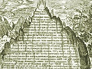

  
[Intangible Textual Heritage](../../index)  [Gnosticism and
Hermetica](../index)  [Index](index)  [Previous](th336)  [Next](th338) 

------------------------------------------------------------------------

[Buy this Book at
Amazon.com](https://www.amazon.com/exec/obidos/ASIN/0766126145/internetsacredte)

------------------------------------------------------------------------

  
*Thrice-Greatest Hermes, Vol. 3*, by G.R.S. Mead, \[1906\], at
Intangible Textual Heritage

------------------------------------------------------------------------

p. 231

#### VII.

### LACTANTIUS [1](#fn_534)

i. *Divinæ Institutiones*, i. 6, 1; Brandt, p. 18;
Fritzsche, i. 13. [2](#fn_535)

##### THOYTH-HERMES AND HIS BOOKS ON THE GNOSIS

Let us now pass to divine testimonies;
but, first of all, I will bring into court testimony which is like
divine \[witness\], both on account of its exceeding great age, and
because he whom I shall name was carried back again from men unto the
gods.

In Cicero, [3](#fn_536) Caius Cotta, [4](#fn_537) the Pontifex, arguing against the Stoics
about faiths and the diversity of opinions which obtain concerning the
gods, in order that, as was the way of the Academics, [5](#fn_538) he might bring all things into doubt,
declares that there were five Hermeses; and after enumerating four of
them in succession, \[he adds\] that the fifth was he by whom

p. 232

\[paragraph continues\] Argus was
slain, [1](#fn_539) and for that cause he fled
into Egypt, and initiated the Egyptians into laws and letters.

The Egyptians call him Thoyth, and from him the first month of their
year (that is, September) has received its name. He also founded a city
which even unto this day is called Hermopolis. The people of
Phenëus, [2](#fn_540) indeed, worship him as a
god; but, although

p. 233

he was \[really\] a man, still he was of such high antiquity, and so
deeply versed in every kind of science, that his knowledge of \[so\]
many things and of the arts gained him the title of “Thrice-greatest.”

He wrote books, indeed many \[of them\], treating of the Gnosis [1](#fn_541) of things divine, in which he asserts
the greatness of the Highest and One and Only God, and calls Him by the
same names as we \[do\]—God and Father. [2](#fn_542) And \[yet\], so that no one should seek
after His name, he has declared that He cannot be named, in that He doth
not need to have a name, owing, indeed, unto the very \[nature of His\]
unity. [3](#fn_543) His words are these [4](#fn_544):

#### FRAGMENT II.

> But God \[is\] one; and He who’s one needs not a name, for He \[as
> one\] is The-beyond-all-names.

------------------------------------------------------------------------

##### THE HISTORICAL ORIGINS OF THE HERMETIC TRADITION

For Lactantius, then, Hermes was very ancient; moreover, he was one who
descended from heaven and had returned thither. When, however, Firmianus
attempts the historical origins of the Hermetic tradition, as was
invariably the case with the ancients, he can do nothing better than
refer us to a complex though

p. 234

interesting myth, and to a legend of it devised to flatter the
self-esteem of its Hellenic creators: A Greek god, whose cult, moreover,
was known to be intimately connected with an ancient mystery-tradition,
was the originator of the wisdom of Egypt. Of course; and so with all
nations who had any ancient learning—their special tradition was oldest
and best and originator of all others!

For the rest, Lactantius knows nothing historically of the tradition
which he esteemed so highly, and the mention of the Latinized name
Thoyth [1](#fn_545) and of Hermopolis [2](#fn_546) does but throw the paucity of his
knowledge into deeper relief. What Lactantius does know is a large
literature in Greek and its general tendency.

The sentence he quotes is not found textually in any of the extant
Trismegistic literature. [3](#fn_547)

ii. *Ibid.*, i. 11, 61; Brandt, p. 47; Fritzsche, i.
29, 30.

##### URANUS, CRONUS AND HERMES, ADEPTS OF THE PERFECT SCIENCE

And so it appears that he \[Cronus\] was not born from Heaven (which is
impossible), but from that man who was called Uranus; and that this is
so, Trismegistus bears witness, when, in stating that there have been
very few in whom the perfect science has been found,

p. 235

he mentioned in their number Uranus, Cronus and Hermes, his own
kinsfolk. [1](#fn_548)

iii. *Ibid.*, ii. 8, 48; Brandt, p. 138; Fritzsche,
i. 89.

##### DIVINE PROVIDENCE

For the World was made by Divine Providence, not to mention
Thrice-greatest, who preaches this. [2](#fn_549)

iv. *Ibid.*, ii. 8, 68; Brandt, p. 141; Fritzsche,
i. 91.

##### ON MORTAL AND IMMORTAL SIGHT

His \[God’s\] works are seen by the eyes; but how He made them, is not
seen even by the mind, “in that,” as Hermes says:

#### FRAGMENT III.

> Mortal cannot draw nigh [3](#fn_550) to the
> Immortal, nor temporal to the Eternal, nor the corruptible to That
> which knoweth no corruption. [4](#fn_551)

> And, therefore, hath the earthly animal not yet capacity to see
> celestial things, in that it is kept shut within the body as in a
> prison house, lest with freed sense, emancipate, it should see all.

p. 236

The first part of this citation (which Lactantius gives in Latin) is
identical in idea with a sentence in Frag. iv.—that favourite source of
quotation, which Stobæus, Ex. ii. (*Flor*. lxxx. \[lxxviii.\] 9),
excerpted from “The \[Sermon\] to Tat.” [1](#fn_552) It might, then, be thought that this was
simply a paraphrase of Lactantius’, or that he was quoting from memory,
and that the second sentence was not quotation but his own writing. But
the second sentence is so thoroughly Trismegistic that it has every
appearance of being genuine. [2](#fn_553)

v. *Ibid.*, ii. 10, 13; Brandt, p. 149; Fritzsche,
i. 96.

##### MAN MADE AFTER THE IMAGE OF GOD

But the making of the truly living man out of clay [3](#fn_554) is of God. And Hermes also hands on the
tradition of this fact,—for not only has he said that man was made by
God after the Image of God, [4](#fn_555) but
also he has attempted to explain with what skilfulness He has formed
every single member in the body of man, since there is not one of them
which is not admirably suited not only for what it has to do, but also
adapted for beauty. [5](#fn_556)

------------------------------------------------------------------------

Man made after the Image of God is one of the fundamental doctrines of
the Trismegistic tradition. For instance, *P. S. A.*, vii. 2: “The
\[man\] ‘essential,’ as say the Greeks, but which we call the ‘form of
the

p. 237

\[paragraph continues\] Divine
Similitude’”; and x. 3: “Giving the greatest thanks to God, His Image
reverencing,—not ignorant that he \[man\] is, too, God’s image, the
second \[one\]; for that there are two images of God—Cosmos and
man.” [1](#fn_557)

vi. *Ibid.*, ii. 12, 4; Brandt, p. 156; Fritzsche,
i. 100.

##### HERMES THE FIRST NATURAL PHILOSOPHER

Empedocles [2](#fn_558) . . . \[and
others\] . . . laid down four elements, fire, air, water, and
earth,—\[in this\] perchance following Trismegistus, who said that our
bodies were composed of these four elements by God.

“For that they have in them something of fire, something of air,
something of water, and something of earth,—and yet they are not fire
\[in itself\], nor air, nor water, nor earth.”

------------------------------------------------------------------------

All this about the elements is, of course, a commonplace of ancient
physics, and we may, therefore, dismiss the naïve speculation of
Lactantius, who evidently thought he had the very words of the first
inventor of the theory before him; for he renders into Latin word for
word the same text which Stobæus has preserved to us in an excerpt from
“The \[Sermons\] to Tat”—Ex. iii. I. [3](#fn_559)

vii. *Ibid.*, ii. 14, 5; Brandt, p. 163; Fritzsche,
i. 105.

##### THE DAIMON-CHIEF

Thus there are two classes of daimons,—the one celestial, and the other
terrestrial. The latter are impure spirits, the authors of the evils
that are done, [4](#fn_560)

p. 238

of whom the same Diabolus is chief. Whence Trismegistus calls him the
“Daimon-chief.” [1](#fn_561)

viii. *Ibid.*, ii. 15, 6; Brandt, p. 166; Fritzsche,
i. 106.

##### DEVOTION IS GOD-GNOSIS

In fine, Hermes asserts that those who have known God, not only are safe
from the attacks of evil daimons, but also that they are not held even
by Fate. [2](#fn_562) He says:

#### FRAGMENT IV.

> The one means of protection is piety. For neither doth an evil daimon
> nor doth Fate rule o’er the pious man.  id="fr_563">[3](#fn_563) For God doth save the pious \[man\]
> from every ill. The one and only good found in mankind is piety.

And what piety means, he witnesses in another place, saying:

“Devotion is God-Gnosis.” [4](#fn_564)

Asclepius, his Hearer, has also explained the same idea at greater
length in that “Perfect Sermon” which he wrote to the King.

Both, then, assert that the daimons are the enemies and harriers of men,
and for this cause Trismegistus

p. 239

calls them “evil ‘angels’,” [1](#fn_565)—so far
was he from being ignorant that from celestial beings they had become
corrupted, and so earthly.

------------------------------------------------------------------------

This passage is given in Greek, and is quoted, but with numerous
glosses, also by Cyril (*Contra Julianum*, iv. 130); it is also
practically the same as the sentence in *P. S. A.*, xxix.: “The
righteous man finds his defence in serving God and deepest piety. For
God doth guard such men from every ill.”

Now we know that Lactantius had the Greek of this “Perfect Sermon”
before him, and we know that our Latin translation is highly rhetorical
and paraphrastic.

The only difficulty is that Lactantius’ quotation ends with the
sentence: “The one and only good found in mankind is piety”; and this
does not appear in the Latin translation of *P. S. A*. On the other
hand, Firmianus immediately refers by name to a Perfect Sermon, which,
however, he says was written by Asclepius, and addressed to the King.
Our Fragment is, therefore, probably from the lost ending of *C. H*.,
xvi. (see Commentary on the title).

ix. *Ibid.*, iv. 6, 4; Brandt, p. 286; Fritzsche, i.
178.

##### THE COSMIC SON OF GOD

Hermes, in that book which is entitled the “Perfect Sermon,” uses these
words:

#### FRAGMENT V.

> The Lord and Master of all things (whom ’tis our custom to call God),
> when He had made the

p. 240

> second God, the Visible and Sensible,  id="fr_566">[1](#fn_566)—I call Him sensible, not that He hath
> sensation in Himself (for as to this, whether or no He hath Himself
> sensation, we will some other time enquire), but that He is object of
> senses and of mind,—when, then, He’d made Him First, and One and
> Only, [2](#fn_567) He seemed to Him most
> fair, and filled quite full of all things good. At Him he marvelled,
> and loved Him altogether as His Son.  id="fr_568">[3](#fn_568)

------------------------------------------------------------------------

Lactantius here quotes from the lost Greek original of “The Perfect
Sermon,” viii. 1. We have thus a means of controlling the old Latin
translation which has come down to us.

It is, by comparison, very free and often rhetorical; inserting phrases
and even changing the original, as, for instance, when in the last
clause it says: “He fell in love with him as being part of His
Divinity.”

It is, however, possible that the translator may have had a different
text before him, for there is reason to believe that there were several
recensions of the *P. S. A*. [4](#fn_569)

x. *Ibid.*, iv. 6, 9; Brandt, p. 291; Fritzsche, i.
179.

##### THE DEMIURGE OF GOD

(Speaking of the Son of God and identifying Him with the pre-existent
Wisdom spoken of in Proverbs viii. 22, Lactantius adds:)

p. 241

Wherefore also Trismegistus has called Him the “Demiurge of God.” [1](#fn_570)

xi. *Ibid.*, iv. 7, 3; Brandt, p. 292; Fritzsche, i.
179.

##### THE NAME OF GOD

Even then \[when the world shall be consummated\], [2](#fn_571) it \[God’s Name\] will not be able to be
uttered by the mouth of man, as Hermes teaches, saying:

#### FRAGMENT VI.

> But the Cause of this Cause is the Divine and the Ingenerable Good’s
> Good-will, which [3](#fn_572) first brought
> forth the God whose Name cannot be spoken by the mouth of man.  id="fr_573">[4](#fn_573)

xii. *Ibid.*, iv. 7, 3; Brandt, p. 293; Fritzsche,
i. 179, 180.

##### THE HOLY WORD ABOUT THE LORD OF ALL.

And a little after \[he says\] to his son:

#### FRAGMENT VII.

> For that there is, \[my\] son, a Word \[*Logos*\] of wisdom, that no
> tongue can tell,—a Holy [5](#fn_574)

p. 242

> \[paragraph continues\] \[Word\] about
> the only Lord of all, the God before all thought,—whom to declare
> transcends all human power. [1](#fn_575)

xiii. *Ibid.*, iv. 8, 5; Brandt, p. 296; Fritzsche,
i. 181.

##### HIS OWN FATHER AND OWN MOTHER

But Hermes also was of the same opinion when he says:

“His own father and His own mother.” [2](#fn_576)

xiv. *Ibid.*, iv. 9, 3; Brandt, p. 300; Fritzsche,
i. 182, 183.

##### THE POWER AND GREATNESS OF THE WORD

Trismegistus, who has tracked out, I know not how, almost all truth, has
often described the power and greatness of the Word (*Logos*), as the
above quotation [3](#fn_577) from him shows, in
which he confesses the Word to be Ineffable and Holy, and in that its
telling forth transcends the power of man.

xv. *Ibid.*, iv. 13, 2; Brandt, p. 316; Fritzsche,
i. 190.

##### THE FATHERLESS AND MOTHERLESS

For God, the Father, and the Source, and Principle of things, in that He
hath no parents, is very truly called by Trismegistus “father-less” and
“mother-less” [4](#fn_578) in that He is
brought forth from none. [5](#fn_579)

p. 243

xvi. *Ibid.*, v. 14, 11; Brandt, p. 446; Fritzsche,
i. 256.

##### PIETY THE GNOSIS OF GOD

But “piety is nothing else than Gnosis of God,” [1](#fn_580) as Trismegistus has most truly laid
down, as we have said in another place. [2](#fn_581)

xvii. *Ibid.*, vi. 25, 10; Brandt, p. 579;
Fritzsche, ii. 60.

##### THE ONLY WAY TO WORSHIP GOD

Concerning justice, he \[Trismegistus, who in this (namely concerning
sacrifice) “agrees substantially and verbally with the prophets”\] has
thus spoken:

“Unto this Word (*Logos*), my son, thy adoration and thy homage pay.
There is one way alone to worship God,—\[it is\] not to be bad.”

------------------------------------------------------------------------

Here Lactantius translates literally from *C. H.*, xii. (xiii.) 23, a
sermon which now bears the title, “About the Common Mind to Tat.”
Hermes, however, in the context of the quoted passage, is not writing
“about justice,” and much less could the whole sermon be so entitled, if
indeed Lactantius intended us so to understand it. But see the
Commentary, *C. H.*, xii. (xiii.) 6, and Ex. xi., “On Justice.”

xviii. *Ibid.*, v. 25, 11; Brandt, p. 579;
Fritzsche, ii. 60.

##### THE WORTHIEST SACRIFICE TO GOD

Also in that “Perfect Sermon,” when he heard Asclepius enquiring of his
son, [3](#fn_582) whether it would be pleasing
to his [4](#fn_583) father, that incense and
other perfumes

p. 244

should be offered in their holy rite to God, \[Hermes\] exclaimed:

#### FRAGMENT VIII.

> Nay, nay; speak more propitiously, O \[my\] Asclepius! For very great
> impiety is it to let come in the mind any such thought about that One
> and Only Good.

> These things, and things like these, are not appropriate to Him. For
> He is full of all things that exist and least of all stands He in need
> \[of aught\].

> But let us worship pouring forth our thanks. The \[worthiest\]
> sacrifice to Him is blessing, \[and blessing\] only.

------------------------------------------------------------------------

With this compare the passage in *P. S. A.*, xli. 2 (p. 61, 16, Goldb.).
Here again we have the means of controlling the old Latin translator,
but not with such exactitude as before, for Lactantius has also turned
the Greek text into Latin. But not only from the other specimens of
Lactantius’ Hermes translations, but also from his present close
reproduction of the ordinary wording of the Trismegistic treatises, we
may be further confident that the Old Latin translation is free,
paraphrastic, and rhetorical, as we have already remarked.

xix. *Ibid.*, vii. 4, 3; Brandt, p. 593; Fritzsche,
ii. 69.

##### MAN MADE IN THE IMAGE OF GOD

But Hermes was not ignorant that man was made by God and in the Image of
God. [1](#fn_584)

p. 245

xx. *Ibid.*, vii. 9, 11; Brandt, p. 612; Fritzsche,
ii. 82.

##### CONTEMPLATION

(Speaking of man being the only animal that has his body upright, and
face raised to heaven, looking towards his Maker, Lactantius says:)

And this “looking” Hermes has most rightly named contemplation. [1](#fn_585)

xxi. *Ibid.*, vii. 13, 3; Brandt, p. 624 Fritzsche,
ii. 90.

##### THE DUAL NATURE OF MAN

Hermes, in describing the nature of man, in order that he might teach
how he was made by God, brings forward the following:

#### FRAGMENT IX.

> From the two natures, the deathless and mortal, He made one
> nature,—that of man,—one and the self-same thing; and having made the
> self-same \[man\] both somehow deathless and somehow mortal, He
> brought him forth, and set him up betwixt  id="fr_586">[2](#fn_586) the godlike and immortal

p. 246

> nature and the mortal, that seeing all he might wonder at all.

------------------------------------------------------------------------

##### WONDER THE BEGINNING OF PHILOSOPHY

This idea of “wondering” was, doubtless, a commonplace in Hellenistic
philosophical circles and looked back to the Platonic saying: “There is
no other beginning of Philosophy than wondering.” Compare also one of
the newest found “Logoi of Jesus,” from the rubbish heaps of
Oxyrhynchus, which runs: “Let not him that seeketh . . . cease until he
find, and when he finds he shall wonder; wondering he shall reign, and
reigning he shall rest.” [1](#fn_587)

Wondering is the beginning of Gnosis; this makes a man king of himself,
and thus master of gods and men, and so he has peace. The translation of
βασιλεύσει by Grenfell and Hunt as “reach the kingdom” seems to me to
have no justification.

Lactantius here quotes the Greek text of *P. S. A.*, viii. 3, and so
once again we can control the Old Latin version. The Church Father is
plainly the more reliable, reproducing as he does familiar Hermetic
phrasing and style; and we thus again have an insight into the methods
of our rhetorical, truncated, and interpolated Latin Version.

xxii. *Ibid.*, vii. 18, 3; Brandt, p. 640;
Fritzsche, ii. 99.

##### THE COSMIC RESTORATION

And Hermes states this \[the destruction of the world\] [2](#fn_588) plainly. For in that book which bears
the title

p. 247

of “The Perfect Sermon,” after an enumeration of the evils of which we
have spoken, he adds:

#### FRAGMENT X.

> Now when these things shall be, as I have said, Asclepius, then will
> \[our\] Lord and Sire, the God and Maker of the First and the One
> God, [1](#fn_589) look down on what is done,
> and, making firm His Will,—that is the Good,—against disorder,
> recalling error, and purging out the bad, either by washing it away
> with water-flood, or burning it away with swiftest fire, or forcibly
> expelling it with war and famine,—He \[then\] will bring again His
> Cosmos to its former state, and so achieve its Restoration.  id="fr_590">[2](#fn_590)

xxiii. *Ibid.*, Epitome, 4, 4; Brandt, p. 679;
Fritzsche, ii. 117.

##### OF HERMES AND HIS DOCTRINE CONCERNING GOD

Hermes,—who, on account of his virtue and knowledge of many arts, gained
the title of Thrice-greatest, who also in the antiquity of his doctrine
preceded the philosophers, and who is worshipped as god among the
Egyptians,—declaring the greatness of the One and Only God with unending
praises, calls Him God and Father, \[and says\] He has no name, for that
He has no need for a distinctive name, [3](#fn_591) inasmuch as He alone is,

p. 248

nor has He any parents, in that He is both from Himself and by
Himself. [1](#fn_592)

In writing to his son \[Tat\] he begins as follows:

“To comprehend God is difficult, to speak \[of Him\] impossible, even
for one who can comprehend; for the Perfect cannot be comprehended by
the imperfect, nor the Invisible by the visible.” [2](#fn_593)

xxiv. *Ibid.*, Ep., 14; Brandt, p. 685; Fritzsche,
ii. 121.

##### A REPETITION

(Lactantius repeats in almost identical words what he has written in i.
11.)

xxv. *Ibid.*, Ep., 37 (42), 2; Brandt, p. 712;
Fritzsche, ii. 140.

##### PLATO AS PROPHET FOLLOWS TRISMEGISTUS

By means of him \[the Logos\] as Demiurge, [3](#fn_594) as Hermes says, He \[God the Father\]
hath devised the beautiful and wondrous creation of the world. . . .

Finally Plato has spoken concerning the first and second God, not
plainly as a philosopher, but as a prophet, perchance in this following
Trismegistus, whose words I have added in translation from the Greek.

------------------------------------------------------------------------

(Lactantius then translates verbally from the Greek text he has quoted
in iv. 6, 4, omitting, however, the last clause and the parenthesis in
the middle.)

------------------------------------------------------------------------

### Footnotes

[231:1](th337.htm#fr_534) A pupil of Arnobius;
flourished at the beginning of the fourth century.

[231:2](th337.htm#fr_535) Brandt (S.), L.
*Caeli Firmiani Lactanti Opera Omnia*,—*Pars I., Divinae Institutiones
et Epitome* (Vienna, 1890). Pars II., to be edited by G. Laubmann, has
not yet appeared. Fritzsche (O. F.), *Div. Institt*. (Leipzig, 1842), 2
vols.

[231:3](th337.htm#fr_536) *De Natura Deorum*,
iii. 22, 56.

[231:4](th337.htm#fr_537) *C. Aurelius Cotta*,
124-76 (?) B.C.

[231:5](th337.htm#fr_538) Cicero makes Cotta
maintain the cause of this school both here and in the *De Oratore*.

[232:1](th337.htm#fr_539) Argos, according to
the many ancient myths concerning him, was all-seeing (πανόπτης),
possessed of innumerable eyes, or, in one variant, of an eye at the top
of his head. Like Hercules, he was of superhuman strength, and many
similar exploits of his powers are recorded. In the Io-legends, Hera
made Argos guardian of the cow into which the favourite of Zeus had been
metamorphosed. Zeus accordingly sent Hermes to carry off his beloved.
Hermes is said to have lulled Argos to sleep by means of his syrinx, or
pipe of seven reeds, or by his caduceus, and then to have stoned him or
cut off his head. See Reseller’s *Ausführ. Lex. d. griech. u. röm.
Myth*., *s.v*. “Argos.” It is to be noticed that instead of Argum, four
MSS. read *argentum*, which is curious as showing a Medieval Alchemical
influence. See n. 4 to *Ciceronis Opera Philosophica* (Delph. et Var.
Clas.), vol. ii. (London, 1830).

[232:2](th337.htm#fr_540) *Pheneatæ*,—Phenëus
was a town in Arcadia, that country of ancient mysteries. (It is
remarkable that Hermas is taken by the “Shepherd” in spirit to a
mountain in Arcadia. See *Shepherd of Hermas*, Sim. ix. 1.) Cicero
begins his description of the fifth Hermes with this statement, and
Lactantius has thus awkwardly misplaced it. Pausanias (viii. 14, 6)
tells us that Phenëus itself was considered as a very ancient city, and
that its chief cult was that of Hermes. This cult of Hermes, moreover,
was blended with an ancient mystery-tradition, for Pausanias (*ibid*.,
15, 1) tells us that:

“The Pheneatians have also a sanctuary of Demeter sumamed Eleusinian,
and they celebrate mysteries in her honour, alleging that rites
identical with those performed at Eleusis were instituted in their
land. . . . Beside the sanctuary of the Eleusinian goddess is what is
called the Petroma, two great stones fitted to each other. Every second
year, when they are celebrating what they call the Greater Mysteries,
they open these stones, and taking out of them certain writings which
bear on the mysteries, they read them in the hearing of the initiated,
and put them back in their place that same night. I know, too, that on
the weightiest matters most of the Pheneatians swear by the Petroma.”
Frazer’s Translation, i. 393 (London, 1898).

[233:1](th337.htm#fr_541) *Cognitionem.*

[233:2](th337.htm#fr_542) *Cf.* *P. S. A.*, xx.
(p. 42, 16, Goldb.) *et pass*.; *C. H*., v. (vi.) 2.

[233:3](th337.htm#fr_543) Compare with
*Epitome* 4 below.

[233:4](th337.htm#fr_544) Lactantius here
quotes in Greek. *Cf.* *P. S. A.*, xx. (p. 42, 27-43, 3, Goldb.).

[234:1](th337.htm#fr_545) Was, however, this
the spelling found in Cicero, for Firmianus takes it from the text of
Tully? It is a pity we have no critical apparatus of the text of
Lactantius, for the MSS. of Cicero present us with the following
extraordinary list of variants: Then, Ten, Their, Thoyt, Theyt, Theyn,
Thetum, Them, Thernum, Theutatem, Theut, Thoyth, Thoth. See n. 5 to the
text of Cicero, cited above. *Cf*. R. 117, n. 2.

[234:2](th337.htm#fr_546) Which he probably
took from *P. S. A.*, xxxvii. 4: “Whose home is in a place called after
him.”

[234:3](th337.htm#fr_547) Chambers (p. 41, n.
1), in referring it to *C. H.*, v. (vi.) 10, is mistaken.

[235:1](th337.htm#fr_548) *Cf.* *C. H*., x.
(xi.) 5; *P. S. A.*, xxxvii. 1. Also Lact., *Epit*., 14. In my
commentary on the first passage I have shown that Lactantius is probably
here referring to a lost Hermetic treatise.

[235:2](th337.htm#fr_549) *Cf.* Fragg. *ap*.
Stob., *Ecl.*, i. 5, 16, 20. It is to be noticed from the context that
Lactantius places Trismegistus in a class apart together with the
Sibylline Oracles and Prophets, and then proceeds to speak of the
philosophers, Pythagoreans, Platonists, etc. He also repeats the same
triple combination in iv. 6.

[235:3](th337.htm#fr_550) *Propinquare*. L.
glosses this as meaning “come close to and follow with the
intelligence.”

[235:4](th337.htm#fr_551) *Cf.* Frag. *ap*.
Cyril, *C. I*., i. (vol. vi., p. 31 C).

[236:1](th337.htm#fr_552) Compare also Lact.,
*Epit*., 4.

[236:2](th337.htm#fr_553) It is interesting to
note, in the history of the text-tradition, that the received reading
σημήναι (“be expressed”) in Stobæus stands in one MS. (A) συμβῆναι,
which seems to be a transference from the original of L.’s
*propinquare*.

[236:3](th337.htm#fr_554) *Limo*,—slime or mud.

[236:4](th337.htm#fr_555) Lact. repeats this in
vii. 4. *Cf.* *C. H.*, i. 12.

[236:5](th337.htm#fr_556) *Cf.* *C. H.*, v.
(vi.) 6.

[237:1](th337.htm#fr_557) *Cf.* also
Hermes-Prayer, iii. 11. R. 21, n. 11.

[237:2](th337.htm#fr_558) Date *c.* 494-434
B.C.

[237:3](th337.htm#fr_559) See also Ex. vii. 3;
*C. H.*, ii. (iii.) 11.

[237:4](th337.htm#fr_560) *Cf.* *C. H.*, ix.
(x.) 3; *C. H.*, xvi. 10.

[238:1](th337.htm#fr_561) δαιμονιάρχην. This
term is not found in the extant texts; “Diabolus” is, of course, not to
be referred to Hermes, but to the disquisition of Lactantius at the
beginning of 14.

[238:2](th337.htm#fr_562) *Cf.* Cyril, *C. J*.,
iv. (vol. vi. 130 E, Aub.).

[238:3](th337.htm#fr_563) For the same idea,
see *C. H.*, xii. (xiii.) 9.

[238:4](th337.htm#fr_564) ἡ γὰρ εὐσέβεια γνῶσις
ἐστι τοῦ θεοῦ,—which Lactantius in another passage (v. 14) renders into
Latin as “*Pietas autem nihil aliud est quam dei notio*,—is given in *C.
H.*, ix. (x.) 4 as: εὐσέβεια δέ ἐστι θεοῦ γνῶσις (where Parthey notes no
various readings in MSS.).

[239:1](th337.htm#fr_565) ἀγγέλους
πονηροὺς,—these words do not occur in our extant Greek texts; but the
Lat. trans, of *P. S. A.*, xxv. 4, preserves “*nocentes angeli*.”

[240:1](th337.htm#fr_566) *Sc.* the Logos as
Cosmos.

[240:2](th337.htm#fr_567) *Cf.* Frag. x.

[240:3](th337.htm#fr_568) For last clause, see
*C. H*., i. 12. *Cf.* also Ps. Augustin., *C. Quinque Hæreses*, vol.
viii., Append, p. 3 E, Maur.

[240:4](th337.htm#fr_569) Lactantius himself
also gives a partial translation of this passage in his *Epitome*, 42
(Fritz., ii. 140).

[241:1](th337.htm#fr_570) δημιουργὸν τοῦ . The
exact words do not occur in our extant texts, but the idea is a
commonplace of the Trismegistic doctrine; see especially *P. S. A.*,
xxvi.: “The Demiurgus of the first and the one God,” and Lact., *ibid*.,
vii. 18, 4: “God of first might, and Guider of the one God.” See also
*C. H.*, i. 10, 11, xvi. 18; Cyril, *C. Jul.*, i. 33 (Frag. xiii.), and
vi. 6 (Frag. xxi.); and Exx. iii. 6, iv. 2. *Cf.* also Ep. 14 below.

[241:2](th337.htm#fr_571) *Cf.* vii. 18 below.

[241:3](th337.htm#fr_572) *Sc.* will
(βούλησις). *Cf.* especially *P. S. A.*, Commentary.

[241:4](th337.htm#fr_573) This is plainly from
the same source as the following Fragment.

[241:5](th337.htm#fr_574) *Cf.* *C. H.*, i. 5;
and Lact. and Cyril, *passim* (*e.g*. Fragg. xxi., xxii.).

[242:1](th337.htm#fr_575) This passage and the
preceding, then, are evidently taken from “The Sermons to Tat.”
Lactantius quotes in Greek, and again refers to the passage in iv. 9.

[242:2](th337.htm#fr_576) αὐτοπάτορα καὶ
αὐτομήτορα—not found in the extant texts; but for the idea see *C. H*.,
i. 9. See also iv. 13, and Ep. 4 below.

[242:3](th337.htm#fr_577) *Ibid*., iv. 7.

[242:4](th337.htm#fr_578) ἀπάτωρ *et* ἀμήτωρ.
*Cf.* Lact., *D. I*., i. 7, 2 (Brandt).

[242:5](th337.htm#fr_579) Terms not found in
our extant texts; probably taken from the same source as the terms in
iv. 8 above.

[243:1](th337.htm#fr_580) *Notio dei*.

[243:2](th337.htm#fr_581) Namely ii. 15, 6;
*q.v*. for comment.

[243:3](th337.htm#fr_582) That is, Hermes’ son
Tat.

[243:4](th337.htm#fr_583) That is, Tat’s
father, Hermes.

[244:1](th337.htm#fr_584) See above, *ibid*.,
ii. 10, 13, Comment.

[245:1](th337.htm#fr_585) θεοπτίαν = θεωρίαν.
See, for instance, *C. H*., xiv. (xv.) 1, and *K. K*., 1, 38, 51; also
Frag. *ap.* Stob., Flar., xi. 23; and also compare *C. H.*, iv. (v.) 2:
“For contemplator (θεατής) of God’s works did man become.” It is also of
interest to note that Justin Martyr (*Dial. c. Tryph*., 218 c)
enumerates the Theoretics or Contemplatives, among the most famous sects
of Philosophers, naming them in the following order: Platonics, Stoics,
Peripatetics, Theoretics, Pythagorics.

[245:2](th337.htm#fr_586) Compare the “setting
up betwixt” (ἐν μέσῳ . . . ἵδρυσεν) with the “setting up” of the mind
“in the midst” of *C. H*., iv. (v.) 3.

[246:1](th337.htm#fr_587) Grenfell (B. P.) and
Hunt (A. S.), *New Sayings of Jesus*, p. 13 (London, 1904).

[246:2](th337.htm#fr_588) *Cf.* iv. 7 above.

[247:1](th337.htm#fr_589) *Cf.* Frag. v.

[247:2](th337.htm#fr_590) Lactantius quotes the
original Greek of *P. S. A.*, xxvi. 1 (p. 48, 24, Goldb.), so that we
can thus once more remark the liberties which the Old Latin translation
has taken with the text.

[247:3](th337.htm#fr_591) *Cf.* Frag. ii.

[248:1](th337.htm#fr_592) See i. 6 and iv. 8
above.

[248:2](th337.htm#fr_593) The first clause is a
verbatim translation of the text of the Stobæan Extract ii., while the
second is a paraphrase even of L.’s own version from the Greek (see ii.
8 above). We learn, however, the new scrap of information that the
quotation is from the beginning of the sermon.

[248:3](th337.htm#fr_594) The reference to the
“Demiurge” looks back to iv. 6, 9.

------------------------------------------------------------------------

[Next: VIII. Augustine](th338)
