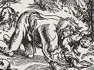

  
[Intangible Textual Heritage](../../index)  [Gothic](../index) 
[Index](index)  [Previous](bow16) 

------------------------------------------------------------------------

[Buy this Book at
Amazon.com](https://www.amazon.com/exec/obidos/ASIN/B002B54F2G/internetsacredte)

------------------------------------------------------------------------

  
*The Book of Were-Wolves*, by Sabine Baring-Gould, \[1865\], at
Intangible Textual Heritage

------------------------------------------------------------------------

p. 261

# CHAPTER XVI.

### A SERMON ON WERE -WOLVES.

The discourses of Dr. Johann Geiler--The Sermon--Remarks.

THE following curious specimen of a late mediæval sermon is taken from
the old German edition of the discourses of Dr. Johann Geiler von
Keysersperg, a famous preacher in Strasbourg. The volume is entitled:
"*Die Emeis*. Dis ist das Büch von der Omeissen, und durch Herr der
Künnig ich diente gern. Und sagt von Eigenschafft der Omeissen, und gibt
underweisung von der Unholden oder Hexen, und von Gespenst, der Geist,
und von dem Wütenden Heer Wunderbarlich."

This strange series of sermons was preached at Strasbourg in the year
1508, and was taken down and written out by a barefooted friar, Johann
Pauli, and by him published in 1517. The doctor died on Mid-Lent Sunday,
1510. There is a Latin edition of his sermons,

p. 262

but whether of the same series or not I cannot tell, as I have been
unable to obtain a sight of the volume. The German edition is
illustrated with bold and clever woodcuts. Among other, there are
representations of the Witches' Sabbath, the Wild Huntsman, and a
Werewolf attacking a Man.

The sermon was preached on the third Sunday in Lent. No text is given,
but there is a general reference to the gospel for the day. This is the
discourse:--\[1\]

"What shall we say about were-wolves? for there are were-wolves which
run about the villages devouring men and children. As men say about
them, they run about full gallop, injuring men, and are called
ber-wölff, or wer-wölff. Do you ask me if I know aught about them? I
answer, Yes. They are apparently wolves which cat men and children, and
that happens on seven accounts:--

|                  |             |
|------------------|-------------|
| 1\. Esuriem      | Hunger.     |
| 2\. Rabiem       | Savageness. |
| 3\. Senectutem   | Old age.    |
| 4\. Experientiam | Experience. |
| 5\. Insaniem     | Madness.    |
| 6\. Diabolum     | The Devil.  |
| 7\. Deum         | God.        |

The first happens through hunger; when the wolves

\[1. Headed thus:--"Am drittë sontag à fastê, occuli, predigt dé doctor
vô dê Werwölffenn."\]

p. 263

find nothing to eat in the woods, they must come to people and eat men
when hunger drives them to it. You see well, when it is very cold, that
the stags come in search of food up to the villages, and the birds
actually into the dining-room in search of victuals.

"Under the second head, wolves eat children through their innate
savageness, because they are savage, and that is (propter locum coitum
ferum). Their savageness arises first from their condition. Wolves which
live in cold places are smaller on that account, and more savage than
other wolves. Secondly, their savageness depends on the season; they are
more savage about Candlemas than at any other time of the year, and men
must be more on their guard against them then than at other times. It is
a proverb, 'He who seeks a wolf at Candlemas, a peasant on Shrove
Tuesday, and a parson in Lent, is a man of pluck.' . . . Thirdly, their
savageness depends on their having young. When the wolves have young,
they are more savage than when they have not. You see it so in all
beasts. A wild duck, when it has young poults, you see what an uproar it
makes. A cat fights for its young kittens; the wolves do ditto.

"Under the third head, the wolves do injury on

p. 264

account of their age. When a wolf is old, it is weak and feeble in its
leas, so it can't ran fast enough to catch stags, and therefore it rends
a man, whom it can catch easier than a wild animal. It also tears
children and men easier than wild animals, because of its teeth, for its
teeth break off when it is very old; you see it well in old women: how
the last teeth wobble, and they have scarcely a tooth left in their
heads, and they open their mouths for men to feed them with mash and
stewed substances.

"Under the fourth head, the injury the were-wolves do arises from
experience. It is said that human flesh is far sweeter than other flesh;
so when a wolf has once tasted human flesh, he desires to taste it
again. So he acts like old topers, who, when they know the best wine,
will not be put off with inferior quality.

"Under the fifth head, the injury arises from ignorance. A dog when it
is mad is also inconsiderate, and it bites any man; it does not
recognize its own lord: and what is a wolf but a wild dog which is mad
and inconsiderate, so that it regards no man.

"Under the sixth head, the injury comes of the Devil, who transforms
himself, and takes on him the form of a wolf So writes Vincentius in his
*Speculum Historiale*. p. 265 And he has
taken it from Valerius Maximus in the Punic war. When the Romans fought
against the men of Africa, when the captain lay asleep, there came a
wolf and drew his sword, and carried it off. That was the Devil in a,
wolf's form. The like writes William of Paris,--that a wolf will kill
and devour children, and do the greatest mischief. There was a man who
had the phantasy that he himself was a wolf. And afterwards he was found
lying in the wood, and he was dead out of sheer hunger.

"Under the seventh head, the injury comes of God's ordinance. For God
will sometimes punish certain lands and villages with wolves. So we read
of Elisha,--that when Elisha wanted to go up a mountain out of Jericho,
some naughty boys made a mock of him and said, 'O bald head, step up! O
glossy pate, step up!' What happened? He cursed them. Then came two
bears out of the desert and tore about forty-two of the children. That
was God's ordinance. The like we read of a prophet who would set at
naught the commands he had received of God, for he was persuaded to eat
bread at the house of another. As he went home he rode upon his ass.
Then came a lion which slew him and left the ass alone. That was God's
ordinance. p. 266 Therefore must man turn to
God when He brings wild beasts to do him a mischief: which same brutes
may He not bring now or evermore. Amen."

It will be seen from this extraordinary sermon that Dr. Johann Geiler
von Keysersperg did not regard werewolves in any other light than
natural wolves filled with a lust for human flesh; and he puts aside
altogether the view that they are men in a state of metamorphosis.
However, he alludes to this superstition in his sermon on wild-men of
the woods, but translates his lycanthropists to Spain.

THE END.
