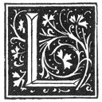

  
[Intangible Textual Heritage](../../index)  [Grimoires](../index) 
[Esoteric](../../eso/index)  [Index](index)  [Previous](abr006) 
[Next](abr008) 

------------------------------------------------------------------------

p. 4

### THE FIRST CHAPTER.

|                    |
|--------------------|
|  |

AMECH, if thou wishest to know the reason wherefore I give unto thee
this Book, it is that if thou considerest thy condition, which is that
of being a last-born Son, thou shalt know wherefore it appertaineth unto
thee; and I should commit a great error should I deprive thee of that
grace which God hath given unto me with so much profusion and
liberality. I will then make every effort to avoid and to fly prolixity
of words in this First Book; having alone in view the ancientness of
this Venerable and Indubitable Science. And seeing that TRUTH hath no
need of enlightenment and of exposition, she being simple and right; be
thou only obedient unto all that I shall say unto thee, contenting
thyself with the simplicity thereof, be thou good and upright, [1](#fn_16) and thou shalt acquire more wealth than I
could know how to promise unto thee. May the Only and Most Holy God
grant unto all, the grace necessary to be able to comprehend and
penetrate the high Mysteries of the Qabalah and of the Law; but they
should content themselves with that which the Lord accordeth unto them;
seeing that if against His Divine Will they wish to fly yet higher, even
as did Lucifer, this will but procure for them a most shameful and fatal
fall. Wherefore it is necessary to be extremely prudent, and to consider
the INTENTION which I have had in describing this method of operation;
because in consideration of thy great youth I attempt no other thing but
to excite thee unto the research of this Sacred Magic. But the manner of
acquiring the same will come later, in all its perfection, and in its
proper time; for it will be taught thee by better Masters than I, that
is to say, by those same Holy Angels of God. No man

p. 5

is born into the World a Master, and for that reason are we obliged to
learn. He who applieth himself thereunto, and studieth, learneth; and a
man can have no more shameful and evil title [1](#fn_17) than that of being an Ignorant person.

------------------------------------------------------------------------

### Footnotes

[4:1](abr007.htm#fr_16) *Réel*.

[5:1](abr007.htm#fr_17) This is identical with
the Oriental doctrine that Ignorance is in itself evil and unhappiness.

------------------------------------------------------------------------

[Next: The Second Chapter](abr008)
