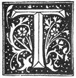

  
[Intangible Textual Heritage](../../index)  [Grimoires](../index) 
[Esoteric](../../eso/index)  [Index](index)  [Previous](abr014) 
[Next](abr016) 

------------------------------------------------------------------------

### THE NINTH CHAPTER.

|                    |
|--------------------|
|  |

HE infamous BELIAL hath no other desire than that of obtaining the power
of hiding and obscuring the True Divine Wisdom, so that he may have more
means of blinding simple men and of leading them by the nose; so that
they may always remain in their simplicity, and in their error, and that
they may not discover the Way which leadeth unto the True Wisdom; seeing
that otherwise it is certain that both he and his Kingdom would remain
bound and that he would lose the title which he giveth himself of
"Prince of this World," having become the slave of man. This is
wherefore he seeketh to annul and destroy utterly this Sacred Wisdom. I,
however, do pray all and singular to be upon their guard, and in no way
to despise the Way and Wisdom of the Lord, nor to allow themselves to be
seduced by the DEMON and his adherents; for he is a liar and will be so

p. 36

eternally; and may the Truth for ever flourish; for in following out and
obeying with fidelity that which I have written in these Three Books,
not only shall we arrive at the desired end, but we shall sensibly know
and feel the Grace of the Lord, and the actual assistance of His Holy
Angels, who take an incredible pleasure in seeing that they are obeyed
and that you intend to follow out the Commandments of God, and that
their instructions are observed. Such then are the particular points
upon which I insist.

This Wisdom hath its foundation in the High and Holy Qabalah [1](#fn_67) which is not granted unto any other than
unto the First-Born, even as God hath ordained, and as it was observed
by our predecessors. Thence arose the difference, and the truck [2](#fn_68) or exchange between JACOB and ESAU; the
primogeniture being the Qabalah, which is much nobler and greater than
the Sacred Magic. [3](#fn_69) And by the Qabalah
we can arrive at the Sacred Magic, but by the latter we cannot have the
Qabalah. Unto the Child of a Servant, or of an Adulterer, the Qabalah is
not granted, but only unto a Legitimate Child; as occurred in the case
of ISAAC and ISHMAEL; but the Sacred Wisdom through the Mercy of God all
can acquire, provided that they walk in the right Path; and each one
should content himself with the Gift and Grace of the Lord. And this
must not be done out of curiosity, and with extravagant and ridiculous
scruples, wishing to know and understand more than is right; seeing that
temerity is certainly punished by God, Who then permitteth him who is
presumptuous not only to be turned aside out of

p. 37

the True Way by the Second Causes, [1](#fn_70)
but also the DEMON hath power over him, and he ruineth and exterminateth
him in such a manner, that we can only say that he himself is the sole
cause of his own ruin and misery. It is certain that the OLD SERPENT
will attempt to contaminate the present Book with his venom, and even to
destroy and lose it utterly, but O LAMECH! as a faithful father I
entreat thee by the True God Who hath created thee and all things, and I
entreat every other person who by thy means shall receive this method of
operating, not to be induced or persuaded to have any other sentiment or
opinion, or to believe the contrary. Pray unto God and ask Him for His
assistance, and place all thy confidence in Him alone. And although thou
canst not have the understanding of the Qabalah, nevertheless the Holy
Guardian Angels at the end of the Six Moons or Months [2](#fn_71) will manifest unto thee that which is
sufficient for the possession of this Sacred Magic.

Wherefore all the Signs and Symbols given in the Third Book, are written
with Letters of the Fourth Hierarchy; [3](#fn_72) but the Mysterious Words wherein
consisteth the Secret [4](#fn_73) have their
origin in and are drawn from the Hebrew, Latin, Greek, Chaldean,
Persian, and Arabian languages by a singular Mystery and according unto
the Will of the Most Wise Architect and Fabricator of the Universe, Who
alone dominateth and governeth it by His All-Power; all the Monarchies
and Kingdoms of the World are submitted unto His Infinite Power, and
unto this Sacred Magic and Divine Wisdom.

------------------------------------------------------------------------

### Footnotes

[36:1](abr015.htm#fr_67) As I have pointed out
in my "Kabbalah Unveiled," I consider this a truer orthography than
"Cabala," or "Kabbalah".

[36:2](abr015.htm#fr_68) *Troque ou change*.

[36:3](abr015.htm#fr_69) That is to say the True
and Unwritten Qabalah, which is the Ancient Egyptian Magical Wisdom; and
not later Hebrew perversions thereof.

[37:1](abr015.htm#fr_70) That is to say the
Administrators of the First Cause, *i.e.* the various Divine Powers, or
Gods and Goddesses, who act more directly on matter.

[37:2](abr015.htm#fr_71) Abraham here alludes to
the period of preparation required from the Neophyte, as described
later.

[37:3](abr015.htm#fr_72) Regarding the
Hierarchies, see end of Third Book.

[37:4](abr015.htm#fr_73) Thus in the Indian
"Mantras" the force and mystery of the Words themselves is especially
insisted on.

------------------------------------------------------------------------

[Next: The Tenth Chapter](abr016)
