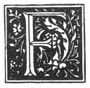

  
[Intangible Textual Heritage](../../index)  [Grimoires](../index) 
[Esoteric](../../eso/index)  [Index](index)  [Previous](abr073) 
[Next](abr075) 

------------------------------------------------------------------------

### THE FIFTEENTH CHAPTER.

|                    |
|--------------------|
|  |

OR the Spirits to bring us anything we may wish to eat or to drink, and
even all (kinds of food) that we can imagine.

\(1\) For them to bring us Bread.

\(2\) Meat.

\(3\) Wine of all kinds.

\(4\) Fish.

\(5\) Cheese.

\(1\)

|     |     |     |     |     |
|-----|-----|-----|-----|-----|
| I   | A   | I   | I   | N   |
| A   |     |     |     |     |
| I   |     |     |     |     |
| I   |     |     |     |     |
| N   |     |     |     |     |

\(2\)

|     |     |     |     |     |
|-----|-----|-----|-----|-----|
| B   | A   | S   | A   | R   |
| A   |     |     |     |     |
| S   |     |     |     |     |
| A   |     |     |     |     |
| R   |     |     |     | B   |

p. 202

\(3\)

|     |     |     |     |     |     |
|-----|-----|-----|-----|-----|-----|
| L   | E   | C   | H   | E   | M   |
| E   |     |     |     |     |     |
| C   | N   | O   | H   | A   | H   |
| H   |     |     |     |     |     |
| E   |     |     |     |     |     |
| M   | E   | C   | H   | E   | L   |

\(4\)

|     |     |     |     |     |
|-----|-----|-----|-----|-----|
| D   | A   | C   | A   | D   |
| A   | R   | A   | F   | A   |
| C   | A   | M   | A   | C   |
| A   | F   | A   | R   | A   |
| D   | A   | C   | A   | D   |

\(5\)

|     |     |     |     |     |     |     |     |
|-----|-----|-----|-----|-----|-----|-----|-----|
| L   | E   | B   | H   | I   | N   | A   | H   |
|     |     |     |     |     |     |     | A   |
|     |     |     |     |     |     |     | N   |
|     |     |     |     |     |     |     | I   |
|     |     |     |     |     |     |     | H   |
|     |     |     |     |     |     |     | B   |
| A   |     |     |     |     |     |     | E   |
| H   | A   |     |     |     |     |     | L   |

 

------------------------------------------------------------------------

[Next: Notes to Chapter XV](abr075)
