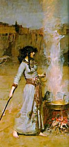

  
[Intangible Textual Heritage](../../index)  [Grimoires](../index) 
[Esoteric](../../eso/index) 

------------------------------------------------------------------------

<table width="75%">
<colgroup>
<col style="width: 50%" />
<col style="width: 50%" />
</colgroup>
<tbody>
<tr class="odd">
<td data-valign="CENTER" width="50%"></td>
<td data-valign="CENTER" width="50%"><h3 id="the-book-of-the-sacred-magic-of-abramelin-the-mage" data-align="CENTER">The Book of the Sacred Magic of Abramelin the Mage</h3>
<h3 id="translated-by-s.l.-macgregor-mathers" data-align="CENTER">Translated by S.L. MacGregor Mathers</h3>
<h3 id="section" data-align="CENTER">[1900]</h3></td>
</tr>
</tbody>
</table>

------------------------------------------------------------------------

|                                                                                                                           |
|---------------------------------------------------------------------------------------------------------------------------|
|  |

This remarkable grimoire was translated by S.L.M. Mathers from a 15th
century French mauscript. This text has had a huge influence on modern
ceremonial magic, and has been cited as a primary influence on Aleister
Crowley. Abraham of Würzburg, a cabalist and scholar of magic, describes
a quest for the secret teachings which culminated in Egypt, where he
encountered the magician Abramelin, who taught him his system in detail.
The procedure involves many months of purification, followed by the
invocation of good and evil spirits to accomplish some very worldly
goals, including acquisition of treasure and love, travel through the
air and under water, and raising armies out of thin air. It also tells
of raising the dead, transforming ones appearance, becoming invisible,
and starting storms. The key to this is a set of remarkable magic
squares, sigils consisting of mystical words which in most cases can be
read in several directions. Of course, these diagrams are said to have
no potency unless used in the appropriate ritual context by an initiate.
Mathers analyzed these words in an extensive set of notes and gives
possible derivations from Hebrew, Greek and other languages.

------------------------------------------------------------------------

[Title Page](abr000)  
[Table of Contents](abr001)  
[Introduction](abr002)  
[Appendix A: Hebrew and Chaldee Alphabet](abr003)  
[Appendix B. Employment of a Child-Clairvoyant by Cagliostro](abr004)  
[Appendix C. Examples of Other Methods of Angelic Evocation](abr005)  

### The First Book

[Prologue](abr006)  
[The First Chapter](abr007)  
[The Second Chapter](abr008)  
[The Third Chapter](abr009)  
[The Fourth Chapter](abr010)  
[The Fifth Chapter](abr011)  
[The Sixth Chapter](abr012)  
[The Seventh Chapter](abr013)  
[The Eighth Chapter](abr014)  
[The Ninth Chapter](abr015)  
[The Tenth Chapter](abr016)  
[The Eleventh Chapter](abr017)  
[The Twelfth Chapter](abr018)  

### The Second Book

[Prologue](abr019)  
[The First Chapter: What and How Many be the Forms of Veritable
Magic](abr020)  
[The Second Chapter. What We Should Consider Before Undertaking This
Operation](abr021)  
[The Third Chapter. Of the Age and Quality of the Person Who Wisheth to
Undertake This Operation](abr022)  
[The Fourth Chapter. That the Greater Number of Magical Books are False
and Vain](abr023)  
[The Fifth Chapter. That in This Operation it is not Necessary to Regard
the Time, Nor the Day, Nor the Hours](abr024)  
[The Sixth Chapter. Concerning the Planetary Hours and Other Errors of
the Astrologers](abr025)  
[The Seventh Chapter. Regarding What it is Necessary to Accomplish
During the First Two Moons...](abr026)  
[The Eighth Chapter. Concerning the Two Second Moons](abr027)  
[The Ninth Chapter. Concerning the Two Last Moons Which Must Be Thus
Commenced](abr028)  
[The Tenth Chapter. Concerning What Things a Man May Learn and Study
During These Two Moons](abr029)  
[The Eleventh Chapter. Concerning the Selection of the Place](abr030)  
[The Twelfth Chapter. How One Should Keep Oneself in Order to Carry Out
This Operation Well](abr031)  
[The Thirteenth Chapter. Concerning the Convocation of the Good
Spirits](abr032)  
[The Fourteenth Chapter. Concerning the Convocation of the
Spirits](abr033)  
[The Fifteenth Chapter. Concerning What You Should Demand of the
Spirits...](abr034)  
[The Sixteenth Chapter. Concerning the Sending Them Away](abr035)  
[The Seventeenth Chapter. What We Should Answer Unto the Interrogations
of the Spirits, and How We Should Resist Their Demands](abr036)  
[The Eighteenth Chapter. How He Who Operateth Should Behave as Regardeth
the Spirits](abr037)  
[The Nineteenth Chapter. A Descriptive List of the Names of the
Spirits...](abr038)  
[Notes to the Foregoing Lists of Names of Spirits](abr039)  
[The Twentieth Chapter. How the Operations Should be
Performed](abr040)  
[By Whom the Symbols of the Chapters of the Third Book be
Manifested](abr041)  
[Unto What Prince the Operations of Each Chapter are
Submitted](abr042)  
[Instructions and Explanations...](abr043)  

### The Third Book

[The Prologue](abr044)  
[The First Chapter: To Know All Manner of Things Past and
Future](abr045)  
[Notes to the Chapters of Magical Symbols: Introduction](abr046)  
[Notes to Chapter I](abr047)  
[The Second Chapter. To Obtain Information Concerning, and to be
Enlightened Upon All Sorts of Propositions and All Doubtful
Sciences](abr048)  
[Notes to Chapter II](abr049)  
[The Third Chapter. To cause any Spirit to appear, and take any form,
such as of Man, Animal, Bird, etc.](abr050)  
[Notes to Chapter III](abr051)  
[The Fourth Chapter. For Divers Visions](abr052)  
[Notes to Chapter IV](abr053)  
[The Fifth Chapter. How we may retain the Familiar Spirits bond or free
in whatsoever form](abr054)  
[Notes to Chapter V](abr055)  
[The Sixth Chapter. To cause Mines to be pointed out, and to help
forward all kinds of work connected therewith](abr056)  
[Notes to Chapter VI](abr057)  
[The Seventh Chapter. To cause the Spirits to perform with facility and
promptitude all necessary Chemical labours and Operations, as regardeth
Metals especially](abr058)  
[Notes to Chapter VII](abr059)  
[Th Eighth Chapter. To Excite Tempests](abr060)  
[Notes to Chapter VIII](abr061)  
[The Ninth Chapter. To transform Animals into Men, and Men into Animals;
etc.](abr062)  
[Notes to Chapter IX](abr063)  
[The Tenth Chapter. To hinder any Necromantic or Magical Operations from
taking effect...](abr064)  
[Notes to Chapter X](abr065)  
[The Eleventh Chapter. To Cause All Kinds Of Books to be Brought to One,
and Whether Lost or Stolen](abr066)  
[Notes to Chapter XI](abr067)  
[The Twelfth Chapter. To Know the Secrets of Any Person](abr068)  
[Notes to Chapter XII](abr069)  
[The Thirteenth Chapter. To Cause a Dead Body to Revive...](abr070)  
[Notes to Chapter XIII](abr071)  
[The Fourteenth Chapter. ... To Render Oneself Invisible Unto Every
Person](abr072)  
[Notes to Chapter XIV](abr073)  
[The Fifteenth Chapter. For the Spirits to bring us anything we may wish
to eat or to drink...](abr074)  
[Notes to Chapter XV](abr075)  
[The Sixteenth Chapter. To Find and Take Possession of All Kinds of
Treasures...](abr076)  
[Notes to Chapter XVI](abr077)  
[The Seventeenth Chapter. To Fly in the Air and Travel Any
Whither](abr078)  
[Notes to Chapter XVII](abr079)  
[The Eighteenth Chapter. To Heal Divers Maladies](abr080)  
[Notes to Chapter XVIII](abr081)  
[The Nineteenth Chapter. For Every Description of Affection and
Love.](abr082)  
[Notes to Chapter XIX](abr083)  
[The Twentieth Chapter. To Excite ... Hatred and Enmity, Discords,
Quarrels, etc.](abr084)  
[Notes to Chapter XX](abr085)  
[The Twenty-First Chapter. To Transform Oneself, and Take Different
Faces and Forms](abr086)  
[Notes to Chapter XXI.](abr087)  
[The Twenty-Second Chapter. \[How to\] ... Cast Spells, and Work Every
Kind of Evil](abr088)  
[Notes to Chapter XXII](abr089)  
[The Twenty-Third Chapter. To Demolish Buildings and
Strongholds](abr090)  
[Notes to Chapter XXIII](abr091)  
[The Twenty-Fourth Chapter. To Discover Any Thefts That Hath
Occurred](abr092)  
[Notes to Chapter XXIV](abr093)  
[The Twenty-Fifth Chapter. To walk upon, and operate under,
Water.](abr094)  
[Notes to Chapter XXV](abr095)  
[The Twenty-Sixth Chapter. To Open Every Kind Of Lock...](abr096)  
[Notes to Chapter XXVI](abr097)  
[The Twenty-Seventh Chapter. To Cause Visions to Appear](abr098)  
[Notes to Chapter XXVII](abr099)  
[The Twenty-Eighth Chapter. To Have as Much Gold and Silver as One May
Wish...](abr100)  
[Notes to Chapter XXVIII](abr101)  
[The Twenty-Ninth Chapter. To Cause Armed Men to Appear](abr102)  
[Notes to Chapter XXIX](abr103)  
[The Thirtieth Chapter. To Cause ... Music and Dances to
Appear](abr104)  
[Notes to Chapter XXX](abr105)  
[Essential Remarks Upon the Foregoing Symbols](abr106)  
