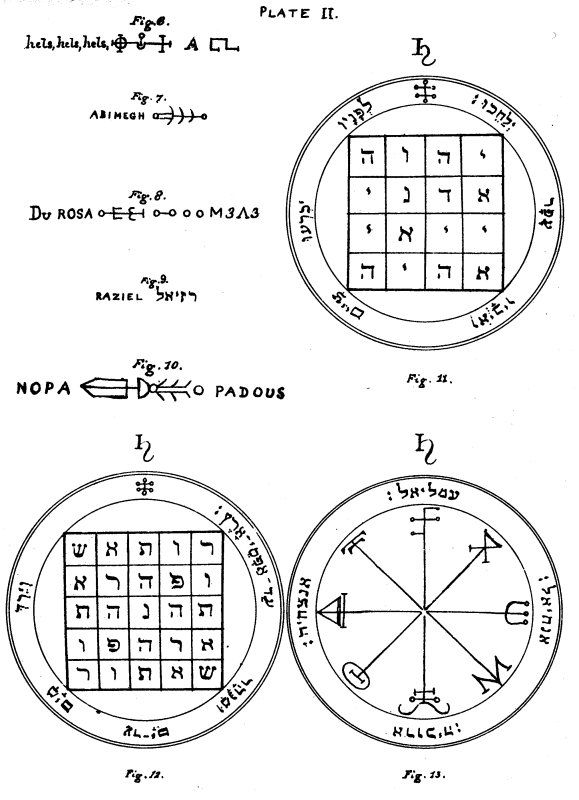

  
[Intangible Textual Heritage](../../index)  [Grimoires](../index) 
[Index](index)  [Previous](kos24)  [Next](kos26) 

------------------------------------------------------------------------

# PLATE II.

### SATURN.

   
Plate II.

 

\_\_\_\_\_\_\_\_\_\_\_\_\_\_\_\_\_\_\_\_\_\_

Figure 11.--The First Pentacle of Saturn.--This Pentacle is of great
value and utility for striking terror into the Spirits. Wherefore, upon
its being shown to them they submit, and kneeling upon the earth before
it, they obey.

Editor's Note.--The Hebrew letters within the square are the four great
Names of God which are written with four letters:--IHVH, Yod, He, Vau,
He; ADNI, Adonai; IIAI, Yiai (this Name has the same

p. 67

\[paragraph continues\] Numerical value in Hebrew as the Name EL); and
AHIH, Eheieh. The Hebrew versicle which surrounds it is from Psalm
lxxii. 9: 'The Ethiopians shall kneel before Him, His enemies shall lick
the dust.'

\_\_\_\_\_\_\_\_\_\_\_\_\_\_\_\_\_\_\_\_\_\_

Figure 12.--The Second Pentacle of Saturn.--This Pentacle is of great
value against adversities; and of especial use in repressing the pride
of the Spirits.

Editor's Note.--This is the celebrated

SATOR  
AREPO  
TENET  
OPERA  
ROTAS,

the most perfect existing form of double acrostic, as far as the
arrangement of the letters is concerned; it is repeatedly mentioned in
the records of mediæval Magic; and, save to very few, its derivation
from the present Pentacle has been unknown. It will be seen at a glance
that it is a square of five, giving twenty-five letters, which, added to
the unity, gives twenty six, the numerical value of IHVH. The Hebrew
versicle surrounding it is taken from Psalm lxxii. 8, 'His dominion
shall be also from the one sea to the other, and from the flood unto the
world's end.' This passage consists also of exactly twenty-five letters,
and its total numerical value (considering the final letters with
increased numbers), added to that of the Name Elohim, is exactly equal
to the total numerical value of the twenty-five letters in the Square.

\_\_\_\_\_\_\_\_\_\_\_\_\_\_\_\_\_\_\_\_\_\_

Figure 13.--The Third Pentacle of Saturn.--This should be made within
the Magical Circle, and it is good for use at night when thou invokest
the Spirits of the nature of Saturn.

Editor's Note.--The characters at the ends of the rays of the Mystic
Wheel are Magical Characters of Saturn. Surrounding it are the Names of
the Angels:--Omeliel, Anachiel, Arauchiah, and Anazachia, written in
Hebrew.

------------------------------------------------------------------------

[Next: Plate III](kos26)
