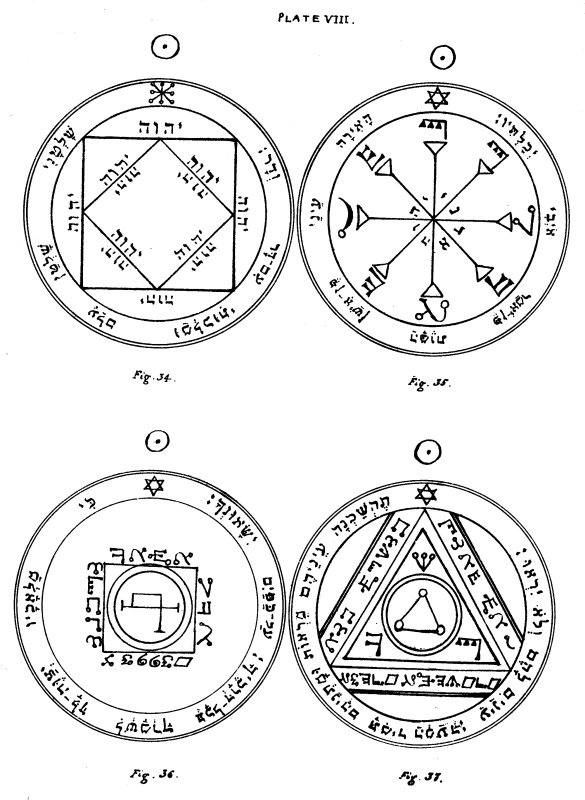

  
[Intangible Textual Heritage](../../index)  [Grimoires](../index) 
[Index](index)  [Previous](kos30)  [Next](kos32) 

------------------------------------------------------------------------

# PLATE VIII.

   
PLATE VIII.

\_\_\_\_\_\_\_\_\_\_\_\_\_\_\_\_\_\_\_\_\_\_

Figure 34.--The Third Pentacle of the Sun.--This serveth in addition (to
the effects of the two preceding) to acquire Kingdom and Empire, to
inflict loss, and to acquire renown and glory, especially through the
Name of God, Tetragrammaton, which therein is twelve times contained.

Editor's Note.--The Name IHVH, twelve times repeated; and a versicle
somewhat similar to Daniel iv. 34:--'My Kingdom is an everlasting
Kingdom, and my dominion endureth from age unto age.'

\_\_\_\_\_\_\_\_\_\_\_\_\_\_\_\_\_\_\_\_\_\_

Figure 35.--The Fourth Pentacle of the Sun.--This serveth to enable thee
to see the Spirits when they appear invisible unto those who invoke
them; because, when thou hast uncovered it, they will immediately appear
visible.

Editor's Note.--The Names IHVH, Adonai, are written in the centre in
Hebrew; and round the radii in the mystical characters of the 'Passing
of the River.' The versicle is from Psalm xiii. 3, 4:--'Lighten mine
eyes that I sleep not in death, lest mine enemy say, I have prevailed
against him.'

\_\_\_\_\_\_\_\_\_\_\_\_\_\_\_\_\_\_\_\_\_\_

Figure 36.--The Fifth Pentacle of the Sun.--It serveth to invoke those
Spirits who can transport thee from one place unto another, over a long
distance and in short time.

Editor's Note.--Characters in the 'Passing of the River' Alphabet,
forming Spirits' Names. The versicle is from Psalm xci. 11, 12:--'He
shall give His Angels charge over thee, to keep thee in all thy ways.
They shall bear thee up in their hands.'

p. 74

Figure 37.--The Sixth Pentacle of the Sun.--It serveth excellently for
the operation of invisibility, when correctly made.

Editor's Note.--In the centre is the Mystical letter Yod, in the
Celestial Alphabet. The three letters in the 'Passing of the River'
writing, in the Angles of the triangle, form the great Name Shaddaï. The
words in the same characters round its three sides are, in my opinion,
from Genesis 1. 1:--'In the beginning the Elohim created,' etc.; but the
characters are sadly mangled in the MSS. The versicle is from Psalms
lxix. 23, and cxxxv. 16:--'Let their eyes be darkened that they see not
and make their loins continually to shake. They have eyes and see not.'

------------------------------------------------------------------------

[Next: Plate IX](kos32)
