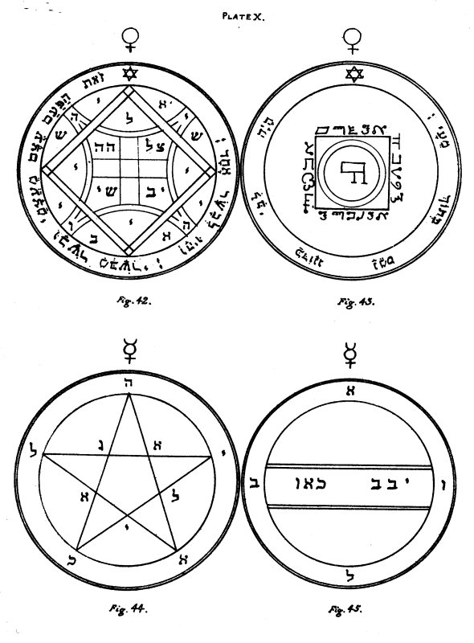

  
[Intangible Textual Heritage](../../index)  [Grimoires](../index) 
[Index](index)  [Previous](kos32)  [Next](kos34) 

------------------------------------------------------------------------

# PLATE X.

   
PLATE X.

\_\_\_\_\_\_\_\_\_\_\_\_\_\_\_\_\_\_\_\_\_\_

Figure 42.--The Fourth Pentacle of Venus.--It is of great power, since
it compels the Spirits of Venus to obey, and to force on the instant any
person thou wishest to come unto thee.

Editor's Note.--At the four Angles of the Figure are the four letters of
the Name IHVH. The other letters form the Names of Spirits of Venus,
e.g.:--Schii, Eli, Ayib, etc. The versicle is from Genesis ii. 23,
24:--'This is bone of my bones, and flesh of my flesh. And they two were
one flesh.'

\_\_\_\_\_\_\_\_\_\_\_\_\_\_\_\_\_\_\_\_\_\_

Figure 43.--The Fifth and last Pentacle of Venus.--When it is only
showed unto any person soever, it inciteth and exciteth wonderfully unto
love.

Editor's Note.--Around the central Square arc the Names Elohim, El
Gebil, and two other Names which I cannot decipher, and have, therefore,
given them as they stand. The characters are those of the 'Passing of
the River.' The surrounding versicle is from Psalm xxii. 14:--'My heart
is like wax, it is melted in the midst of my bowels.'

\_\_\_\_\_\_\_\_\_\_\_\_\_\_\_\_\_\_\_\_\_\_

### MERCURY.

Figure 44.--The First Pentacle of Mercury.--It serveth to invoke the
Spirits who are under the Firmament.

Editor's Note.--Letters forming the Names of the Spirits Yekahel and
Agiel.

\_\_\_\_\_\_\_\_\_\_\_\_\_\_\_\_\_\_\_\_\_\_

Figure 45.--The Second Pentacle of Mercury.--The Spirits herein written
serve to bring to effect and to grant things which are contrary unto the
order of Nature; and which are not contained under any other head. They
easily give answer, but they can with difficulty be seen.

p. 76

Editor's Note.--The Letters form the Names of Böel and other Spirits.

------------------------------------------------------------------------

[Next: Plate XI](kos34)
