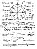
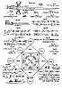

  
[Intangible Textual Heritage](../../index)  [Grimoires](../index) 
[Index](index)  [Previous](kos43)  [Next](kos45) 

------------------------------------------------------------------------

p. 96

## CHAPTER VIII

### OF THE KNIFE, SWORD, SICKLE, PONIARD, DAGGER, LANCE, WAND, STAFF, AND OTHER INSTRUMENTS OF MAGICAL ART

IN order to properly carry out the greatest and most important
Operations of the Art, various Instruments are necessary, as a Knife
with a white hilt, another with a black hilt, a short Lance, wherewith
to trace Circles, Characters, and other things.

The Knife with the white hilt (*see [Figure 61](#img_kos13)*) should be
made in the day and hour of Mercury, when Mars is in the Sign of the Ram
or of the Scorpion. It should be dipped in the blood of a gosling and in
the juice of the pimpernel, the Moon being at her full or increasing in
light. Dip therein also the white hilt, upon the which thou shalt have
engraved the Characters shown. Afterwards perfume it with the perfumes
of the Art.

With this Knife thou mayest perform all the necessary Operations of the
Art, except the Circles. But if it seemeth unto thee too troublesome to
make a similar Knife, have one made in the same fashion; and thou shalt
place it thrice in the fire until it becometh red-hot, and each time
thou shalt immerse it in the aforesaid blood and juice, fasten thereunto
the white hilt having engraved thereon the aforesaid characters, and
upon the hilt thou shalt write with the pen of Art, commencing from the
point and going towards the hilt, these Names Agla, On, as shown in
*[Figure 61](#img_kos13)*. Afterwards thou shalt perfume and sprinkle
it, and shalt wrap it in a piece of silken cloth.

But as for the Knife with the black hilt (*see [Figure 62](#img_kos13)*)
for making the Circle, wherewith to strike terror and fear into the
Spirits, it should be made in the same manner, except that it should be
done in the day and hour of Saturn, and dipped in the blood of a black
cat and in the juice of hemlock, the Characters and Names shown in
*[Figure 62](#img_kos13)* being written thereon, from the point towards
the hilt. Which being completed, thou shalt wrap it in a black silk
cloth.

The Scimitar (*[Figure 63](#img_kos13)*), and the Sickle (*[Figure
64](#img_kos13)*), are made in

 

 [  
Click to enlarge](img/kos13.jpg)  
Plate XIII.

 [  
Click to enlarge](img/kos14.jpg)  
Plate XIV.

 

p. 97

the same way, as also the Dagger (*[Figure 65](#img_kos13)*), the
Poniard (*[Figure 66](#img_kos13)*), and the short Lance (*[Figure
67](#img_kos13)*), in the day and hour of Mercury, and they should be
dipped in the blood of a magpie and the juice of the herb Mercury. Thou
must make for them handles of white boxwood cut at a single stroke from
the tree, at the rising of the Sun, with a new knife, or with any other
convenient instrument. -The characters shown should be traced thereon.
Thou shalt perfume them according to the rules of Art; and wrap them in
silk cloth like the others.

The Staff (*[Figure 68](#img_kos13)*) should be of elderwood, or cane,
or rosewood; and the Wand (*[Figure 69](#img_kos13)*) of hazel or nut
tree, in all cases the wood being virgin, that is of one year's growth
only. They should each be cut from the tree at a single stroke, on the
day of Mercury, at sunrise. The characters shown should be written or
engraved thereon in the day and hour of Mercury.

This being done, thou shalt say:--

ADONAI, Most Holy, deign to bless and to consecrate this Wand, and this
Staff, that they may obtain the necessary virtue, through Thee, O Most
Holy ADONAI, Whose kingdom endureth unto the Ages of the Ages. Amen.

After having perfumed and consecrated them, put them aside in a pure and
clean place for use when required.

Swords are also frequently necessary for use in Magical Arts. Thou shalt
therefore take a new Sword which thou shalt clean and polish on the day
of Mercury, and at the first or the fifteenth hour, and after this thou
shalt write on one side these Divine Names in Hebrew, YODHE VAU HE,
ADONAI, EHEIEH, YAYAI; and on the other side ELOHIM GIBOR (*[Figure
70](#img_kos14)*); sprinkle and cense it and repeat over it the
following conjuration:--

### THE CONJURATION OF THE SWORD.

I conjure thee, O Sword, by these Names, ABRAHACH, ABRACH, ABRACADABRA,
YODHE VAU HE, that thou serve me for a strength and defence in all
Magical Operations, against all mine Enemies, visible and invisible.

I conjure thee anew by the Holy and Indivisible Name of EL strong and
wonderful; by the Name SHADDAI Almighty; and by these Names QADOSCH,
QADOSCH, QADOSCH, ADONAI ELOHIM TZABAOTH, EMANUEL, the First and the
Last, Wisdom, Way, Life, Truth, Chief, Speech, Word, Splendour, Light,
Sun, Fountain, Glory, the Stone of the Wise, Virtue, Shepherd, Priest,
Messiach Immortal; by these Names then, and by the other Names, I
conjure thee, O Sword, that thou servest me for a Protection in all
adversities. Amen.

p. 98

This being finished thou shalt wrap it also in silk like all the other
Instruments, being duly purified and consecrated by the Ceremonies
requisite for the perfection of all Magical Arts and Operations.

Three [1](#fn_78) other Swords should be made
for the use of the Disciples.

The first one should have on the pommel the Name CARDIEL or GABRIEL
(*[Figure 71](#img_kos14)*); on the Lamen of the Guard, REGION (*[Figure
72](#img_kos14)*); on the Blade, PANORAIM HEAMESIN (*[Figure
73](#img_kos14)*).

The Second should have on the pommel the Name AURIEL (*[Figure
74](#img_kos14)*); on the Lamen of the Guard, SARION (*[Figure
75](#img_kos14)*); on the Blade, GAMORINDEBALIN (*[Figure
76](#img_kos14)*).

The third should have on the pommel the Name DAMIEL or RAPHAEL (*[Figure
77](#img_kos14)*); on the Lamen of the Guard, YEMETON (*[Figure
78](#img_kos14)*); on the Blade, LAMEDIN ERADIM (*[Figure
79](#img_kos14)*).

The Burin [2](#fn_79) (*[Figure
80](#img_kos14)*) or Graver is useful for engraving or incising
characters. In the day and hour either of Mars or of Venus thou shalt
engrave thereon the characters shown, and having sprinkled and censed it
thou shalt repeat over it the following Prayer:--

### PRAYER.

ASOPHIEL, ASOPHIEL, ASOPHIEL, PENTAGRAMMATON, ATHANATOS, EHEIEH ASHER
EHEIEH, QADOSCH, QADOSCH, QADOSCH; O God Eternal, and my Father, bless
this Instrument prepared in Thine honour, so that it may only serve for
a good use and end, for Thy Glory. Amen.

Having again perfumed, thou shalt put it aside for use. The Needle may
be consecrated in the same way.

------------------------------------------------------------------------

### Footnotes

[98:1](kos44.htm#fr_78) The description of these
three Swords for the Disciples is only given in 1307 Sloane MSS.

[98:2](kos44.htm#fr_79) From here to the end of
the Chapter is from 1203 Lansdowne MSS.

------------------------------------------------------------------------

[Next: Chapter IX. Of the Formation of the Circle](kos45)
