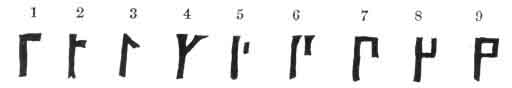
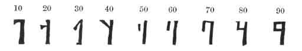
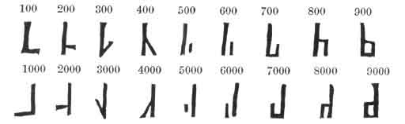
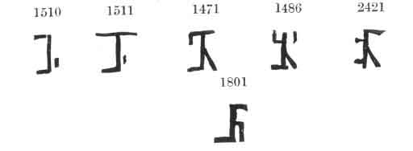

  
[Intangible Textual Heritage](../../index)  [Grimoires](../index) 
[Index](index)  [Previous](ma148)  [Next](ma150) 

------------------------------------------------------------------------

p. 140

CHAP. XXVII.

OF THE NOTES OF THE HEBREWS AND CHALDEANS, AND OTHER NOTES OF MAGICIANS.

THE Hebrew characters have marks of numbers attributed to them far more
excellent than any other language, since the greatest mysteries lie in
the Hebrew letters, as is handled concerning these in that part of
Cabala which we call Notariacon. Now the principal Hebrew letters are in
number twenty-two, whereof five have various other certain figures in
the end of a word, which, therefore, they call the five ending letters,
which, being added to them aforesaid, make twenty-seven; which being
then divided into three degrees, signify units, which are in the first
degree--tens, which are in the second--and hundreds, which are in the
third degree. Now every one, if they are marked with a great character,
signifies so many thousands, as here--

<table data-cellspacing="0" data-border="0" data-cellpadding="9" width="798">
<colgroup>
<col style="width: 33%" />
<col style="width: 33%" />
<col style="width: 33%" />
</colgroup>
<tbody>
<tr class="odd">
<td width="33%" data-valign="TOP">
3000 
ג
</td>
<td width="33%" data-valign="TOP">
2000 
ב
</td>
<td width="33%" data-valign="TOP">
1000 
א
</td>
</tr>
</tbody>
</table>

 

The classes of the Hebrew numbers are these which follow:--

|     |     |     |     |     |     |     |     |     |
|-----|-----|-----|-----|-----|-----|-----|-----|-----|
| 9   | 8   | 7   | 6   | 5   | 4   | 3   | 2   | 1   |
| ט   | ח   | ז   | ו   | ה   | ד   | ג   | ב   | א   |
| 90  | 80  | 70  | 60  | 50  | 40  | 30  | 20  | 10  |
| צ   | פ   | ע   | ס   | נ   | מ   | ל   | כ   | י   |
| 900 | 800 | 700 | 600 | 500 | 400 | 300 | 200 | 100 |
| ץ   | ף   | ן   | ם   | ך   | ת   | ש   | ר   | ק   |

 

Sometimes the final letters are not used, but we write thus:

|      |     |     |     |     |     |
|------|-----|-----|-----|-----|-----|
| 1000 | 900 | 800 | 700 | 600 | 500 |
| א    | קתת | תת  | שת  | רת  | קת  |

 

 

And by those simple figures, and by the joining them together, they
describe all other compound numbers: as eleven, twelve, an hundred and
ten, an

p. 141

hundred and eleven, by adding to the number ten those which are units;
and in the like manner to the rest, after their manner; yet we describe
the fifteenth number not by ten and five, but by nine and six, *viz.* וט
and that out of honour to the Divine name יה, which signifies fifteen,
lest that sacred name should be abused to profane things. Likewise the
Egyptians, Æthiopians, Chaldeans, and Arabians, have their marks of
numbers, which serve for the making of magical characters; but the
Chaldeans mark their numbers with the letters of their alphabet, after
the manner of the Hebrews. I found, in a very antient book of Magic,
some very elegant characters, which I have figured in the following
manner

 

Now of these characters, turned towards the left hand, are made tens.

 

And those marks being downwards, to the right hand, make hundreds; to
the left, thousands,

viz.

 

p. 142

And by the composition and mixture of these characters, other compound
numbers are most elegantly made, as you may perceive by these few:--

 

 

------------------------------------------------------------------------

[Next: Chapter XXVIII: The Magic Tables Of The Planets...](ma150)
