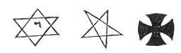

  
[Intangible Textual Heritage](../../index)  [Grimoires](../index) 
[Index](index)  [Previous](ma250)  [Next](ma252) 

------------------------------------------------------------------------

Of the making of the CRYSTAL *and the Form of Preparation for a* VISION.

PROCURE of a lapidary good clear pellucid crystal, of the bigness of a
small orange, i. c. about one inch and a half in diameter; let it be
globular or round each way alike; then, when you have got this crystal,
fair and clear, without any clouds or specks, get a small plate of pure
gold to encompass the crystal round one half; let this be fitted on an
ivory or ebony pedestal, as you may see more fully described in the
drawing, (see the Plate, fig. I.) Let there be engraved a circle (A)
round the crystal with these characters around inside the circle next
the crystal  ; afterwards
the name "*Tetragrammaton*". On the other side of the plate let there be
engraven "*Michael, Gabriel, Uriel, Raphael;*" which are the four
principal angels ruling over the *Sun, Moon, Venus and Mercury*; but on
the table on which the crystal stands the following names, characters,
&c. must be drawn in order.

First, The names of the seven planets and angels ruling them, with their
seals or characters. The names of the four kings of the four corners of
the earth. Let them be all written within a double circle, with a
triangle on a table; on which place the crystal on its pedestal: this
being. done,

p. 136

thy table is complete (as in the Fig. D,) and fit for the calling of the
spirits; after which thou shalt proceed to experiment, thus:

In what time thou wouldest deal with the spirits by the *table* and
*crystal*, thou must observe the planetary hour; and whatever planet
rules in that hour, the angel governing the planet thou shalt call in
the manner following; but first, say this short prayer:

"Oh, God! who art the author of all good things, strengthen, I beseech
thee, thy poor servant, that he may stand fast, without fear, through
this dealing and work; enlighten, I beseech thee, oh Lord! the dark
understanding of thy creature, so that his spiritual eye may be opened
to see and know thy angelic spirits descending here in this crystal:
(*Then lay thy hand on the crystal saying*,) and thou, oh inanimate
creature of God, be sanctified and consecrated, and blessed to this
purpose, that no evil phantasy may appear in thee; or, if they do gain
ingress into this, creature, they may be constrained to speak
intelligibly, and truly, and without the least ambiguity, for Christ's
sake. *Amen*. And forasmuch as thy servant here standing before thee,
oh, Lord! desires neither evil treasures, nor injury to his neighbour,
nor hurt to any living creature, grant him the power of descrying those
celestial spirits or intelligences, that may appear in this crystal, and
whatever good gifts (whether the power of healing infirmities, or of
imbibing wisdom, or discovering any evil likely to afflict any person or
family, or any other good gift thou mayest be pleased to bestow on me,
enable me, by thy wisdom and mercy, to use whatever I may receive to the
honour of thy holy name. Grant this for thy son Christ's sake. *Amen*."

Then taking your ring and pentacle, put the ring on the little finger of
your right hand; hang the pentacle round thy neck; (*Note*, the pentacle
may be either wrote on clean virgin parchment, or engraven on a square
plate of silver and suspended from thy neck to the breast), then take
your black ebony wand, with the gilt characters on it and trace the
circle, (Fig. 7. C D E F,) saying, "In the name of the blessed Trinity,
I consecrate this piece of ground for our defence; so that no evil
spirit may have power to break these bounds prescribed here, through
Jesus Christ our Lord." *Amen*.

p. 137

Then place the vessel for the perfumes between thy circle and the holy
table on which the crystal stands, and, having fire therein, cast in thy
perfumes, saying,

"I conjure thee, oh thou creature of fire! by him who created all things
both in heaven and earth, and in the sea, and in every other place
whatever, that forthwith thou cast away every phantasm from thee, that
no hurt whatsoever shall be done in any thing. Bless, oh Lord, this
creature of fire, and sanctify it that it may be blessed, and that they
may fill tip the power and virtue of their odours; so neither the enemy,
nor any false imagination, may enter into them, through our Lord Jesus
Christ. *Amen*."

Now, this being done in the order prescribed, take out thy little book,
which must be made about seven inches long, of pure white virgin vellum
or paper, likewise pen and ink must be ready to write down the *name,
character*, and *office*, likewise the seal or image of whatever spirit
may appear (for this I must tell you that it does not happen that the
same spirit you call will always appear, for you must try the spirit to
know whether he be a pure or impure being, and this thou shalt easily
know by a firm and undoubted faith in God.)

Now the most pure and simple way of calling the spirits or spirit is by
a short oration to the spirit himself, which is more effectual and easy
to perform than composing a table of letters; for all celestial
operations, the more pure and unmixed they are, the more they are
agreable to the celestial spirits: therefore, after the circle is drawn,
the book, perfumes, rod, &c. in readiness, proceed as follows:

(After noticing the exact hour of the day, and what angel rules that
hour, thou shalt say,)

"In the name of the blessed and holy Trinity, I do desire thee, thou
strong and mighty angel  [1](#fn_6), Michæl, that
if it be the divine will of him who is called Tetragrammaton, &c. the
Holy God, the Father, that thou take upon thee some shape as best
becometh thy celestial nature, and appear to us visibly here in this
crystal, and answer our demands in as far as we shall not transgress the

p. 138

bounds of the divine mercy and goodness, by requesting unlawful
knowledge; but that thou wilt graciously shew us what things are most
profitable for us to know and do, to the glory and honour of his divine
Majesty, who liveth and reigneth, world without end. *Amen*.

"Lord, thy will be done on earth, as it is in heaven;--make clean our
hearts within us, and take not thy Holy Spirit from us.

"O Lord, by thy name, we have called him, suffer him to administer unto
us. And that all things may work together for thy honour and glory, to
whom with thee, the Son, and blessed Spirit, be ascribed all might,
majesty and dominion. *Amen*."

Note, In these dealings, two should always be present; for often a
spirit is manifest to one in the crystal when the other cannot perceive
him; therefore if any spirit appear, as there most likely will, to one
or both, say,

"Oh, Lord! we return thee our hearty and sincere thanks for the hearing
of our prayer, and we thank thee for having permitted thy spirit to
appear unto us which we, by thy mercy, will interrogate to our further
instruction, through Christ. *Amen*."

Interrog. 1. In the name of the holy and undefiled Spirit, the Father,
the begotten Son, and Holy Ghost, proceeding from both, what is thy true
name?

If the spirit answers, *Michael*, then proceed.

Quest. 2. What is thy office? 3. What is thy true sign or character? 4.
When are the times most agreeable to thy nature to hold conference with
us?

Wilt thou swear by the blood and righteousness of our Lord Jesus Christ,
that thou art truly Michael?

(Here let him swear, then write down his seal or character in thy book,
and against it, his office and times to be called, through God's name;
also write down any thing he may teach thee, or any responses he may
make to thy questions or interrogations, concerning life or death, arts
or sciences, or any other thing;) and then shalt thou say,

p. 139

"Thou great and mighty spirit, inasmuch as thou camest in peace and in
the name of the ever blessed and righteous Trinity, so in this name thou
mayest depart, and return to us when we call thee in his name to whom
every knee doth bow down. Fare thee well, Michael; peace be between us,
through our blessed Lord Jesus Christ. *Amen*."

Then will the spirit depart; then say, "To God the Father, eternal
Spirit, fountain of Light, the Son, and Holy Ghost, be all honour and
glory, world without end. *Amen*."

I shall here set down the Table of the names of Spirits and Planets
governing the Hours; so thou shalt easily know by inspection, what
Spirit and Planet governs every Hour of the Day and Night in the Week.

<table data-border="" data-cellspacing="1" data-cellpadding="9" width="709">
<colgroup>
<col style="width: 12%" />
<col style="width: 12%" />
<col style="width: 12%" />
<col style="width: 12%" />
<col style="width: 12%" />
<col style="width: 12%" />
<col style="width: 12%" />
<col style="width: 12%" />
</colgroup>
<tbody>
<tr class="odd">
<td width="13%" data-valign="TOP">
 
</td>
<td width="13%" data-valign="TOP">
Angels and Planets ruling SUNDAY.
</td>
<td width="13%" data-valign="TOP">
Angels and Planets ruling MONDAY.
</td>
<td width="13%" data-valign="TOP">
Angels and Planets ruling TUESDAY.
</td>
<td width="13%" data-valign="TOP">
Angels and Planets ruling WEDNESDAY.
</td>
<td width="13%" data-valign="TOP">
Angels and Planets ruling THURSDAY.
</td>
<td width="13%" data-valign="TOP">
Angels and Planets ruling FRIDAY.
</td>
<td width="13%" data-valign="TOP">
Angels and Planets ruling SATURDAY.
</td>
</tr>
<tr class="even">
<td width="13%" data-valign="TOP">
Hours 
Day.
</td>
<td width="13%" data-valign="TOP"><em></em>

Day.
</td>
<td width="13%" data-valign="TOP"><em></em>

Day.
</td>
<td width="13%" data-valign="TOP"><em></em>

Day.
</td>
<td width="13%" data-valign="TOP"><em></em>

Day.
</td>
<td width="13%" data-valign="TOP"><em></em>

Day.
</td>
<td width="13%" data-valign="TOP"><em></em>

Day.
</td>
<td width="13%" data-valign="TOP"><em></em>

Day.
</td>
</tr>
<tr class="odd">
<td width="13%" data-valign="TOP">
1
</td>
<td width="13%" data-valign="TOP">
☉ Michael
</td>
<td width="13%" data-valign="TOP">
♀ Gabriel
</td>
<td width="13%" data-valign="TOP">
♂ Samael
</td>
<td width="13%" data-valign="TOP">
☿ Raphael
</td>
<td width="13%" data-valign="TOP">
♄ Sachiel
</td>
<td width="13%" data-valign="TOP">
♀ Anael
</td>
<td width="13%" data-valign="TOP">
♃ Cassiel
</td>
</tr>
<tr class="even">
<td width="13%" data-valign="TOP">
2
</td>
<td width="13%" data-valign="TOP">
♀ Anael
</td>
<td width="13%" data-valign="TOP">
♃ Cassiel
</td>
<td width="13%" data-valign="TOP">
☉ Michael
</td>
<td width="13%" data-valign="TOP">
♀ Gabriel
</td>
<td width="13%" data-valign="TOP">
♂ Samael
</td>
<td width="13%" data-valign="TOP">
☿ Raphael
</td>
<td width="13%" data-valign="TOP">
♄ Sachiel
</td>
</tr>
<tr class="odd">
<td width="13%" data-valign="TOP">
3
</td>
<td width="13%" data-valign="TOP">
☿ Raphael
</td>
<td width="13%" data-valign="TOP">
♄ Sachiel
</td>
<td width="13%" data-valign="TOP">
♀ Anael
</td>
<td width="13%" data-valign="TOP">
♃ Cassiel
</td>
<td width="13%" data-valign="TOP">
☉ Michael
</td>
<td width="13%" data-valign="TOP">
♀ Gabriel
</td>
<td width="13%" data-valign="TOP">
♂ Samael
</td>
</tr>
<tr class="even">
<td width="13%" data-valign="TOP">
4
</td>
<td width="13%" data-valign="TOP">
♀ Gabriel
</td>
<td width="13%" data-valign="TOP">
♂ Samael
</td>
<td width="13%" data-valign="TOP">
☿ Raphael
</td>
<td width="13%" data-valign="TOP">
♄ Sachiel
</td>
<td width="13%" data-valign="TOP">
♀ Anael
</td>
<td width="13%" data-valign="TOP">
♃ Cassiel
</td>
<td width="13%" data-valign="TOP">
☉ Michael
</td>
</tr>
<tr class="odd">
<td width="13%" data-valign="TOP">
5
</td>
<td width="13%" data-valign="TOP">
♃ Cassiel
</td>
<td width="13%" data-valign="TOP">
☉ Michael
</td>
<td width="13%" data-valign="TOP">
♀ Gabriel
</td>
<td width="13%" data-valign="TOP">
♂ Samael
</td>
<td width="13%" data-valign="TOP">
☿ Raphael
</td>
<td width="13%" data-valign="TOP">
♄ Sachiel
</td>
<td width="13%" data-valign="TOP">
♀ Anael
</td>
</tr>
<tr class="even">
<td width="13%" data-valign="TOP">
6
</td>
<td width="13%" data-valign="TOP">
♄ Sachiel
</td>
<td width="13%" data-valign="TOP">
♀ Anael
</td>
<td width="13%" data-valign="TOP">
♃ Cassiel
</td>
<td width="13%" data-valign="TOP">
☉ Michael
</td>
<td width="13%" data-valign="TOP">
♀ Gabriel
</td>
<td width="13%" data-valign="TOP">
♂ Samael
</td>
<td width="13%" data-valign="TOP">
☿ Raphael
</td>
</tr>
<tr class="odd">
<td width="13%" data-valign="TOP">
7
</td>
<td width="13%" data-valign="TOP">
♂ Samael
</td>
<td width="13%" data-valign="TOP">
☿ Raphael
</td>
<td width="13%" data-valign="TOP">
♄ Sachiel
</td>
<td width="13%" data-valign="TOP">
♀ Anael
</td>
<td width="13%" data-valign="TOP">
♃ Cassiel
</td>
<td width="13%" data-valign="TOP">
☉ Michael
</td>
<td width="13%" data-valign="TOP">
♀ Gabriel
</td>
</tr>
<tr class="even">
<td width="13%" data-valign="TOP">
8
</td>
<td width="13%" data-valign="TOP">
☉ Michael
</td>
<td width="13%" data-valign="TOP">
♀ Gabriel
</td>
<td width="13%" data-valign="TOP">
♂ Samael
</td>
<td width="13%" data-valign="TOP">
☿ Raphael
</td>
<td width="13%" data-valign="TOP">
♄ Sachiel
</td>
<td width="13%" data-valign="TOP">
♀ Anael
</td>
<td width="13%" data-valign="TOP">
♃ Cassiel
</td>
</tr>
<tr class="odd">
<td width="13%" data-valign="TOP">
9
</td>
<td width="13%" data-valign="TOP">
♀ Anael
</td>
<td width="13%" data-valign="TOP">
♃ Cassiel
</td>
<td width="13%" data-valign="TOP">
☉ Michael
</td>
<td width="13%" data-valign="TOP">
♀ Gabriel
</td>
<td width="13%" data-valign="TOP">
♂ Samael
</td>
<td width="13%" data-valign="TOP">
☿ Raphael
</td>
<td width="13%" data-valign="TOP">
♄ Sachiel
</td>
</tr>
<tr class="even">
<td width="13%" data-valign="TOP">
10
</td>
<td width="13%" data-valign="TOP">
☿ Raphael
</td>
<td width="13%" data-valign="TOP">
♄ Sachiel
</td>
<td width="13%" data-valign="TOP">
♀ Anael
</td>
<td width="13%" data-valign="TOP">
♃ Cassiel
</td>
<td width="13%" data-valign="TOP">
☉ Michael
</td>
<td width="13%" data-valign="TOP">
♀ Gabriel
</td>
<td width="13%" data-valign="TOP">
♂ Samael
</td>
</tr>
<tr class="odd">
<td width="13%" data-valign="TOP">
11
</td>
<td width="13%" data-valign="TOP">
♀ Gabriel
</td>
<td width="13%" data-valign="TOP">
♂ Samael
</td>
<td width="13%" data-valign="TOP">
☿ Raphael
</td>
<td width="13%" data-valign="TOP">
♄ Sachiel
</td>
<td width="13%" data-valign="TOP">
♀ Anael
</td>
<td width="13%" data-valign="TOP">
♃ Cassiel
</td>
<td width="13%" data-valign="TOP">
☉ Michael
</td>
</tr>
<tr class="even">
<td width="13%" data-valign="TOP">
12
</td>
<td width="13%" data-valign="TOP">
♃ Cassiel
</td>
<td width="13%" data-valign="TOP">
☉ Michael
</td>
<td width="13%" data-valign="TOP">
♀ Gabriel
</td>
<td width="13%" data-valign="TOP">
♂ Samael
</td>
<td width="13%" data-valign="TOP">
☿ Raphael
</td>
<td width="13%" data-valign="TOP">
♄ Sachiel
</td>
<td width="13%" data-valign="TOP">
♀ Anael
</td>
</tr>
<tr class="odd">
<td width="13%" data-valign="TOP">
Hours 
Night
</td>
<td width="13%" data-valign="TOP"><em></em>

Night.
</td>
<td width="13%" data-valign="TOP"><em></em>

Night.
</td>
<td width="13%" data-valign="TOP"><em></em>

Night.
</td>
<td width="13%" data-valign="TOP"><em></em>

Night.
</td>
<td width="13%" data-valign="TOP"><em></em>

Night.
</td>
<td width="13%" data-valign="TOP"><em></em>

Night.
</td>
<td width="13%" data-valign="TOP"><em></em>

Night.
</td>
</tr>
<tr class="even">
<td width="13%" data-valign="TOP">
1
</td>
<td width="13%" data-valign="TOP">
♄ Sachael
</td>
<td width="13%" data-valign="TOP">
♀ Anael
</td>
<td width="13%" data-valign="TOP">
♃ Cassiel
</td>
<td width="13%" data-valign="TOP">
☉ Michael
</td>
<td width="13%" data-valign="TOP">
♀ Gabriel
</td>
<td width="13%" data-valign="TOP">
♂ Samael
</td>
<td width="13%" data-valign="TOP">
☿ Raphael
</td>
</tr>
<tr class="odd">
<td width="13%" data-valign="TOP">
2
</td>
<td width="13%" data-valign="TOP">
♂ Samiel
</td>
<td width="13%" data-valign="TOP">
☿ Raphael
</td>
<td width="13%" data-valign="TOP">
♄ Sachiel
</td>
<td width="13%" data-valign="TOP">
♀ Anael
</td>
<td width="13%" data-valign="TOP">
♃ Cassiel
</td>
<td width="13%" data-valign="TOP">
☉ Michael
</td>
<td width="13%" data-valign="TOP">
♀ Gabriel
</td>
</tr>
<tr class="even">
<td width="13%" data-valign="TOP">
3
</td>
<td width="13%" data-valign="TOP">
☉ Michael
</td>
<td width="13%" data-valign="TOP">
♀ Gabriel
</td>
<td width="13%" data-valign="TOP">
♂ Samael
</td>
<td width="13%" data-valign="TOP">
☿ Raphael
</td>
<td width="13%" data-valign="TOP">
♄ Sachiel
</td>
<td width="13%" data-valign="TOP">
♀ Anael
</td>
<td width="13%" data-valign="TOP">
♃ Cassiel
</td>
</tr>
<tr class="odd">
<td width="13%" data-valign="TOP">
4
</td>
<td width="13%" data-valign="TOP">
♀ Anael
</td>
<td width="13%" data-valign="TOP">
♃ Cassiel
</td>
<td width="13%" data-valign="TOP">
☉ Michael
</td>
<td width="13%" data-valign="TOP">
♀ Gabriel
</td>
<td width="13%" data-valign="TOP">
♂ Samael
</td>
<td width="13%" data-valign="TOP">
☿ Raphael
</td>
<td width="13%" data-valign="TOP">
♄ Sachiel
</td>
</tr>
<tr class="even">
<td width="13%" data-valign="TOP">
5
</td>
<td width="13%" data-valign="TOP">
☿ Raphael
</td>
<td width="13%" data-valign="TOP">
♄ Sachiel
</td>
<td width="13%" data-valign="TOP">
♀ Anael
</td>
<td width="13%" data-valign="TOP">
♃ Cassiel
</td>
<td width="13%" data-valign="TOP">
☉ Michael
</td>
<td width="13%" data-valign="TOP">
♀ Gabriel
</td>
<td width="13%" data-valign="TOP">
♂ Samael
</td>
</tr>
<tr class="odd">
<td width="13%" data-valign="TOP">
6
</td>
<td width="13%" data-valign="TOP">
♀ Gabriel
</td>
<td width="13%" data-valign="TOP">
♂ Samael
</td>
<td width="13%" data-valign="TOP">
☿ Raphael
</td>
<td width="13%" data-valign="TOP">
♄ Sachiel
</td>
<td width="13%" data-valign="TOP">
♀ Anael
</td>
<td width="13%" data-valign="TOP">
♃ Cassiel
</td>
<td width="13%" data-valign="TOP">
☉ Michael
</td>
</tr>
<tr class="even">
<td width="13%" data-valign="TOP">
7
</td>
<td width="13%" data-valign="TOP">
♃ Cassiel
</td>
<td width="13%" data-valign="TOP">
☉ Michael
</td>
<td width="13%" data-valign="TOP">
♀ Gabriel
</td>
<td width="13%" data-valign="TOP">
♂ Samael
</td>
<td width="13%" data-valign="TOP">
☿ Raphael
</td>
<td width="13%" data-valign="TOP">
♄ Sachiel
</td>
<td width="13%" data-valign="TOP">
♀ Anael
</td>
</tr>
<tr class="odd">
<td width="13%" data-valign="TOP">
8
</td>
<td width="13%" data-valign="TOP">
♄ Sachiel
</td>
<td width="13%" data-valign="TOP">
♀ Anael
</td>
<td width="13%" data-valign="TOP">
♃ Cassiel
</td>
<td width="13%" data-valign="TOP">
☉ Michael
</td>
<td width="13%" data-valign="TOP">
♀ Gabriel
</td>
<td width="13%" data-valign="TOP">
♂ Samael
</td>
<td width="13%" data-valign="TOP">
☿ Raphael
</td>
</tr>
<tr class="even">
<td width="13%" data-valign="TOP">
9
</td>
<td width="13%" data-valign="TOP">
♂ Samael
</td>
<td width="13%" data-valign="TOP">
☿ Raphael
</td>
<td width="13%" data-valign="TOP">
♄ Sachiel
</td>
<td width="13%" data-valign="TOP">
♀ Anael
</td>
<td width="13%" data-valign="TOP">
♃ Cassiel
</td>
<td width="13%" data-valign="TOP">
☉ Michael
</td>
<td width="13%" data-valign="TOP">
♀ Gabriel
</td>
</tr>
<tr class="odd">
<td width="13%" data-valign="TOP">
10
</td>
<td width="13%" data-valign="TOP">
☉ Michael
</td>
<td width="13%" data-valign="TOP">
♀ Gabriel
</td>
<td width="13%" data-valign="TOP">
♂ Samael
</td>
<td width="13%" data-valign="TOP">
☿ Raphael
</td>
<td width="13%" data-valign="TOP">
♄ Sachiel
</td>
<td width="13%" data-valign="TOP">
♀ Anael
</td>
<td width="13%" data-valign="TOP">
♃ Cassiel
</td>
</tr>
<tr class="even">
<td width="13%" data-valign="TOP">
11
</td>
<td width="13%" data-valign="TOP">
♀ Anael
</td>
<td width="13%" data-valign="TOP">
♃ Cassiel
</td>
<td width="13%" data-valign="TOP">
☉ Michael
</td>
<td width="13%" data-valign="TOP">
♀ Gabriel
</td>
<td width="13%" data-valign="TOP">
♂ Samael
</td>
<td width="13%" data-valign="TOP">
☿ Raphael
</td>
<td width="13%" data-valign="TOP">
♄ Sachiel
</td>
</tr>
<tr class="odd">
<td width="13%" data-valign="TOP">
12
</td>
<td width="13%" data-valign="TOP">
☿ Raphael
</td>
<td width="13%" data-valign="TOP">
♄ Sachiel
</td>
<td width="13%" data-valign="TOP">
♀ Anael
</td>
<td width="13%" data-valign="TOP">
♃ Cassiel
</td>
<td width="13%" data-valign="TOP">
☉ Michael
</td>
<td width="13%" data-valign="TOP">
♀ Gabriel
</td>
<td width="13%" data-valign="TOP">
♂ Samael
</td>
</tr>
</tbody>
</table>

 

p. 140

Note, The day is divided into twelve equal parts, called Planetary
Hours, reckoning from sun-rise to sun-set, and, again, from the setting
to the rising; and to find the planetary hour, you need but to divide
the natural hours by twelve, and the quotient gives the length of the
planetary hours and odd minuets, which shews you how long a spirit bears
rule in that day. as Michael governs the first and the eighth hour on
Sunday, as does the ☉. After you have the length of the first hour, you
have only to look in the Table, as if it be the fourth hour, on Sunday,
you see in the Table that the ☽ and Gabriel rules; and so for the rest
it being so plain and easy you cannot err.

THE CONCLUSION OF THE MAGUS.

------------------------------------------------------------------------

### Footnotes

[137:1](ma251.htm#fr_6) Or any other angel or
spirit.

------------------------------------------------------------------------

[Next: Advertisement](ma252)
