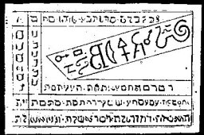

  
[Intangible Textual Heritage](../../index)  [Grimoires](../index) 
[Index](index)  [Previous](m601)  [Next](m603) 

------------------------------------------------------------------------

# THE MYSTERY OF THE SECOND SEAL

The Name is True Seal of the Choir of Hosts or Dominations of the
Ministering Angels.

CONJURATION

I, N.N., a servant of God, desire, call upon and conjure thee, Spirit
Phuel, by the Holy Messengers and all the Disciples of the Lord, by the
four Holy Evangelists and the three Holy Men of God and by the most
terrible and most holy words Abriel, Fibriel, Zada, Zaday, Zarabo,
Laragola, Lavaterium, Laroyol, Zay, Zagin, Labir, Lya, Adeo, Deus, Alon,
Abay, Alos, Pieus, Ehos, Mihi, Uini, Mora, Zorad, and by those holy
words, that thou come and appear before me, N.N., in a beautiful human
form, and bring me what I desire. (This the conjuror must name.)

This Seal from the Choir of the Dominationen, or Hosts, the following
are the most useful: Aha, Rosh, Habu, Aromicha, Lemar, Patteny, Hamya,
Azoth, Hayozer, Karohel, Wezynna, Patecha, Tehom. The special secret of
this seal is that if a man carries this Seal with him, it will bring him
great fortune and blessing; it is therefore called the truest and
highest Seal of Fortune.

------------------------------------------------------------------------

[Next: The Mystery of The Third Seal](m603)
