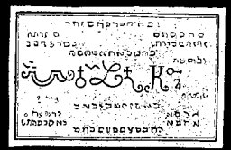

  
[Intangible Textual Heritage](../../index)  [Grimoires](../index) 
[Index](index)  [Previous](m605)  [Next](m607) 

------------------------------------------------------------------------

# THE MYSTERY OF THE SIXTH SEAL.

The Seal of the Power Angels are Potestatum over the Angels and Spirits
of all the Elements.

CONJURATION.

I, N.N., a servant of God, desire, call upon and conjure thee, Spirit
Alymon, by the most dreadful words, Sather, Ehomo, Geno, Poro, Jehovah,
Elohim, Volnah, Denach, Alonlam, Ophiel, Zophiel, Sophiel, Habriel,
Eloha, Alesimus, Dileth, Melohim, and by all the holiest words through
which thou canst be conquered, that thou appear before me in a mild,
beautiful human form, and fulfil what I command thee, so surely as God
will come to judge the living and the dead. Fiat, Fiat, Fiat.

The most obedient Angels of Power, seu Potestates, are the following
four elements: Schunmyel, Alymon, Mupiel, Symnay, Semanglaf, Taftyah,
Melech, Seolam, Waed, Sezah, Safyn, Kyptip, Taftyarohel, Aeburatiel,
Anyam, Bymnam. This is the mystery or Seal of the Might-Angels. The
peculiar Arcanum of this Seal of the Mighty is that if a man wears this
seal in bed, he will learn what he desires to know through dreams and
visions.

------------------------------------------------------------------------

[Next: The Mystery of The Seventh Seal](m607)
