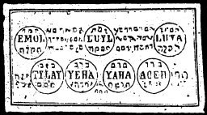

  
[Intangible Textual Heritage](../../index)  [Grimoires](../index) 
[Index](index)  [Previous](m707)  [Next](m709) 

------------------------------------------------------------------------

### THE SEVENTH TABLE OF MARS

Conjuration

I, N.N., cite Thee, Spirit Emol, by Deus Sachnaton \* Luil, by Acumea \*
Luiji, by Ambriel \*, Tijlaij, by Ehos \*, by Jeha, by Zora \* Ageh, by
Awoth, \* that you appear before me in a beautiful, human form, and
accomplish my desire, thus truly in and through the anepobeijaron, which
Aaron heard and which was prepared for him. Fiat, fiat, fiat.

The Seventh Seal of Mars brings good fortune. In case of quarrels the
Spirits of Mars will help you.

------------------------------------------------------------------------

[Next: THE EIGHTH TABLE OF THE SUN](m709)
