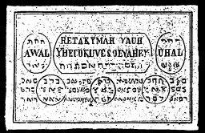

  
[Intangible Textual Heritage](../../index)  [Grimoires](../index) 
[Index](index)  [Previous](m709)  [Next](m711) 

------------------------------------------------------------------------

### THE NINTH TABLE OF VENUS

Conjuration

Reta, Kijmah, Yamb, Yheloruvesopijhael, I call upon Thee, Spirit Awel,
through God Tetragrammaton, Uhal, by Pomamiach that you will obey my
commands and fulfil my desires. Thus truly in and through the name of
Esercheije, which Moses named, and upon which followed hail, the like of
which was not known since the beginning of the world. Fiat, fiat, fiat.

The Ninth Table of the Spirits of Venus makes one beloved in all
respects and makes secrets known through dreams. Its spirits also assist
liberally in all kinds of business.

------------------------------------------------------------------------

[Next: THE TENTH TABLE OF MERCURY](m711)
