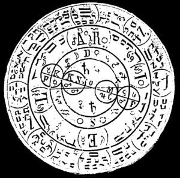

  
[Intangible Textual Heritage](../../index)  [Grimoires](../index) 
[Index](index)  [Previous](m7104)  [Next](m7106) 

------------------------------------------------------------------------

### Citation of Ariel

  

## ARIELIS

Seal or Character for Coercion and Obedience.

Yschiros, Theor Zebaoth, Wyzeth, Yzathos, Xyzo, Xywethororwoy, Xantho,
Wiros, Rurawey, Ymowe, Noswathosway, Wuvnethowesy, Zebaoth, Yvmo,
Zvswethonowe, Yschyrioskay, Ulathos, Wyzoy, Yrsawo, Xyzeth,
Durobijthaos, Wuzowethus, Yzweoy, Zaday, Zywaye, Hagathorwos, Yachyros,
Imas, Tetragrammaton, Ariel.

------------------------------------------------------------------------

[Next: Citation of Marbuel](m7106)
