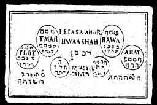

  
[Intangible Textual Heritage](../../index)  [Grimoires](../index) 
[Index](index)  [Previous](m710)  [Next](m712) 

------------------------------------------------------------------------

### THE TENTH TABLE OF MERCURY

Conjuration

Petasa, Ahor, Havaashar, N. N., cites Thee Spirit Yloij \* through God,
God Adonaij  Ymah, through God Tetragrammaton
 Rawa, through God Emanuel \* Ahaij, through Athanatos
 that Thou appear before me as truly in and through
the name of Adonai, which Moses mentioned, and there appeared
grasshoppers. fiat, fiat, fiat.

The Tenth Table of the Spirits of Mercury gives wealth in Chemistry.
These spirits contribute treasures of the mines.

------------------------------------------------------------------------

[Next: THE ELEVENTH TABLE OF THE SPIRITS](m712)
