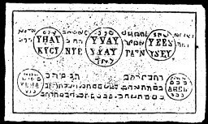

  
[Intangible Textual Heritage](../../index)  [Grimoires](../index) 
[Index](index)  [Previous](m711)  [Next](m713) 

------------------------------------------------------------------------

### THE ELEVENTH TABLE OF THE SPIRITS

Conjuration

I, N.N., cite Thee, Spirit Yhaij, by El, Yvaij, by Elohim, Ileh, by Elho
\* Kijlij, by Zebaoth, Taijn Iseij, by Tetragrammaton, Jeha, by Zadaij
\* Ahel, by Agla that you will obey my orders, as truly in and through
the name Schemesumatie, upon which Josua called, and the sun stood still
in its course. Fiat, fiat, fiat.

The Eleventh Table gives good luck and fortune. Its spirits give the
treasures of the sea.

------------------------------------------------------------------------

[Next: THE TWELFTH TABLE OF THE SCHEMHAMFORASCH](m713)
