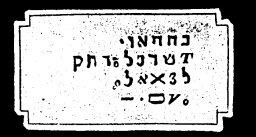

  
[Intangible Textual Heritage](../../index)  [Grimoires](../index) 
[Index](index)  [Previous](m716)  [Next](m718) 

------------------------------------------------------------------------

### BREASTPLATE OF MOSES

The Hebrew inscriptions within the seal are pronounced as follows:

JEHOVA, ASER EHEJE CETHER ELEION EHEJE

Their meaning is as follows:

The Most High, whom no eye hath seen, nor tongue spoke; the Spirit which
did great acts and performed great wonders. The Words of the Breastplate
and the Helmet pronounced mean Holiness.

------------------------------------------------------------------------

[Next: HELMET OF MOSES AND AARON](m718)
