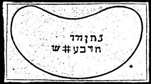

  
[Intangible Textual Heritage](../../index)  [Grimoires](../index) 
[Index](index)  [Previous](m717)  [Next](m719) 

------------------------------------------------------------------------

### HELMET OF MOSES AND AARON

The Hebrew inscriptions are to be pronounced as follows:

HIEBEL MARE ACTITAS BARNE DONENE ARIAERCH

These are the names which the old Egyptians used instead of the
unutterable name of Asser Criel, and are called the "Fire of God," and
"Strong Rock of Faith." Whoever wears them on his person will not die a
sudden death.

------------------------------------------------------------------------

[Next: BREASTPLATE OF AARON](m719)
