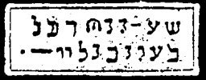

  
[Intangible Textual Heritage](../../index)  [Grimoires](../index) 
[Index](index)  [Previous](m722)  [Next](m724) 

------------------------------------------------------------------------

### DISMISSION OF ELEAZAR, THE SON OF AARON

The inscriptions on the seal are to be read as follows:

LEAY YLI ZIARITE ZELOHABE ET NEGORAMY ZIEN LATEBM DAMA MECHA RA METI
OZIRA

Through this dismission all things dissolve into nothing.

------------------------------------------------------------------------

[Next: CITATION OF GERMUTHSAI OR LEVIATHAN](m724)
