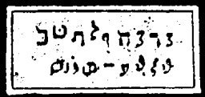

  
[Intangible Textual Heritage](../../index)  [Grimoires](../index) 
[Index](index)  [Previous](m724)  [Next](m726) 

------------------------------------------------------------------------

### DISMISSION OF LEVIATHAN

The inscriptions on the seal are to be read as follows:

MALCOH, SADAIJ, CUBOR DAMABIAH MENKIE LEJABEL MANIAH IJEJAVAI

That is, Strong, Might spirit of hell, go back into thine own Works, in
the name of Jehova.

------------------------------------------------------------------------

[Next: BALAAM'S SORCERY](m726)
