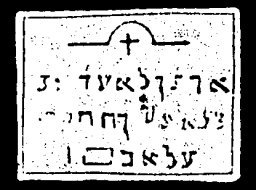

  
[Intangible Textual Heritage](../../index)  [Grimoires](../index) 
[Index](index)  [Previous](m730)  [Next](m732) 

------------------------------------------------------------------------

### GENERAL CITATION OF MOSES ON ALL SPIRITS

The inscriptions on the seal are to be read as follows:

AHEZERAIJE COMITEJON SEDE LEJI THOMOS SASMAGATA BIJ UL IJCOS JOUA ELOIJ
ZAWAIJM

These are the high and powerful utterances that Moses employed in the
awakening of the Leviathan, in order to compel him to serve his Lord.
The first cannot be uttered and was used by the first inhabitants of
earth as a mighty lord. The whole is good, but not everyone can obtain
it in perfection without severe discipline.

------------------------------------------------------------------------

[Next: CHARACTERS ON THE LEFT SIDE OF THE ARK OF THE COVENANT OF THE
MOST HIGH](m732)
