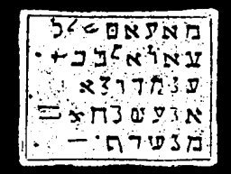

  
[Intangible Textual Heritage](../../index)  [Grimoires](../index) 
[Index](index)  [Previous](m733)  [Next](m735) 

------------------------------------------------------------------------

### CONJURED SPIRIT APPEARS ON A PILLAR OF FIRE

The inscriptions on the seal are to be said as follows:

AFFABIJ ZIEN, JERAMIJE LATABI DAMAJESANO NOIJ LIJOIJ LEAIJ GLIJ EIJLOIJ
LIECLE LOATE ELI ELI MECHARAMETHIJ RIJIBISAS SA FU AZIRA REACHA

The Citation names the twelve evil spirits of man, through the help of
the Father, of the Hebrew Eli. It is terrible.

------------------------------------------------------------------------

[Next: CONJURED SPIRIT APPEARS ON A PILLAR OF CLOUDS](m735)
