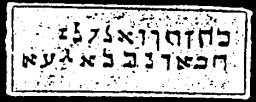

  
[Intangible Textual Heritage](../../index)  [Grimoires](../index) 
[Index](index)  [Previous](m734)  [Next](m736) 

------------------------------------------------------------------------

### CONJURED SPIRIT APPEARS ON A PILLAR OF CLOUDS

The inscriptions on the seal are to be read as follows:

KAHAI CONOR ANUHEC ZELOHAE ZOLE HEBEI EDE NEGO RANEIJ HAHABE GIZAON

------------------------------------------------------------------------

[Next: Appendix to the General Citation of Moses on All Spirits](m736)
